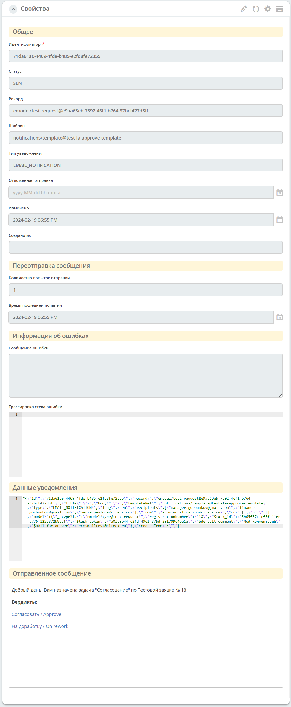

.. _notifications-label:

Уведомления
============

.. note::

    Отображение уведомлений добавлено в версии 2.7.0 микросервиса ecos-notifications

.. contents::

Общие сведения
--------------

Микросервис **ecos-notifications** — единая точка отправки уведомлений в платформе Citeck.

Все уведомления (email и другие типы) должны отправляться только через него. Не следует отправлять уведомления напрямую из кода микросервиса или из скриптов процессов.

Основной сценарий использования — отправка email-уведомлений из BPMN-процессов через элемент :ref:`Send Task<notification_from_bpmn>`. Также поддерживаются :ref:`массовые рассылки<bulk_mail>` и :ref:`lazy approval<lazy_approval_settings>`.

Уведомления отправляются на основе :ref:`шаблонов уведомлений<notification_templates>`. Маршрутизация и блокировка отправки настраивается через :ref:`отправителей<senders>`.

**Устойчивость к недоступности SMTP:** если почтовый сервер временно недоступен, уведомления сохраняются в БД со статусом ``WAIT_FOR_DISPATCH`` или ``ERROR`` и отправляются автоматически после восстановления соединения.

1. Сущность "Уведомление"
-------------------------

1.1 Форма, поля
~~~~~~~~~~~~~~~~~~

:Идентификатор: Уникальный id уведомления.

:Статус: Текущий статус уведомления. См. `1.2 Статусы`_.

:Рекорд: Базовый рекорд уведомления — документ, по атрибутам которого вычислялась модель шаблона.

:Шаблон: Шаблон уведомления, использованный при отправке.

:Тип уведомления: Тип отправки. На текущий момент поддерживается ``EMAIL_NOTIFICATION``.

:Отложенная отправка: Время запланированной отправки. Если задано, уведомление не отправляется сразу.

:Изменено: Время последнего изменения записи уведомления.

:Создано из: Источник уведомления — ссылка на объект (например, массовую рассылку), из которого было создано уведомление. Для уведомлений из BPMN-процессов поле пустое.

:Количество попыток отправки: Счётчик попыток отправки. Увеличивается при каждой неудачной попытке.

:Время последней попытки: Временная метка последней попытки отправки.

:Сообщение ошибки: Сообщение об ошибке, возникшей при последней попытке отправки.

:Трассировка стека ошибки: Полный стек ошибки — используется для диагностики технических проблем.

:Данные уведомления: Полное JSON-представление уведомления — вся полезная нагрузка (получатели, заголовок, тело, вложения и т.д.). Удобно для отладки: позволяет убедиться, что модель шаблона вычислилась корректно.

:Отправленное сообщение: Итоговое сообщение в том виде, в котором оно было отправлено получателю (после подстановки шаблона и вычисления модели).

1.2 Статусы
~~~~~~~~~~~~

:WAIT_FOR_DISPATCH: Уведомление создано и ожидает отправки. Начальный статус для всех уведомлений.

:SENT: Сообщение успешно отправлено.

:ERROR: При отправке возникла ошибка. Микросервис будет предпринимать повторные попытки отправки в соответствии с настроенной политикой повторов.

:EXPIRED: Все попытки отправки исчерпаны или истёк TTL (время жизни) сообщения. Повторных попыток не будет.

:BLOCKED: Отправка заблокирована одним из :ref:`отправителей<senders>`. Повторных попыток не будет.

**Типичный жизненный цикл уведомления:**

.. code-block::

   WAIT_FOR_DISPATCH → SENT                  (успешная отправка)
   WAIT_FOR_DISPATCH → ERROR → ... → SENT   (успешная отправка после повтора)
   WAIT_FOR_DISPATCH → ERROR → ... → EXPIRED (все попытки исчерпаны)
   WAIT_FOR_DISPATCH → BLOCKED               (заблокировано отправителем)

2. Журнал уведомлений
-----------------------

Журнал **Уведомления** расположен в **Разделе администратора → Конфигурация уведомлений**:

В данном журнале отображается информация обо всех уведомлениях, отправленных из микросервиса **ecos-notifications**.

На текущий момент поддерживается только простая текстовая фильтрация полей через ``ИЛИ``.

.. image:: _static/notification/notification_journal.png
        :width: 700
        :align: center

3. Диагностика проблем с доставкой
------------------------------------

Если уведомление не доходит до получателя, используйте журнал уведомлений для диагностики.

**Алгоритм:**

1. Найдите нужное уведомление в журнале — по получателю, шаблону или времени отправки.
2. Проверьте **Статус** уведомления:

   - ``ERROR`` / ``EXPIRED`` — смотрите поля **Сообщение ошибки** и **Трассировка стека ошибки**.
     Типичные причины: недоступность SMTP, неверный адрес получателя, ошибка рендеринга шаблона.
   - ``BLOCKED`` — уведомление заблокировано настройками :ref:`отправителя<senders>`.
     Проверьте конфигурацию активных отправителей и условия блокировки.
   - ``WAIT_FOR_DISPATCH`` — уведомление ещё не обработано. Возможна проблема с доступностью SMTP
     или большой очередью.

3. Откройте поле **Данные уведомления** — убедитесь, что получатели, тема и тело письма вычислены корректно.
4. Откройте поле **Отправленное сообщение** — проверьте финальный вид письма.

.. note::

   Если уведомление попало в статус ``EXPIRED``, повторная отправка автоматически не происходит.
   Для повторной отправки используйте :ref:`массовую рассылку<bulk_mail>` или перезапустите процесс.
