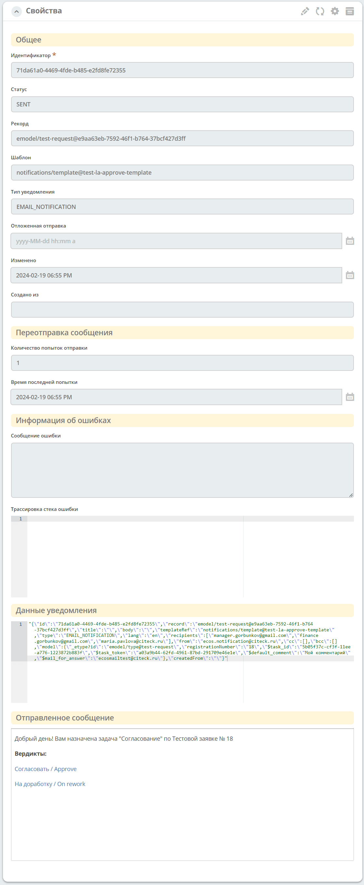
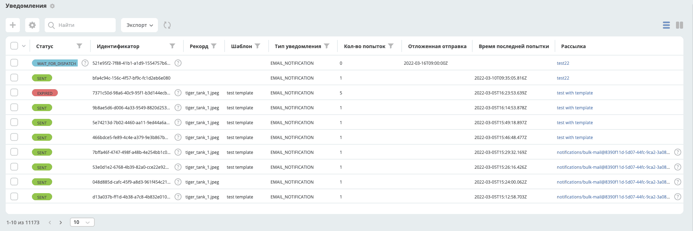

.. _notifications-label:

Уведомления
============

.. note::

    Отображение уведомлений добавлено в версии 2.7.0 микросервиса ecos-notifications

.. contents::

Общие сведения
--------------

Микросервис **ecos-notifications** — единая точка отправки уведомлений в платформе Citeck.

Все уведомления (email и другие типы) должны отправляться только через него. Не следует отправлять уведомления напрямую из кода микросервиса или из скриптов процессов.

Основной сценарий использования — отправка email-уведомлений из BPMN-процессов через элемент :ref:`Send Task<notification_from_bpmn>`. Также поддерживаются :ref:`массовые рассылки<bulk_mail>` и :ref:`lazy approval<lazy_approval_settings>`.

Уведомления отправляются на основе :ref:`шаблонов уведомлений<notification_templates>`. Маршрутизация и блокировка отправки настраивается через :ref:`отправителей<senders>`.

.. note::

   Устойчивость к недоступности SMTP: если почтовый сервер временно недоступен, уведомления сохраняются в БД со статусом ``WAIT_FOR_DISPATCH`` или ``ERROR`` и отправляются автоматически после восстановления соединения. Подробнее — в разделе `4. Повторные попытки отправки`_.

1. Сущность "Уведомление"
-------------------------

1.1 Форма, поля
~~~~~~~~~~~~~~~~~~

.. list-table::
   :header-rows: 1
   :class: tight-table

   * - Поле
     - Описание
   * - Идентификатор
     - Уникальный id уведомления.
   * - Статус
     - Текущий статус уведомления. См. `1.2 Статусы`_.
   * - Рекорд
     - Базовый рекорд уведомления — документ, по атрибутам которого вычислялась модель шаблона.
   * - Шаблон
     - Шаблон уведомления, использованный при отправке.
   * - Тип уведомления
     - Тип отправки. На текущий момент поддерживается ``EMAIL_NOTIFICATION``.
   * - Отложенная отправка
     - Время запланированной отправки. Если задано, уведомление не отправляется сразу.
   * - Изменено
     - Время последнего изменения записи уведомления.
   * - Создано из
     - Источник уведомления — ссылка на объект (например, массовую рассылку), из которого было создано уведомление. Для уведомлений из BPMN-процессов поле пустое.
   * - Количество попыток отправки
     - Счётчик попыток отправки. Увеличивается при каждой неудачной попытке.
   * - Время последней попытки
     - Временная метка последней попытки отправки.
   * - Время следующей попытки
     - Время, на которое запланирована следующая попытка отправки. Заполнено, пока уведомление находится в статусе ``ERROR``. Доступно также как колонка журнала уведомлений. См. `4. Повторные попытки отправки`_.
   * - Время первой ошибки
     - Время первой неудачной попытки. От него отсчитывается окно повторов (``retry-window``).
   * - Тип ошибки
     - Классификация последней ошибки: ``TRANSIENT`` — временная (повторы выполняются), ``PERMANENT`` — постоянная (повторы бесполезны).
   * - Сообщение ошибки
     - Сообщение об ошибке, возникшей при последней попытке отправки.
   * - Трассировка стека ошибки
     - Полный стек ошибки — используется для диагностики технических проблем.
   * - Данные уведомления
     - Полное JSON-представление уведомления — вся полезная нагрузка (получатели, заголовок, тело, вложения и т.д.). Удобно для отладки: позволяет убедиться, что модель шаблона вычислилась корректно.
   * - Отправленное сообщение
     - Итоговое сообщение в том виде, в котором оно было отправлено получателю (после подстановки шаблона и вычисления модели).

Поля **Время следующей попытки**, **Время первой ошибки** и **Тип ошибки** заполняются микросервисом
и доступны только на чтение; в Records API им соответствуют атрибуты ``nextRetryAt``, ``firstErrorAt``
и ``failureKind``.

1.2 Статусы
~~~~~~~~~~~~

.. list-table::
   :header-rows: 1
   :class: tight-table

   * - Статус
     - Описание
   * - ``WAIT_FOR_DISPATCH``
     - Уведомление создано и ожидает отправки. Начальный статус для всех уведомлений.
   * - ``SENT``
     - Сообщение успешно отправлено.
   * - ``ERROR``
     - При отправке возникла ошибка, которая может пройти сама (недоступность SMTP, таймаут). Уведомление остаётся в очереди — см. поле **Время следующей попытки**. Это единственный нетерминальный статус после ошибки.
   * - ``FAILED``
     - Отправка невозможна по причине, которую повтор не исправит: некорректный адрес получателя, сломанный шаблон, нечитаемая конфигурация отправителя, отказ SMTP-сервера с кодом 5xx. Делается ровно одна попытка, повторов не будет.
   * - ``EXPIRED``
     - Бюджет повторов исчерпан — превышено максимальное количество попыток (``max-attempts``) или окно повторов (``retry-window``). Автоматических повторов больше не будет.
   * - ``BLOCKED``
     - Отправка заблокирована одним из :ref:`отправителей<senders>`. Повторных попыток не будет.
   * - ``CANCELLED``
     - Отправка отменена — например, была удалена массовая рассылка, из которой создано уведомление. Запланированные повторы при этом останавливаются.

.. note::

   Из статусов ``ERROR``, ``FAILED`` и ``EXPIRED`` уведомление можно вернуть в очередь вручную —
   действием **Повторить отправку сейчас** (см. `4.4 Ручная повторная отправка`_).

**Типичный жизненный цикл уведомления:**

.. code-block::

   WAIT_FOR_DISPATCH → SENT                  (успешная отправка)
   WAIT_FOR_DISPATCH → ERROR → ... → SENT    (успешная отправка после повтора)
   WAIT_FOR_DISPATCH → ERROR → ... → EXPIRED (бюджет повторов исчерпан)
   WAIT_FOR_DISPATCH → FAILED                (постоянная ошибка, повтор бесполезен)
   WAIT_FOR_DISPATCH → BLOCKED               (заблокировано отправителем)

2. Журнал уведомлений
-----------------------

Журнал **Уведомления** расположен в **Разделе администратора → Конфигурация уведомлений**:

В данном журнале отображается информация обо всех уведомлениях, отправленных из микросервиса **ecos-notifications**.

На текущий момент поддерживается только простая текстовая фильтрация полей через ``ИЛИ``.

3. Диагностика проблем с доставкой
------------------------------------

Если уведомление не доходит до получателя, используйте журнал уведомлений для диагностики.

.. dropdown:: Алгоритм
   :color: secondary

   1. Найдите нужное уведомление в журнале — по получателю, шаблону или времени отправки.
   2. Проверьте **Статус** уведомления:

      - ``ERROR`` — временная ошибка, повторы продолжаются. Смотрите поля **Сообщение ошибки** и
        **Время следующей попытки**. Типичная причина — недоступность SMTP-сервера.
      - ``FAILED`` — постоянная ошибка. Смотрите поля **Сообщение ошибки** и **Трассировка стека ошибки**.
        Типичные причины: неверный адрес получателя, ошибка рендеринга шаблона, некорректная конфигурация
        отправителя. Повтор без устранения причины не поможет.
      - ``EXPIRED`` — бюджет повторов исчерпан. Смотрите **Сообщение ошибки**: как правило, SMTP-сервер
        был недоступен дольше, чем настроенное окно повторов.
      - ``BLOCKED`` — уведомление заблокировано настройками :ref:`отправителя<senders>`.
        Проверьте конфигурацию активных отправителей и условия блокировки.
      - ``WAIT_FOR_DISPATCH`` — уведомление ещё не обработано. Возможна проблема с доступностью SMTP
        или большой очередью.

   3. Откройте поле **Данные уведомления** — убедитесь, что получатели, тема и тело письма вычислены корректно.
   4. Откройте поле **Отправленное сообщение** — проверьте финальный вид письма.
   5. Устранив причину (например, восстановив SMTP-сервер или исправив адрес получателя), вернитесь в журнал
      и выполните действие **Повторить отправку сейчас** (см. `4.4 Ручная повторная отправка`_).

4. Повторные попытки отправки
------------------------------

.. note::

   Механизм повторных отправок переработан в релизе платформы 2026.3
   (см. :ref:`изменения обратной совместимости <breaking_changes_2026.3>`).

4.1 Как это работает
~~~~~~~~~~~~~~~~~~~~~

Если отправка уведомления не удалась, микросервис классифицирует ошибку и решает, имеет ли смысл повтор.

**Постоянные ошибки** — те, которые повтор не исправит: некорректный адрес получателя, сломанный шаблон,
нечитаемая конфигурация отправителя, отказ SMTP-сервера с кодом 5xx. Уведомление сразу переходит в статус
``FAILED`` после единственной попытки; почтовый сервер не нагружается бесполезными повторами.

**Временные ошибки** — недоступность SMTP-сервера, таймаут, отказ с кодом 4xx, переполненный почтовый ящик
получателя. Уведомление остаётся в статусе ``ERROR``, и повторы выполняются в рамках бюджета.

Неизвестные ошибки считаются временными: ложный вердикт "постоянная ошибка" безвозвратно теряет письмо,
а лишние повторы стоят лишь нескольких дешёвых попыток.

Интервал между повторами растёт по экспоненте: первый повтор через ``initial-interval``, каждый следующий
в ``multiplier`` раз позже предыдущего, но не позже ``max-interval``. К интервалу добавляется случайный
разброс ±20%, поэтому фактические паузы не совпадают с настройками в точности — это не даёт всем
накопившимся уведомлениям пойти на SMTP-сервер одновременно. При настройках по умолчанию последовательность
пауз — примерно 1 мин, 3 мин, 9 мин, 27 мин, далее по 2 часа.

Бюджет повторов ограничен с двух сторон: количеством попыток (``max-attempts``) и окном повторов
(``retry-window``, отсчитывается от первой ошибки). Что закончится первым, то и переводит уведомление
в статус ``EXPIRED``.

.. note::

   При работе нескольких реплик микросервиса каждое уведомление обрабатывается только одной из них,
   поэтому получатели не получают дубли писем. Если реплика упала в процессе отправки, её уведомления
   возвращаются в очередь после истечения аренды (``lease-time``).

4.2 Частичная доставка
~~~~~~~~~~~~~~~~~~~~~~~

Если письмо адресовано нескольким получателям и почтовый сервер принял его только для части из них,
уведомление считается отправленным (статус ``SENT``), а список отклонённых адресов записывается в поле
**Сообщение ошибки**. Повторная отправка в этом случае не выполняется: она означала бы повторное письмо
для всех, кто уже его получил.

4.3 Настройка
~~~~~~~~~~~~~~

Параметры задаются в конфигурации микросервиса (см. :ref:`настройка подключения <ecos-notifications-settings>`) в блоке ``ecos-notifications.retry``:

.. list-table::
   :header-rows: 1
   :class: tight-table

   * - Параметр
     - По умолчанию
     - Описание
   * - ``enabled``
     - ``true``
     - ``false`` — первая же ошибка переводит уведомление в терминальный статус.
   * - ``poll-interval``
     - ``30s``
     - Как часто проверяется очередь повторов.
   * - ``batch-size``
     - ``50``
     - Сколько уведомлений берётся в обработку за один проход.
   * - ``max-attempts``
     - ``20``
     - Максимум попыток отправки.
   * - ``initial-interval``
     - ``1m``
     - Пауза перед первым повтором.
   * - ``multiplier``
     - ``3.0``
     - Во сколько раз растёт пауза.
   * - ``max-interval``
     - ``2h``
     - Максимальная пауза между повторами.
   * - ``retry-window``
     - ``24h``
     - Окно повторов от первой ошибки.
   * - ``lease-time``
     - ``15m``
     - Аренда уведомления, взятого репликой в обработку.

Показаны значения по умолчанию — задавать блок целиком не требуется, достаточно переопределить нужные параметры:

.. code-block:: yaml

 ecos-notifications:
   retry:
     max-attempts: 20
     retry-window: 24h

.. warning::

   Некорректные значения (нулевой ``batch-size``, ``multiplier`` меньше 1, неположительные интервалы)
   не дают микросервису запуститься — ошибка будет видна в логе при старте.

   Параметр ``lease-time`` должен превышать ``batch-size`` × максимальное время отправки одного письма,
   иначе другая реплика может взять в работу уведомление, которое ещё отправляется. Таймауты
   ``spring.mail.properties.mail.smtp.*timeout`` обязательно должны быть конечными.

   Даже при ``enabled: false`` ручная повторная отправка продолжает работать: уведомление получит
   ровно одну попытку.

.. note::

   Устаревший блок настроек ``ecos-notifications.error-notification`` (параметры ``ttl``, ``delay``,
   ``min-try-count``) больше не влияет на поведение. Стенды с ним запускаются без ошибок, но в лог
   пишется предупреждение — такие настройки следует перенести в блок ``retry``.

4.4 Ручная повторная отправка
~~~~~~~~~~~~~~~~~~~~~~~~~~~~~~

Действие **Повторить отправку сейчас** доступно в журнале уведомлений и на карточке уведомления — для
уведомлений в статусах ``ERROR``, ``FAILED`` и ``EXPIRED``. Действие возвращает уведомление в очередь
повторов со сброшенным бюджетом: счётчик попыток обнуляется, а запланированное **Время следующей попытки**
сбрасывается на текущий момент — ждать его не нужно, отправка выполняется при ближайшей проверке очереди
(по умолчанию — в пределах 30 секунд).

Действие доступно администраторам и системным пользователям.

.. note::

   Похожее по названию действие **Отправить повторно** (``RESEND``) предлагается для уведомлений в
   остальных статусах — важно не перепутать их:

   .. list-table::
      :header-rows: 1
      :class: tight-table

      * - Действие
        - Для каких статусов
        - Что происходит
      * - **Повторить отправку сейчас**
        - ``ERROR``, ``FAILED``, ``EXPIRED``
        - Работает с той же записью уведомления: сбрасывает бюджет повторов и возвращает её в очередь.
      * - **Отправить повторно** (``RESEND``)
        - остальные статусы
        - Формирует и отправляет новое уведомление, оставляя исходную запись без изменений.
