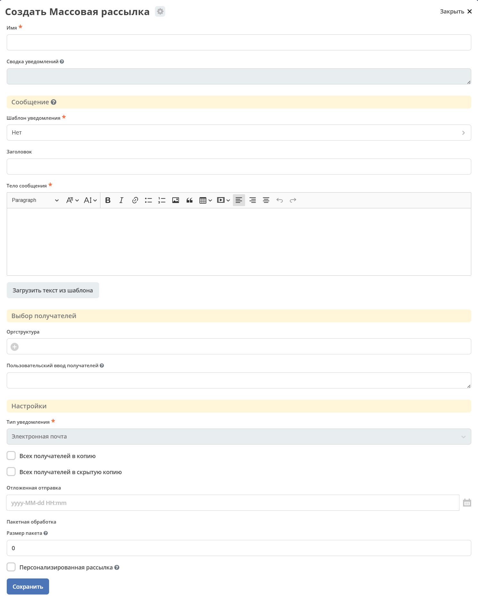
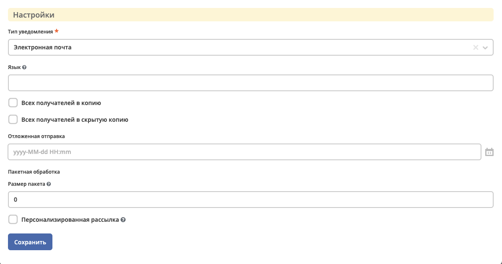
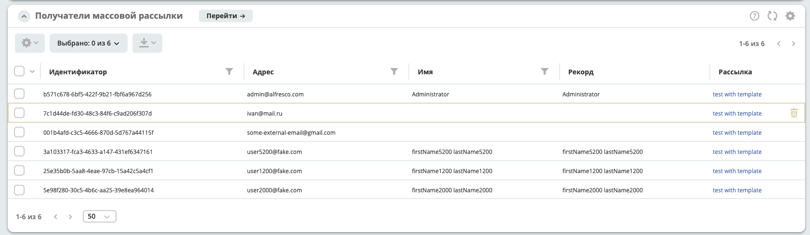
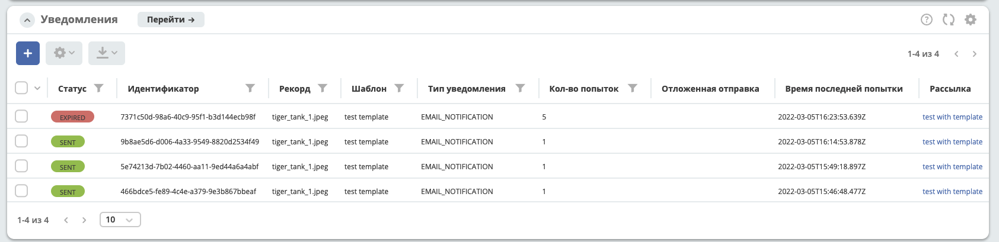

Массовая рассылка
==================

.. note:: 

    Добавлено в версии 2.7.0 микросервиса ecos-notifications

.. contents::

1. Общие сведения
-----------------

Массовая рассылка позволяет отправить уведомления пользователям через конфигурирование сообщений администратором системы.

Данный фунционал может использоваться для системных уведомлений о технических работах, информационных сообщений или любых других рассылок. 

Особенности:

* отправка уведомлений большому количеству пользователей за счет возможности разбиения получателей на партии
* добавление получателей в копию, скрытую копию
* отложенная отправка 
* получение реципиентов из разных источников, редактирование реципиентов до отправки 
* установление текста уведомлений напрямую
* подгрузка текста уведомления из заготовленных шаблонов с последующей корректировкой
* отправка уведомлений по шаблону с выбором базового рекорда
* просмотр статуса рассылки

.. note:: 

    В массовой рассылке заложена возможность отправки уведомлений через разные провайдеры - email, mobile push, sms и т.д. |br|
    На текущий момент реализована только отправка email. В будущем, для поддержки других провайдеров, необходимо реализовать получение разных адресов отправки в зависимоти от типа уведомления.

2. Создание массовой рассылки
-----------------------------

Массовые рассылки располагаются в инструментах администратора, блок "Конфигурация уведомлений", журнал "Массовая рассылка".

2.1 Форма
~~~~~~~~~~~~~~~~~~

2.2 Описание полей
~~~~~~~~~~~~~~~~~~

:Имя: Имя массовой рассылки

:Сводка уведомлений: Сводка по количеству уведомлений в разных статусах, относящихся к текущей рассылки.

:Шаблон уведомления: Отправка уведомления по выбранному шаблону уведомления.

:Record уведомления: Если выбран ``шаблон уведомлений``, то можно выбрать боазовый recordRef для расчета модели шаблона уведомления.

:Заголовок: Прямое установление заголовка уведомления.

:Тело сообщения: Прямое установление тела сообщения через редактор richText.

.. note:: 

    Через кнопку ``Загрузить текст из шаблона`` можно подгрузить *заголовок* и *тело сообщения* из заготовленного шаблона.

:Оргструктура: Выбор получателей сообщения из компонента оргструктуры. Возможно выбрать конкретных пользователей или группу.

:Пользовательский ввод получателей: Ввод получателей через указание прямого адреса (*на данный момент только email*) или userName пользователя. Разделители - ``,``, ``;``, ``пробел``, ``перевод на строку - \n``. Например, данное поле может использоваться для вставки списка получателей копированием из excel.

:Тип уведомления: Выбор типа уведомления - email, mobile push, sms и т.д. На данный момент реализован только email.

:Язык: Язык уведомления для выбранного ``шаблона уведомления``

:Всех получателей в копию: Если выбрано, то все получатели будут добавлены в копию (``cc``)

:Всех получателей в скрытую копию: Если выбрано, то все получатели будут добавлены в скрытую копию (``bcc``)

:Отложенная отправка: Выбор времени отложенной отправки. Если пусто, то отправка осуществится сразу после действия `3.2.2 Отправить сообщения`_

:Размер пакета: Размер пакета при разбиении рассылки по получателям. |br| Например, если размер равен 0, то будет отправлено одно сообщение. Если получателей 10, а размер равен 2, то будет отправлено 5 сообщений. |br| Эта опция может быть полезна, если почтовый сервер не может обработать отсылку сообщения большому количеству получателей в одном сообщении.

:Персонализированная рассылка: Отправка персонализированного сообщения каждому получателю

2.3 Примеры пакетной рассылки
~~~~~~~~~~~~~~~~~~~~~~~~~~~~~~~~~~~~

Ниже будут описаны примеры логики обработки пакетной рассылки для более детального понимания.
 
Предположим, что в рассылке 1_000 получателей, тип уведомления - email, тогда:

При рассылке по умолчанию, без дополнительных настроек, будет отправлено одно сообщение, в котором в поле ``to`` будет 1_000 адресов.

Если выбрано ``Персонализированная рассылка``, то будет отправлено 1_000 сообщений, в поле ``to`` по одному адресу. 
Если здесь же проставить ``Всех получателей в копию`` или ``Всех получателей в скрытую копию``, то по одному адресу будет добавлено в ``cc`` или ``bcc`` соответственно, при этом в ``to`` будет пусто.

Если ``Размер пакета`` установить ``50``, то будет отправлено 20 сообщений, в поле ``to`` по 50 адресов.
Если здесь же проставить ``Всех получателей в копию`` или ``Всех получателей в скрытую копию``, то по 50 адресов будет добавлено в ``cc`` или ``bcc`` соответственно, при этом в ``to`` будет пусто.

Некоторые почтовые серверы плохо орабатывают большое количество писем в одном сообщении. С помощью пакетной обработки можно решить эту проблему. |br|
Например, типичная задача - *Отправить информационное сообщение большому количеству пользователей, при этом пользователи не должны видеть других получателей* решается установлением ``размера пакета`` и флага ``Всех получателей в скрытую копию``.

3. Жизненный цикл массовой рассылки
-----------------------------------

После создания, массовая рассылка переходит в статус "Новый", на котором можно сформировать получателей, скорректировать их и запланировать отправку.

3.1 Статусы
~~~~~~~~~~~~~~~~~~

Статусы устанавиваются в приоритете описания:

:Новый: Массовая рассылка создана.

:Осуществляются попытки отправки: Устанавливается, если хотя бы у одного сообщения при отправке произошла ошибка и осуществляются повторные попытки отправки.

:Ошибка: Устанавливается, если хотя бы у одного сообщения при отправке произошла ошибка, а все повторные попытки или время жизни сообщения были исчерпаны.

:Ожидается отправка: Устанавливается, если хотя бы одно сообщение массовой рассылки находится в статусе "Ожидание отправки".

:Отправлено: Устанавливается, если не найдены кейсы, описанные выше и хотя бы одно сообщение находится в статусе "Отправлено".

3.2 Действия
~~~~~~~~~~~~~~~~~~

3.2.1 Сформировать получателей
""""""""""""""""""""""""""""""""""""

Выбранные получатели на форме массовой рассылки являются заготовкой для формирования конечного списка получателей.

По умолчанию, на форме есть возможноть выбрать получателей из компонента оргструктуры и ручного ввода (см. `2.2 Описание полей`_). |br|
При этом, заложена возможность получить дополнительных рецепиентов из кастомного источника. (см. `4. Дополнительные источники формирования получателей`_)

При выполнении действия "Формирование получателей" происходит сбор получателей из разных источников и формирование уникальных рецепиентов по адресу. В результате можно посмотреть и скорректировать список сформированных получателей в журнале "Получатели":

Журнал получателей поддерживает удаление и простой текстовый поиск через ``ИЛИ``.

.. note::

    При каждом запуске действия "Сформировать получателей" происходит удаление старых получателей и формирование новых.

3.2.2 Отправить сообщения
""""""""""""""""""""""""""""""""""""

При выполнении действия "Отправить сообщения" происходит отправка сообщений, согласно указанным настройкам, получателям из сформированного списка - журнала "Получатели".

В результате действия будут сформированны уведомления в журнале "Уведомления" (см. :ref:`Описание уведомлений  <notifications-label>`), в котором можно посомтреть информацию о сформированных сообщениях и так же их статус.

Пользователи, у которых установлен атрибут **ecos:isPersonDisabled = true**, отфильтровываются, и email сообщения им не отправляются. Актуально для версий: ecos-com:4.9.15, ecos-com:4.11.4 и ecos-com:4.15.0+

4. Дополнительные источники формирования получателей
----------------------------------------------------

Получение дополнительных получателей осуществляется через records dao, который при ``queryOne`` запросе атрибута ``recipients[]?json``, должен вернуть список объектов в формате:

.. code-block:: kotlin
    :caption: RecipientInfo

    data class RecipientInfo(

        @AttName("address")
        var address: String? = "",

        @AttName(".disp")
        var disp: String? = "",

        @AttName("record")
        var record: RecordRef? = RecordRef.EMPTY

    )

.. code-block:: kotlin
    :caption: Запрос дополнительных получателей

    val query = RecordsQuery.Builder()
                .withQuery(bulkMail.recipientsData.custom)
                .withSourceId(provider)
                .withMaxItems(1)
                .build()

    recordsService.queryOne(query, "recipients[]?json").asList(RecipientInfo::class.java)

Перечисление recods источников устанавливается через ecos config c id - ``bulk-mail-custom-recipients-providers``. 

.. code-block:: yaml
    :caption: Ecos config: bulk-mail-custom-recipients-providers

    id: bulk-mail-custom-recipients-providers
    value:
        - notifications/custom-fixed-recipients
        - notifications/custom-mail-recipients

Указанному источнику, для вычисления получателей, можно передать необходимую информацию в query. Информация, передаваемая в query берется из ``bulkMailRecord.recipientsData.custom``, где ``custom`` это ``ObjectData``. |br|
Например, объект ``custom`` можно заполнить на переопределенной форме bulk mail, внутри контейнера ``recipientsData``, создав вложенынй контейнер ``custom``. Таким образом, все, что будет заполнено внутри custom, будет передано в query объекте, источнику records.

В итоге, при формировании получателей, будет вызван records api метод queryOne с переданным ``query``, для каждого указанного источника в конфиге ``bulk-mail-custom-recipients-providers``.

.. |br| raw:: html

      