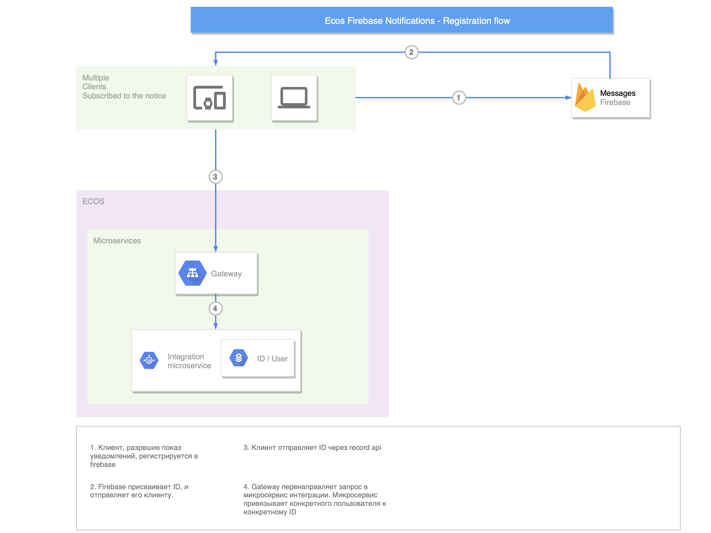
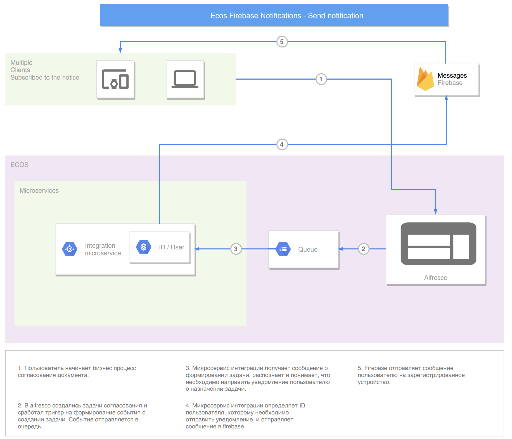

Push уведомления (firebase)
===========================

.. contents::

Firebase уведомления отправляются как реакция на события с использованием библиотеки.

Пуш уведомления на мобильное устройство о задачах
---------------------------------------------------

Для подключения пуш уведомлений необходимо предпринять ряд действия, описанных ниже.

1. Подключение отправки эвентов из alfresco
~~~~~~~~~~~~~~~~~~~~~~~~~~~~~~~~~~~~~~~~~~~~~~~~~~~~~~

В alfresco необходимо включить отправки эвентов по задачам.

2. Подключение firebase на мобильном устройстве
~~~~~~~~~~~~~~~~~~~~~~~~~~~~~~~~~~~~~~~~~~~~~~~~~~~~~~

В мобильном приложении должен быть подключен firebase sdk с настройками конкретного проекта,
см. `документацию firebase <https://firebase.google.com/>`_ под нужную платформу приложения клиента.

3. Настройка микросервисе нотификаций
~~~~~~~~~~~~~~~~~~~~~~~~~~~~~~~~~~~~~~~~~~~~~~~~~~~~~~
В микросервисе нотификаций должны быть заданы настройки для подключения к firebase - ``credentials`` и ``data base url``. Берутся из google firebase console.

.. attention::

  Для каждого проекта / сервера необходимо использовать отдельные серверные приватные ключи - credentials.

Data base url задается через spring config:

.. code-block:: yaml
  
  ecos-notifications:
    firebase:
      data-base-url: some-url

Определение credentials доступно двумя способами:

1. Указание classpath до json файла с credentials

.. code-block:: yaml

  ecos-notifications:
    firebase:
      credential-class-path: /credentials/some-credentials.json

2. Указание через spring config

Идентификаторы мапятся с json credentials

.. code-block:: yaml

  ecos-notifications:
    firebase:
      credentials:
        type: foobar
        project_id: foobar
        private_key_id: foobar
        private_key: foobar
        client_email: foobar
        client_id: foobar
        auth_uri: foobar
        token_uri: foobar
        auth_provider_x509_cert_url: foobar
        client_x509_cert_url: foobar

Если spring config задается через env:

.. code-block::

  ECOS-NOTIFICATIONS_FIREBASE_CREDENTIALS_TYPE=foobar
  ECOS-NOTIFICATIONS_FIREBASE_CREDENTIALS_PROJECTID=foobar
  ECOS-NOTIFICATIONS_FIREBASE_CREDENTIALS_PRIVATEKEYID=foobar
  ECOS-NOTIFICATIONS_FIREBASE_CREDENTIALS_PRIVATEKEY=foobar
  ECOS-NOTIFICATIONS_FIREBASE_CREDENTIALS_CLIENTEMAIL=foobar
  ECOS-NOTIFICATIONS_FIREBASE_CREDENTIALS_CLIENTID=foobar
  ECOS-NOTIFICATIONS_FIREBASE_CREDENTIALS_AUTHURI=foobar
  ECOS-NOTIFICATIONS_FIREBASE_CREDENTIALS_TOKENURI=foobar
  ECOS-NOTIFICATIONS_FIREBASE_CREDENTIALS_AUTHPROVIDERX509CERTURL=foobar
  ECOS-NOTIFICATIONS_FIREBASE_CREDENTIALS_CLIENTX509CERTURL=foobar
  

4. Реализация подписки / отписки на пуш уведомления на мобильном устройстве пользователя
~~~~~~~~~~~~~~~~~~~~~~~~~~~~~~~~~~~~~~~~~~~~~~~~~~~~~~~~~~~~~~~~~~~~~~~~~~~~~~~~~~~~~~~~~~

.. note::
       Если основной функционал подписки / отписки в мобильном клиенте уже реализован, а нужно только изменить настройки подиски, то см. :ref:`пункт 3, Настройка подписки  <notification_subscrive_config_label>` 

1. Получение tenant id.

Сначала необходимо получить tenantId сервера, для этого выполняем запрос

.. code-block::

       GET /share/proxy/alfresco/citeck/global-properties?name=ecos.server.tenant.id HTTP/1.1
       Host: some-ecos-server.citeck.ru

В ответе получим tenant id сервера и запоминаем

.. code-block:: json

  {
    "data": {
      "ecos.server.tenant.id": "some-tenant-id"
      }
  }

2. Регистрация в firebase

Мобильный клиент регистрируется в firebase через sdk.

.. attention::
       На схеме микросервис интеграции заменить на нотификаций

.. _notification_subscrive_config_label:

3. Настройка подписки

После того, как пользователь подтвердил подписку на уведомления и был получен registrationToken от firebase, его необходимо передать в ecos с настройками подписки. Формируем запрос

.. code-block::

  POST /share/api/records/mutate HTTP/1.1
  Host: some-ecos-server.citeck.ru

.. code-block:: json

  {
    "records": [
      {
        "id": "notifications/subscription-action@",
        "attributes": {
          "subscriberId": "some-tenant-id|mmtr_user",
          "eventType": "task.assign",
          "action": {
            "type": "FIREBASE_NOTIFICATION",
            "config": {
              "fireBaseClientRegToken": "ctBwBNEJ0Uk:APA91bG0KNkEey7sOOegkf7QVbf8nlb-h_McCcTVQ9BEcCPdE9ndsLJX_N5vW5rotia0yKvAfj0nsRqEFwEVc6ZR5QLzZA2tRo1wMZVOdKmuBdhEddt8PA0iA4PiSgKcB2SQ1cRocvda",
              "deviceType": "android",
              "templateId": "notifications/template@some-template",
              "locale": "ru"
            },
            "condition": "customData.req.type.asText() == 'uterm:travelExpensesRequest' && (event.taskType == '{http://www.citeck.ru/model/blabla/te/workflow/1.0}approvalTask' || event.taskType == '{http://www.citeck.ru/model/blabla/te/workflow/1.0}approvalPRTask')",
            "customData": [
              {
                "variable": "req",
                "record": "${event.docId}",
                "attributes": { 
                  "number": "uterm:terRegNumber",
                  "package": ".atts(n:\"uterm:packageContent\"){id}",
                  "employee": "uterm:reportablePerson",
                  "type": "_type"
                }
              }
            ]
          }
        }
      }
    ]
  }
  
:id: Указывается records api id для подписок в микросервисе нотификаций.

:subscriberId: Здесь нужно сформировать ``id``, по шаблону ``tenantId|username``, то есть, в ``tenanId`` подставляем ``id``, полученный из пункта №1, в username подставляем username текущего пользователя.

:type: Для отправки пуш уведомлений через firebase указывается ``FIREBASE_NOTIFICATION``. На данный момент это единственное реализованное действие.

:fireBaseClientRegToken: Подставляем токен, полученный от firebase.

:deviceType: Подставляем в зависимости от мобильного клиента - ``android`` или ``ios``.

:templateId: RecordRef шаблона уведомления из микросервиса уведомлений. Шаблон включает в себя title и body уведомления. Если шаблон не указан, то будет использоваться шаблон по умолчанию.

В микросервисе нотификаций добавлены 4 шаблона по умолчанию - create, assign, complete, delete task.

Модель данных для шаблона уведомления описывается в model шаблона уведомления, где основной record - это record, по которому отправляется уведомления. В частности для уведомлений по задачам, это документ, по которому идет бизнес процесс.

В уведомлениях по задачам доступен рекорд задачи в атрибуте ``$task``.

.. note::
        В шаблонах уведомлений для firebase в модель всегда необходимо добавлять атрибут ``_data: "$notificationData?json"``

*condition* - условие отправки уведомления на groovy. Если условие не нужно, то можно передать true.

.. note::
       Если необходимо получать пуши по всем задачам назначенным на пользователя, то условие должно вернуть true

.. hint::
       Моделью данных для вычисления условия является сам event + дополнительная информация, которую можно запросить по records api в блоке ``customData``. При построении запроса в records api, так же можно использовать шаблонизатор freemarker для доступа к модели events.
   
*customData* - дополнительная модель данных, которую можно использовать в шаблоне и условии.

*locale* - локаль, в которой неоходимо получать уведомление

В ответе приходит id созданного объекта подписки, его нужно сохранить для следующего использования

.. code-block:: json

  {
      "records": [
          {
              "id": "notifications/subscription-action@5",
              "attributes": {}
          }
      ],
      "errors": []
  }

На данном этапе пользователь зарегистрировался как подписчик и будет получать уведомления

1. Отписка от пуш уведомления

Если пользователь отказывается от подписки, то необходимо отправить соответствующий запрос серверу, с id, сохраненным на шаге №3
  
.. code-block::

  POST /share/api/records/delete HTTP/1.1
  Host: some-ecos-server.citeck.ru
  
.. code-block:: json

  {
    "records": [
    			"notifications/subscription-action@5"
    	]
  }

Ответ сервера:

* Если в ответе приходит 200й код, значит сервер был доступен и обработал запрос. Если другой код, то подписка не была удалена (возможно стоит вывести пользователю сообщение, что сервер не доступен, повторите операцию позднее)
* Если в ответе пришел 200й код, но при этом в объекте error вернулся тип ошибки EmptyResultDataAccessException, то следует считать что данной подписки на сервере не существует, соответственно и на клиенте нужно актуализировать состояние. Пример ответа с данной ошибкой
  
.. code-block:: json

   {
    "records": [],
    "errors": [
      {
        "type": "EmptyResultDataAccessException",
        "msg": "No class ru.citeck.ecos.notifications.domain.subscribe.Action entity with id 222 exists!",
        "stackTrace": [
          "org.springframework.data.jpa.repository.support.SimpleJpaRepository.lambda$deleteById$0(SimpleJpaRepository.java:151)",
          "java.util.Optional.orElseThrow(Optional.java:290)",
          "org.springframework.data.jpa.repository.support.SimpleJpaRepository.deleteById(SimpleJpaRepository.java:150)"
        ]
      }
    ]
   }

5. Обновление fireBaseClientRegToken и locale

Токен, выданный firebase не бесконечный, в sdk для этого предусмотрено его автоматическое обновление. На клиенте, при срабатывания onRefreshToken, необходимо обновить токен в экосе. 
Если у пользователя изменилась локаль приложение, ее так же нужно изменить в подписке.

Для этого выполнить запрос

.. code-block::

  POST /share/api/records/mutate HTTP/1.1
  Host: some-ecos-server.citeck.ru
  
.. code-block:: json

  {
    "records": [
      {
        "id": "notifications/subscription-action@1331",
        "attributes": {
        	"updateActionConfig": {
        		  "fireBaseClientRegToken": "some-new-token",
              "deviceType": "android",
              "templateId": "supervisor-firebase-template",
              "locale": "en"
        	}
        }
      }
    ]
  }

В атрибуте ``updateActionConfig`` необходимо передать новый config, где ``fireBaseClientRegToken`` - новый токен, ``locale`` - новая локаль, ``deviceType`` и ``templateId`` - Оставляем как в шаге №2. В id передаем id объекта action, который необходимо изменить (полученный в ответе на шаге №2).

6. Процесс отправки и получения пуш уведомления

.. attention::
       На схеме микросервис интеграции заменить на нотификаций

.. note::
       У одного пользователя может быт несколько мобильных устройств для получения пуш уведомлений
