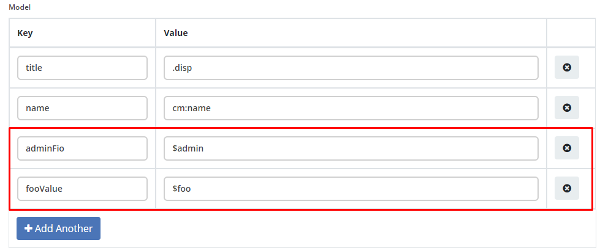
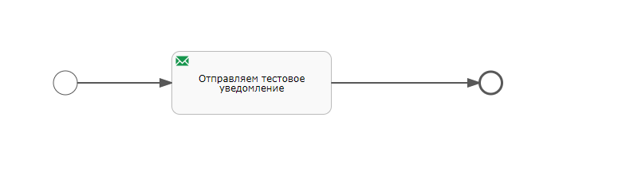
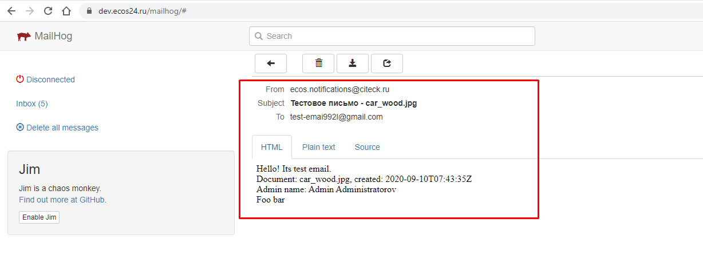
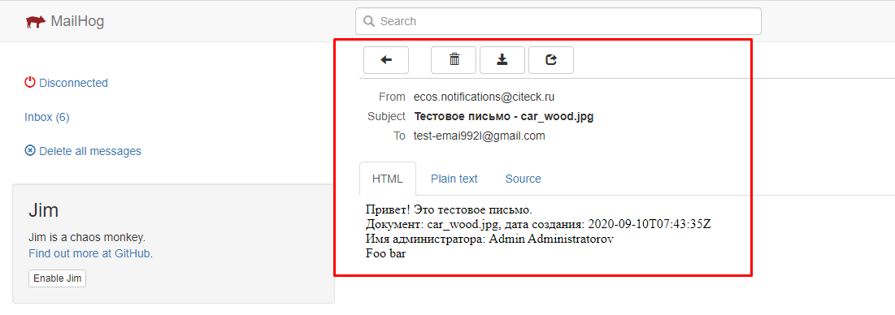

Отправка уведомлений из flowable
==================================

.. contents::

1. Общие сведения
-----------------

Для отправки уведомлений через микросервис нотификаций была доработана стандартная активность “Mail Task”.

.. note:: 

    При этом осталась поддержка стандартных уведомлений flowable. Если в mail task заполнено поле ``template``, то отправка осуществляется через микросервис нотификаций по указанному шаблону, иначе - через стандартынй механизм flowable с использованием стандартных полей.

В mail task были добавлены поля:

:template: RecordRef шаблона уведомления из микросервиса нотификаций. Здесь необходимо указывать полный recordRef, например - ``notifications/template@simple-test-template``

:html: Стандартное поле, которые не актуально при указании template, но его нужно обязательно заполнить, иначе flowable не даст сохранить шаблон процесса. Например, можно заполнить символом ``_``.

:charset: Стандартное поле, заполнить значением ``UTF-8``

:language: Указывается язык шаблона уведомления в формате ``ru``, ``en`` и т.д. Если язык не указан, то берется язык по умолчанию, который определяется свойством ``notifications.default.locale`` в alfresco-global.properties, изначально - ``en``.

:record: Базовый record для заполнения шаблона. Если в этом поле ничего не указано, то берется документ, по которому запущен бизнес процесс из переменной процесса ``document``

:notificationtype: Тип уведомления. Если поле не заполнено, то тип = ``EMAIL_NOTIFICATION``

:additionalmeta: Описание дополнительной мета информации в виде json: |br| *ключ (string)* - по ключу становится доступна информация в модели шаблона уведомления. |br| *значение (object)* - если в значении передана строка и начинается с префикса ``!str_``, то символы после префикса записываются как строка, иначе строка считается как recordRef. Если в значение передан тип объекта, отличный от string, то он записывается явно. 

Например, если в ``additionalmeta`` добавить информацию:

.. code-block:: json

    {
        "admin": "people@admin",
        "foo": "!str_bar"
    }

То в модели шаблона уведомления можно будет получить доступ к значениям:

При обработке шаблона - ``${adminFio}`` выведет *.disp* для *admin*, ``${foo}`` выведет *bar*

Пользователи, у которых установлен атрибут **ecos:isPersonDisabled = true**, отфильтровываются, и email сообщения им не отправляются. Актуально для версий: ecos-com:4.9.15, ecos-com:4.11.4 и ecos-com:4.15.0+

2. Пример отправки из mail task
-------------------------------

1. Создаем шаблон уведомления

С информаций:

**id** = “simple-test-template“

**Notification Title** = Тестовое письмо - ${title}

**Model** = |br| 
title - .disp |br| 
created - cm:created |br| 
adminFio - $admin |br| 
fooValue - $foo

**template content**

.. code-block:: 
    :caption: ru

    Привет! Это тестовое письмо.  
    Документ: ${title}, дата создания: ${created}  
    Имя администратора: ${adminFio}  
    Foo ${fooValue}

.. code-block:: 
    :caption: en

    Hello! Its test email.  
    Document: ${title}, created: ${created}  
    Admin name: ${adminFio}  
    Foo ${fooValue}

2. Создаем процесс flowable

Создадим простой flowable процесс с id ``simple-test-template``, состоящий из отправки одного емейла.

Заполним mail task следующими значениями:

**template** - notifications/template@simple-test-template

**html** - “_“.

**language** - оставим пустым.

**record** - оставим пустым.

**notificationtype** - оставим пустым

**to** - тестовый емейл, кому отправить уведомление

**additionalmeta** - 

.. code-block:: json

    {
    "admin": "people@admin",
    "foo": "!str_bar"
    }

3. Деплоим процесс в ecos

4. Загрузим какой-нибудь файл в папку “Guest Home“

Например, изображение с именем car_wood.jpg, по этому документу будет запускать процесс.

5. Запуск процесса

Перейдём на страницу старта workflow - https://you-ecos-url.com/share/page/start-workflow?referrer=workflows&myWorkflowsLinkBack=true и выберем созданный процесс на этапе №2 с id - ``simple-test-template``, в поле “Элементы“ выберем загруженный файл ``car_wood.jpg`` и нажмем “Начать бизнес процесс“

6. Получение уведомления

Так как мы не указали language, то пришло уведомление из шаблона по умолчанию en. 

Вернемся в бизнес процесс flowable и в поле language поставим ru, сохраним и задеплоим новую версию, запустим бизнес процесс.

Получим уведомление из шаблона ru:

.. |br| raw:: html

      