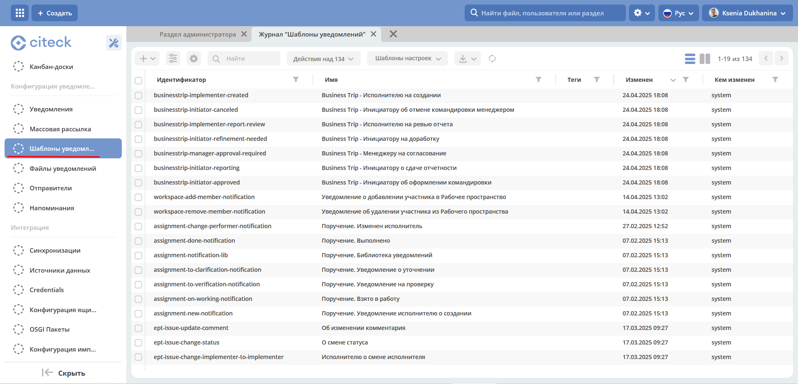
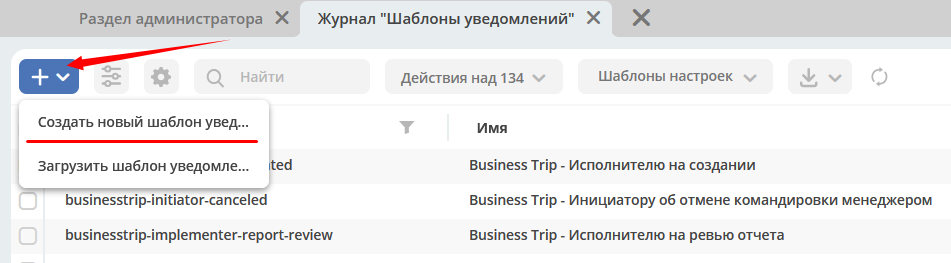
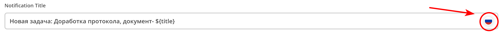
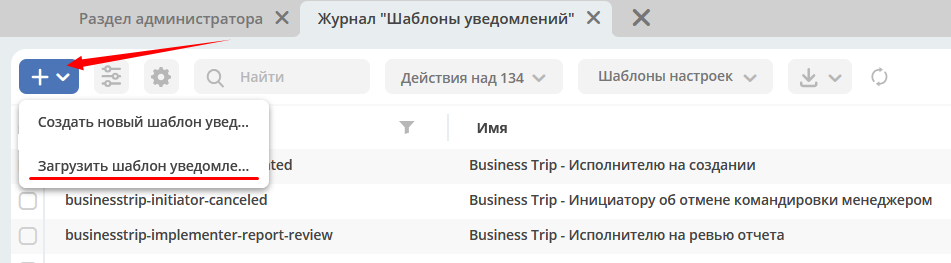
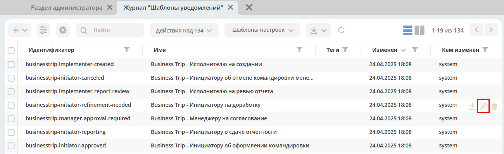
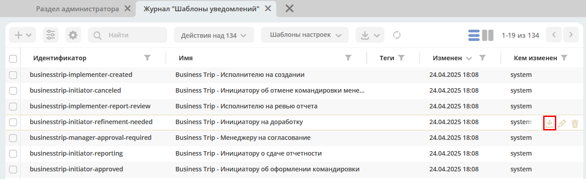
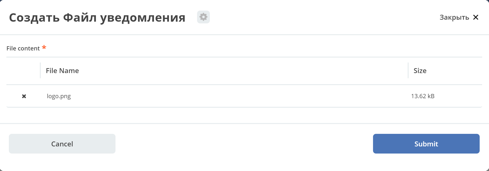

Шаблоны уведомлений
====================

.. _notification_templates:

.. contents::

1. Общие сведения
-----------------
1.1 Описание сущности “Шаблон уведомления“
~~~~~~~~~~~~~~~~~~~~~~~~~~~~~~~~~~~~~~~~~~~~

:Id: Уникальный идентификатор шаблона уведомления.
:Name: Имя шаблона уведомления.
:Tags: Теги.

:Notification title: Заголовок уведомления, мульти-язычное поле – строка с поддержкой freemarker.

:Notification body: Многокомпонентное поле для описания тела уведомления с привязкой к указанной локали. В одном шаблоне уведомления предусмотрена поддержка разных локалей (языков). |br| *Lang* - Локаль сообщения, например *en*, *ru*. |br| *Body* - Исходное содержимое текста сообщения c использованием `freemarker <https://freemarker.apache.org/>`_. При нажатии на кнопку "Редактировать как HTML" открывается richText редактор сообщения для более удобного редактирования html разметки
:Model: Модель, исходя из которой будет происходить шаблонизация текста – title или body для уведомлений. |br| Модель – это map ключ: значение, ключом в данном случае выступает имя переменной, которая будет доступна в шаблоне, а значение – ecos records выражение для вычисления значения переменной. |br| Базовым record является документ, по которому идет бизнес-процесс. То есть, если в модели указать значение ``.disp``, то вычисляется заголовок по документу. Так же есть доступ к другим объектам через знак ``$``, например, если уведомление отправляется в рамках бизнес процесса, - ``$process.webUrl`` (по умолчанию доступны дополнительные переменные ``$now``, ``$user``, ``$webUrl``). |br| При использовании мульти шаблонов, модель из базового шаблона будет сливаться с моделью, найденной по типу, таким образом часть «базовой» модели может быть описана в базовом шаблоне, а более специфичные атрибуты могут быть вынесены в конкретный шаблон.

:Multi templates: Вычисляемые шаблоны, в зависимости от типа документа, по которому отсылается уведомление. Например, может быть «базовый» шаблон, который включает в себя несколько других шаблонов с разными типами документов. |br| При отправке уведомления, если у документа, по которому отправляется уведомление, тип не соответствует ни одному из мульти-шаблонов, то отправка осуществится по «базовому» шаблону, если тип документа соответствует мульти-шаблону, то отправка произойдет по соответствующему шаблону.
:Predicate: Позволяет задать дополнительные условия для связки *шаблон - тип*. Вычисление предикатов происходит на основе атрибутов модели.

1.2 Журнал “Шаблоны уведомлений“
~~~~~~~~~~~~~~~~~~~~~~~~~~~~~~~~

.. _template_journal:

Для перехода в журнал необходимо в боковом меню выбрать **«Инструменты»**. Далее в правой части перейти в блок **"Конфигурация уведомлений" - > журнал "Шаблоны уведомлений"**.

1. Операции
-----------
2.1 Создание шаблона уведомления 
~~~~~~~~~~~~~~~~~~~~~~~~~~~~~~~~~

Для создания необходимо перейти в журнал «Шаблоны уведомлений», см. `1.2 Журнал “Шаблоны уведомлений“`_.

Шаблон уведомления может быть создан несколькими способами:

* Создание нового объекта;
* Импорт модуля (zip).

2.1.1 Создание нового объекта
""""""""""""""""""""""""""""""

Для создания нового объект необходимо нажать на **«+»** и выбрать **«Создать новый шаблон уведомления»**

Описание полей см. `1.1 Описание сущности “Шаблон уведомления“`_.

Для примера создадим базовый шаблон c уведомлением о том, что создан новый документ.

Открываем форму создания и заполняем следующую информацию:

**id** - ssg-incident-base-new-incident-to-possible-responsible

**name** - Базовый шаблон. Новый документ

**notification title** - Новый инцидент: ${title}. |br| 
В данном случае *${title}* означает, что из описанной модели будет взято значение, которое является заголовком для документа. |br| 
Данное поле является мульти язычным, переключение языков происходит по нажатию на значок флага.

**Notification body** - ``lang`` = ru, ``body`` заполняем следующим текстом:

.. code-block::

    <#import "ssg-template-lib" as lib>

    <@lib.its_test_message/>
    

        Сообщаем, что сформирован документ, за обработку которого Вы являетесь ответственным. 
        <@lib.document_link/> 
        Пожалуйста, проверьте рабочий список задач Скиф. 
    

В данном шаблоне импортируется библиотечный шаблон:

.. code-block::

    <#macro its_test_message>
        <b>Это письмо было отправлено вам в рамках тестирования настроек новой системы.
            Вам не нужно отвечать или как-то реагировать на него.</b>
    </#macro>

    <#macro document_link>
    <a href="${web_url}/v2/dashboard?recordRef=${doc_recordRef}"><u><i>${title}</i></u></a>
    </#macro>

В шаблонах уведомления поддерживается ``import`` и ``include`` других шаблонов по их ``id``.

В текущем примере:

``<@lib.its_test_message/>`` - печать блока текста, информирующего о том, что это сообщение является тестовым. |br|
``<@lib.document_link/>`` - печатает ссылку на документ, по которому идет бизнес процесс, в данном случае – сам документ.

Подробнее о использовании макросов, импорте и включении других шаблонов см. документацию apache freemarker - https://freemarker.apache.org

**Model** - описываем модель, которая потребуется для шаблонизации текста:

*Flowable:*

* **web_url : $process.webUrl** – используется для формирования ссылки на документ
* **doc_recordRef : .id**  – уникальный id документа, так же используется для формирования ссылки на документ
* **title : .disp** – заголовок документа

*Ecos BPMN:*

См. описание компонента :ref:`«Уведомление» в документации по Ecos BPMN.<notification_variables>`

2.1.2 Импорт модуля
""""""""""""""""""""
Для импорта модуля в журнале «Шаблоны уведомлений» нажмите на **«+»** и выберите **«Загрузить шаблон уведомления»**

В открывшейся форме загрузите zip архив с шаблоном уведомления. Подробнее про модуль «Шаблон уведомления» см. `2.4 Выгрузка шаблона уведомления`_.

2.2 Редактирование шаблона уведомления
~~~~~~~~~~~~~~~~~~~~~~~~~~~~~~~~~~~~~~~~~~~~~~~~~~~~~~

Для редактирования шаблона уведомления перейдите в журнал (см. `1.2 Журнал “Шаблоны уведомлений“`_), найдите нужный шаблон и нажмите на действие «Редактировать».

2.3 Удаление шаблона уведомления
~~~~~~~~~~~~~~~~~~~~~~~~~~~~~~~~~

Для удаления шаблона уведомления перейдите в журнал (см. `1.2 Журнал “Шаблоны уведомлений“`_), найдите нужный шаблон и нажмите на действие «Удалить».

2.4 Выгрузка шаблона уведомления
~~~~~~~~~~~~~~~~~~~~~~~~~~~~~~~~~~~~

Для выгрузки модуля шаблона уведомления перейдите в журнал (см. `1.2 Журнал “Шаблоны уведомлений“`_), найдите нужный шаблон и нажмите на действие «Скачать».

Модуль представляет собой zip архив с мета-информаций по шаблону и самим контентом шаблона. Для примера, выгрузим модуль для шаблона, созданного на шаге `2.1.1 Создание нового объекта`_.

Файл ssg-incident-base-new-incident-to-possible-responsible.html.meta.yml является мета информацией, содержимое файла:

.. code-block:: json

    {
        "id" : "ssg-incident-base-new-incident-to-possible-responsible",
        "name" : "Базовый шаблон. Новый документ",
        "notificationTitle" : {
            "ru" : "Новый инцидент: ${title}"
        },
        "model" : {
            "web_url" : "$process.webUrl",
            "doc_recordRef" : ".id",
            "title" : ".disp"
        },
        "multiTemplateConfig" : []
    }

Файл ssg-incident-base-new-incident-to-possible-responsible.html.ftl является самим контентом шаблона, его содержимое:

.. code-block::

    <#import "ssg-template-lib" as lib>

    <@lib.its_test_message/>
    

        Сообщаем, что сформирован документ, за обработку которого Вы являетесь ответственным. 
        <@lib.document_link/> 
        Пожалуйста, проверьте рабочий список задач Скиф. 
    

Обратите внимание, что модуль должен быть именно zip архивом, а файлы внутри него чувствительны к наименованию и расширению. |br|
Файл с контентом должен иметь расширение «.html.ftl», а файл с мета информацией должен именоваться по правилу полное_имя_файла_контента_с_расширением.meta.yml

.. note:: 
    
    Если тело шаблона предусматривает несколько локалей, то в имени файла контента указывается локаль по следующему правилу: |br|
    ``ssg-incident-base-new-incident-to-possible-responsible.html_en.ft`` для локали ``en`` |br|
    ``ssg-incident-base-new-incident-to-possible-responsible.html_ru.ft`` для локали ``ru`` |br|
    и т.д.

3. Использование переменных в шаблоне
-------------------------------------
В шаблонах уведомлений доступны переменные, определенные в модели, см `1.1 Описание сущности “Шаблон уведомления“`_ блок «Model», а также добавленные сервисы в freemarker.

.. _notification_template_services:

3.1 Сервисы и константы
~~~~~~~~~~~~~~~~~~~~~~~

В шаблонах уведомлений доступны следующие сервисы, добавленные в freemarker:

-  ``link`` - формирование ссылок
  
   -  ``getRecordLink(recordRef: String): String`` - возвращает полную ссылку на переданный recordRef вида *http://<webUrl>/v2/dashboard?recordRef=<recordRef>*

-  ``meta`` - сервис для получения различной мета информация
  
   -  ``getWebUrl(): String``- возвращает настроенный webUrl сервера

-  ``_notification`` - информация о текущем уведомлении
  
   -  ``title`` - заголовок уведомления
   -  ``from`` - отправитель уведомления
   -  ``to`` - получатель уведомления
   -  ``cc`` - копия уведомления
   -  ``bcc`` - скрытая копия уведомления

-  ``image`` - работа с изображениями в шаблоне, см. пример - :ref:`Вставка изображений в шаблон<notification_template_add_image>` .
  
   -  ``toBase64Data(fileName: String): String`` - возвращает *base64 data image* представление изображения по переданному имени файла изображения
   -  ``toBase64(fileName: String): String`` - возвращает *base64* представление изображения по переданному имени файла изображения

-  ``config`` - предоставляет доступ к Конфигурации Ecos по ключу в формате ``<область>$<идентификатор>``.

   - ``get(key: String): DataValue`` - получение значения по ключу
   - ``getOrDefault(key: String, defaultValue: Any): DataValue`` - получение значения по ключу, если значение не найдено, то возвращается значение по умолчанию
   - ``getNotNull(key: String): DataValue`` - получение значения по ключу, если значение null, то выбрасывается исключение

    .. code-block::

        //получение значения конфигурации по ключу и приведение к типу String
        <#assign replyEmail = config.getNotNull("app/service-desk$sd-email-reply").asText()>

3.2 Множественные атрибуты
~~~~~~~~~~~~~~~~~~~~~~~~~~~

Предположим, что в источнике есть атрибут ``eventLines``, который возвращает список "строк" с атрибутами. |br|
Для получения данных по множественным атрибутам, как и для всех других, используется стандартные records выражения:

* ``lines: eventLines[]{id:skifem:eventLineId,text:VIEW_0POSTXT}`` - получить список строк, с атрибутами id и VIEW_0POSTXT. Внутри {} можно указывать атрибуты, которые необходимо подгрузить в объект.
* ``firstLine: eventLines{id:skifem:eventLineId,text:VIEW_0POSTXT}`` - аналогично примеру выше, с оговоркой, что будет загружен только первый объект.

.. image:: _static/template/notifications_template_atts_list.png
        :width: 400
        :align: center

В самом шаблоне уведомления выведем информацию по списку строк в виде html таблицы и отдельной строкой первый элемент:

.. code-block::

    

    <table>
        <caption>Пример - информация по строкам</caption>
        <tr>
            <th>id</th>
            <th>текст документа</th>
        </tr>
        <#if (lines?? && lines?size > 0)>
            <#list lines as line>
                <tr>
                    <td>${line.id!""}</td>
                    <td>${line.text!""}</td>
                </tr>
            </#list>
        </#if>
    </table>
     
    Пример - информация по первой строке: id: ${firstLine.id!""}, text: ${firstLine.text!""}
    

В результате получим емейл с следующим содержанием:

3.3 Вставка изображений в шаблон
~~~~~~~~~~~~~~~~~~~~~~~~~~~~~~~~~

.. _notification_template_add_image:

В шаблонах уведомлений реализована возможность вставлять изображения в html разметку в виде base64 data.

Доступные для вставки изображения находятся в журнале **«Файлы уведомлений»** (**"Инструменты" - > "Конфигурация уведомлений" - > журнал "Шаблоны уведомлений"**). 

Для загрузки нового изображения необходимо нажать на «+» и загрузить изображение. Имя изображения является идентификатором и должно быть уникально.

Для примера, предположим, что в шаблон письма необходимо добавить кнопку с ссылкой на ресурс https://citeck.com. Для этого необходимо осуществить следующие действия:

1. Загрузить файл изображения test-logo-citeck.png в журнал **«Файлы уведомлений»**.

2. В шаблоне добавим html разметку с кнопкой и src в виде base64 изображения, загруженного в пункте №1.

.. code-block::

    Привет! Это тестовый шаблон с кнопкой-изображение :)
    <form action="https://citeck.com/">
        <input type="image" src="${image.toBase64Data("test-logo-citeck.png")}" style="max-height: 67px; max-width: 200px;">
    </form>

Как видно из шаблона выше, для конвертации изображение в base64 data необходимо у сервиса ``image`` вызвать метод ``toBase64Data`` и передать ему идентификатор изображения.

3. В результате получим емейл с кнопкой в виде изображения:

3.4 Прикрепление вложений (attachments) к email уведомлению
~~~~~~~~~~~~~~~~~~~~~~~~~~~~~~~~~~~~~~~~~~~~~~~~~~~~~~~~~~~~

Для того чтобы прикрепить вложение необходимо в шаблоне уведомления в модель добавить атрибут ``_attachments``. В него мы можем указать контент или список из контентов. Выглядеть это должно следующим образом:

.. image:: _static/template/notifications_template_attachments_2.png
        :width: 600
        :align: center

    
В значении к полю ``_attachments`` необходимо указать :ref:`Records API атрибут.<Records API attribute>`

Для рекродов, которые хранятся в emodel - ``_content{bytes,meta:?json}``

.. note::

    Доступно с версии ``2.15.0`` микросервиса *ecos-notification*.
    Можно использовать любой атрибут, в котором хранится content рекорда. В примере используется ``_content``, так как он является атрибутом для хранения контента по умолчанию.

Ожидаемая модель:

.. code-block:: json

    {
        "bytes": "SOj2",
        "meta": {
            "name": "test.txt",
            "ext": "txt",
            "mimeType": "text/plain"
        }
    }

Для рекордов, которые хранятся в Alfresco - ``cm:content{bytes,previewInfo?json}``

.. note::

    Доступно с версии ``2.5.0`` микросервиса *ecos-notification*.

Ожидаемая модель:

.. code-block:: json

    {
        "bytes": "SOj2",
        "previewInfo": {
            "originalName": "test.txt",
            "originalExt": "txt",
            "mimeType": "text/plain"
        }
    }

Использование вышеуказанных атрибутов необязательно, главное чтобы атрибут ``_attachments`` соответствовал ожидаемой модели.

:bytes: Контент файла закодированный в формат Base64
:mimetype: Mimetype файла
:ext: Расширение файла
:name: Имя файла

.. note::

    1. Если в ``originalName`` будет находиться имя без расширения, то система сама допишет расширение файлу из originalExt.
    2. Если окажется, что ``cm:content`` будет отсутствовать у ноды (или лист контентов будет пустым), то отправится уведомление без прикрепления вложений.

.. |br| raw:: html

      

