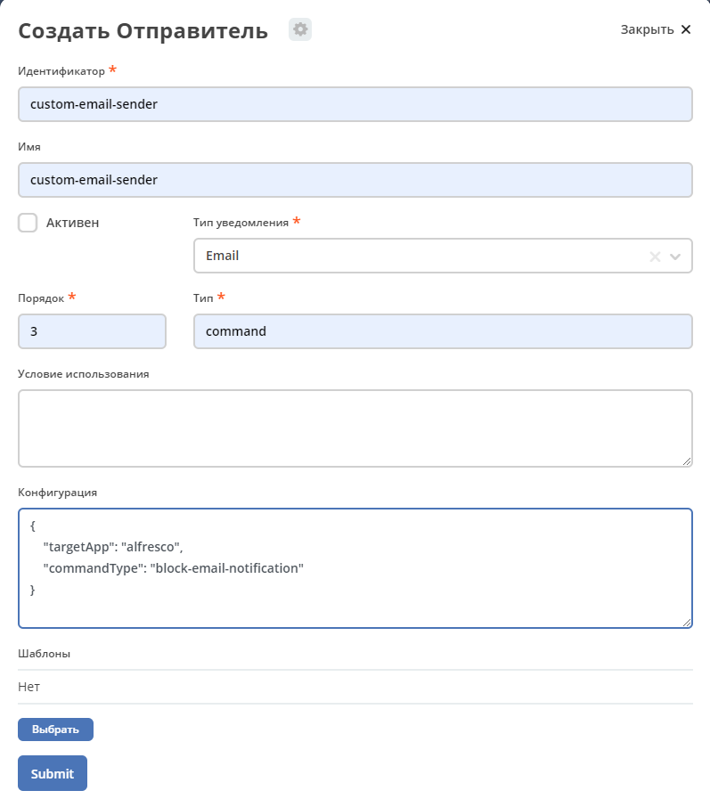

Отправители
*************

.. note:: 

    Добавлено в версии 2.9.0 микросервиса ecos-notifications
    
.. contents::

1. Общие сведения
-----------------
Основная цель механизма - это роутинг, обработка одного уведомления несколькими сендерами не поддерживается. Механизм разрабатывался для поддержки возможности блокировки отправки уведомлений

**Журнал "Отправители"** доступен в разделе администратора меню **"Конфигурация уведомлений"**

.. image:: _static/sender/sender_journal.png
       :width: 600
       :align: center
       :alt: Журнал “Отправители“
       
Для отправки уведомления перебираются активные отправители с соответствующим типом нотификации в порядке возрастания порядка. 

В отправителе можно определить список шаблонов, для которых он будет применяться. Если список не задан, то отправитель доступен для отправки уведомления по любому шаблону. 

Также в конфигурации можно указать дополнительные условия для применения сендера. Условия описываются в формате предикатов, например:

.. code-block::

    {    
      "t": "eq",
      "a": "process-definition",
      "v": "flowable$confirm"
    }

..
 'предикатов </docs/general/Язык_предикатов.rst>'

Значения атрибутов при проверке применения сендера вычисляются на основе атрибутов модели шаблона нотификации.

Реализовано два типа отправителей **default** и **command**. 

default не имеет параметров для конфигурации. В микросервисе нотификации сконфигурированы два default отправителя *default-email-sender* и *default-firebase-sender* с порядком равным 1000. Их можно увидеть в журнале “Отправители“ (раздел администратора, меню “Конфигурация уведомлений”)
У отправителя с типом command в конфигурации определены два параметра:

.. code-block::

  {
    "targetApp": String // приложение, в котором нужно исполнить команду
    "commandType": String // тип команды
   }

Для отправки уведомления через command-отправителя необходимо реализовать:

1) Класс с аннотацией ``@CommandType(“тип_ команды_из_конфигурации“)``. Структура класса должна повторять структуру уведомления, отправляемого микросервисом нотификации **(ru.citeck.ecos.notifications.domain.sender.command.CmdFitNotification)**

2) Обработчик команды реализующий интерфейс **ru.citeck.ecos.commands.CommandExecutor<класс_из_п.1>**. В результате выполнения обработчик должен возвращать значение из перечисления **ru.citeck.ecos.notifications.lib.NotificationSenderSendStatus**.

3) Создать отправителя в журнале “Отправители“

       
2. Статусы обработки уведомления       
----------------------------------

После получения уведомления на отправку сендер должен вернуть статус обработки уведомления **(ru.citeck.ecos.notifications.lib.NotificationSenderSendStatus)**:

* **SENT** - Уведомление отправлено. Дальнейшая обработка не требуется
* **BLOCKED** - Отправка уведомления заблокирована. Дальнейшая обработка не требуется
* **SKIPPED** - Уведомление не обработано текущим Sender'ом. Нужно использовать следующий.

3. Пример использования command отправителя
---------------------------------------------------

Для блокировки отправки сообщений были созданы журнал с условиями блокировок и command отправитель. Также создан обработчик команды, которая указана в конфигурации отправителя. Этот обработчик проверяет совпадают ли параметры уведомления с условиями в журнале блокировок, и если совпадают, то возвращает статус **BLOCKED**. Таким образом, уведомление не отправляется, а помечается как заблокированное
