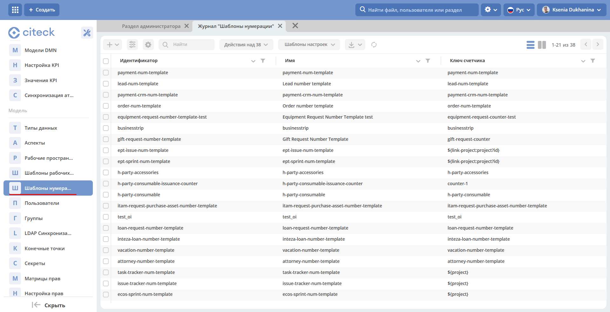
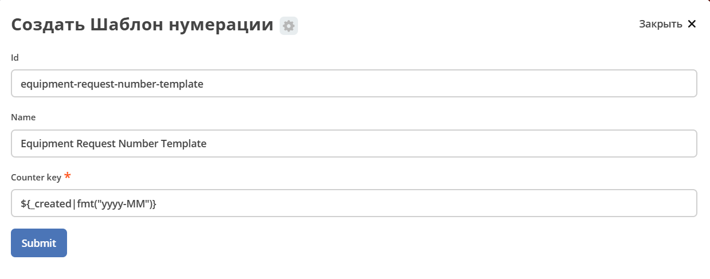
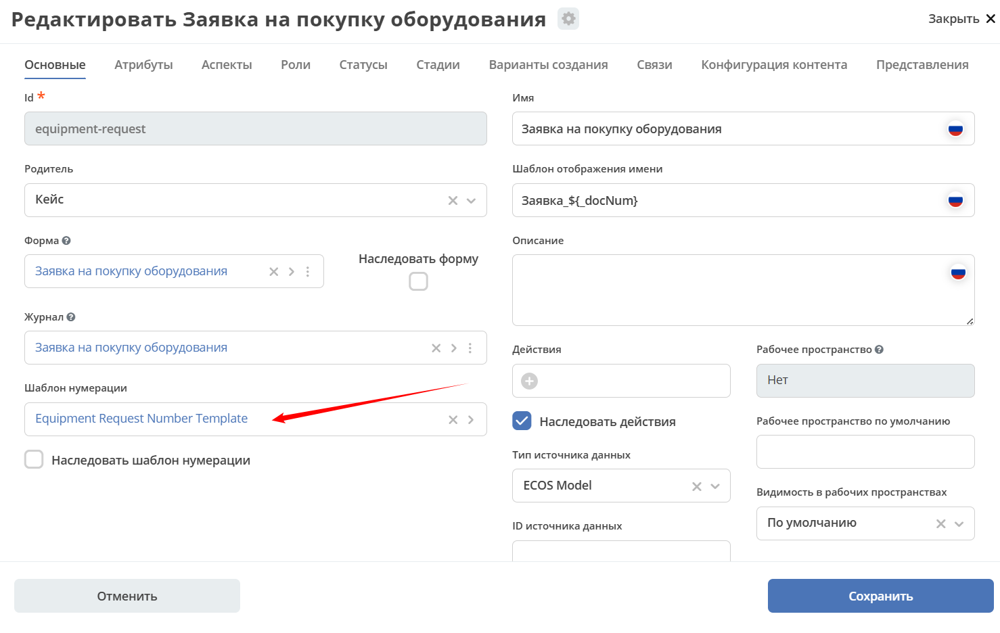
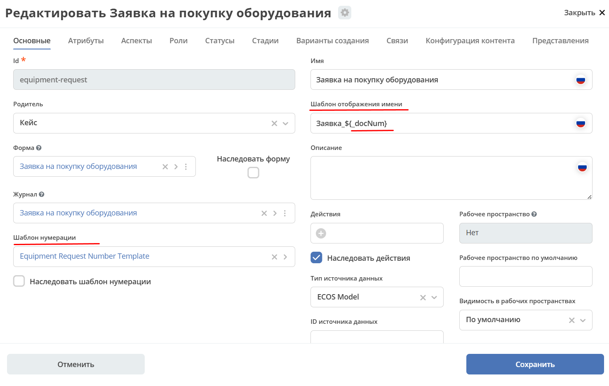
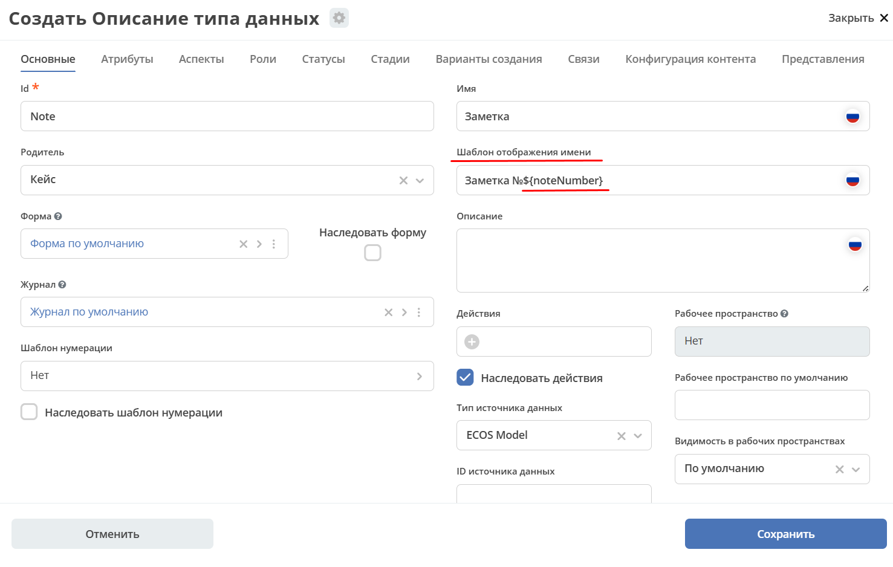
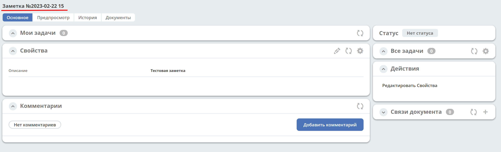

.. _number_template:

Шаблоны нумерации
==================

Template
---------------
Шаблоны нумерации можно полностью настроить через интерфейс ECOS. Шаблоны и счетчики для них хранятся в **ecos-model**.

.. image:: _static/number_template/Number_template_1.png
       :width: 400
       :align: center
       :alt: Шаблон нумерации

Файлы шаблонов создаются и сохраняются в формате: **graphml**

Number template
~~~~~~~~~~~~~~~~
Сущность, которая определяет шаблон счетчика на основе текущей даты или полей в сущности, которую мы хотим пронумеровать.

Поля:

* **id** - идентификатор сущности
* **name** - произвольное имя. Справочная информация
* **counterKey** - шаблон ключа счетчика. Может быть как константой (будет создан только 1 счетчик для шаблона), так и с вставками в формате ``${атрибут_из_нумеруемой_сущности}``. В будущем будет возможность так же использовать текущую дату для шаблона (например, для старта нумерации с 0 каждый год или месяц или день).

Number counter
~~~~~~~~~~~~~~
Сущность, в которой ведется счет

Поля:

* **key** - ключ счетчика. Константное значение, которое получилось после вычисления counterKey в шаблоне нумерации
* **counter** - значение счетчика

Алгоритм работы
----------------------------------------

В приложении, которое использует шаблоны нумерации, настраивается синхронизация с загрузкой всех шаблонов из **ecos-model** с целью получения списка атрибутов, которые нужны шаблону.

При создании новой сущности мы берем её тип, из типа получаем шаблон нумерации и если он задан, то достаем список необходимых для шаблона атрибутов. Далее отправляем команду с необходимыми атрибутами в **ecos-model** для получения следующего значения счетчика. Получив значение счетчика, сохраняем его в одном из полей (в alfresco значение счетчика всегда сохраняется в **ecos:docNum**).

Для получения значения счетчика следует всегда использовать системный атрибут ``_docNum`` (каждый источник ответственен за возвращение актуального значения нумерации по этому атрибуту).

Настройка шаблона в интерфейсе
--------------------------------------------------------------

1.	Перейти в журнал **«Шаблоны нумерации» (Инструменты – Модель -Шаблоны нумерации)** .

1. Нажать **+** и выбрать **«Создать новый шаблон»**
2. Ввести **Id**, **name** и **counterKey** и нажать **Submit**

Новый шаблон нумерации создан. 

Привязка к типу данных
-------------------------

Шаблон нумерации можно привязать к типу данных по любому из двух вариантов:

1.	C использованием системного атрибута ``_docNum``, содержащего номер, который генерируется по шаблону: 

2. с привязкой счетчика к конкретному атрибуту. В поле будет записываться номер из счетчика:

   
   - Перейти в настройки атрибута:

    .. image:: _static/number_template/Number_template_5.png
        :width: 600
        :align: center

   - Указать тип **Counter, storing type On create**, выбрать созданный ранее шаблон нумерации, подтвердить:

    .. image:: _static/number_template/Number_template_6.png
        :width: 500
        :align: center

Использование данных счетчика в шаблоне отображения имени
-----------------------------------------------------------

В шаблоне отображения имени можно задать данные счетчика. Например:

Для **1 случая** указывается системный атрибут ``_docNum``:

Для получения следующего отображения имени:

.. image:: _static/number_template/Display_name_2.png
       :width: 600
       :align: center

Для **2 случая** указывается атрибут/-ы, к которому привязан счетчик.

Возможно указать количество символов (заполнение лидирующими нулями): ``Test №${_docNum|fmt('00000')}``

Реализована поддержка для чисел и дат в fmt:

``fmt('YYYY.MM', ‘en', ‘GMT+0')``

``fmt(’00000', 'en')``

Например: ``Заметка №${$now|fmt('yyyy-MM-dd')} ${noteNumber}``

Где 

- ``now|fmt('yyyy-MM-dd')`` – текущая дата; 
- ``noteNumber`` – атрибут «Регистрационный номер», к которому привязан счетчик.

Для получения следующего отображения имени:

