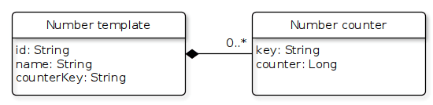
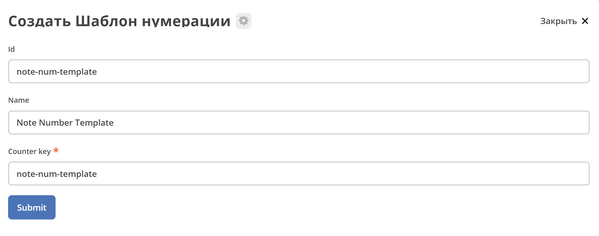

.. _number_template:

Шаблоны нумерации
==================

.. contents::
    :depth: 2

Описание
-----------

**Шаблоны нумерации** — механизм автоматической генерации уникальных номеров для сущностей в Citeck. С их помощью можно настроить сквозную, ежемесячную, проектную или любую другую нумерацию без программирования — прямо через интерфейс администратора.

Шаблон задаёт правило формирования ключа счётчика, а счётчик хранит текущее значение и автоматически инкрементируется при создании каждой новой записи. Шаблоны и счётчики хранятся в сервисе **ecos-model**.

На этой странице описаны:

- структура сущностей **Number template** и **Number counter**;
- алгоритм работы механизма нумерации;
- настройка шаблона через интерфейс;
- привязка шаблона к типу данных;
- использование счётчика в шаблоне отображения имени;
- изменение текущего значения счётчика.

Файлы шаблонов создаются и сохраняются в формате: graphml

Number template
~~~~~~~~~~~~~~~~
Сущность, которая определяет шаблон счетчика на основе текущей даты или полей в сущности, которую мы хотим пронумеровать.

.. list-table::
   :header-rows: 1
   :widths: 20 80
   :class: tight-table

   * - Поле
     - Описание
   * - **id**
     - Идентификатор сущности
   * - **name**
     - Произвольное имя. Справочная информация
   * - **counterKey**
     - Шаблон ключа счетчика. Может быть как константой (будет создан только 1 счетчик для шаблона), так и с вставками в формате ``${атрибут_из_нумеруемой_сущности}``

Number counter
~~~~~~~~~~~~~~
Сущность, в которой ведется счет.

.. list-table::
   :header-rows: 1
   :widths: 20 80
   :class: tight-table

   * - Поле
     - Описание
   * - **key**
     - Ключ счетчика. Константное значение, которое получилось после вычисления counterKey в шаблоне нумерации
   * - **counter**
     - Значение счетчика

Алгоритм работы
------------------

В приложении, которое использует шаблоны нумерации, настраивается синхронизация с загрузкой всех шаблонов из **ecos-model** с целью получения списка атрибутов, которые нужны шаблону.

При создании новой сущности мы берем её тип, из типа получаем шаблон нумерации и если он задан, то достаем список необходимых для шаблона атрибутов. Далее отправляем команду с необходимыми атрибутами в **ecos-model** для получения следующего значения счетчика. Получив значение счетчика, сохраняем его в одном из полей.

Для получения значения счетчика следует всегда использовать системный атрибут ``_docNum`` (каждый источник ответственен за возвращение актуального значения нумерации по этому атрибуту).

Настройка шаблона в интерфейсе
--------------------------------

1. Перейти в журнал **«Шаблоны нумерации» (Рабочее пространство "Раздел администратора" - Модель)**.

   .. image:: _static/number_template/Number_template_2.png
          :width: 600
          :align: center

2. Нажать **+** и выбрать **«Создать новый шаблон»**
3. Ввести Id, name и counterKey и нажать **Submit**

Рассмотрим пример с использованием текущего месяца для шаблона (нумерация стартует с 0 каждый месяц):

Новый шаблон нумерации создан. 

Привязка к типу данных
-------------------------

Шаблон нумерации можно привязать к типу данных по любому из двух вариантов:

.. tab-set::

   .. tab-item:: Через системный атрибут _docNum

      C использованием системного атрибута ``_docNum``, содержащего номер, который генерируется по шаблону:

      .. image:: _static/number_template/Number_template_4.png
             :width: 600
             :align: center

   .. tab-item:: Через привязку к атрибуту

      С привязкой счетчика к конкретному атрибуту. В поле будет записываться номер из счетчика:

      1. Перейти в настройки атрибута:

         .. image:: _static/number_template/Number_template_5.png
             :width: 600
             :align: center

      2. Указать тип **Counter, storing type On create**, выбрать созданный ранее шаблон нумерации, подтвердить:

         .. image:: _static/number_template/Number_template_6.png
             :width: 500
             :align: center

Использование данных счетчика в шаблоне отображения имени
-----------------------------------------------------------

В шаблоне отображения имени можно задать данные счетчика. Например:

.. tab-set::

   .. tab-item:: Случай 1. Системный атрибут _docNum

      Указывается системный атрибут ``_docNum``:

      .. image:: _static/number_template/Display_name_1.png
             :width: 600
             :align: center

      Для получения следующего отображения имени ``Заявка № 17``.

   .. tab-item:: Случай 2. Атрибут счетчика

      Указывается атрибут/-ы, к которому привязан счетчик.

      .. image:: _static/number_template/Display_name_3.png
             :width: 600
             :align: center

Форматирование через fmt
~~~~~~~~~~~~~~~~~~~~~~~~~

Реализована поддержка форматирования чисел и дат через ``fmt``:

.. code-block:: text

   fmt('YYYY.MM', 'en', 'GMT+0')

   fmt('00000', 'en')

Например, ``Test №${_docNum|fmt('00000')}`` позволяет указать количество символов (заполнение лидирующими нулями).

.. list-table:: Примеры шаблонов
   :header-rows: 1
   :widths: 60 40
   :class: tight-table

   * - Шаблон
     - Результат
   * - ``Заметка №${$now|fmt('yyyy-MM-dd')} ${noteNumber}``
     - ``Заметка №2023-02-23 15``
   * - ``Заявка № ${_created|fmt('yyyy-MM')}-${_docNum}``
     - ``Заявка № 2025-07-1``

.. note::
   ``now|fmt('yyyy-MM-dd')`` — текущая дата; ``noteNumber`` — атрибут «Регистрационный номер», к которому привязан счетчик.

Изменение текущего значения счетчика
-------------------------------------

Для изменения текущего значения счетчика необходимо выполнить mutate запрос.

Template:

.. code-block:: yaml

       ---
       id: ept-issue-num-template
       name: ept-issue-num-template
       counterKey: '${link-project:project?id}'

Изменение счетчика:

.. code-block:: javascript

       const record = Records.get("emodel/num-template-action@");
       record.att("type", "set-next-number");
       record.att("args",
       {
              "templateRef": "emodel/num-template@ept-issue-num-template",
              "counterKey": "emodel/ept-project@3059e6bc-1915-4afc-a36e-39effb8a04d9",
              "nextNumber": 113
       })
       record.save();