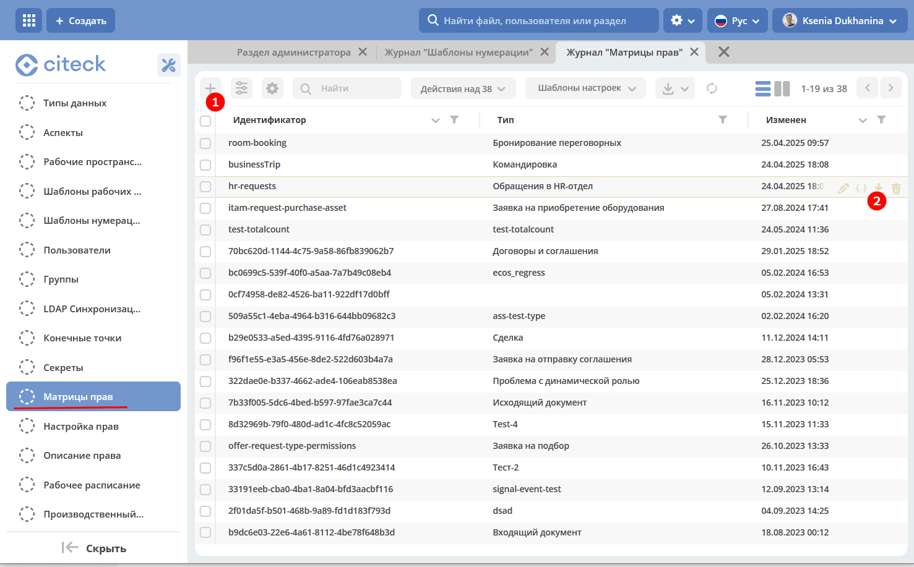

.. _permissions_journal:

Матрицы прав
=============

**Матрица прав** — инструмент управления доступом, позволяющий гибко настраивать права пользователей и ролей на объекты системы: документы и их отдельные атрибуты.

Матрицы привязываются к :ref:`типам данных <data_types>` и определяют, какие действия доступны каждой роли на каждом этапе жизненного цикла документа.

Возможности
-----------

С помощью матрицы прав можно:

- разрешать или запрещать просмотр, создание, редактирование и удаление записей;
- управлять видимостью и доступностью отдельных атрибутов для конкретных ролей;
- задавать разные наборы прав в зависимости от статуса документа.

Работа с матрицей
------------------

Журнал содержит :ref:`матрицы прав <permissions>`, созданные для типов данных.

Матрицу прав можно загрузить, нажав **(1)**:

Для матрицы доступны действия **(2)**:

- редактирование через JSON;
- скачивание;
- удаление.