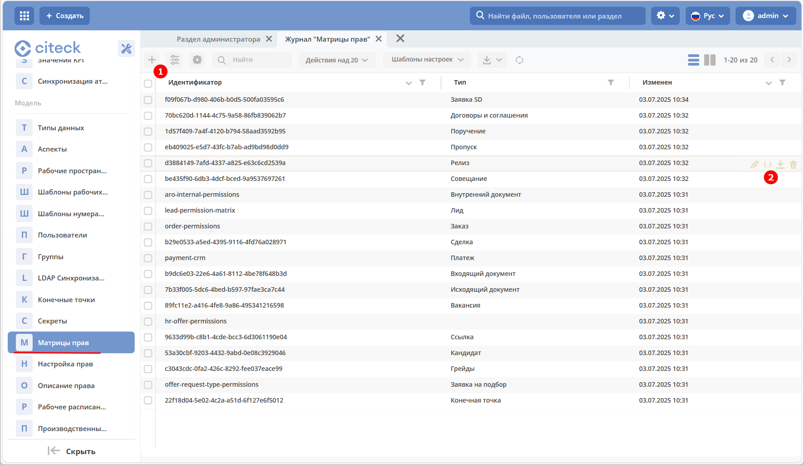

Матрицы прав
============

.. _permissions_journal:

Журнал содержит :ref:`матрицы прав<permissions>`, созданные для типов данных.

**Матрица прав** - таблица, которая показывает, какими правами обладает конкретная роль на отдельные виды данных. Права могут быть настроены отдельно на документ, отдельно на его атрибуты.

Матрицу прав можно загрузить, нажав **(1)**:

.. image:: _static/matrix/matrix_02.png
    :width: 400
    :align: center

Для матрицы доступны действия **(2)**:

- редактирование через json:

- скачивание;
- удаление.