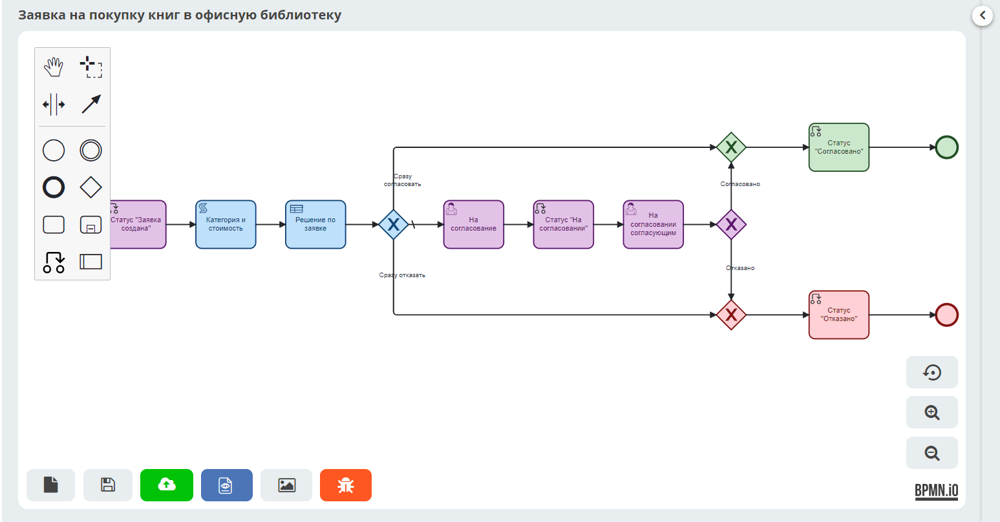

.. _ecos-bpmn_platform:

Платформа бизнес-процессов (Citeck BPMN)
================================================================

В Citeck реализована low-code платформа для автоматизации бизнес-процессов на основе нотации **BPMN 2.0** (Business Process Model and Notation) — международного стандарта визуального моделирования процессов. Платформа построена на движке **Camunda** и библиотеке **bpmn-js**, что обеспечивает полную совместимость со стандартом и широкие возможности кастомизации.

Встроенный визуальный редактор позволяет без программирования создавать схемы процессов любой сложности: от линейных маршрутов согласования до разветвлённых процессов с параллельным выполнением, таймерами, обработкой ошибок и интеграцией с внешними системами. Готовые модели публикуются непосредственно в среду исполнения и сразу доступны для запуска.

Раздел охватывает полный цикл работы с BPMN в Citeck:

.. grid:: 1
   :gutter: 3

   .. grid-item-card:: Общее описание
      :link: ecos_bpmn
      :link-type: ref

      Архитектура платформы и модель прав доступа.

   .. grid-item-card:: Редактор
      :link: modeller_bp
      :link-type: ref

      Элементы нотации, палитра компонентов и настройки задач.

   .. grid-item-card:: Базовые операции
      :link: ecos_bpmn_base_operations
      :link-type: ref

      Создание, редактирование, версионирование и публикация моделей.

   .. grid-item-card:: Права доступа
      :link: bpmn_permissions
      :link-type: ref

      Настройка разрешений на уровне категорий и отдельных процессов.

   .. grid-item-card:: Задачи
      :link: tasks_options
      :link-type: ref

      Управление пользовательскими задачами и их жизненным циклом.

   .. grid-item-card:: Внешние задачи
      :link: ecos_bpmn_external_task
      :link-type: ref

      Интеграция с внешними воркерами через External Task API.

   .. grid-item-card:: Администрирование
      :link: bpmn_admin
      :link-type: ref

      Мониторинг экземпляров, миграция и ручное управление.

   .. grid-item-card:: KPI
      :link: bpmn_kpi
      :link-type: ref

      Метрики производительности процессов.

.. toctree::
    :maxdepth: 3
    :hidden:

    ecos_bpmn/ecos_bpmn_overview
    ecos_bpmn/ecos_bpmn_editor
    ecos_bpmn/ecos_bpmn_base_operations
    ecos_bpmn/ecos_bpmn_permissions
    ecos_bpmn/ecos_bpmn_tasks
    ecos_bpmn/ecos_bpmn_external_task
    ecos_bpmn/ecos_bpmn_administration
    ecos_bpmn/ecos_bpmn_kpi
