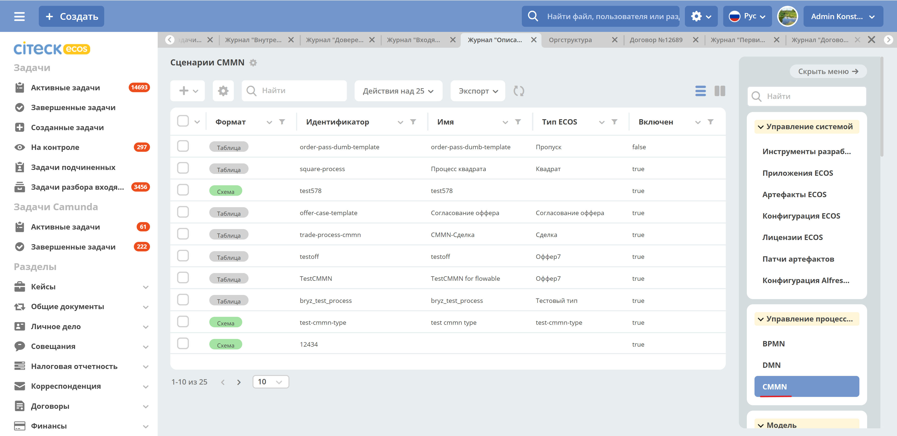
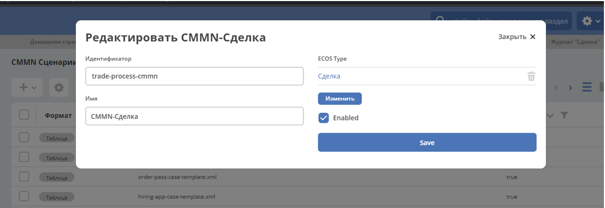
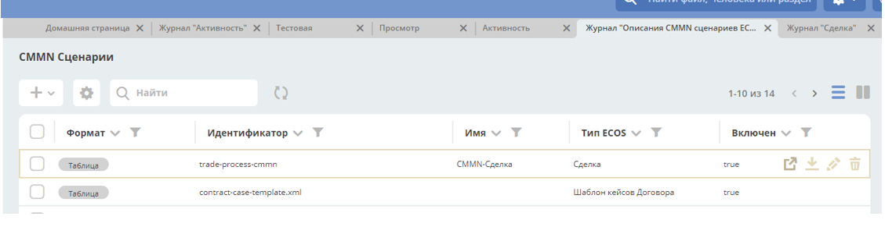
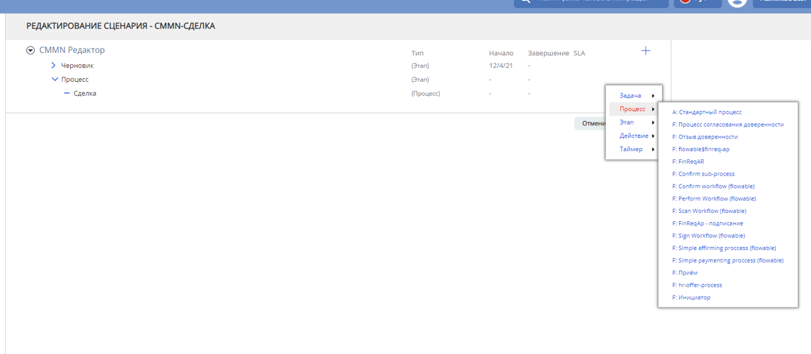
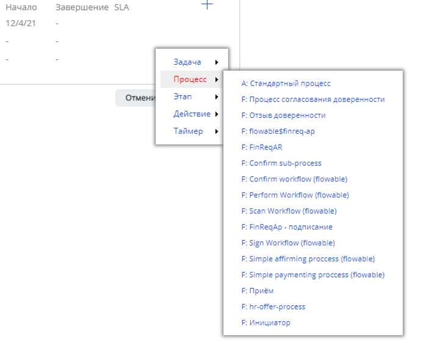

Редактор сценариев (CMMN)
==========================

Для того чтобы все корректно работало, необходимо создать новый **CMMN сценарий**.

При создании нового CMMN сценария необходимо его привязать к нужному **Типу данных**, и проставить галочку в опции :guilabel:`Enabled`.

Чтобы проверить успешное создание Сценария необходимо открыть его в новом окне.

|

.. image:: _static/CMMN/proccess_cmmn_4.png
        :width: 600          
        :align: center

Где необходимо добавить нужный нам процесс.

|

