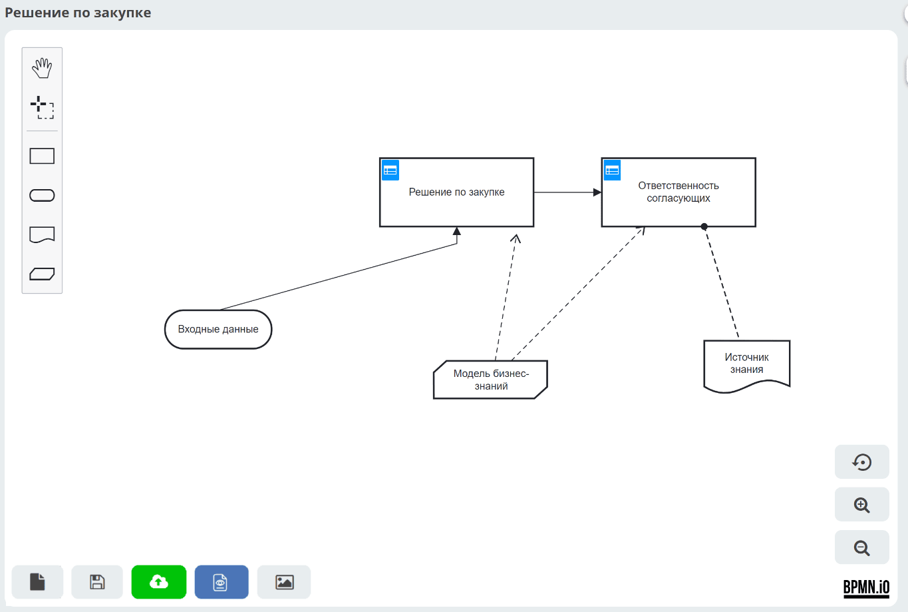

.. _ecos-dmn:

Модели принятия решений (Citeck DMN)
=========================================================

В Citeck реализована поддержка нотации **DMN 1.3** (Decision Model and Notation) — международного стандарта визуального моделирования логики принятия решений. Платформа построена на редакторе `dmn-js <https://bpmn.io/toolkit/dmn-js/>`_ и движке **Camunda**, что обеспечивает совместимость со стандартом и интеграцию с бизнес-процессами BPMN.

Встроенный редактор позволяет без программирования описывать правила принятия решений в виде таблиц: задаются входные условия и соответствующие им выходные значения. Готовые модели публикуются в движок и могут вызываться из BPMN-процессов или напрямую через API — что упрощает изменение бизнес-логики без вмешательства в код процессов.

Раздел охватывает полный цикл работы с DMN в Citeck:

.. grid:: 1
   :gutter: 3

   .. grid-item-card:: Общее описание
      :link: ecos_dmn
      :link-type: ref

      Архитектура платформы и навигация по журналу моделей.

   .. grid-item-card:: Редактор
      :link: modeller_dmn
      :link-type: ref

      Конструктор DMN и компоненты Citeck DMN — типы элементов нотации и правила их соединения.

   .. grid-item-card:: Базовые операции
      :link: new_dmn
      :link-type: ref

      Создание, редактирование, версионирование и публикация решений.

   .. grid-item-card:: Права доступа
      :link: dmn_permissions
      :link-type: ref

      Настройка разрешений на уровне разделов и отдельных моделей.

.. toctree::
    :maxdepth: 3
    :hidden:

    ecos_dmn/ecos_dmn_overview
    ecos_dmn/ecos_dmn_editor
    ecos_dmn/ecos_dmn_base_operations
    ecos_dmn/ecos_dmn_permissions
