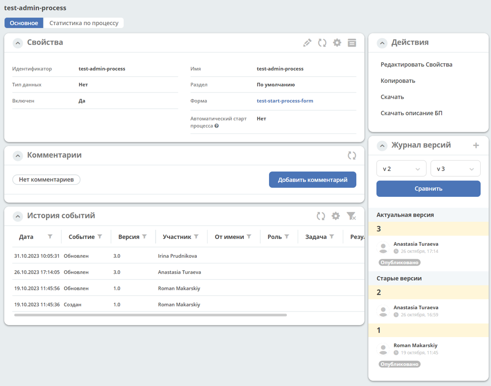
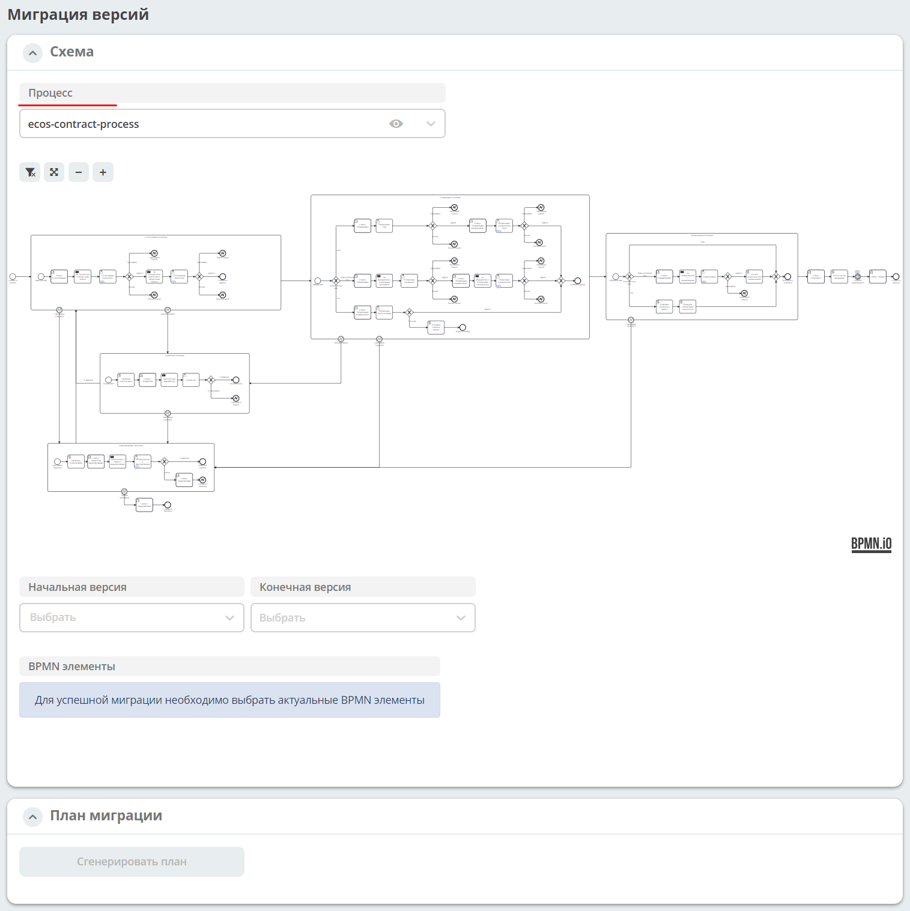

Информация о процессе
=======================

.. _process_information:

.. contents:: 

Представлена обобщенная информация о процессе **(1)**: 

    -	количество запущенных процессов по текущей версии;
    -	количество инцидентов по текущей версии;
    -	общее количество опубликованных версий;
    -	количество запущенных процессов по всем версиям.

Доступен выбор версии процесса **(2)** из опубликованных:

.. image:: _static/adm_8.png
       :width: 300
       :align: center

В скобках указано количество активных экземпляров процессов (инстансов)/количество инцидентов. Для выбранной версии процесса откроется подробная информация.

Действия с процессом **(3)**:

Доступен переход к карточке процесса с подробной информацией **(4)**:

Действия
----------

.. _actions_migration:

Миграция версий
~~~~~~~~~~~~~~~~

Вы можете перенести запущенные экземпляры процесса из текущей версии в другую версию, используя действие **Миграция версий**.

По нажатию на действие открывается отдельный экран миграции процесса. Указан процесс, из которого выбрано действие. 

По нажатию на:

.. list-table::
      :widths: 5 10
      :align: center
      :class: tight-table 
      
      * - 
          .. image:: _static/migration_02_1.png
              :width: 30
              :align: center

        - открывается карточка процесса с подробной информацией

На схеме исходной версии процесса отмечены счетчики запущенных экземпляров процесса (инстансов) и инцидентов:

Выберите **начальную** (исходную) версию процесса из списка и **конечную** (целевую) версию процесса. Выберите **элементы процесса**, кликнув на них на схеме.

Нажмите **«Сгенерировать план»**. План сформируется в json-редакторе, для реадктирования доступна только секция **processInstanceQuery**: 

...

Нажмите **«Запустить миграцию»**. Подтвердите действие:

Миграция будет запущена в фоновом режиме. Если миграция не сможет запуститься -  будет показана ошибка. 

Схема
------

Схема процесса, на которой отмечены:

.. list-table::
      :widths: 5 10
      :align: center
      :class: tight-table 
      
      * - 
          .. image:: _static/adm_11.png
              :width: 30
              :align: center

        - количество запущенных экземпляров процесса (инстансов).
      * - 
          .. image:: _static/adm_12.png
              :width: 30
              :align: center

        - количество инцидентов

Журнал
-------

Экземпляры процесса
~~~~~~~~~~~~~~~~~~~~~

В первой вкладке представлен cписок запущенных экземпляров процесса для выбранной версии процесса:

.. image:: _static/adm_13.png
       :width: 600
       :align: center

По клику на **ID** открывается подробная информация о нем. См. подробно :ref:`Экземпляр процесса<process_instance>`

По клику на **Документ** открывается карточка документа.

Возможные состояния процесса:

.. list-table::
      :widths: 5 10
      :align: center
      :class: tight-table 
      
      * - 
          .. image:: _static/adm_14.png
              :width: 30
              :align: center

        - Экземпляр активен.
      * - 
          .. image:: _static/adm_15.png
              :width: 30
              :align: center

        - Экземпляр приостановлен.
      * - 
            .. image:: _static/adm_16.png
                :width: 30
                :align: center

        - В экземпляре обнаружены инциденты.

Инциденты
~~~~~~~~~~~~~~~~~~~~~

**Список инцидентов** в запущенных экземпляров процесса для выбранной версии процесса:

.. image:: _static/adm_17.png
       :width: 600
       :align: center

Фильтрация инцидентов по сообщению работает только для тех инцидентов, которые произошли в текущей области видимости. То есть, если мы находимся в процессе А, у которого через callActivity вызывается процесс B и инцидент произошел внутри процесса B, то такой процесс будет показан в списке, но фильтрация по его сообщению работать не будет.

По клику на **Экземпляр процесса** открывается подробная информация о нем. См. :ref:`подробно Экземпляр процесса<process_instance>`

По клику на **Элемент**, **Отказавший элемент** элемент будет подсвечен на схеме:

.. image:: _static/adm_18.png
       :width: 600
       :align: center

.. list-table::
      :widths: 5 10
      :class: tight-table 
      
      * - 
          .. image:: _static/adm_37_1.png
              :width: 30
              :align: center

        - Ввести комментарий к инциденту:

          .. image:: _static/adm_39.png
              :width: 500
              :align: center

      * - 
          .. image:: _static/adm_37_2.png
              :width: 30
              :align: center

        - | Изменить количество попыток выполнения неуспешной задачи:

          .. image:: _static/adm_40.png
              :width: 500
              :align: center

          | Введите значение и нажмите **«Сохранить»**.
          | После нажатия кнопки **«Повторить»** механизм повторно запустит задания и увеличит их значения повторных попыток в базе данных, чтобы исполнитель заданий мог снова получить и выполнить задания.

Фоновые задачи
~~~~~~~~~~~~~~~~~~~~~

Список фоновых задач в запущенных экземплярах процесса для выбранной версии процесса:

По клику на **Элемент** элемент будет подсвечен на схеме:

.. image:: _static/adm_21.png
       :width: 600
       :align: center
