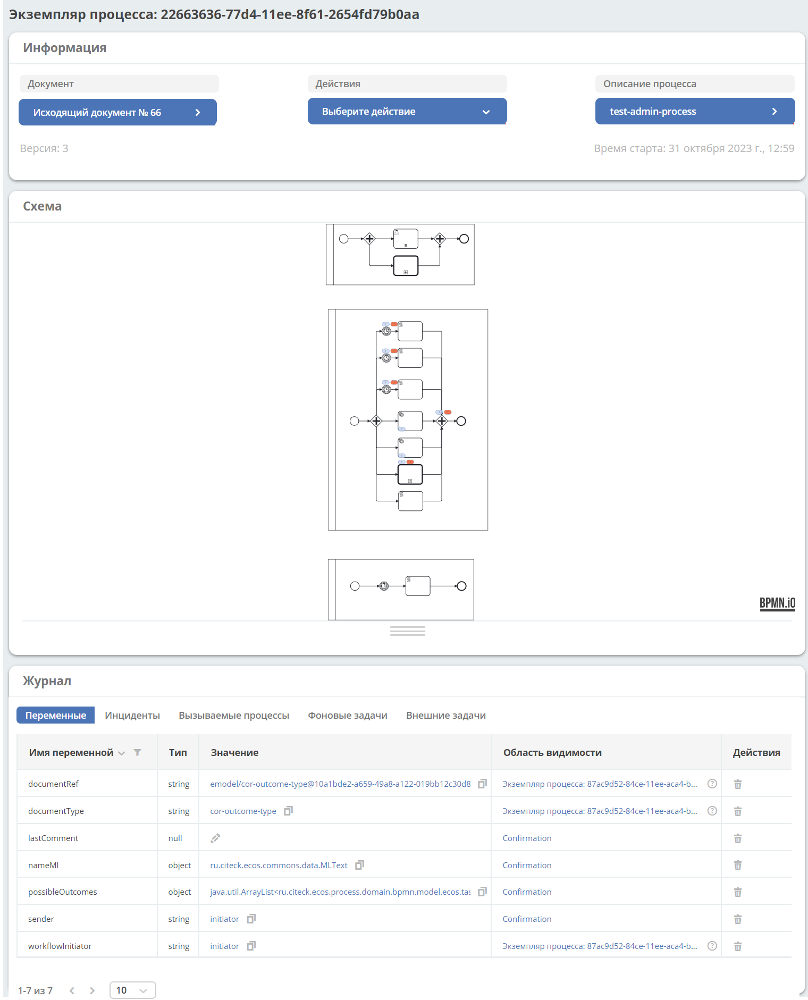
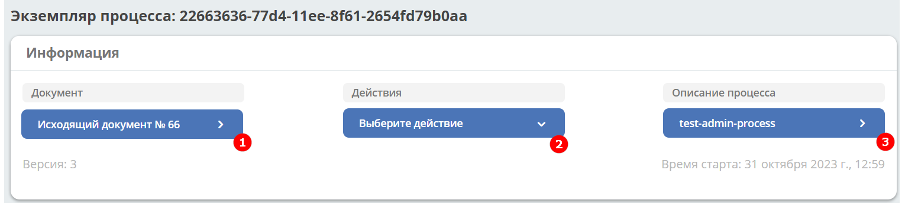

Экземпляр процесса
===================

.. _process_instance:

.. contents:: 

Карточка выбранного экземпляра процесса - дашборд со следующими виджетами.

Рассмотрим каждый виджет отдельно.

Информация 
-----------

**1** – Переход в карточку документа.

**2** – Действия с экземпляром процесса:

    .. image:: _static/adm_23_1.png
        :width: 300

**3** - Переход в карточку процесса.

.. _process_instance_actions:

Описание действий
~~~~~~~~~~~~~~~~~~~

    -	**Приостановить экземпляр процесса** - приостанавливает экземпляр процесса. Прочтите внимательно описание и подтвердите: 

        .. image:: _static/adm_24.png
            :width: 600
            :align: center

    -	**Возобновить экземпляр процесса** - возобновляет приостановленный экземпляр процесса. Прочтите внимательно описание и подтвердите: 

        .. image:: _static/adm_25.png
            :width: 600
            :align: center

    -	**Удалить экземпляр процесс** - удаляет экземпляр процесса. После успешного удаления пользователь информируется об этом, и  перенаправляется на страницу **Информация о процессе**.

        .. image:: _static/adm_26.png
            :width: 600
            :align: center

    -	**Добавить переменную в экземпляр процесса** - в форме введите название переменной и выберите тип из представленных.

        .. image:: _static/adm_27.png
            :width: 600
            :align: center

    -	**Миграция токенов**. По нажатию на действие открывается схема текущего экземпляра процесса, на которой подсвечены активные элементы - счетчики экземпляров, инциденты:

        .. image:: _static/adm_28.png
            :width: 600
            :align: center
        
        Для увеличения схемы используйте сочетания **ctrl+ скролл мыши**.
        
        Кликом на элемент из схемы процесса выберите начальный и целевой токен:

        .. image:: _static/adm_29.png
            :width: 600
            :align: center        

       На схеме начальный токен будет отмечен зеленой рамкой, целевой – красной. Также  выбранные токены отражены в нижней части: 

        .. image:: _static/adm_30.png
            :width: 600
            :align: center   

       Для подтверждения действия нажмите **«Мигрировать»**.

Схема
-----

        .. image:: _static/adm_31.png
            :width: 600
            :align: center 

Схема процесса, на которой отмечены:

.. list-table::
      :widths: 5 10
      :align: center
      :class: tight-table 
      
      * - 
          .. image:: _static/adm_11.png
              :width: 30
              :align: center

        - Количество запущенных экземпляров процесса (инстансов).
      * - 
          .. image:: _static/adm_12.png
              :width: 30
              :align: center

        - Количество инцидентов

Журнал
-----------

Переменные
~~~~~~~~~~~~~~~~~~

На вкладке представлен cписок переменных данного экземпляра процесса:

        .. image:: _static/adm_32.png
            :width: 600
            :align: center 

По клику на **Область видимости** включается фильтр сортировки всех переменных, которые есть в рамках этой области видимости. 

        .. image:: _static/adm_33.png
            :width: 600
            :align: center 

Элемент выделяется на схеме бизнес-процесса:

        .. image:: _static/adm_34.png
            :width: 600
            :align: center 

Для отключения фильтра:

        .. image:: _static/adm_35.png
            :width: 300
            :align: center 

.. list-table::
      :widths: 5 10
      :class: tight-table 
      
      * - 
          .. image:: _static/adm_33_1.png
              :width: 30
              :align: center

        - Редактировать переменную экземпляра процесса:

          .. image:: _static/adm_33_4.png
              :width: 500
              :align: center

          | Если переменная заполнена, кликните **Значение** для изменения.
          | Внесите изменения и сохраните.

      * - 
          .. image:: _static/adm_33_2.png
              :width: 30
              :align: center

        - | Копировать значение переменной экземпляра процесса

      * - 
          .. image:: _static/adm_33_3.png
              :width: 30
              :align: center

        - | Удалить переменную.

Инциденты
~~~~~~~~~~~~~~~~~~

На вкладке представлен cписок неразрешенных инцидентов (возникших ошибок) данного экземпляра процесса:

        .. image:: _static/adm_37.png
            :width: 600
            :align: center 

По клику на **Экземпляр процесса** открывается подробная информация о нем. См. :ref:`Экземпляр процесса<process_instance>`

По клику на **Элемент**, **Отказавший элемент** элемент будет подсвечен на схеме:

        .. image:: _static/adm_38.png
            :width: 600
            :align: center 

.. list-table::
      :widths: 5 10
      :class: tight-table 
      
      * - 
          .. image:: _static/adm_37_1.png
              :width: 30
              :align: center

        - Ввести комментарий к инциденту:

          .. image:: _static/adm_39.png
              :width: 500
              :align: center

      * - 
          .. image:: _static/adm_37_2.png
              :width: 30
              :align: center

        - | Изменить количество попыток выполнения неуспешной задачи:

          .. image:: _static/adm_40.png
              :width: 500
              :align: center

          | Введите значение и нажмите **«Сохранить»**.
          | После нажатия кнопки **«Повторить»** механизм повторно запустит задания и увеличит их значения повторных попыток в базе данных, чтобы исполнитель заданий мог снова получить и выполнить задания.

Вызываемые процессы
~~~~~~~~~~~~~~~~~~~~

На вкладке представлен cписок вызываемых :ref:`call activity<call_activity>` данного экземпляра процесса и их состояний:

        .. image:: _static/adm_41.png
            :width: 600
            :align: center 

По клику на **Вызываемый экземпляр** открывается подробная информация о нем. См. :ref:`Экземпляр процесса<process_instance>`

По клику на **Описание процесса** открывается информация об основном бизнес-процессе.

По клику на **Элемент** элемент будет подсвечен на схеме.

Фоновые задачи
~~~~~~~~~~~~~~~~~~

На вкладке представлен cписок :ref:`событий<bpmn_events>` данного экземпляра процесса

        .. image:: _static/adm_42.png
            :width: 600
            :align: center 

По клику на **Элемент**, **Отказавший элемент** элемент будет подсвечен на схеме.

Фоновую задачу можно приостановить или запустить, нажимая соответствующие кнопки в колонке **Действия**.

Внешние задачи
~~~~~~~~~~~~~~~~~~

На вкладке представлен cписок :ref:`External tasks<ecos_bpmn_external_task>` данного экземпляра процесса:

        .. image:: _static/adm_43.png
            :width: 600
            :align: center 
 
По клику на **Элемент** элемент будет подсвечен на схеме.
