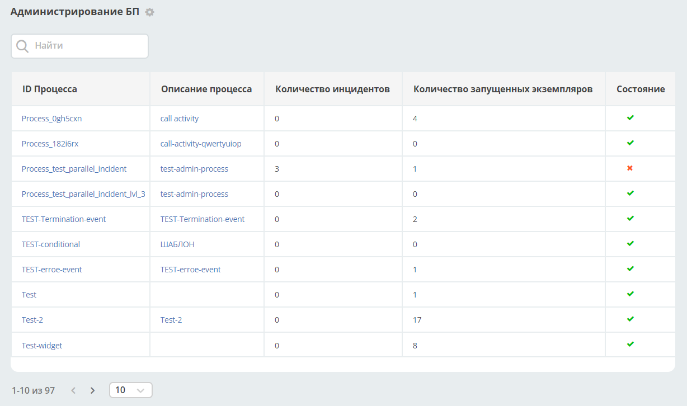

Администрирование бизнес-процессов
===================================

.. _bpmn_admin:

.. contents:: 

Раздел **«Администрирование БП»** позволяет наблюдать за состоянием опубликованных процессов (process definition). 

Перейти в раздел можно из меню **(1)** и через раздел администратора **(2)**:

.. image:: _static/admin/adm_1.png
       :width: 600
       :align: center

В таблице представлены все опубликованные бизнес-процессы:

|

.. list-table::
      :widths: 5 10
      :align: center
      :class: tight-table 
      
      * - 
           .. image:: _static/admin/adm_3.png
               :width: 20
               :align: center

        - Успешно выполняемые процессы.
      * - 
            .. image:: _static/admin/adm_4.png
                :width: 20
                :align: center

        - Существует по крайней мере один экземпляр процесса или экземпляр подпроцесса, в котором произошел неразрешенный инцидент.

Для перехода к карточке процесса с подробной информацией кликните на **Описание процесса**:

.. image:: _static/admin/adm_5.png
       :width: 600
       :align: center

Для перехода к информации о конкретном процессе и инцидентах кликните на **ID процесса** – откроется дашборд со следующими виджетами:

Рассмотрим каждый виджет отдельно.

Информация о процессе
----------------------

.. image:: _static/admin/adm_7.png
       :width: 600
       :align: center

Представлена обобщенная информация о процессе **(4)**: 

    -	количество запущенных процессов по текущей версии
    -	количество инцидентов по текущей версии
    -	общее количество опубликованных версий;
    -	количество запущенных процессов по всем версиям.

Доступен выбор версии процесса **(1)** из опубликованных:

.. image:: _static/admin/adm_8.png
       :width: 300
       :align: center

В скобках указано количество активных экземпляров процессов (инстансов)/количество инцидентов. Для выбранной версии процесса откроется подробная информация.

Действия с процессом **(2)**:

.. image:: _static/admin/adm_7_1.png
       :width: 300
       :align: center

Доступен переход к карточке процесса с подробной информацией **(3)**:

.. image:: _static/admin/adm_9.png
       :width: 600
       :align: center

Схема
~~~~~~

.. image:: _static/admin/adm_10.png
       :width: 600
       :align: center

Схема процесса, на которой отмечены:

.. list-table::
      :widths: 5 10
      :align: center
      :class: tight-table 
      
      * - 
          .. image:: _static/admin/adm_11.png
              :width: 30
              :align: center

        - количество запущенных экземпляров процесса (инстансов).
      * - 
          .. image:: _static/admin/adm_12.png
              :width: 30
              :align: center

        - количество инцидентов

Журнал
~~~~~~~

Экземпляры процесса
""""""""""""""""""""""""

В первой вкладке представлен cписок запущенных экземпляров процесса для выбранной версии процесса:

По клику на **ID** открывается подробная информация о нем. См. подробно :ref:`Экземпляр процесса<process_instance>`

По клику на **Документ** открывается карточка документа.

Возможные состояния процесса:

.. list-table::
      :widths: 5 10
      :align: center
      :class: tight-table 
      
      * - 
          .. image:: _static/admin/adm_14.png
              :width: 30
              :align: center

        - Экземпляр активен.
      * - 
          .. image:: _static/admin/adm_15.png
              :width: 30
              :align: center

        - Экземпляр приостановлен.
      * - 
            .. image:: _static/admin/adm_16.png
                :width: 30
                :align: center

        - В экземпляре обнаружены инциденты.

Инциденты
"""""""""""

**Список инцидентов** в запущенных экземпляров процесса для выбранной версии процесса:

.. image:: _static/admin/adm_17.png
       :width: 600
       :align: center

Фильтрация инцидентов по сообщению работает только для тех инцидентов, которые произошли в текущей области видимости. То есть, если мы находимся в процессе А, у которого через callActivity вызывается процесс B и инцидент произошел внутри процесса B, то такой процесс будет показан в списке, но фильтрация по его сообщению работать не будет.

По клику на **Экземпляр процесса** открывается подробная информация о нем. См. :ref:`подробно Экземпляр процесса<process_instance>`

По клику на **Элемент**, **Отказавший элемент** элемент будет подсвечен на схеме:

.. list-table::
      :widths: 5 10
      :class: tight-table 
      
      * - 
          .. image:: _static/admin/adm_37_1.png
              :width: 30
              :align: center

        - Ввести комментарий к инциденту:

          .. image:: _static/admin/adm_39.png
              :width: 500
              :align: center

      * - 
          .. image:: _static/admin/adm_37_2.png
              :width: 30
              :align: center

        - | Изменить количество попыток выполнения неуспешной задачи:

          .. image:: _static/admin/adm_40.png
              :width: 500
              :align: center

          | Введите значение и нажмите **«Сохранить»**.
          | После нажатия кнопки **«Повторить»** механизм повторно запустит задания и увеличит их значения повторных попыток в базе данных, чтобы исполнитель заданий мог снова получить и выполнить задания.

Фоновые задачи
""""""""""""""""

Список фоновых задач в запущенных экземплярах процесса для выбранной версии процесса:

.. image:: _static/admin/adm_20.png
       :width: 600
       :align: center

По клику на **Элемент** элемент будет подсвечен на схеме:

.. _process_instance:

Экземпляр процесса
-------------------

Карточка выбранного экземпляра процесса - дашборд со следующими виджетами.

Рассмотрим каждый виджет отдельно.

Информация 
~~~~~~~~~~~~

.. image:: _static/admin/adm_23.png
       :width: 600
       :align: center

**1** – Переход в карточку документа.

**2** – Действия с экземпляром процесса:

    .. image:: _static/admin/adm_23_1.png
        :width: 300

**3** - Переход в карточку процесса.

Описание действий
""""""""""""""""""

    -	**Приостановить экземпляр процесса** - приостанавливает экземпляр процесса. Прочтите внимательно описание и подтвердите: 

        .. image:: _static/admin/adm_24.png
            :width: 600
            :align: center

    -	**Возобновить экземпляр процесса** - возобновляет приостановленный экземпляр процесса. Прочтите внимательно описание и подтвердите: 

        .. image:: _static/admin/adm_25.png
            :width: 600
            :align: center

    -	**Удалить экземпляр процесс** - удаляет экземпляр процесса. После успешного удаления пользователь информируется об этом, и  перенаправляется на страницу **Информация о процессе**.

        .. image:: _static/admin/adm_26.png
            :width: 600
            :align: center

    -	**Добавить переменную в экземпляр  процесса** - в форме введите название переменной и выберите тип из представленных.

        .. image:: _static/admin/adm_27.png
            :width: 600
            :align: center

    -	**Миграция токенов**. По нажатию на действие открывается схема текущего экземпляра процесса, на которой подсвечены активные элементы - счетчики экземпляров, инциденты:

        .. image:: _static/admin/adm_28.png
            :width: 600
            :align: center
        
        Для увеличения схемы используйте сочетания **ctrl+ скролл мыши**.
        
        Кликом на элемент из схемы процесса выберите начальный и целевой токен:

        .. image:: _static/admin/adm_29.png
            :width: 600
            :align: center        

       На схеме начальный токен будет отмечен зеленой рамкой, целевой – красной. Также  выбранные токены отражены в нижней части: 

        .. image:: _static/admin/adm_30.png
            :width: 600
            :align: center   

       Для подтверждения действия нажмите **«Мигрировать»**.

Схема
~~~~~

        .. image:: _static/admin/adm_31.png
            :width: 600
            :align: center 

Схема процесса, на которой отмечены:

.. list-table::
      :widths: 5 10
      :align: center
      :class: tight-table 
      
      * - 
          .. image:: _static/admin/adm_11.png
              :width: 30
              :align: center

        - Количество запущенных экземпляров процесса (инстансов).
      * - 
          .. image:: _static/admin/adm_12.png
              :width: 30
              :align: center

        - Количество инцидентов

Журнал
~~~~~~

Переменные
""""""""""""

На вкладке представлен cписок переменных данного экземпляра процесса:

        .. image:: _static/admin/adm_32.png
            :width: 600
            :align: center 

По клику на **Область видимости** включается фильтр сортировки всех переменных, которые есть в рамках этой области видимости. 

        .. image:: _static/admin/adm_33.png
            :width: 600
            :align: center 

Элемент выделяется на схеме бизнес-процесса:

        .. image:: _static/admin/adm_34.png
            :width: 600
            :align: center 

Для отключения фильтра:

        .. image:: _static/admin/adm_35.png
            :width: 300
            :align: center 

.. list-table::
      :widths: 5 10
      :class: tight-table 
      
      * - 
          .. image:: _static/admin/adm_33_1.png
              :width: 30
              :align: center

        - Редактировать переменную экземпляра процесса:

          .. image:: _static/admin/adm_33_4.png
              :width: 500
              :align: center

          | Если переменная заполнена, кликните **Значение** для изменения.
          | Внесите изменения и сохраните.

      * - 
          .. image:: _static/admin/adm_33_2.png
              :width: 30
              :align: center

        - | Копировать значение переменной экземпляра процесса

      * - 
          .. image:: _static/admin/adm_33_3.png
              :width: 30
              :align: center

        - | Удалить переменную.

Инциденты
""""""""""""

На вкладке представлен cписок неразрешенных инцидентов (возникших ошибок) данного экземпляра процесса:

        .. image:: _static/admin/adm_37.png
            :width: 600
            :align: center 

По клику на **Экземпляр процесса** открывается подробная информация о нем. См. :ref:`Экземпляр процесса<process_instance>`

По клику на **Элемент**, **Отказавший элемент** элемент будет подсвечен на схеме:

        .. image:: _static/admin/adm_38.png
            :width: 600
            :align: center 

.. list-table::
      :widths: 5 10
      :class: tight-table 
      
      * - 
          .. image:: _static/admin/adm_37_1.png
              :width: 30
              :align: center

        - Ввести комментарий к инциденту:

          .. image:: _static/admin/adm_39.png
              :width: 500
              :align: center

      * - 
          .. image:: _static/admin/adm_37_2.png
              :width: 30
              :align: center

        - | Изменить количество попыток выполнения неуспешной задачи:

          .. image:: _static/admin/adm_40.png
              :width: 500
              :align: center

          | Введите значение и нажмите **«Сохранить»**.
          | После нажатия кнопки **«Повторить»** механизм повторно запустит задания и увеличит их значения повторных попыток в базе данных, чтобы исполнитель заданий мог снова получить и выполнить задания.

Вызываемые процессы
"""""""""""""""""""""

На вкладке представлен cписок вызываемых :ref:`call activity<call_activity>` данного экземпляра процесса и их состояний:

        .. image:: _static/admin/adm_41.png
            :width: 600
            :align: center 

По клику на **Вызываемый экземпляр** открывается подробная информация о нем. См. :ref:`Экземпляр процесса<process_instance>`

По клику на **Описание процесса** открывается информация об основном бизнес-процессе.

По клику на **Элемент** элемент будет подсвечен на схеме.

Фоновые задачи
"""""""""""""""

На вкладке представлен cписок :ref:`событий<bpmn_events>` данного экземпляра процесса

        .. image:: _static/admin/adm_42.png
            :width: 600
            :align: center 

По клику на **Элемент**, **Отказавший элемент** элемент будет подсвечен на схеме.

Фоновую задачу можно приостановить или запустить, нажимая соответствующие кнопки в колонке **Действия**.

Внешние задачи
"""""""""""""""

На вкладке представлен cписок :ref:`External tasks<ecos_bpmn_external_task>` данного экземпляра процесса:

        .. image:: _static/admin/adm_43.png
            :width: 600
            :align: center 
 
По клику на **Элемент** элемент будет подсвечен на схеме.
