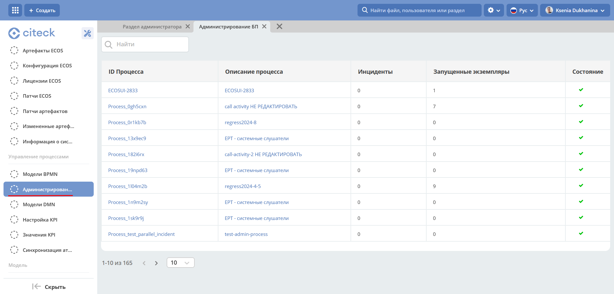

Администрирование бизнес-процессов
===================================

.. contents:: 

.. _bpmn_admin:

Раздел **«Администрирование БП»** позволяет наблюдать за состоянием опубликованных бизнес-процессов (process definition), получать подробную информацию о них и их запущенных экземплярах (process instance).

Вы можете перенести запущенные экземпляры процесса из текущей версии в другую версию, используя действие :ref:`миграция версий<actions_migration>`.

Для выбранного экземпляра процесса доступны следующие :ref:`действия<process_instance_actions>`:

    - Приостановить/ возобновить экземпляр процесса;
    - Удалить экземпляр процесс;
    - Добавить переменную в экземпляр процесса;
    - Миграция токенов.

Перейти в раздел можно из меню **(1)** и через раздел администратора **(2)**:

В таблице представлены все опубликованные бизнес-процессы:

.. image:: _static/admin/adm_2.png
       :width: 600
       :align: center

|

.. list-table::
      :widths: 5 10
      :align: center
      :class: tight-table 
      
      * - 
           .. image:: _static/admin/adm_3.png
               :width: 20
               :align: center

        - Успешно выполняемые процессы.
      * - 
            .. image:: _static/admin/adm_4.png
                :width: 20
                :align: center

        - Существует по крайней мере один экземпляр процесса или экземпляр подпроцесса, в котором произошел неразрешенный инцидент.

Для перехода к карточке процесса с подробной информацией кликните на **Описание процесса**:

.. image:: _static/admin/adm_5.png
       :width: 600
       :align: center

Для перехода к информации о конкретном процессе и инцидентах кликните на **ID процесса** – откроется дашборд со следующими виджетами:

.. image:: _static/admin/adm_6.png
       :width: 600
       :align: center

Рассмотрим каждый виджет :ref:`отдельно<process_information>`

.. toctree::
    :maxdepth: 3

    admin/process_information
    admin/process_instance