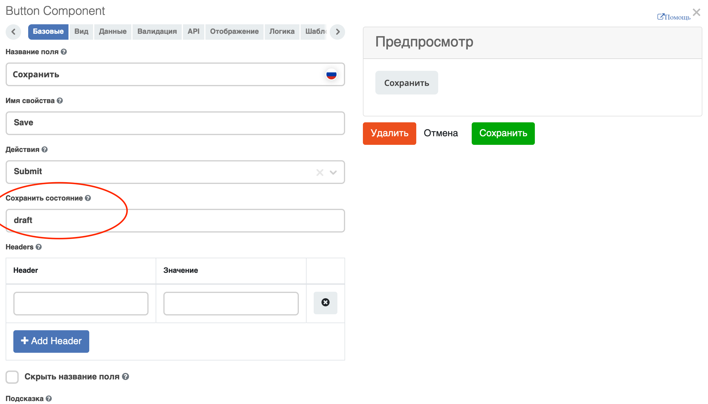

Базовые операции
================

.. contents:: 

Список процессов
----------------

.. list-table::
      :widths: 1 5
      :class: tight-table 

      * - 
               .. image:: _static/02.png
                :width: 50
                :align: center

        - представление в виде плиток|списка

Представление в виде плиток:

 .. image:: _static/03a.png
       :width: 600
       :align: center

Представление в виде списка:

 .. image:: _static/03b.png
       :width: 600
       :align: center

Для просмотра/редактирования процесса наведите курсор мышь на плитку:

 .. image:: _static/10.png
       :width: 600
       :align: center

Карточка бизнес-процесса
------------------------

Для созданного процесса доступны следующие опции:

 .. image:: _static/04.png
       :width: 200
       :align: center

* **Просмотр** - карточка процесса с виджетами:
  
        .. image:: _static/05.png
            :width: 600
            :align: center

      **1.** Виджет :ref:`Статистика процесса<widget_process_statistics>` визуализирует статистику по бизнес-процессу с отображением тепловой карты (heatmap): 

        .. image:: _static/05_1.png
            :width: 600
            :align: center

      **2.** Виджет «Свойства» с информацией о процессе.
      **3.** Виджет :ref:`Комментарии<widget_comments>` 
      **4.** Виджет :ref:`История событий<widget_events-history>` для отображения событий бизнес-процесса.
      **5.** Виджет «Действия», в котором доступны:

           - **Скачать** - скачать процесс в формате xml;
           - **Скачать описание БП** -  осуществляется выгрузка модели бизнес процесса в Excel:

                  .. image:: _static/05_2.png
                        :width: 800
                        :align: center

      **6.** Виджет :ref:`Журнал версий<widget_versions_journal_bpmn>` содержит актуальную и предшествующие версии бизнес-процесса.

*	**Удалить**
*	**Редактировать карточку процесса:** 

        .. image:: _static/06.png
            :width: 600
            :align: center

*	**Редактировать бизнес-процесс:**

        Откроется :ref:`конструктор бизнес-процесса<modeller_bp>`

        .. image:: _static/07.png
            :width: 600
            :align: center

.. _new_bp:

Создание
--------

Для создания нового бизнес-процесса перейдите в левом меню в пункт **«Моделирование – Редактор бизнес-процессов»** или через верхнее меню **«Раздел администратора – Управление процессами – BPMN»** и далее нажмите:

 .. image:: _static/08.png
       :width: 300
       :align: center

Откроется форма создания карточки процесса:

 .. image:: _static/09.png
       :width: 600
       :align: center

.. list-table:: Описание полей формы
      :widths: 10 20 30
      :header-rows: 1
      :align: center
      :class: tight-table 

      * - п/п
        - Наименование
        - Описание
      * - 1
        - **Идентификатор**
        - уникальный идентификатор
      * - 2
        - **Имя**
        - наименование создаваемого бизнес-процесса
      * - 3
        - **Ecos Type**
        - тип данных. При привязке к типу данных можно автоматически начинать процесс, если проставлен  чекбокс **(7)**. На форме редактора на основе типа данных будут подтягиваться роли, статусы и т.д.
      * - 4
        - **Раздел**
        - наименование раздела, в котором будет сохранен процесс. Если не заполнять, то сохранение происходит в раздел "По умолчанию".
      * - 5
        - **Форма**
        - указать для запуска (старта) процесса через форму.
      * - 6
        - **Включен**
        - включение процесса
      * - 7
        - **Автоматический старт процесса**
        - при создании объекта указанного типа процесс будет запущен автоматически.

Сохранение и публикация процесса
---------------------------------

 .. image:: _static/78.png
       :width: 700
       :align: center

Процесс можно:

.. list-table::
      :widths: 1 3 5
      :class: tight-table 

      * - **1** 
        - **Сохранить как черновик** 
        - Без проверки валидности (наличия логических ошибок) и конвертации в ECOS формат.
      * - **2**
        - **Сохранить** 
        - С проверкой валидности (наличия логических ошибок) и конвертацией в ECOS формат.
      * - **3**
        - **Сохранить и опубликовать**
        - С проверкой валидности (наличия логических ошибок), конвертацией в ECOS формат, публикацией, чтобы процесс стал исполняемым.

.. note:: 

      Если вы отредактировали процесс, то его необходмо опубликовать заново, чтобы применить изменения и сделать их доступными для пользователей. Таким образом вы создаете новую версию процесса.

      В виджете :ref:`История событий<widget_versions_journal>` отображается информация о событиях создания, обновления, публикации бизнес-процесса с указанием автора, времени, комментария и т.д. 

      В виджете :ref:`Журнал версий<widget_versions_journal>` для версии процесса, которая была опубликована, будет показываться тег **"Опубликовано"**, для процесса, сохраненного как черновик - **"Черновик"**.

.. _new_bp_start:

Способы запуска бизнес-процесса
---------------------------------

Существует два способа запуска бизнес-процесса:

**1. Автоматический запуск БП при создании документа**

Осуществляется автоматически, если в описании БП указать необходимый **«Ecos Type»** и выставить флаг **«Автоматический старт процесса»** в положение истина.

**2. Ручной запуск БП через форму**

В описании БП в поле **«Форма»** можно указать форму запуска процесса, тогда ручной запуск осуществляется через **«Меню» -> «Создать» (+)**.

Способы автоматического старта и ручного запуска могут использовать как вместе, так и отдельно, в зависимости от бизнес требований.

В независимости от того, каким образом осуществляется старт бизнес-процесса, для возможности запуска, он должен быть **«включен»**. 

Старт процесса при нажатии кнопки «Отправить» (Submit) на форме создания/редактирования документа
~~~~~~~~~~~~~~~~~~~~~~~~~~~~~~~~~~~~~~~~~~~~~~~~~~~~~~~~~~~~~~~~~~~~~~~~~~~~~~~~~~~~~~~~~~~~~~~~~~~~

Если рекорд сохраняется в состоянии **Черновик**, то есть через сабмит кнопку с состоянием **draft**,

то :ref:`автоматический старт процесса<new_bp_start>` не осуществляется. Автоматический старт произойдет при сабмите без состояния черновика.

Настройка меню
---------------

Для добавления процесса в меню **«Создать»**:

1.	Перейти в настройку меню, нажав на шестеренку, потом кнопку **«Настроить меню»** справа сверху.

 .. image:: _static/79.png
       :width: 600
       :align: center

2.	Выбрать элемент меню, в котором будет находиться процесс. Навести на элемент и нажать кнопку **«Добавить»**:

  .. image:: _static/80.png
        :width: 600
        :align: center

  - для описанного выше способа **1** выбрать **«Добавить ссылку на создание кейса»** из списка выбрать необходимый тип данных, нажать **«ОК»**:

  .. image:: _static/81a.png
        :width: 600
        :align: center

  - для описанного выше способа **2** выбрать **«Запустить бизнес-процесс»**, из списка выбрать необходимый процесс, нажать **«ОК»**.

 .. image:: _static/81b.png
       :width: 600
       :align: center

|

 .. image:: _static/82.png
       :width: 600
       :align: center

Добавленный пункт меню:

 .. image:: _static/83.png
       :width: 400
       :align: center

Форма запуска БП:

 .. image:: _static/84.png
       :width: 600
       :align: center

Форма задачи БП:

 .. image:: _static/85.png
       :width: 600
       :align: center