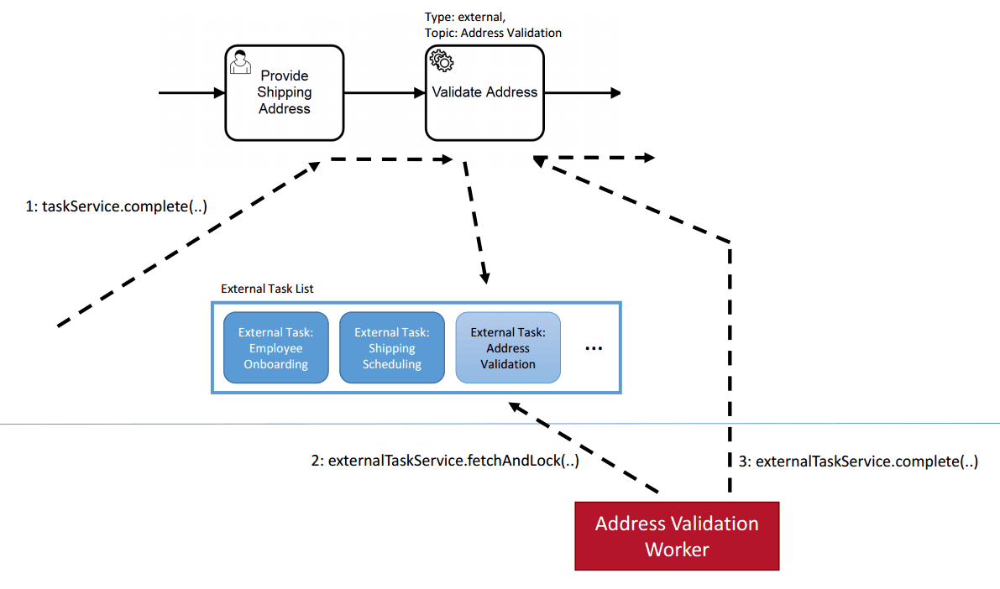

.. _ecos_bpmn_external_task:

Внешние задачи
============================

.. contents::

**Внешние задачи (External Tasks)** — механизм интеграции, позволяющий выполнять сервисные задачи бизнес-процесса во внешних приложениях. Движок процесса создаёт экземпляры задач и публикует их в топики, а внешние обработчики (workers) получают, обрабатывают и завершают задачи через API. Это обеспечивает независимость обработчиков от движка, возможность масштабирования и поддержку разнородных технологических стеков.

В разделе описан паттерн внешней задачи, настройка Spring Boot Starter для клиента внешних задач, подписка на топики, конфигурация обработчиков и обработка ошибок.

Паттерн внешняя задача
----------------------

Поток выполнения внешних задач можно концептуально разделить на три этапа, как показано на следующем рисунке:

1. **Process Engine: создание экземпляра внешнего задания.** Когда движок процесса сталкивается с сервисной задачей, которая настроена на внешнюю обработку, он создает экземпляр внешней задачи и добавляет его в список внешних задач. Экземпляр задачи получает топик, который идентифицирует характер задачи, которую необходимо выполнить.
2. **External Worker: получение и блокировка внешних задач.** В какой-то момент в будущем внешний обработчик может получить и заблокировать задания для определенного набора топиков. Чтобы предотвратить одновременное получение одной задачи несколькими обработчиками, задача имеет timestamp-based блокировку, которая устанавливается при получении задачи. Только когда блокировка истекает, другой обработчик может снова получить задание.
3. **External Worker & Process Engine: завершение экземпляра внешней задачи.** Когда внешний обработчик выполнил требуемую задачу, он может подать сигнал движку процесса продолжить выполнение процесса после выполнения сервисной задачи.

.. note:: 
    **Аналогия с пользовательской задачей**

    Внешние задачи концептуально очень похожи на пользовательские задачи. Когда вы впервые пытаетесь понять шаблон внешней задачи, может быть полезно подумать о нем по аналогии с пользовательской задачей: 
    
    Пользовательские задачи создаются движком процесса и добавляются в список задач. Затем движок процесса ждет, пока пользователь-человек запросит список, возьмет задачу на себя и затем выполнит ее. 
    
    Внешние задачи аналогичны: Внешняя задача создается, а затем добавляется в топик. Затем внешнее приложение запрашивает топик и блокирует задачу. После блокировки задачи приложение может работать над ней и завершить ее.

Суть этого паттерна заключается в том, что объекты, выполняющие фактическую работу, 
не зависят от движка процесса и получают задания для обработки путем запроса API движка процесса. 
Это дает следующие преимущества:

.. list-table::
      :widths: 10 25
      :header-rows: 1
      :class: tight-table
      :align: center

      * - Преимущество
        - Описание
      * - **Crossing System Boundaries**
        - Внешний обработчик не обязательно должен работать в том же Java-процессе, на той же машине, в том же кластере или даже на том же континенте, что и движок процесса. Все, что требуется — доступ к API движка процесса (через REST или Java). Благодаря polling-pattern, обработчику не нужно предоставлять какой-либо интерфейс для доступа к движку процесса.
      * - **Crossing Technology Boundaries**
        - Внешний обработчик не обязательно должен быть реализован на Java. Вместо этого можно использовать любую технологию, которая наиболее подходит для выполнения необходимой задачи и может быть использована для доступа к API движка процесса (через REST или Java).
      * - **Specialized Workers**
        - Внешний обработчик не обязательно должен быть приложением общего назначения. Каждый экземпляр внешнего обработчика получает имя топика, определяющее характер выполняемого задания. Обработчики могут опрашивать задания только для тех топиков, над которыми они могут работать.
      * - **Fine-Grained Scaling**
        - При высокой нагрузке, сосредоточенной на обработке сервисных задач, количество внешних обработчиков для соответствующих топиков может быть масштабировано независимо от движка процесса.
      * - **Independent Maintenance**
        - Обработчики можно разворачивать независимо от движка процесса без нарушения работы. Например, если обработчик для определенного топика имеет простой (например, из-за обновления), это не оказывает немедленного воздействия на движок процесса. Выполнение внешних заданий для таких обработчиков происходит плавно: они сохраняются в списке внешних задач до тех пор, пока внешний обработчик не возобновит работу.

Spring Boot Starter для клиента внешних задач
----------------------------------------------

Ecos Spring Boot Starter External Task Client позволяет легко добавить обработчика для внешних задач
в Spring Boot приложение. Для этого необходимо добавить зависимость:

.. code-block:: xml

    <dependency>
        <groupId>ru.citeck.ecos.bpmn</groupId>
        <artifactId>ecos-bpmn-external-task-client-springboot-starter</artifactId>
        <version>2.1.0</version>
    </dependency>

.. note:: 
    В текущей реализации starter`a, spring boot приложение должно находиться в одном контуре с Citeck.

    Для использования обработчиков из внешних контуров, можно воспользоваться стандартными `клиентами <https://docs.camunda.org/manual/7.19/user-guide/ext-client/>`_. 

Подписка на топики
~~~~~~~~~~~~~~~~~~

Интерфейс, позволяющий реализовать пользовательскую бизнес-логику и взаимодействовать с Engine, называется `ExternalTaskHandler`. 
Подписка идентифицируется именем топика.

Вы можете подписать клиента на имя топика `processPayment`, определив bean с возвращающим типом `ExternalTaskHandler` и добавив аннотацию на этот bean:

.. code-block:: kotlin

    @ExternalTaskSubscription("processPayment")

Для аннотации требуется как минимум имя топика. 

Для более подвинутой конфигурации можно сослаться на имя топика в файле конфигурации spring-boot, например application.yml, либо определить атрибуты конфигурации через аннотацию:

.. tab-set::

      .. tab-item:: Через application.yml

            .. code-block:: yaml

                ecos.bpm.client:
                    subscriptions:
                        processPayment:
                            process-definition-key: payment_process
                            include-extension-properties: true
                            variable-names: defaultFlow

      .. tab-item:: Через атрибуты аннотации

            .. code-block:: kotlin

                @ExternalTaskSubscription(
                    topicName = "processPayment",
                    processDefinitionKey = "payment_process",
                    includeExtensionProperties = true,
                    variableNames = ["defaultFlow"]
                )

Полный список атрибутов можно найти в `Javadocs. <https://docs.camunda.org/javadoc/camunda-bpm-platform/7.19/org/camunda/bpm/client/spring/annotation/ExternalTaskSubscription.html>`_.

.. note:: 
    Свойства, определенные в файле application.yml, всегда переопределяет соответствующий атрибут, определенный программно через аннотацию.

Пример конфигурации обработчика
~~~~~~~~~~~~~~~~~~~~~~~~~~~~~~~

Один обработчик
++++++++++++++++

Вы можете сконфигурировать обработчик следующим образом:

.. code-block:: kotlin

    @Component
    @ExternalTaskSubscription("processPayment")
    class PaymentProcessorWorker : ExternalTaskHandler {

        override fun execute(externalTask: ExternalTask, externalTaskService: ExternalTaskService) {
            // you business logic here
            externalTaskService.complete(externalTask);
        }

    }

Несколько обработчиков в одном классе
+++++++++++++++++++++++++++++++++++++

Если вы хотите определить несколько бинов обработчиков в одном классе конфигурации, вы можете сделать это следующим образом:

.. code-block:: kotlin

    @Configuration
    class PaymentWorker {

        @Bean
        @ExternalTaskSubscription("processPayment")
        fun processPayment(externalTask: ExternalTask, externalTaskService: ExternalTaskService) {
            // you business logic here
            externalTaskService.complete(externalTask);
        }

        @Bean
        @ExternalTaskSubscription("cancelPayment")
        fun processPayment2(externalTask: ExternalTask, externalTaskService: ExternalTaskService) {
            // you business logic here
            externalTaskService.complete(externalTask);
        }

    }

Обработка ошибок и завершение задачи
~~~~~~~~~~~~~~~~~~~~~~~~~~~~~~~~~~~~

Для манипуляции с задачей используется интерфейс `ExternalTaskService <https://docs.camunda.org/javadoc/camunda-bpm-platform/7.19/org/camunda/bpm/client/task/ExternalTaskService.html>`_.

Для успешного выполнения задачи необходимо вызвать метод `complete` (как в примере выше):

.. code-block:: kotlin

    externalTaskService.complete(externalTask)

Но `happy path` не всегда возможен, правильная обработка ошибок внешних задач очень важна для обеспечения надежности и стабильности выполнения процессов.

Обработка бизнес-ошибок
++++++++++++++++++++++++

В процессе выполнения внешний задачи может возникнуть бизнес-ошибка, которая должна быть обработана в процессе посредством `error event`.

Для выбрасывания бизнес-ошибки необходимо использовать метод `handleBpmnError`:

.. code-block:: kotlin

    @Component
    @ExternalTaskSubscription("processPayment")
    class PaymentProcessorWorker : ExternalTaskHandler {

        override fun execute(externalTask: ExternalTask, externalTaskService: ExternalTaskService) {
            // you business logic here
            externalTaskService.handleBpmnError(externalTask, "error-code", "error-message");
        }

    }

Обработка технических ошибок
++++++++++++++++++++++++++++

Если в процессе обработки возникла техническая ошибка, то посредством метода `handleFailure` можно реализовать механизм повторной обработки задачи.

.. tab-set::

      .. tab-item:: С аннотацией @ExternalTaskRetry

            Для удобства можно воспользоваться аннотацией `ru.citeck.ecos.bpmn.externaltask.impl.retry.ExternalTaskRetry`:

            .. code-block:: kotlin

                @Component
                @ExternalTaskSubscription("processPayment")
                class PaymentProcessorWorker(
                    private val paymentService: PaymentService
                ) : ExternalTaskHandler {

                    @ExternalTaskRetry(
                        retries = 3,
                        retryTimeout = 10_000,
                        incrementRetryTimeout = true
                    )
                    override fun execute(task: ExternalTask, taskService: ExternalTaskService) {
                        // you business logic here
                        paymentService.processPayment(task)

                        // complete, if successful
                        taskService.complete(task)
                    }
                }

      .. tab-item:: Вручную

            Механизм повторной обработки задачи можно реализовать вручную, со своей логикой повторной обработки:

            .. code-block::

                @Component
                @ExternalTaskSubscription("processPayment")
                class PaymentProcessorWorker(
                    private val paymentService: PaymentService
                ) : ExternalTaskHandler {

                    companion object {
                        private val log = KotlinLogging.logger {}

                        private const val ONE_MINUTE = 1000L * 60
                        private const val MAX_RETRIES = 5
                    }

                    override fun execute(task: ExternalTask, taskService: ExternalTaskService) {
                        try {
                            // you business logic here
                            paymentService.processPayment(task)

                            // complete, if successful
                            taskService.complete(task)
                        } catch (e: Exception) {
                            log.error("Error processing external task: ${task.id}", e)

                            val retries = getRetries(task)
                            val timeout = getNextTimeout(retries)
                            taskService.handleFailure(
                                task, e.message,
                                ExceptionUtils.getStackTrace(e),
                                retries, timeout
                            )
                        }
                    }

                    private fun getRetries(task: ExternalTask): Int {
                        var retries = task.retries
                        retries = if (retries == null) {
                            MAX_RETRIES
                        } else {
                            retries - 1
                        }
                        return retries
                    }

                    private fun getNextTimeout(retries: Int): Long {
                        // increasing interval: 1 additional minute delay after each retry
                        return ONE_MINUTE * (MAX_RETRIES - retries)
                    }

                }

Если количество попыток обработки задачи исчерпано, то будет создан инцидент и задача помечена как `failed`, в дальнейшем требуется ручной разбор инцидента в административном интерфейсе.

Комбинированная обработка ошибок
++++++++++++++++++++++++++++++++

В некоторых случаях возможна ситуация, когда в процессе обработки внешней задачи может возникнуть как бизнес-ошибка, так и техническая ошибка.
В таком случае возможно использовать `@ExternalTaskRetry` и `handleBpmnError` вместе.

Автоматический retry с проверкой результата
^^^^^^^^^^^^^^^^^^^^^^^^^^^^^^^^^^^^^^^^^^^

.. code-block::

    @Component
    @ExternalTaskSubscription("processPayment")
    class PaymentProcessorWorker(
        private val paymentService: PaymentService
    ) : ExternalTaskHandler {

        @ExternalTaskRetry
        override fun execute(task: ExternalTask, taskService: ExternalTaskService) {
            // you business logic here
            val processResult = paymentService.processPayment(task)
            if (processResult == "DENIED") {
                taskService.handleBpmnError(task, "paymentDenied", "Payment was denied")
                return
            }

            // complete, if successful
            taskService.complete(task)
        }
    }

В данном случае, если в процессе обработки задачи возникнет техническая ошибка, например, случился `Exception` при выполнении метода `paymentService.processPayment` из-за проблем с сетью, 
то задача будет повторно обработана согласно настройкам `@ExternalTaskRetry`. После успешного выполнения обратки платежа, если платеж был отклонен, то будет выброшена бизнес-ошибка, иначе - задача будет завершена успешно.

Также можно реализовать кейс, когда после нескольких неудачных попыток обработки задачи из-за технической ошибки, необходимо выбросить бизнес-ошибку.

Ручной контроль порога попыток
^^^^^^^^^^^^^^^^^^^^^^^^^^^^^^

.. code-block::

    @Component
    @ExternalTaskSubscription("processPayment")
    class PaymentProcessorWorker(
        private val paymentService: PaymentService
    ) : ExternalTaskHandler {
    
        companion object {
            private const val ATTEMPT_THRESHOLD = 1
        }

        @ExternalTaskRetry
        override fun execute(task: ExternalTask, taskService: ExternalTaskService) {
            try {
                // you business logic here
                val processResult = paymentService.processPayment(task)

                // complete, if successful
                taskService.complete(task)
            } catch (e: Exception) {
                val retries = task.retries
                if (retries >= ATTEMPT_THRESHOLD) {
                    // If the number of retries is greater than the threshold, then throw an BPMN error
                    taskService.handleBpmnError(task, "paymentDenied", ExceptionUtils.getStackTrace(e))
                } else {
                    // Otherwise throw root exception. Its will be handled by @ExternalTaskRetry
                    throw e
                }
            }
        }
    }

.. note::
    При работе с внешними задачами и моделировании процесса необходимо учитывать, что внешние задачи
    выполняются асинхронно, а обработка ошибок является зоной ответственности внешнего обработчика.

    Обработчик выполняется без транзакции, и одна и та же задача может прийти в него повторно.
    Как это учитывать в коде — в разделе `Рекомендации по реализации обработчиков`_.

Рекомендации по реализации обработчиков
----------------------------------------------

Раздел описывает свойства паттерна, которые проявляются не на happy path, а при повторе, сбое или
рестарте: как их учитывать в коде обработчика и почему транзакция вокруг обработчика внешнюю
систему не защищает.

Внешние задачи выполняются at-least-once
~~~~~~~~~~~~~~~~~~~~~~~~~~~~~~~~~~~~~~~~~

Движок не гарантирует, что задача будет обработана ровно один раз. Он гарантирует, что она будет
обработана **хотя бы один раз**. Один и тот же экземпляр задачи попадает к обработчику повторно как
минимум в четырёх случаях:

.. list-table::
      :widths: 10 25
      :header-rows: 1
      :class: tight-table

      * - Случай
        - Что происходит
      * - **Истёк lock**
        - Блокировка задачи временная (``lockDuration``). Если обработка не уложилась в неё, задачу
          получит другой обработчик — при том, что первый ещё работает.
      * - **Сбой между эффектом и complete**
        - Обработчик вызвал внешнюю систему, но упал, был перезапущен или потерял сеть до
          ``complete``. Для движка задача не выполнена, и он выдаст её снова.
      * - **Повтор после технической ошибки**
        - ``handleFailure`` (в том числе через ``@ExternalTaskRetry``) возвращает задачу в топик:
          обработка начинается заново с первой строки ``execute``.
      * - **Ручное вмешательство**
        - Повторный запуск задачи администратором или откат процесса на предыдущий шаг.

Отсюда главное требование к обработчику: **он обязан быть идемпотентным**. Это не свойство
конкретной интеграции и не следствие настроек транзакций — это следствие самого паттерна.

Идемпотентность строится по одной схеме:

1. **Вход по состоянию, а не по факту получения задачи.** Обработчик сам решает, нужно ли выполнять
   работу, глядя на состояние данных, а не полагаясь на то, что раз задача пришла — эффект ещё
   не произведён.
2. **Признак «сделано» фиксируется до внешнего эффекта** — либо это собственная отметка, записанная
   и закоммиченная перед вызовом, либо состояние, которое проставляет сама внешняя система или
   вызываемый сервис сразу после эффекта.
3. **У повтора есть явная ветка «уже сделано»**, и она завершает задачу штатно (``complete``), а не
   выбрасывает бизнес-ошибку: работа выполнена, процесс должен идти дальше.

.. code-block::

    @Component
    @ExternalTaskSubscription("processPayment")
    class PaymentProcessorWorker(
        private val paymentService: PaymentService,
        private val recordsService: RecordsService
    ) : ExternalTaskHandler {

        companion object {
            private val PAID_STATUSES = setOf("PAID", "PAYMENT_SENT")
        }

        @ExternalTaskRetry
        override fun execute(task: ExternalTask, taskService: ExternalTaskService) {
            val orderRef = EntityRef.valueOf(task.getVariable<Any>("orderRef").toString())

            // 1-2. Вход по состоянию: признак ставит платёжный сервис сразу после списания,
            // поэтому отдельная своя отметка не нужна
            val status = recordsService.getAtt(orderRef, "paymentStatus?str").asText()
            if (status in PAID_STATUSES) {
                // 3. Повтор после успешной оплаты: работа уже сделана, ведём процесс дальше
                log.info { "Payment for $orderRef is already done (status $status), nothing to do" }
                taskService.complete(task)
                return
            }

            val processResult = paymentService.processPayment(task)
            if (processResult == "DENIED") {
                taskService.handleBpmnError(task, "paymentDenied", "Payment was denied")
                return
            }

            taskService.complete(task)
        }
    }

Если у операции нет наблюдаемого признака выполнения, его нужно завести самому: записать отметку
(идентификатор запроса, отметку времени отправки, флаг) **до** обращения к внешней системе — тогда
повтор увидит её и не выполнит эффект второй раз. Отметка, записанная после эффекта, от повтора не
спасает: между эффектом и записью и происходит сбой.

.. note::
    ``lockDuration`` следует выбирать по худшему времени обработки, а не по среднему. Заниженное
    значение — самый частый способ получить двойной внешний эффект: задачу подхватит второй
    обработчик, пока первый ещё ждёт ответа внешней системы.

Транзакции и внешние эффекты
~~~~~~~~~~~~~~~~~~~~~~~~~~~~~

Код обработчика выполняется **без транзакции**: каждая мутация ``recordsService`` — отдельная
единица работы. Пометив метод аннотацией
``ru.citeck.ecos.webapp.lib.spring.context.txn.RunInTransaction``, можно выполнить его внутри
транзакции (см. :ref:`Транзакции <ecos-transactions>`).

**Это допустимо только для обработчиков без внешнего эффекта** — тех, что меняют несколько записей и
должны сделать это одной единицей работы. Если обработчик обращается во внешнюю систему (отправка
документа, платёж, вызов стороннего API), оборачивать ``execute`` транзакцией нельзя, и вот почему.

.. list-table::
      :widths: 10 25
      :header-rows: 1
      :class: tight-table

      * - Причина
        - Механика
      * - **Продолжение процесса идёт внутри транзакции обработчика**
        - ``complete`` завершается сигналом исполнению (``signal``), то есть движок продолжает процесс
          **синхронно, внутри** вызова обработчика. Если ``complete`` попал в транзакцию, то узлы
          после сервисной задачи выполняются, пока она открыта. Типовой случай — сразу за узлом
          стоит смена статуса той же записи: продолжение процесса ждёт строки, заблокированные
          самим обработчиком, а обработчик ждёт ответа ``complete``. Результат — самоблокировка,
          таймаут, откат и повтор задачи.
      * - **Внешний вызов не откатывается**
        - Транзакция откатывает записи, а отправленный документ или проведённый платёж — нет. При
          откате внешняя система остаётся с эффектом, а Citeck — без отметки о нём: следующая
          попытка выполнит эффект второй раз. Если отметку писал сам обработчик в той же
          транзакции, она исчезает вместе с откатом.
      * - **Транзакция распространяется на другие приложения**
        - Транзакции построены на двухфазном коммите и продолжаются через records-вызовы в соседние
          приложения. Откат вернёт и то, что успели записать они — включая служебные записи,
          созданные интеграцией для внешнего вызова.
      * - **Блокировки живут столько же, сколько чужой сервис отвечает**
        - Транзакция, растянутая на HTTP-вызов третьей стороны, держит строки всё время ожидания.

.. warning::
    ``asyncAfter`` на сервисной задаче убирает только первую причину: продолжение процесса уходит в
    job executor и перестаёт конкурировать с транзакцией обработчика. Расхождение с внешней системой
    при откате и повторный эффект остаются. Как решение проблемы это не годится.

Правильный скелет обработчика с внешним эффектом — без транзакции вокруг ``execute``, с отметкой до
вызова и с проверкой состояния на входе:

.. code-block:: kotlin

    @ExternalTaskRetry
    override fun execute(task: ExternalTask, taskService: ExternalTaskService) {
        // 1. состояние решает, нужно ли что-то делать
        if (alreadySent(orderRef)) {
            taskService.complete(task)
            return
        }

        // 2. отметка о намерении — до внешнего вызова, отдельной единицей работы
        markSendStarted(orderRef)

        // 3. внешний эффект — вне транзакции
        paymentService.processPayment(task)

        // 4. локальные записи после эффекта; если их несколько и они должны лечь вместе,
        //    транзакцией оборачивается именно этот блок, а не весь обработчик
        TxnContext.doInTxn {
            markSendFinished(orderRef)
            writePaymentDetails(orderRef)
        }

        taskService.complete(task)
    }

.. note::
    Если транзакция всё же нужна, оборачивайте в неё конкретный блок кода, а не метод целиком, и
    никогда не включайте в неё ``complete``.

Чек-лист обработчика
~~~~~~~~~~~~~~~~~~~~~

.. list-table::
      :widths: 10 25
      :header-rows: 1
      :class: tight-table

      * - Проверка
        - Почему
      * - Что произойдёт, если задача придёт второй раз?
        - Ответ «эффект повторится» означает дефект: паттерн at-least-once, повтор штатен.
      * - Есть ли признак «сделано» и записан ли он до внешнего эффекта?
        - Признак после эффекта не защищает от сбоя между ними.
      * - Не обёрнут ли транзакцией внешний вызов или ``complete``?
        - Внешний эффект не откатывается, а продолжение процесса внутри транзакции даёт
          самоблокировку.
      * - Покрывает ли ``lockDuration`` худшее время обработки?
        - Иначе задачу параллельно возьмёт второй обработчик.
      * - Разделены ли технические ошибки и бизнес-ошибки?
        - ``handleFailure``/``@ExternalTaskRetry`` — повтор; ``handleBpmnError`` — ветка процесса.
      * - Завершается ли задача при исходе «уже сделано»?
        - Бизнес-ошибка здесь увела бы процесс в ветку сбоя после фактически успешной работы.

Дополнительные материалы
----------------------------------------------

С более подробной документацией по внешним задачам можно ознакомиться по ссылкам:

1. `External Tasks <https://docs.camunda.org/manual/7.19/user-guide/process-engine/external-tasks/#error-event-definitions>`_
2. `External Task Client <https://docs.camunda.org/manual/7.19/user-guide/ext-client/>`_
3. `External Task Spring Boot Starter <https://docs.camunda.org/manual/7.19/user-guide/ext-client/spring-boot-starter/>`_
4. `Error Boundary Event <https://docs.camunda.org/manual/7.19/reference/bpmn20/events/error-events/#error-boundary-event>`_

