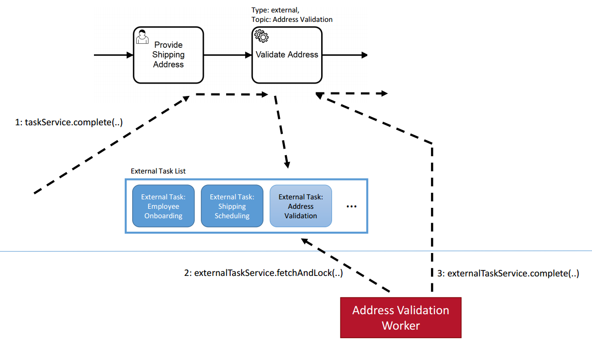

Внешние задачи
==============

.. contents:: 

.. _ecos_bpmn_external_task:

Паттерн внешняя задача
----------------------

Поток выполнения внешних задач можно концептуально разделить на три этапа, как показано на следующем рисунке:

1. **Process Engine:** Создание экземпляра внешнего задания
2. **External Worker:** Получение и блокировка внешних задач
3. **External Worker & Process Engine:** Завершение экземпляра внешней задачи

Когда движок процесса сталкивается с сервисной задачей, которая настроена на внешнюю обработку, 
он создает экземпляр внешней задачи и добавляет его в список внешних задач **(шаг 1)**. 
Экземпляр задачи получает топик, который идентифицирует характер задачи, которую необходимо выполнить. 
В какой-то момент в будущем внешний обработчик может получить и заблокировать задания для определенного набора топиков **(шаг 2)**. 
Чтобы предотвратить одновременное получение одной задачи несколькими обработчиками, 
задача имеет timestamp-based блокировку, которая устанавливается при получении задачи. 
Только когда блокировка истекает, другой обработчик может снова получить задание. 
Когда внешний обработчик выполнил требуемую задачу, он может подать сигнал движку процесса 
продолжить выполнение процесса после выполнения сервисной задачи **(шаг 3)**.

.. note:: 
    **Аналогия с пользовательской задачей**

    Внешние задачи концептуально очень похожи на пользовательские задачи. Когда вы впервые пытаетесь понять шаблон внешней задачи, может быть полезно подумать о нем по аналогии с пользовательской задачей: 
    
    Пользовательские задачи создаются движком процесса и добавляются в список задач. Затем движок процесса ждет, пока пользователь-человек запросит список, возьмет задачу на себя и затем выполнит ее. 
    
    Внешние задачи аналогичны: Внешняя задача создается, а затем добавляется в топик. Затем внешнее приложение запрашивает топик и блокирует задачу. После блокировки задачи приложение может работать над ней и завершить ее.

Суть этого паттерна заключается в том, что объекты, выполняющие фактическую работу, 
не зависят от движка процесса и получают задания для обработки путем запроса API движка процесса. 
Это дает следующие преимущества:

1. **Crossing System Boundaries:** Внешний обработчик не обязательно должен работать в том же Java-процессе, 
на той же машине, в том же кластере или даже на том же континенте, что и движок процесса. 
Все, что требуется - доступ к API движка процесса (через REST или Java). 
Благодаря polling-pattern, обработчику не нужно предоставлять какой-либо интерфейс для доступа к движку процесса.

1. **Crossing Technology Boundaries:** Внешний обработчик не обязательно должен быть реализован на Java. 
Вместо этого можно использовать любую технологию, которая наиболее подходит для выполнения необходимой задачи 
и может быть использована для доступа к API движка процесса (через REST или Java).

1. **Specialized Workers:** Внешний обработчик не обязательно должен быть приложением общего назначения. 
Каждый экземпляр внешнего обработчика получает имя топика, определяющее характер выполняемого задания. 
Обработчики могут опрашивать задания только для тех топиков, над которыми они могут работать.

1. **Fine-Grained Scaling:** При высокой нагрузке, сосредоточенной на обработке сервисных задач, 
количество внешних обработчиков для соответствующих топиков может быть масштабировано независимо от движка процесса.

1. **Independent Maintenance:** Обработчики можно разворачивать независимо от движка процесса без нарушения работы. 
Например, если обработчик для определенного топика имеет простой (например, из-за обновления), 
это не оказывает немедленного воздействия на движок процесса. Выполнение внешних заданий для таких рабочих 
происходит плавно: Они сохраняются в списке внешних задач до тех пор, пока внешний обработчик не возобновит работу.

Spring Boot Starter для клиента внешних задач
----------------------------------------------

Ecos Spring Boot Starter External Task Client позволяет легко добавить обработчика для внешних задач
в Spring Boot приложение. Для этого необходимо добавить зависимость:

.. code-block:: xml

    <dependency>
        <groupId>ru.citeck.ecos.bpmn</groupId>
        <artifactId>ecos-bpmn-external-task-client-springboot-starter</artifactId>
        <version>2.1.0</version>
    </dependency>

.. note:: 
    В текущей реализации starter`a, spring boot приложение должно находиться в одном контуре с Citeck.

    Для использования обработчиков из внешних контуров, можно воспользоваться стандартными `клиентами <https://docs.camunda.org/manual/7.19/user-guide/ext-client/>`_. 

Подписка на топики
~~~~~~~~~~~~~~~~~~

Интерфейс, позволяющий реализовать пользовательскую бизнес-логику и взаимодействовать с Engine, называется `ExternalTaskHandler`. 
Подписка идентифицируется именем топика.

Вы можете подписать клиента на имя топика `processPayment`, определив bean с возвращающим типом `ExternalTaskHandler` и добавив аннотацию на этот bean:

.. code-block:: kotlin

    @ExternalTaskSubscription("processPayment")

Для аннотации требуется как минимум имя топика. 

Для более подвинутой конфигурации можно сослаться на имя топика в файле конфигурации spring-boot, например application.yml и применить настройки:

.. code-block:: yaml

    ecos.bpm.client:
        subscriptions:
            processPayment:
                process-definition-key: payment_process
                include-extension-properties: true
                variable-names: defaultFlow

Или определить атрибуты конфигурации через аннотацию:

.. code-block:: kotlin

    @ExternalTaskSubscription(
        topicName = "processPayment",
        processDefinitionKey = "payment_process",
        includeExtensionProperties = true,
        variableNames = ["defaultFlow"]
    )

Полный список атрибутов можно найти в `Javadocs. <https://docs.camunda.org/javadoc/camunda-bpm-platform/7.19/org/camunda/bpm/client/spring/annotation/ExternalTaskSubscription.html>`_.

.. note:: 
    Свойства, определенные в файле application.yml, всегда переопределяет соответствующий атрибут, определенный программно через аннотацию.

Пример конфигурации обработчика
~~~~~~~~~~~~~~~~~~~~~~~~~~~~~~~

Вы можете сконфигурировать обработчик следующим образом:

.. code-block:: kotlin

    @Component
    @ExternalTaskSubscription("processPayment")
    class PaymentProcessorWorker : ExternalTaskHandler {

        override fun execute(externalTask: ExternalTask, externalTaskService: ExternalTaskService) {
            // you business logic here
            externalTaskService.complete(externalTask);
        }

    }

Если вы хотите определить несколько бинов обработчиков в одном классе конфигурации, вы можете сделать это следующим образом:

.. code-block:: kotlin

    @Configuration
    class PaymentWorker {

        @Bean
        @ExternalTaskSubscription("processPayment")
        fun processPayment(externalTask: ExternalTask, externalTaskService: ExternalTaskService) {
            // you business logic here
            externalTaskService.complete(externalTask);
        }

        @Bean
        @ExternalTaskSubscription("cancelPayment")
        fun processPayment2(externalTask: ExternalTask, externalTaskService: ExternalTaskService) {
            // you business logic here
            externalTaskService.complete(externalTask);
        }

    }

Обработка ошибок и завершение задачи
~~~~~~~~~~~~~~~~~~~~~~~~~~~~~~~~~~~~

Для манипуляции с задачей используется интерфейс `ExternalTaskService <https://docs.camunda.org/javadoc/camunda-bpm-platform/7.19/org/camunda/bpm/client/task/ExternalTaskService.html>`_.

Для успешного выполнения задачи необходимо вызвать метод `complete`: 

.. code-block:: kotlin

    @Component
    @ExternalTaskSubscription("processPayment")
    class PaymentProcessorWorker : ExternalTaskHandler {

        override fun execute(externalTask: ExternalTask, externalTaskService: ExternalTaskService) {
            // you business logic here
            externalTaskService.complete(externalTask);
        }

    }

Но happy path не всегда возможен, правильная 
обработка ошибок внешних задач очень важна для обеспечения надежности и стабильности выполнения процессов.

Обработка бизнес-ошибок
++++++++++++++++++++++++

В процессе выполнения внешний задачи может возникнуть бизнес-ошибка, которая должна быть обработана в процессе посредством `error event`.

Для выбрасывания бизнес-ошибки необходимо использовать метод `handleBpmnError`:

.. code-block:: kotlin

    @Component
    @ExternalTaskSubscription("processPayment")
    class PaymentProcessorWorker : ExternalTaskHandler {

        override fun execute(externalTask: ExternalTask, externalTaskService: ExternalTaskService) {
            // you business logic here
            externalTaskService.handleBpmnError(externalTask, "error-code", "error-message");
        }

    }

Обработка технических ошибок
++++++++++++++++++++++++++++

Если в процессе обработки возникла техническая ошибка, то посредством метода `handleFailure` можно реализовать механизм повторной обработки задачи.

Для удобства можно воспользоваться аннотацией `ru.citeck.ecos.bpmn.externaltask.impl.retry.ExternalTaskRetry`:

.. code-block:: java

    @Component
    @ExternalTaskSubscription("processPayment")
    class PaymentProcessorWorker(
        private val paymentService: PaymentService
    ) : ExternalTaskHandler {

        @ExternalTaskRetry(
            retries = 3,
            retryTimeout = 10_000,
            incrementRetryTimeout = true
        )
        override fun execute(task: ExternalTask, taskService: ExternalTaskService) {
            // you business logic here
            paymentService.processPayment(task)

            // complete, if successful
            taskService.complete(task)
        }
    }

Или реализовать механизм повторной обработки задачи вручную, со своей логикой повторной обработки:

.. code-block:: java

    @Component
    @ExternalTaskSubscription("processPayment")
    class PaymentProcessorWorker(
        private val paymentService: PaymentService
    ) : ExternalTaskHandler {

        companion object {
            private val log = KotlinLogging.logger {}

            private const val ONE_MINUTE = 1000L * 60
            private const val MAX_RETRIES = 5
        }

        override fun execute(task: ExternalTask, taskService: ExternalTaskService) {
            try {
                // you business logic here
                paymentService.processPayment(task)

                // complete, if successful
                taskService.complete(task)
            } catch (e: Exception) {
                log.error("Error processing external task: ${task.id}", e)

                val retries = getRetries(task)
                val timeout = getNextTimeout(retries)
                taskService.handleFailure(
                    task, e.message,
                    ExceptionUtils.getStackTrace(e),
                    retries, timeout
                )
            }
        }

        private fun getRetries(task: ExternalTask): Int {
            var retries = task.retries
            retries = if (retries == null) {
                MAX_RETRIES
            } else {
                retries - 1
            }
            return retries
        }

        private fun getNextTimeout(retries: Int): Long {
            // increasing interval: 1 additional minute delay after each retry
            return ONE_MINUTE * (MAX_RETRIES - retries)
        }

    }

Если количество попыток обработки задачи исчерпано, то будет создан инцидент и задача помечена как `failed`, в дальнейшем требуется ручной разбор инцидента в административном интерфейсе.

Комбинированная обработка ошибок
++++++++++++++++++++++++++++++++

В некоторых случаях возможна ситуация, когда в процессе обработки внешней задачи может возникнуть как бизнес-ошибка, так и техническая ошибка.
В таком случае возможно использовать `@ExternalTaskRetry` и `handleBpmnError` вместе:

.. code-block:: java

    @Component
    @ExternalTaskSubscription("processPayment")
    class PaymentProcessorWorker(
        private val paymentService: PaymentService
    ) : ExternalTaskHandler {

        @ExternalTaskRetry
        override fun execute(task: ExternalTask, taskService: ExternalTaskService) {
            // you business logic here
            val processResult = paymentService.processPayment(task)
            if (processResult == "DENIED") {
                taskService.handleBpmnError(task, "paymentDenied", "Payment was denied")
                return
            }

            // complete, if successful
            taskService.complete(task)
        }
    }

В данном случае, если в процессе обработки задачи возникнет техническая ошибка, например, случился `Exception` при выполнении метода `paymentService.processPayment` из-за проблем с сетью, 
то задача будет повторно обработана согласно настройкам `@ExternalTaskRetry`. После успешного выполнения обратки платежа, если платеж был отклонен, то будет выброшена бизнес-ошибка, иначе - задача будет завершена успешно.

Также можно реализовать кейс, когда после нескольких неудачных попыток обработки задачи из-за технической ошибки, необходимо выбросить бизнес-ошибку:

.. code-block:: java

    @Component
    @ExternalTaskSubscription("processPayment")
    class PaymentProcessorWorker(
        private val paymentService: PaymentService
    ) : ExternalTaskHandler {
    
        companion object {
            private  const val ATTEMPT_THRESHOLD = 1
        }
    
        @ExternalTaskRetry
        override fun execute(task: ExternalTask, taskService: ExternalTaskService) {
            try {
                // you business logic here
                val processResult = paymentService.processPayment(task)
    
                // complete, if successful
                taskService.complete(task)
            } catch (e: Exception) {
                val retries = externalTask.retries
                if (retries >= ATTEMPT_THRESHOLD) {
                    // If the number of retries is greater than the threshold, then throw an BPMN error
                    externalTaskService.handleBpmnError(externalTask, "paymentDenied", ExceptionUtils.getStackTrace(e))
                } else {
                    // Otherwise throw root exception. Its will be handled by @ExternalTaskRetry
                    throw e
                }
            }
        }
    }

.. note:: 
    При работе с внешними задачами и моделировании процесса необходимо учитывать, что внешние задачи 
    выполняются асинхронно, а обработка ошибок является зоной ответственности внешнего обработчика.

    Если вы используете мутацию recordsService при обработке внешней задачи, то необходимо учитывать, что код обработки внешней задачи выполняется
    без транзакции. Вы можете пометить метод аннотацией `ru.citeck.ecos.webapp.lib.spring.context.txn.RunInTransaction` для выполнения кода внутри транзакции.

    С более подробной документацией по внешним задачам можно ознакомиться по ссылкам:

     1. `External Tasks <https://docs.camunda.org/manual/7.19/user-guide/process-engine/external-tasks/#error-event-definitions>`_
     2. `External Task Client <https://docs.camunda.org/manual/7.19/user-guide/ext-client/>`_
     3. `External Task Spring Boot Starter <https://docs.camunda.org/manual/7.19/user-guide/ext-client/spring-boot-starter/>`_ 
     4. `Error Boundary Event <https://docs.camunda.org/manual/7.19/reference/bpmn20/events/error-events/#error-boundary-event>`_

