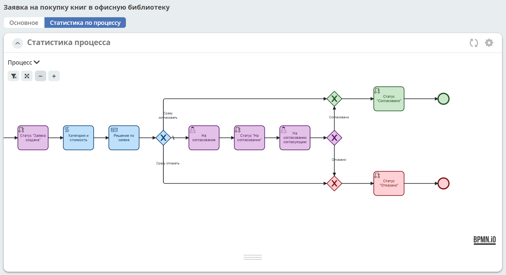

Общее описание Citeck BPMN
============================

.. contents:: 

.. _ecos_bpmn:

Платформа основана на библиотеке редактора `bpmn-js <https://bpmn.io/>`_ и движка `camunda <https://camunda.com/>`_.

 .. image:: _static/01.png
       :width: 600
       :align: center

Права на описание процессов
----------------------------

Предоставление прав разграничено в рамках категорий бизнес-процессов/конкретных бизнес-процессов. По умолчанию для указанных ролей права следующие:

.. list-table::
      :widths: 20 20 10 10 10 10
      :header-rows: 1
      :class: tight-table 
      
      * - Право / Роль/ Группа
        - Описание
        - Администратор БП
        - Менеджер БП
        - Разработчик БП
        - Читатель БП
      * - 
        - 
        - **bp-administrator**
        - **bp-manager**
        - **bp-developer**
        - **bp-viewer**
      * - Право на чтение (read)
        - Просмотр раздела и всех процессов в нем
        -
            .. image:: _static/plus.png
                  :width: 10
                  :align: center

        -
            .. image:: _static/plus.png
                  :width: 10
                  :align: center
        -
            .. image:: _static/plus.png
                  :width: 10
                  :align: center

        -
            .. image:: _static/plus.png
                  :width: 10
                  :align: center
      * - Право на изменение (write)
        - Редактирование раздела и процессов в нем 
        -
            .. image:: _static/plus.png
                  :width: 10
                  :align: center

        -
            .. image:: _static/minus.png
                  :width: 10
                  :align: center
        -
            .. image:: _static/minus.png
                  :width: 10
                  :align: center

        -
            .. image:: _static/minus.png
                  :width: 10
                  :align: center
      * - Редактирование процессов в разделе
        - Редактирование процессов в разделе
        -
            .. image:: _static/plus.png
                  :width: 10
                  :align: center

        -
            .. image:: _static/minus.png
                  :width: 10
                  :align: center
        -
            .. image:: _static/minus.png
                  :width: 10
                  :align: center

        -
            .. image:: _static/minus.png
                  :width: 10
                  :align: center
      * - Деплой процесса
        - :ref:`Публикация моделей процессов<save_bp>` 
        -
            .. image:: _static/plus.png
                  :width: 10
                  :align: center

        -
            .. image:: _static/minus.png
                  :width: 10
                  :align: center
        -
            .. image:: _static/plus.png
                  :width: 10
                  :align: center

        -
            .. image:: _static/minus.png
                  :width: 10
                  :align: center
      * - Просмотр отчета
        - :ref:`Просмотр статистики по процессу<widget_process_statistics>` 
        -
            .. image:: _static/plus.png
                  :width: 10
                  :align: center

        -
            .. image:: _static/plus.png
                  :width: 10
                  :align: center
        -
            .. image:: _static/plus.png
                  :width: 10
                  :align: center

        -
            .. image:: _static/minus.png
                  :width: 10
                  :align: center
      * - Просмотр экземпляра процесса
        - Просмотр экземпляра процесса :ref:`в разделе "Администрирование БП"<bpmn_admin>` 
        -
            .. image:: _static/plus.png
                  :width: 10
                  :align: center

        -
            .. image:: _static/minus.png
                  :width: 10
                  :align: center
        -
            .. image:: _static/minus.png
                  :width: 10
                  :align: center

        -
            .. image:: _static/minus.png
                  :width: 10
                  :align: center
      * - Редактирование экземпляра процесса
        - Редактирование экземпляра процесса :ref:`в разделе "Администрирование БП"<bpmn_admin>` 
        -
            .. image:: _static/plus.png
                  :width: 10
                  :align: center

        -
            .. image:: _static/minus.png
                  :width: 10
                  :align: center
        -
            .. image:: _static/minus.png
                  :width: 10
                  :align: center

        -
            .. image:: _static/minus.png
                  :width: 10
                  :align: center
      * - Миграция экземпляра процесса
        - Миграция экземпляра процесса  :ref:`в разделе "Администрирование БП"<bpmn_admin>` 
        -
            .. image:: _static/plus.png
                  :width: 10
                  :align: center

        -
            .. image:: _static/minus.png
                  :width: 10
                  :align: center
        -
            .. image:: _static/plus.png
                  :width: 10
                  :align: center

        -
            .. image:: _static/minus.png
                  :width: 10
                  :align: center
      * - Ручной запуск экземпляра процесса
        - Ручной запуск экземпляра процесса :ref:`в разделе "Администрирование БП"<bpmn_admin>` 
        -
            .. image:: _static/plus.png
                  :width: 10
                  :align: center

        -
            .. image:: _static/minus.png
                  :width: 10
                  :align: center
        -
            .. image:: _static/plus.png
                  :width: 10
                  :align: center

        -
            .. image:: _static/minus.png
                  :width: 10
                  :align: center

Роли назначены на группы. Чтобы пользователь получил права, необходимо добавить его в соответствующую группу.

Так же права можно настраивать конкретным пользователям на :ref:`конкретные разделы<bpmn_permissions>`

1. Раздел **«Моделирование»** с редакторами DMN/BPMN, раздел доступен для пользователей с правом **Право на чтение (read)**

 .. image:: _static/rights_1.png
       :width: 200
       :align: center

2. В редакторах DMN/BPMN публикация моделей доступна только для пользователей с правом **Деплой процесса**

 .. image:: _static/rights_2.png
       :width: 600
       :align: center

|

 .. image:: _static/rights_3.png
       :width: 600
       :align: center

Право на деплой можно проверить запросом ``permissions._has.deploy?bool``

Например:

.. code-block::

      Citeck.Records.get('eproc/bpmn-def@you-process').load("permissions._has.deploy?bool", true).then(res => console.log(res))

3.	Добавлена возможность просмотра схемы БП для пользователей с правом **Право на чтение (read)**

 .. image:: _static/rights_4.png
       :width: 600
       :align: center

|

 .. image:: _static/rights_5.png
       :width: 600
       :align: center

4.	Добавлен просмотр отчетности для ролей с правом **Просмотр отчета**. Под отчетностью понимаем виджет «Статистика по процессу».

Право на деплой можно проверить запросом ``permissions._has.viewReports?bool``

Например:

.. code-block::

      Citeck.Records.get('eproc/bpmn-def@you-process').load("permissions._has.viewReports?bool", true).then(res => console.log(res))

Настройка просмотра доступна только пользователям из группы администраторы ECOS.

 .. image:: _static/rights_7.png
       :width: 600
       :align: center

Подробно о виджете :ref:`«Статистика по процессу»<widget_process_statistics>`