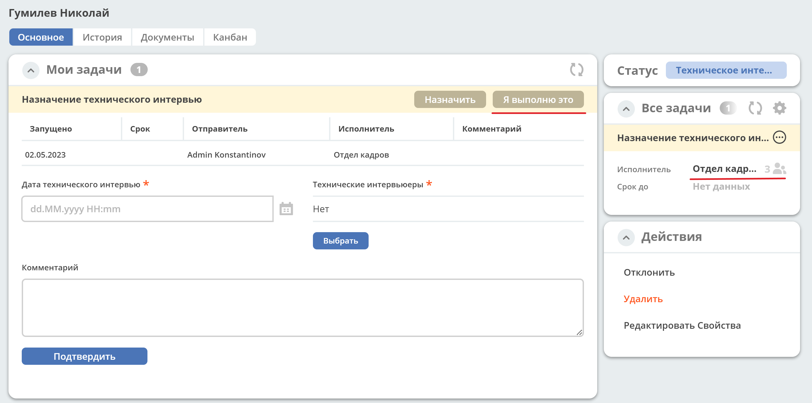
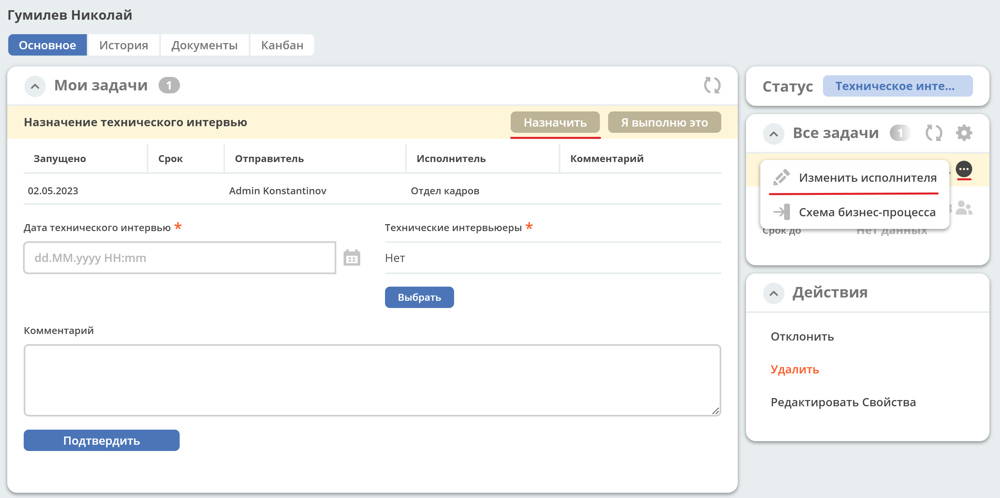
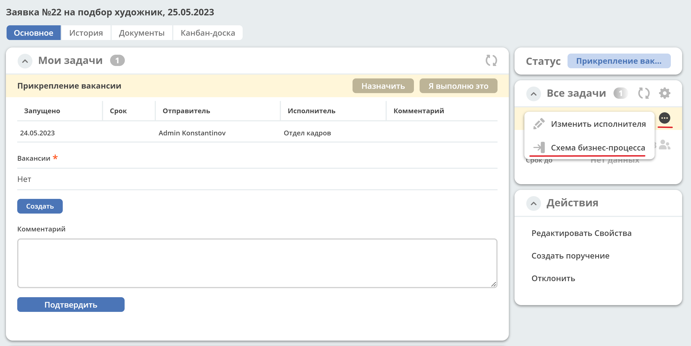

Работа с задачами бизнес-процесса
===================================

При работе с бизнес-процессом на пользователей назначаются задачи. Ниже описаны варианты действий с задачами.

Права
------

Права на операции имеют:

    - администраторы ECOS;

    - пользователи, являющиеся реципиентами задачи.

Дополнительно права на переназначение (изменить исполнителя) задачи имеют пользователи, входящие в группу ``GROUP_WORKFLOW_TASKS_REASSIGN_ALLOWED``

Действия с задачей
-------------------

Я выполню это
~~~~~~~~~~~~~

Действие доступно, если задача назначена на пулл реципиентов - группу или нескольких пользователей. 
При выполнении действия, задача забирается с реципиентов и назначается на текущего пользователя.

Назначить / Изменить исполнителя
~~~~~~~~~~~~~~~~~~~~~~~~~~~~~~~~~~

Действия забирают задачу из пулла реципиентов и назначают на выбранного пользователя.

.. note::

    Если задача переназначается на пользователя, у которого нет прав на чтение документа, по которому идет бизнес-процесс, то переназначающий пользователь делегирует права на чтение к документу.
    Делегация прав сохраняется после завершения задачи и доступна пока у делегата есть соответствующие права.

Вернуть на группу
~~~~~~~~~~~~~~~~~

.. image:: _static/task_3.png
      :width: 600
      :align: center

Действие возвращает задачу на изначальный пулл реципиентов. 
Доступно, если задача была ранее забрана с пулла реципиентов на конкретного пользователя.

Просмотр схемы бизнес-процесса
~~~~~~~~~~~~~~~~~~~~~~~~~~~~~~~

При нажатии на кнопку отображается схема выбранного БП с выделенной текущей задачей:

.. image:: _static/task_5.png
      :width: 600
      :align: center

Добавление комментария
------------------------

.. note::

      На форме задач поле комментарий нужно обязательно добавлять с id ``comment``.

