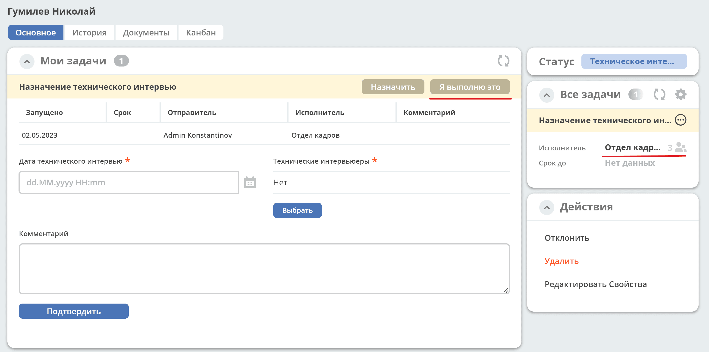
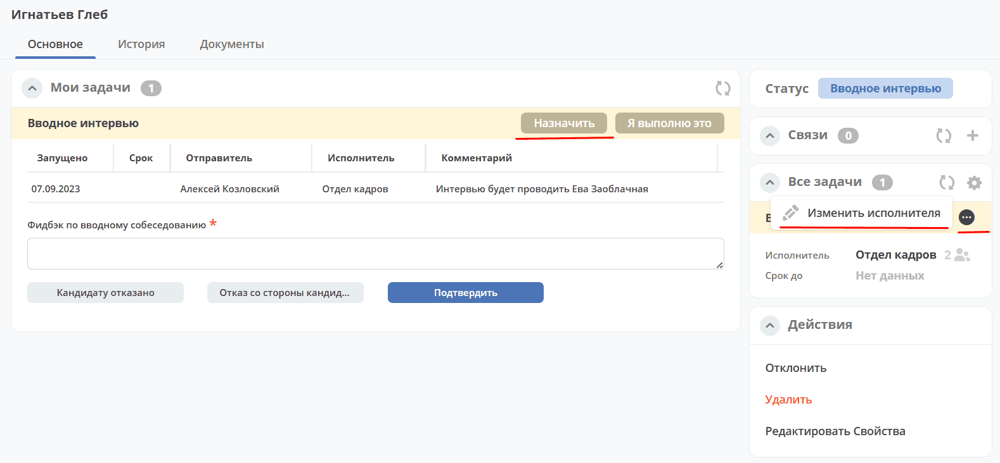
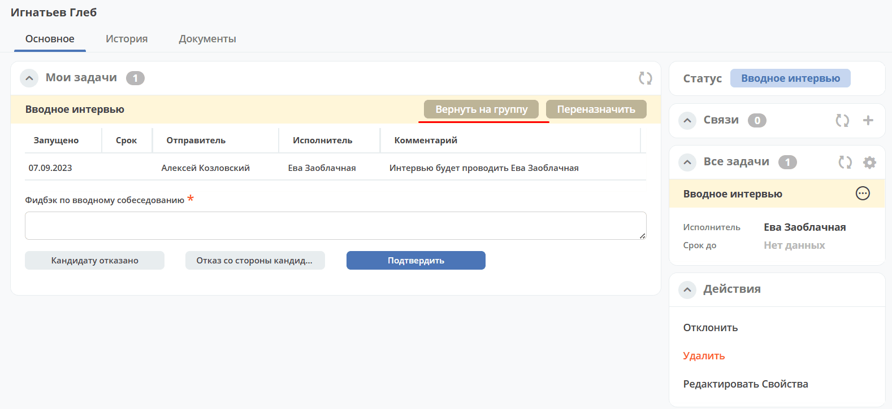

.. _tasks_options:

Работа с задачами бизнес-процесса
==================================================================

.. contents::

При работе с бизнес-процессом на пользователей назначаются задачи. Ниже описаны варианты действий с задачами.

Права
------

Права на операции имеют:

    - администраторы Citeck;

    - пользователи, являющиеся реципиентами задачи.

Дополнительно права на переназначение (изменить исполнителя) задачи имеют пользователи, входящие в группу ``GROUP_WORKFLOW_TASKS_REASSIGN_ALLOWED``.

Действия с задачей
-------------------

.. grid:: 1
   :gutter: 2

   .. grid-item-card:: Я выполню это
      :link: task_execute
      :link-type: ref

      Заберите задачу с пула реципиентов (группы или нескольких пользователей) и назначьте на себя.

   .. grid-item-card:: Назначить / Изменить исполнителя
      :link: task_reassign
      :link-type: ref

      Заберите задачу из пула реципиентов и назначьте на выбранного пользователя.

   .. grid-item-card:: Вернуть на группу
      :link: task_return_to_group
      :link-type: ref

      Верните задачу, ранее забранную на конкретного пользователя, обратно на изначальный пул реципиентов.

   .. grid-item-card:: Просмотр схемы бизнес-процесса
      :link: task_view_scheme
      :link-type: ref

      Откройте схему бизнес-процесса с выделенной текущей задачей.

.. _task_execute:

Я выполню это
~~~~~~~~~~~~~

Действие доступно, если задача назначена на пул реципиентов — группу или нескольких пользователей.
При выполнении действия задача забирается с реципиентов и назначается на текущего пользователя.

.. _task_reassign:

Назначить / Изменить исполнителя
~~~~~~~~~~~~~~~~~~~~~~~~~~~~~~~~~~

Действие забирает задачу из пула реципиентов и назначает на выбранного пользователя.

.. note::

    Если задача переназначается на пользователя, у которого нет прав на чтение документа, по которому идет бизнес-процесс, то переназначающий пользователь делегирует права на чтение к документу.
    Делегация прав сохраняется после завершения задачи и доступна пока у делегата есть соответствующие права.

.. _task_return_to_group:

Вернуть на группу
~~~~~~~~~~~~~~~~~

Действие возвращает задачу на изначальный пул реципиентов.
Доступно, если задача была ранее забрана с пула реципиентов на конкретного пользователя.

.. _task_view_scheme:

Просмотр схемы бизнес-процесса
~~~~~~~~~~~~~~~~~~~~~~~~~~~~~~~

1. Нажмите на кнопку просмотра схемы:

   .. image:: _static/task_4.png
      :width: 600
      :align: center

2. Откроется схема выбранного БП с выделенной текущей задачей:

   .. image:: _static/task_5.png
      :width: 600
      :align: center

Добавление комментария
------------------------

При настройке формы задачи для корректной работы поля комментария необходимо соблюдать следующее правило:

.. note::

    На форме задач поле комментарий нужно обязательно добавлять с id ``comment``.
