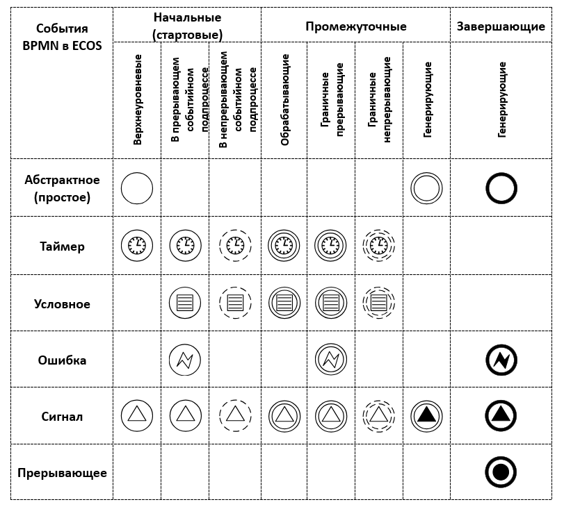

События
=======

.. _bpmn_events:

.. toctree::
    :maxdepth: 2

    events/ecos_bpmn_components_timer
    events/ecos_bpmn_components_conditional
    events/ecos_bpmn_components_error   
    events/ecos_bpmn_components_signal
    events/ecos_bpmn_components_termination
    events/ecos_bpmn_components_event_subprocess

**Событие** является одним из главных элементов BPMN и служит для описания того, что должно случиться (в отличие от задачи, когда что-то должно быть сделано). Событием может быть, например, подписание договора, или разговор с клиентом.

Графические элементы событий в BPMN классифицируют в зависимости от положения события на схеме процесса:

.. list-table::
      :widths: 5 20
      :class: tight-table 
      
      * - 
  
          .. image:: _static/events/common_1.png
                :width: 40
                :align: center
 
        - Начальное событие (инициирующее бизнес-процесс)/ Start event
      * - 
  
          .. image:: _static/events/common_2.png
                :width: 40
                :align: center
 
        - Промежуточное событие / Intermediate Event
      * - 
  
          .. image:: _static/events/common_3.png
                :width: 40
                :align: center
 
        - Конечное событие (заканчивающее бизнес-процесс) / End event

**Промежуточные события** - события, которые находятся между стартовыми и конечными событиями BPMN. Такие события изображаются при помощи двойной линии. Промежуточные события делятся на:
   
   * **Обрабатывающие (catching)** – события ожидания. На время обрабатывающего события выполнение процесса приостанавливается. Такие события не привязаны к какой-либо задаче:
  
      .. image:: _static/events/interm_1.png
            :width: 300
            :align: center

      Поместите на схему промежуточное событие, нажмите на гаечный ключ в контекстном меню и выберите один из возможных подтипов: 

      .. image:: _static/events/interm_2.png
            :width: 300
            :align: center

   * **Граничные прерывающие (boundary interrupting)** – события, которые привязаны к какой-либо активности (например, задаче) и на схеме располагаются на рамке (границе) элемента активности.

      .. image:: _static/events/interm_3.png
            :width: 300
            :align: center

      Граничные события делятся на два класса: 

            * **граничные прерывающие (boundary interrupting)** (на рисунке отмечен как **1**)
            * **граничные непрерывающие (boundary non-interrupting)** (на рисунке отмечен как **2**)
      
      Если есть прерывающее событие для задачи, то необходимо ожидать, пока оно не произойдет (например, пока заявка не будет подтверждена). Параллельно данную задачу делать нельзя. 
      
      Ожидание непрерывающего события не приостанавливает выполнения задачи. Например, в любой момент рассмотрение заявки может переноситься на более высокий уровень, но пока такое сообщение не пришло, выполнение задачи (рассмотрение заявки) должно производиться на более низком уровне.   
      
      Перетащите элемент промежуточного события на рамку задачи или другого элемента, и дальше выберите требуемый тип, нажав на изображение гаечного ключа в контекстном меню.

      .. image:: _static/events/interm_4.png
            :width: 300
            :align: center

   * **Генерирующие (throwing)**

      Когда поток управления достигает генерирующего события, то незамедлительно происходит соответствующая обработка (отправляется сообщение, сигнал и т.д.), после чего поток управления немедленно покидает текущий элемент и продолжает движение далее по процессу.

      .. image:: _static/events/interm_5.png
            :width: 300
            :align: center     

      Рамка такая же, как и у обрабатывающего события, но по стандарту BPMN изображение внутри генерирующего события заливается черным цветом.
      
      Поместите на схему промежуточное событие, нажмите на гаечный ключ в контекстном меню и выберите один из возможных подтипов: 

      .. image:: _static/events/interm_6.png
            :width: 300
            :align: center     

На данный момент в ECOS доступны следующие типы событий:

.. list-table::
      :widths: 5 5 20
      :class: tight-table 
      
      * - 
            .. image:: _static/events/common_4.png
                :width: 40
                :align: center
 
        - :ref:`Таймер<ecos_bpmn_timer>`
        - | Используется для моделирования регулярных событий. 
          | Также таймер может использоваться для моделирования моментов времени, временных промежутков и превышения лимита времени.
      * - 
          .. image:: _static/events/common_7.png
                :width: 40
                :align: center
 
        - :ref:`Условное<ecos_bpmn_conditional>`
        - Используется для моделирования реакции бизнес-процесса на изменения условий. 
      * - 
          .. image:: _static/events/common_9.png
                :width: 40
                :align: center

        - :ref:`Ошибка<ecos_bpmn_error>`
        - Используется для моделирования возможных ошибок при выполнении процесса, а также для отображения последовательности действий по устранению этих ошибок.  
      * -  
          .. image:: _static/events/common_5.png
                :width: 40
                :align: center

        - :ref:`Сигнал<ecos_bpmn_events>`
        - | Обозначает ожидание или отправку сигнала между процессами, используется интеграция с :ref:`событиями ECOS <bpmn_events_integrations>`.
      * - 
          .. image:: _static/events/common_8.png
                :width: 40
                :align: center
 
        - :ref:`Прерывающее<ecos_bpmn_termination>`
        - Вызывает немедленное завершение выполнения процесса, при этом все его активные потоки управления прерываются.  
