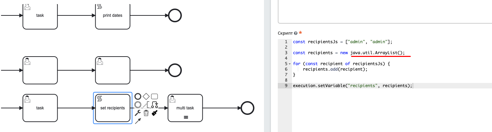
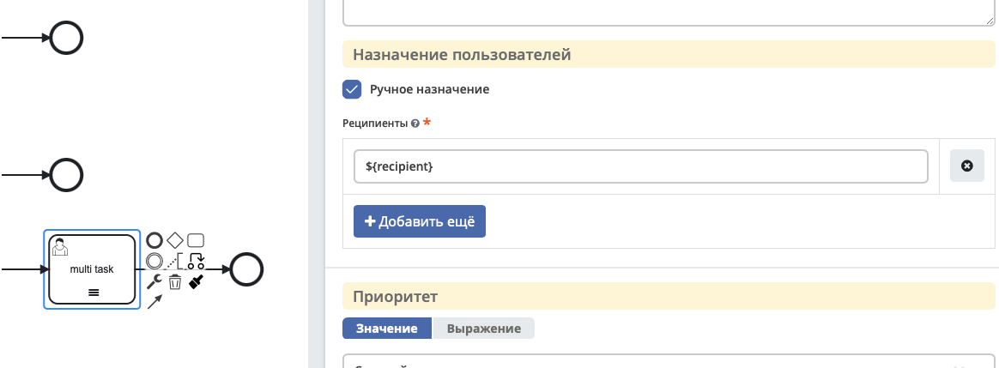
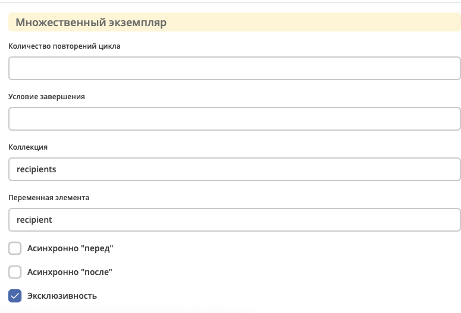

Multi instance
==============

.. _multi_instance:

**Multi Instance (многоэкземплярная активность)** — способ определения повторения определенного шага в бизнес-процессе. 

В концепциях программирования мультиэкземпляр соответствует for each конструкции: он позволяет выполнять определенный шаг или даже полный подпроцесс для каждого элемента в данной коллекции, последовательно или параллельно.

Многоэкземплярная активность — обычное действие, для которого определены дополнительные свойства (так называемые multi-instance characteristics), которые заставляют действие выполняться несколько раз во время выполнения. 

Следующие действия могут стать действиями с несколькими экземплярами:

  * Пользовательская задача;
  * Задача-сценарий;
  * Подпроцесс.

В редакторе Multi Instance можно установить следующим образом:

.. image:: _static/multi_instance/93.png
       :width: 400
       :align: center

.. list-table::
      :widths: 1 10 10
      :align: center
      :class: tight-table 

      * - 
               .. image:: _static/multi_instance/45.png
                :width: 30
                :align: center

        -  | **Sequential Multi Instance** – последовательная активность с несколькими экземплярами.
           | Экземпляры выполняются друг за другом.
           | Когда один экземпляр завершен, создается новый экземпляр для следующего элемента в ``inputCollection``.

        - 
               .. image:: _static/multi_instance/94.png
                :width: 300
                :align: center

      * - 
               .. image:: _static/multi_instance/44.png
                :width: 30
                :align: center

        - | **Parallel Multi Instance** - параллельная активность с несколькими экземплярами.
          | Все экземпляры создаются при активации тела активности с несколькими экземплярами.
          | Экземпляры выполняются одновременно и независимо друг от друга.
      
        - 
               .. image:: _static/multi_instance/95.png
                :width: 300
                :align: center

Настройки:

.. list-table::
      :widths: 5 20
      :align: center
      :class: tight-table 

      * - **Пользовательская задача**
        - | Если выбрано parallel или sequential multi-instance, то задачи будут назначаться на **authority** из ролей - пользователи записываются в **assignee**, группы в **candidateGroup**.
          | При выставлении флага **«Ручное назначение»** появляется возможность указать реципиентов: 

               .. image:: _static/multi_instance/96.png
                :width: 300
                :align: center         

          | Подробно :ref:`о реципиентах<user_task>`

          | И далее укажите настройки **множественного экземпяра**, которые аналогичны и для :ref:`Скриптовой задачи<script_task>`, :ref:`Подпроцесса<sub_process>`:
          
               .. image:: _static/multi_instance/97.png
                :width: 300
                :align: center   

      * - | **Пользовательская задача**
          | **Подпроцесс**
        - | **Количество повторений цикла/ Loop cardinality** - прямое указание числа экземпляров
          | **Условие завершения / Completion condition** - выражение, которое вычисляется каждый раз, когда заканчивается один экземпляр
          | **Коллекция/ Collection** -  коллекция, в которой экземпляр будет создан для каждого элемента
          | **Переменная элемента / Element variable** -  переменная процесса, которая будет установлена для каждого созданного экземпляра, содержащего элемент указанной коллекции
          

Подробно о `Multi instance <https://docs.camunda.org/manual/7.8/reference/bpmn20/tasks/task-markers/#multiple-instance>`_ 

Примеры использования
----------------------

Пользовательская задача
~~~~~~~~~~~~~~~~~~~~~~~~

Как в пользовательской задаче указать, что задачи должны идти параллельно на пользователей, указанных в переменной.

Используйте ``java.util.ArrayList()``:

|

|

