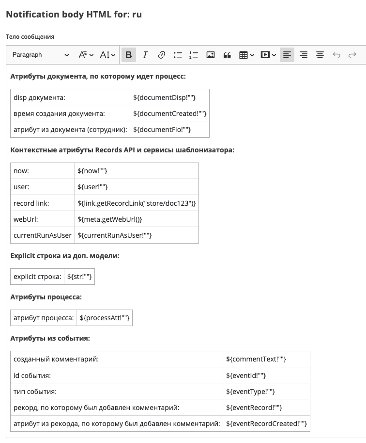
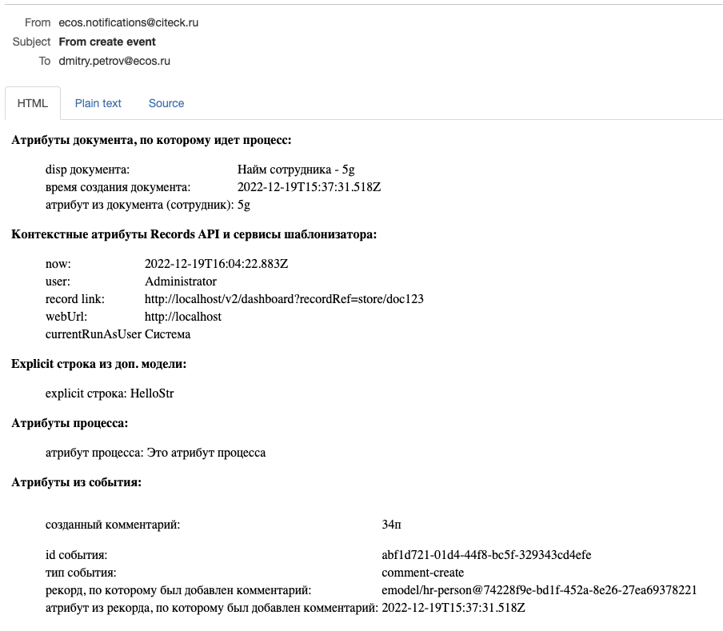

Уведомление
===========

.. _notification:

.. contents::

Общее описание
--------------

Элемент используется для отправки уведомлений пользователям. На данный момент поддерживается только уведомление по электронной почте.

Уведомления отправляются через микросервис ecos-notifications, см. подробнее - :ref:`уведомления<notifications>` и :ref:`шаблоны уведомлений<notification_templates>`.

 .. image:: _static/notifications/48.png
       :width: 400
       :align: center

Атрибуты и форма
----------------

.. list-table::
      :widths: 5 5
      :class: tight-table 

      * - | Указать **Имя**,  
          | **Тип уведомления** указан по умолчанию **Электронная почта**.

        - 
               .. image:: _static/notifications/49.png
                :width: 320
                :align: center

      * - | Можно выбрать :ref:`шаблон уведомления<notification_templates>` или напрямую указать **Заголовок** и **Тело** сообщения напрямую. 
          | При прямом использовании **Заголовка** и **Тела** возможно указывать только текст, без использования динамических переменных из процесса или документа.
        - 
               .. image:: _static/notifications/50.png
                :width: 380
                :align: center

          |

               .. image:: _static/notifications/51.png
                :width: 320
                :align: center 

      * - | **Отправка писем-встреч в календарь пользователя**
          |
          | **Название** и **Описание** могут быть указаны напрямую или через expression ``${someVariable}``
          | Настройки события могут быть выбраны как значениями, так и указаны в виде выражений.
          | 
          | - **Значение**
          | 
          |    **Организатор** выбирается из ролей, заполненных в :ref:`типе данных<data_types_main>`. Конечным результатом обработки поля будет являться email. Если в роли содержится несколько пользователей, то будет выбран первый вычисленный email.
          |
          |    **Дата** начала события. При создании события будет указан часовой пояс организатора из профиля пользователя.
          |
          |    **Продолжительность** события выберите из списка 

          | - **Выражение**
          | 
          |    **Организатор** - имя, recordRef  или емейл организатора. Конечным результатом обработки поля будет являться email.
          |    Поддерживаются expression для получения данных из переменных или сервисов
          |    Например: 
          |     ``ivan.petrov`` 
          |     ``GROUP_company_accountant`` 
          |     ``emodel/authority-group@company_accountant`` 
          |     ``emodel/person@ivan`` 
          |     ``ivan.petrov@citeck.ru`` 
          |    Если передан объект, который содержит несколько емейлов (группа пользователей), то будет выбран первый вычисленный email.
          | 
          |    **Дата** начала события может быть указана в формате ISO или выражение:
          |     ``2020-06-20T10:30:00Z`` 
          |     ``${ someDate}`` 
          |    Выражение всегда должно возвращать `java.util.Date`, `java.util.String (ISO 8601)` или `null`.
          |
          |    **Продолжительность события** в указывается `ISO 8601 <https://en.wikipedia.org/wiki/ISO_8601>`_ формате. Например:
          |     - PT15S - 15 секунд 
          |     - PT1H30M - 1 час 30 минут
          |     - P14D - 14 дней
          |    Может быть указана напрямую или через expression. Например: ``${someVariable}``

        - |

               .. image:: _static/notifications/calc_event_01.png
                :width: 320
                :align: center 

          |

               .. image:: _static/notifications/calc_event_02.png
                :width: 320
                :align: center 

          |

               .. image:: _static/notifications/calc_event_03.png
                :width: 320
                :align: center 

      * - | **Получатели** могут быть выбраны из: 
          | - **Роли** - роли, заполненные в :ref:`типе данных<data_types_main>`.
          | - **Выражение** - имя, recordRef или емейл получателя. Поддерживаются expression для получения данных из переменных или сервисов. Expression может вернуть множественное значение - строки разделенные запятой: ``ivan@mail.com,user2,user3``.
          |   Например: 
          |   ``ivan.petrov`` 
          |   ``GROUP_company_accountant`` 
          |   ``emodel/authority-group@company_accountant`` 
          |   ``emodel/person@ivan`` 
          |   ``${someVariable}`` 
          |   ``${someService.getEmails()},petya.voks`` 

        - |

              .. image:: _static/notifications/send_task_recipient_roles.png
                :width: 320
                :align: center

          |

              .. image:: _static/notifications/send_task_recipient_expression.png
                :width: 320
                :align: center

      * - | **Исходящий адрес** - Исходящий адрес уведомления. Может быть указан напрямую или через expression.
          | Если пусто, то будет использовано значение по умолчанию.
          | Например: 
          | ``someAddress@mail.com`` 
          | ``"Some Name" <someAddress@mail.com>``
          | ``${someExpressionToGetAddress}`` 
          |
          | Получение адреса из Конфигурации Citeck: 
          | ``${Config.getNotNull("app/you-app$you-config-key").asText()}`` 
          |
          | **Record уведомления** - базовый record для заполнения шаблона. Если в этом поле ничего не указано, то берется документ, по которому запущен бизнес процесс. 
          |
          | **Язык**  указывается язык шаблона уведомления в формате ``ru``, ``en`` и т.д. Если язык не указан, то берется язык по умолчанию. 
          |
          | **Дополнительная модель (additional meta)**  - описание дополнительной мета информации, где  
          |  - *ключ (string)* - по ключу становится доступна информация в модели шаблона уведомления.  
          |  - *значение (object)* - если в значении передана строка и начинается с префикса ``!str_``, то символы после префикса записываются как строка, иначе строка считается как recordRef.

        - 
               .. image:: _static/notifications/send_task_settings_panel.png
                :width: 350
                :align: center

.. important::

  При сохранении, сохранении/публикации процесса проверяется обязательность заполнения следующих полей:

   - **«Шаблон»** или **«Тело сообщения»**;
   - **«Получатели»** (Роли или Выражение)

  Иначе в :ref:`линтере<bpmn_linter>` будет выдана ошибка.  

.. _notification_variables:

Доступные переменные
--------------------

В модели шаблона уведомлений есть доступ к следующим переменным:

1. *Переменные из базового record*. По умолчанию это документ, по которому идет бизнес-процесс. Обращение происходит напрямую к атрибутам record.
2. *Переменные процесса.* Через переменную ``$process`` доступны переменные процесса на момент отправки уведомления.
3. *Переменные* :ref:`событий Citeck<ecos_bpmn_events>`. Доступны через переменную ``$process.event``.
4. *Контекстные переменные Records API*

Также в самом шаблоне уведомлений доступны :ref:`сервисы шаблонизатора<notification_template_services>`

Пример использования переменных в шаблоне
~~~~~~~~~~~~~~~~~~~~~~~~~~~~~~~~~~~~~~~~~

Для примера используем **event sub process**, который реагирует на событие добавления нового комментария и отправляет уведомление.

.. image:: _static/notifications/bpmn_notification_example_process.png
    :width: 320
    :align: center

Шаблон уведомления содержит модель:

.. code-block:: yaml

       "model": {
              "documentDisp": ".disp",
              "documentCreated": "_created",
              "documentFio": "fio",
              "now": "$now",
              "user": "$user",
              "processAtt": "$process.someAttr",
              "str": "$str",
              "commentText": "$process.event.text",
              "eventId": "$process.event._meta.id",
              "eventType": "$process.event._meta.type",
              "eventRecord": "$process.event.eventRecord",
              "eventRecordCreated": "$process.event.eventRecordCreated",
              "currentRunAsUser": "$process.currentRunAsUser"
       }

Шаблон уведомления содержит текст:

В результате получим следующее уведомление:

Если необходимо отправить сообщение о добавлении комментария с вложением (реакция на событие добавления комментария), то нужно добавить в модель уведомления атрибут:

.. code-block:: yaml

       "model": {
              "_attachments": "$process.event.attachments[]._as.ref._content{bytes, meta:?json}"
       }

