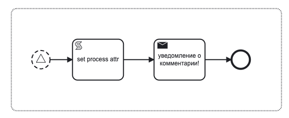
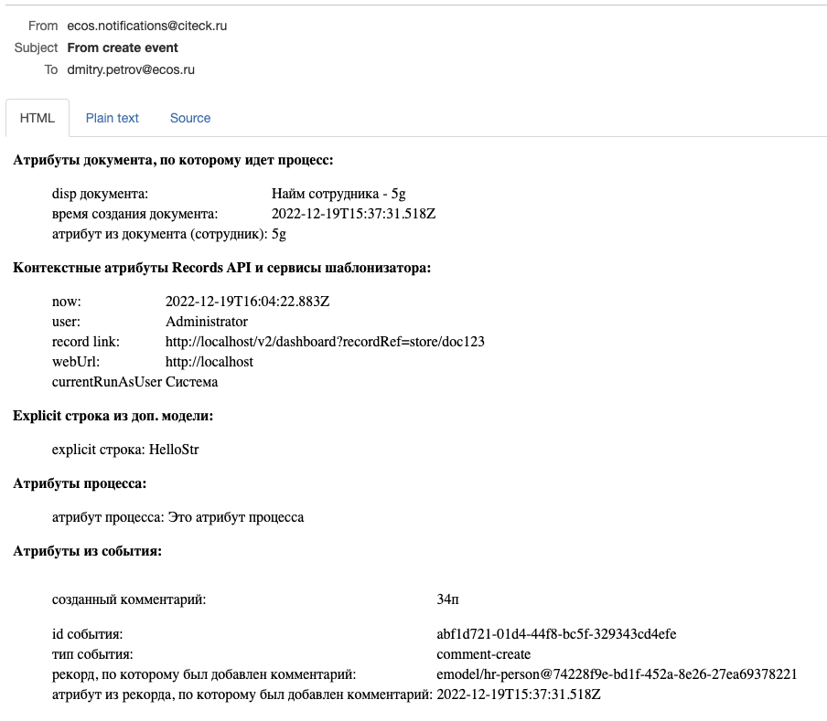

Уведомление
===========
.. _notification:

.. contents::

Общее описание
--------------

Элемент используется для отправки уведомлений пользователям. На данный момент поддерживается только уведомление по электронной почте.

Уведомления отправляются через микросервис ecos-notifications, см. подробнее - :ref:`уведомления<notifications>` и :ref:`шаблоны уведомлений<notification_templates>`.

 .. image:: _static/48.png
       :width: 400
       :align: center

Атрибуты и форма
----------------

.. list-table::
      :widths: 5 5
      :class: tight-table 

      * - Указать **Имя**, выбрать **Тип уведомления**

        - 
               .. image:: _static/49.png
                :width: 300
                :align: center

      * - Можно выбрать :ref:`шаблон уведомления<notification_templates>` или напрямую указать *Заголовок* и *Тело* сообщения напрямую. |br| При прямом использовании Заголовка и Тела возможно указывать только текст, без использования динамических переменных из процесса или документа.

        - 
               .. image:: _static/50.png
                :width: 300
                :align: center

         |

               .. image:: _static/51.png
                :width: 300
                :align: center 

      * - Получатели выбираются из списка ролей, заполненных в :ref:`типе данных<data_types_main>`
        - 
               .. image:: _static/52.png
                :width: 300
                :align: center

      * - **Record уведомления:** |br| Базовый record для заполнения шаблона. Если в этом поле ничего не указано, то берется документ, по которому запущен бизнес процесс. |br| |br|
          **Язык:** |br| Указывается язык шаблона уведомления в формате ``ru``, ``en`` и т.д. Если язык не указан, то берется язык по умолчанию. |br| |br|
          **Дополнительная модель (additional meta):** |br| Описание дополнительной мета информации, где |br| *ключ (string)* - по ключу становится доступна информация в модели шаблона уведомления. |br| *значение (object)* - если в значении передана строка и начинается с префикса ``!str_``, то символы после префикса записываются как строка, иначе строка считается как recordRef.

        - 
               .. image:: _static/53.png
                :width: 300
                :align: center

_notification_variables:

Доступные переменные
--------------------

В модели шаблона уведомлений есть доступ к следующим переменным:

1. *Переменные из базового record*. По умолчанию это документ, по которому идет бизнес-процесс. Обращение происходит напрямую к атрибутам record.
2. *Переменные процесса.* Через переменную ``$process`` доступны переменные процесса на момент отправки уведомления.
3. *Переменные* :ref:`событий Ecos<ecos_bpmn_events>`. Доступны через переменную ``$process.event``.
4. *Контекстные переменные Records API*

Также в самом шаблоне уведомлений доступны :ref:`сервисы шаблонизатора<notification_template_services>`

Пример использования переменных в шаблоне
~~~~~~~~~~~~~~~~~~~~~~~~~~~~~~~~~~~~~~~~~

Для примера используем event sub process, который реагирует на событие добавления нового комментария и отправляет уведомление.

Шаблон уведомления содержит модель:

.. code-block:: yaml

       "model": {
              "documentDisp": ".disp",
              "documentCreated": "_created",
              "documentFio": "fio",
              "now": "$now",
              "user": "$user",
              "processAtt": "$process.someAttr",
              "str": "$str",
              "commentText": "$process.event.text",
              "eventId": "$process.event._meta.id",
              "eventType": "$process.event._meta.type",
              "eventRecord": "$process.event.eventRecord",
              "eventRecordCreated": "$process.event.eventRecordCreated",
              "currentRunAsUser": "$process.currentRunAsUser"
       }

Шаблон уведомления содержит текст:

.. image:: _static/bpmn_notification_example_text.png
    :align: center

В результате получим следующее уведомление:

.. |br| raw:: html

               

