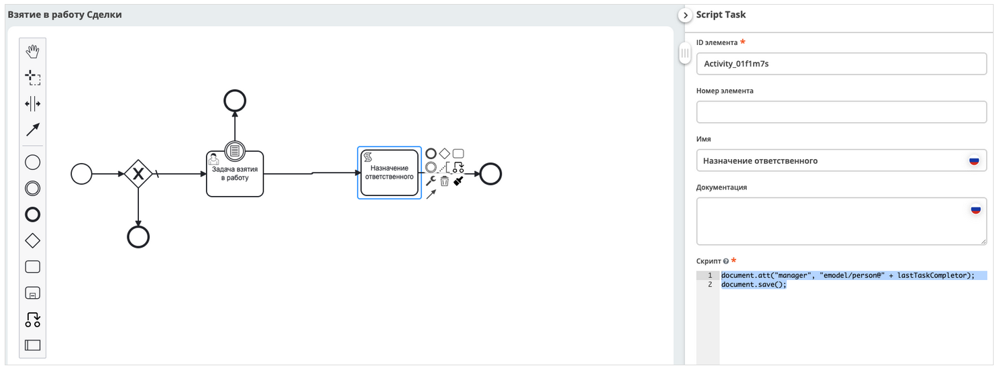

Скриптовая задача
=================

.. _script_task:

.. contents::

Задача, запускающая скрипт (т.е. последовательность действий) или программный код, который выполняется автоматически.

Атрибуты и форма
----------------

Используется язык JavaScript.

 .. image:: _static/script_task/59.png
       :width: 300
       :align: center

.. list-table::
      :widths: 5 5
      :class: tight-table
      :align: center 

      * - Указать **Имя**

        - 
               .. image:: _static/script_task/60.png
                :width: 300
                :align: center
      * - Указать **скрипт** 
        - 
               .. image:: _static/script_task/61.png
                :width: 300
                :align: center
      * - | Настройки асинхронности:
          |  - **Асинхронно "перед"**- исполнение доходит до точки перед блоком, транзакция комитится и дальнейшее выполнение ставится в очередь, которую разбирает уже джоба
          |  - **Асинхронно "после"** - исполнение доходит до точки после блока, транзакция комитится и дальнейшее выполнение ставится в очередь, которую разбирает уже джоба
          | См. подробнее о `асинхронных задачах <https://camunda.com/blog/2014/07/advanced-asynchronous-continuations/>`_  
        - 
               .. image:: _static/script_task/62.png
                :width: 300
                :align: center

.. important::

  При сохранении, сохранении/публикации процесса проверяется обязательность заполнения следующих полей:

   - **«Скрипт»**

  Иначе в :ref:`линтере<bpmn_linter>` будет выдана ошибка.  
  
Доступные переменные
--------------------

Переменные процесса
~~~~~~~~~~~~~~~~~~~

Во время выполнения скриптов доступны все переменные процесса, видимые в текущей области.

.. code-block:: javascript

    // someVar - переменная процесса
    print("someVar: " + someVar);

``documentRef`` - строковое представление entityRef документа |br|
``documentType`` - id типа документа |br|
``lastTaskCompletor`` - username пользователя, который завершил последнюю задачу |br|
``comment`` - комментарий из последней завершенной задачи |br|
``workflowInitiator`` - username инициатора БП |br|

Execution
~~~~~~~~~

.. _execution:

``execution`` - переменная, которая всегда доступна, если скрипт выполняется в области выполнения (например, в Script Task). `(DelegateExecution) <https://docs.camunda.org/javadoc/camunda-bpm-platform/7.17/org/camunda/bpm/engine/delegate/DelegateExecution.html>`_

.. code-block:: javascript

    // Получение переменной процесса
    var sum = execution.getVariable('x');

    // Установление переменной процесса
    execution.setVariable('y', x + 15);

Document
~~~~~~~~

``document`` - является скриптовым представлением документа `AttValueScriptCtx <https://github.com/Citeck/ecos-records/blob/master/ecos-records/src/main/java/ru/citeck/ecos/records3/record/atts/computed/script/AttValueScriptCtx.kt>`_ , по которому идет БП.

.. code-block:: javascript

    // Получение атрибута документа
    var created = document.load("_created");

    // Установление атрибуту документа указанного значения
    document.att("firArchiveBoxNumber", 123);
    // Сохранение
    document.save();

    // Сброс состояния документа, если ранее были внесены изменения через att()
    document.att("firArchiveBoxNumber", 123);
    document.reset();
    

Records
~~~~~~~

``Records`` - это сервис, который предоставляет доступ к функциям работы с рекордами `RecordsScriptService <https://github.com/Citeck/ecos-records/blob/master/ecos-records/src/main/java/ru/citeck/ecos/records3/record/atts/computed/script/RecordsScriptService.kt>`_.

.. code-block:: javascript

    // Получение скриптового представление указанного рекорда
    var doc = Records.get("emodel/doc@111");

    // Query рекордов
    var queryCommentsResult = Records.query({
        sourceId: "emodel/comment",
        language: "predicate",
        query: {
            a: "record",
            t: "eq",
            v: "emodel/doc@123"
        }
    }, {
        text: "text",
        created: "_created"
    });

    var firstComment = queryCommentsResult.records[0];
    var text = firstComment.text;
    var created = firstComment.created;

    print("comment: " + text + " created on " + created);

ECOS Config
~~~~~~~~~~~

``Config`` - предоставляет доступ к Конфигурации Citeck по ключу в формате ``<область>$<идентификатор>``.

    - ``get(key: String): DataValue`` - получение значения по ключу
    - ``getOrDefault(key: String, defaultValue: Any): DataValue`` - получение значения по ключу, если значение не найдено, то возвращается значение по умолчанию
    - ``getNotNull(key: String): DataValue`` - получение значения по ключу, если значение null, то выбрасывается исключение

.. code-block:: javascript

    // Получение значения конфигурации по ключу и приведение к типу String
    var serviceDeskEmailFrom = Config.get("app/service-desk$send-sd-email-from").asText()

DataValue
~~~~~~~~~

``DataValue`` - объект, позволяющий сконвертировать данные в структуру `BpmnDataValue <https://github.com/Citeck/ecos-process/blob/master/src/main/java/ru/citeck/ecos/process/domain/bpmn/engine/camunda/impl/variables/convert/BpmnDataValue.kt>`_ для удобной работы с json представлением, это позволяет безопасно обращаться к полям, получать значения по умолчанию, приводить к нужному типу, сохранять данные в execution и многое другое, подробнее см. методы класса.

    - ``DataValue.of(content: Any?)`` - создает объект DataValue из любого объекта, если объект не может быть сконвертирован в DataValue, то возвращается пустой объект DataValue.
    - ``DataValue.createObj()`` - создает пустой объект DataValue.
    - ``DataValue.createArr()`` - создает пустой массив DataValue.
    - ``DataValue.createStr(value: Any?)`` - создает строковое представление переданного значения.
    
Пример использования:
    
.. code-block:: javascript

    var event = DataValue.of(someExampleEventStructure);

    print("---HELLO FROM SCRIPT---");

    print("event id from base: " + event.get("_meta").get("id"));
    print("event id from $: " + event.get("$._meta.id"));
    print("event id from JsonPointer: " + event.get("/_meta/id"));

    print("event time as instant: " + event.get("/_meta/time").takeAsInstant());
    print("event field names list: " + event.fieldNamesList());

    print("call undefined prop is safe: " + event.get("/_meta/a/b/c/"));

    print("event id is boolean " + event.get("_meta").get("id").isBoolean());

    print("-------END--------------");
    
    
DataValue может быть сохранен в execution процесса с последующим извлечением и использованием.

Сохраняем в execution:

.. code-block:: javascript

    var arr = ["a", "b"];
    var obj = {
      a: "b"
    }
    
    var dArr = DataValue.of(arr);
    var dObj = DataValue.of(obj);
    
    execution.setVariable("dArr", dArr);
    execution.setVariable("dObj", dObj);
    
    
Обращаемся к сохраненным в execution переменным в другом скрипте
    
.. code-block:: javascript

    print("----------");
    
    print("dArr: " + dArr);
    print("dArr 0: " + dArr.get("0"));
    
    print("dObj: " + dObj);
    print("dObj a: " + dObj.get("a"));
    
    print("----------");
    
    
Результат:

.. code-block::

    ----------
    dArr: {"0":"a","1":"b"}
    dArr 0: "a"
    dObj: {"a":"b"}
    dObj a: "b"
    ----------

Time и Duration. Работа с датами и временными интервалами
~~~~~~~~~~~~~~~~~~~~~~~~~~~~~~~~~~~~~~~~~~~~~~~~~~~~~~~~~~~

При работе с датами и временными интервалами рекомендуется использовать объекты ``Time`` и ``Duration``.

``Time`` - объект, упрощающий работу с датами, позволяющий сохранять дату в execution процесса, добавлять к дате календарное/рабочее время на основе рабочего расписания, получать разницу между двумя датами и многое другое. Подробнее см. примеры.

``Duration`` - объект, упрощающий работу с временными интервалами. Поддерживается сохранение в execution процесса.

Примеры использования:

.. code-block:: javascript

    // Получение текущего времени
    let now = Time.now();

    // Получение времени из строки в формате ISO
    let timeFromIsoString = Time.of("2023-02-07T15:00:00.0Z");

    // Получение времени из миллисекунд с начала 1970-01-01T00:00:00Z.
    let timeFromEpochMilli = Time.ofEpochMilli(1644236400000);

    // Получение миллисекунд с начала 1970-01-01T00:00:00Z.
    let timeToEpochMilli = timeFromIsoString.toEpochMilli();

    // Создание объектов Time
    let aprilFirst = Time.of("2023-04-01T00:00:00.0Z");
    let mayFirst = Time.of("2023-05-01T00:00:00.0Z");
    let mayFirst2 = Time.of("2023-05-01T00:00:00.0Z");

    // Сравнение времени
    let isBefore = aprilFirst.isBefore(mayFirst); // true
    let isAfter = aprilFirst.isAfter(mayFirst); // false

    let isBeforeOrEqual = aprilFirst.isBeforeOrEqual(mayFirst); // true
    let isAfterOrEqual = mayFirst.isAfterOrEqual(mayFirst2); // true

    // Создание объектов Time
    let timeFirst = Time.of("2023-04-01T00:00:00.0Z");
    let timeSecond = Time.of("2023-04-01T00:30:00.0Z");

    // Получение разницы между двух точек времени в Duration
    let durationBetween = Time.durationBetween(timeFirst, timeSecond); // PT30M
    let durationAsString = durationBetween.toString(); // "30m"
    let durationAsIsoString = durationBetween.toIsoString(); // "PT30M"

    // Получение разницы между двумя точками времени в минутах
    let durationBetweenMinutes = Time.durationBetween(timeFirst, timeSecond).inWholeMinutes(); // 30
    // etc.

    // Объект Time можно сохранять в execution процесса
    execution.setVariable("time", now);
    // Можно получить объект Time из execution процесса
    let timeFromExecution = execution.getVariable("time");

    // Объект Duration можно сохранять в execution процесса
    execution.setVariable("duration", durationBetween);
    // Можно получить объект Duration из execution процесса
    let durationFromExecution = execution.getVariable("duration");

    let someTime = Time.now();

    // Добавление 1 часа к указанному времени
    let plus1h = Time.plus(someTime, "PT1H");

    // Вычитание 1 часа из указанного времени
    let minus1h = Time.minus(someTime, "PT1H");

    // Добавление 10 минут к текущему времени
    let nowPlus10m = Time.nowPlus("PT10M");

    // Вычитание 10 минут из текущего времени
    let nowMinus10m = Time.nowMinus("PT10M");

    // Добавление 1 часа 30 минут рабочего времени к указанному. Используется рабочее расписание по умолчанию
    let plusWorkingTime1h30m = Time.plusWorkingTime(someTime, "PT1H30M");

    // Добавление 1 часа 30 минут рабочего времени к указанному. Можно указать id рабочего расписания
    let plusWorkingTime1h30mScheduleId = Time.plusWorkingTime(someTime, "PT1H30M", "DEFAULT");

    // Добавление 8 часов рабочего времени к текущему времени. Используется рабочее расписание по умолчанию
    let nowPlusWorkingTime = Time.nowPlusWorkingTime("PT8H");

    // Добавление 8 часов рабочего времени к текущему времени. Можно указать id рабочего расписания
    let nowPlusWorkingTimeWithScheduleId = Time.nowPlusWorkingTime("PT8H", "DEFAULT");

    // Добавление 1 рабочего дня к указанному времени. Используется рабочее расписание по умолчанию
    let plusWorkingDay = Time.plusWorkingDays(someTime, 1);

    // Добавление 1 рабочего дня к указанному времени. Можно указать id рабочего расписания
    let plusWorkingDayWithScheduleId = Time.plusWorkingDays(someTime, 1, "DEFAULT");

    // Добавление 1 рабочего дня к текущему времени. Используется рабочее расписание по умолчанию
    let nowPlusWorkingDay = Time.nowPlusWorkingDays(1);

    // Добавление 1 рабочего дня к текущему времени. Можно указать id рабочего расписания
    let nowPlusWorkingDayWithScheduleId = Time.nowPlusWorkingDays(1, "DEFAULT");

.. warning:: 
    Сохранение объекта javascript Date в execution процесса не поддерживается. Для работы с датами и временными интервалами используйте объекты ``Time`` и ``Duration``.

WebUrl
~~~~~~

``webUrl`` - переменная возвращает настроенный веб url сервера

Tasks
~~~~~

``tasks`` - сервис для манипуляций над задачами.
    
    - ``completeActiveTasks(execution: DelegateExecution)`` - завершает все активные задачи по инстансу процесса из [DelegateExecution.getProcessInstanceId]. Задачи завершаются с результатом *defaultDone: Выполнено*.

Templated content
~~~~~~~~~~~~~~~~~~

``templatedContent`` - сервис для работы с шаблонизированным контентом.

    - ``write(record: String, template: String)`` - генеририрует контент по указанному шаблону [`template`], на основе данных рекорда [`record`] и записывает сгенерированный контент в [`record`] в атрибут контент по умолчанию `content`.
    - ``write(record: String, template: String, attribute: String)`` - генеририрует контент по указанному шаблону `[template`], на основе данных рекорда [`record`] и записывает сгенерированный контент в [`record`] в переданный атрибут [`attribute`].

В качестве [`template`] можно передать строковое представление EntityRef шаблона или его id.

Events
~~~~~~

``events`` - сервис для работы с :ref:`событиями Citeck<ecos_bpmn_events>`.

    - ``send(type: String, data: BpmnDataValue)`` - отправляет событие с указанным типом (именем) и данными.
    
Например, можно отправить Citeck событие через скрипт:

.. code-block:: javascript

    var data = DataValue.of({
      foo: "bar",
      number: 123
    });
     
    events.send("test-topic", data);
     
И подписаться на него в bpmn event через ручную настройку с "test-topic" или программно через слушателя:

.. code-block:: kotlin

    eventsService.addListener<ObjectData> {
      withEventType("test-topic")
      withDataClass(ObjectData::class.java)
      withTransactional(true)
      withAttributes(
        mapOf("foo" to "foo", "itsNum" to "number")
      )
      withAction { event ->
        log.("event received: $event")
      }
    }

Logger
~~~~~~

``log`` -  логгер, пишет в микросервис ecos-process, дополнительно выводится информация о execution. Для настройки уровня логирования используется класс ``ru.citeck.ecos.process.domain.bpmn.engine.camunda.services.beans.ScriptLogger``. |br| Поддерживаемые методы:
    
    - ``log.info(message: String)``
    - ``log.warn(message: String)``
    - ``log.error(message: String)``
    - ``log.debug(message: String)``
    - ``log.trace(message: String)``

.. note:: 

    Читай подробнее о `scripting в Camunda <https://docs.camunda.org/manual/7.14/user-guide/process-engine/scripting/>`_

.. |br| raw:: html

         

Примеры
---------

Скрипт, как в атрибут записать человека, который выполнил предыдущую задачу:
~~~~~~~~~~~~~~~~~~~~~~~~~~~~~~~~~~~~~~~~~~~~~~~~~~~~~~~~~~~~~~~~~~~~~~~~~~~~

.. code-block:: javascript

    document.att("manager", "emodel/person@" + lastTaskCompletor);
    document.save();

Получить локальную часть глобальной ссылки на сущность
~~~~~~~~~~~~~~~~~~~~~~~~~~~~~~~~~~~~~~~~~~~~~~~~~~~~~~

.. code-block:: javascript

    document.load("requestCategory?localId") == "community"

- **requestCategory** - ассоциация

- **?localId** - :ref:`скаляр<Records_API_scalar>` из :ref:`Records API<Records_API>`, который возвращает локальную часть глобальной ссылки на сущность. Например для **emodel/person@someuser** локальная часть - это **"someuser"**

Скрипт для проверки наличия комментариев после завершения задачи:
~~~~~~~~~~~~~~~~~~~~~~~~~~~~~~~~~~~~~~~~~~~~~~~~~~~~~~~~~~~~~~~~~

.. code-block:: javascript

    if (!comment) {
        throw new Error("Комментарий не заполнен");
    }

В эту переменную информация не пишется, если строка пустая.
