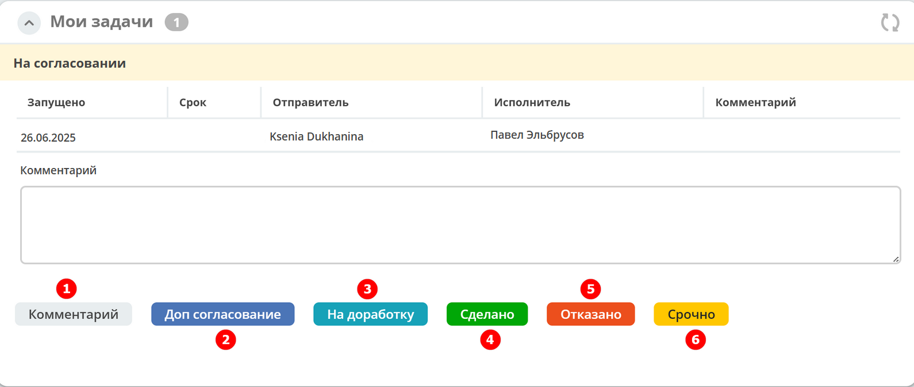

Пользовательская задача
=======================

.. _user_task:

.. contents::
  
Пользовательская задача выполняется пользователем или участником процесса. При выполнении таких задач обычно требуется ввод данных, манипуляции с объектами и т.д.

Атрибуты и форма
----------------

 .. image:: _static/user_task/54.png
       :width: 400
       :align: center

.. list-table::
      :widths: 5 5
      :align: center
      :class: tight-table 

      * - Указать **Имя**.
        - 
               .. image:: _static/user_task/55_0.png
                :width: 300
                :align: center

      * - | Указать **реципиентов** - пользователей - исполнителей задачи.
          | Реципиент может быть выбран из списка ролей или указан вручную.
        
        -

               .. image:: _static/user_task/55_1.png
                :width: 300
                :align: center

      * - | При выборе из списка представлен список ролей, заполненных в :ref:`типе данных<roles_statuses>`:

        -     
               .. image:: _static/user_task/55_2.png
                :width: 300
                :align: center

          |

               .. image:: _static/user_task/55_3.png
                :width: 300
                :align: center
                
      * - | Для ввода вручную необходимо выставить флаг "Ручное назначение"
          | В поле указывается **имя** или **recordRef** реципиента. Поддерживаются expression для получения реципиентов из переменных или сервисов. 
          | Expression может вернуть множественное значение - строки разделенные запятой: user1,user2,user3
          | Например:
          | ``ivan.petrov``
          | ``GROUP_company_accountant``
          | ``emodel/authority-group@company_accountant``
          | ``${someVariable}``
          | ``${someService.getRecipients()},petya.voks``
        - 
               .. image:: _static/user_task/55_4.png
                :width: 300
                :align: center
      * - | **Форма задачи** определяет то, что будет отображено при назначении задачи пользователю.
          | **Форму задачи** можно выбрать из списка, создать.
          | Если форму задачи не указывать - тогда пользователю будут отображены только результаты задачи, указанные в соответствующем поле.
          | :ref:`См. подробно о формах<user_task_form>`
        - 
               .. image:: _static/user_task/56.png
                :width: 300
                :align: center
      
      * - | Указать **срок выполнения** задачи, конкрентную дату.
          | Дата должна быть указана в формате `ISO8601  <https://ru.wikipedia.org/wiki/ISO_8601>`_ 
          | Например: 
          | ``2022-06-26T10:30:00`` - 20 июня 2022 года 10 часов 30 минут 0 секунд
          | или в виде выражения: ``${someDate}``
          | предварительно задав :ref:`переменную execution<execution>` через :ref:`скриптовую задачу<script_task>`
        - 
               .. image:: _static/user_task/56_1.png
                :width: 300
                :align: center

      * - | Выбрать **приоритет** задачи 
        - 
               .. image:: _static/user_task/56_2.png
                :width: 300
                :align: center

      * - | Или указать **приоритет (выражение)** - Expression для получения приоритета задачи из переменных или сервисов. 
          | Выражение должно вернуть число, представляющее собой приоритет: 
          |    - Высокий - 1
          |    - Средний - 2
          |    - Низкий - 3
        - 
               .. image:: _static/user_task/56_2_1.png
                :width: 300
                :align: center

      * - | Указать **результат задачи** (вердикт) – **идентификатор** и **название**.
          | В вердиктах можно настроить темы для кнопки. :ref:`См. подробно о результатах задачи<user_task_result_themes>`
        - 
               .. image:: _static/user_task/56_3.png
                :width: 300
                :align: center

.. note::

  Срок выполнения задачи также можно изменить с помощью **TaskService** или в **TaskListeners** с помощью переданного **DelegateTask**.

.. important::

  При сохранении, сохранении/публикации процесса проверяется обязательность заполнения следующих полей:

   - **«Реципиенты задачи»**;
   - **«Приоритет задачи»**: Приоритет или Приоритет (выражение)

  Иначе в :ref:`линтере<bpmn_linter>` будет выдана ошибка.  

Функционал Lazy approval для задачи
------------------------------------

.. _user_task_lazy_approval:

.. note:: 

  Доступно только в  Enterprise версии. 

  Панель **Согласование по почте** доступна на стендах, где есть лицензия разработчика или лицензия с включенным функционалом lazy approval.

**Lazy approval** – функционал, позволяющий принимать решения из электронной почты, не заходя в Citeck. Например:

.. list-table::
      :widths: 20 20
      :align: center

      * - | Письмо о согласовании:
        - 
            .. image:: _static/user_task/LA_example.png
                  :width: 400
                  :align: center

      * - | В письме выбран вердикт **На доработку**:

        - 
            .. image:: _static/user_task/LA_example_1.png
                  :width: 400
                  :align: center

О предварительных настройках функционала см. :ref:`подробно<lazy_approval_settings>`

Для включения функционала **lazy approval** для определенной задачи необходимо выставить чекбокс **«Согласование по почте»**. 

.. list-table::
      :widths: 5 5
      :align: center
      :class: tight-table 

      * - | Тип уведомления по умолчанию выставлен **Электронная почта**.
          | Выберите **шаблон уведомления** из созданных ранее
        - 
               .. image:: _static/user_task/user_task_LA.png
                :width: 300
                :align: center

      * - | Или выставите чекбокс **Ручной ввод шаблона уведомления**, чтобы воспользоваться другими способами:
          | Выберите **шаблон уведомления** из созданных ранее
          | 1. Можно константно в текстовом формате указать **RecordRef** нужного шаблона.
          | 2. Используя переменную из процесса. Переменную необходимо указывать по следующему синтаксису **${имя_переменной}**. Задать переменную можно ранее в скрипте или иными способами. Пример скрипта в процессе:

            .. code-block::

              execution.setVariable('la_not_templ', "notifications/template@test-la-notification");
        - 
               .. image:: _static/user_task/user_task_LA_1.png
                :width: 300
                :align: center

      * - | Выставите чекбокс **Включить отчеты о выполнении согласований через почту**, чтобы  пользователь получал ответные сообщения об успешно/ неудачно выполненных задачах и выберите шаблоны из созданных ранее. 
          | См. подробно о :ref:`отчеты об обработке сообщений<lazy_approval_reports>`
        - 
               .. image:: _static/user_task/user_task_LA_2.png
                :width: 300
                :align: center

Форма задачи
------------

.. _user_task_form:

.. note::
       
       Если форма задачи не указана, то будут отображаться доступные вердикты задачи, заполненные в поле **Результат задачи**. 

       Результаты задачи версионируются вместе с описанием процесса.

Форму можно создать, нажав **Выбрать - Создать форму**

.. image:: _static/user_task/57.png
       :width: 600
       :align: center

Для добавления кнопок вердиктов задачи на вашу форму, можно воспользоваться компонентом формы **Task Outcome**, который автоматически формирует кнопки вердиктов исходя из настроек **Результатов задачи**.

Вердикты задачи можно добавить вручную для более гибкой настройки конфигурации. Для этого на форму задачи необходимо добавить кнопку, где **«Имя свойства»** задается по шаблону **outcome_идентификаторВердикта**. Например, **outcome_approve**.

 .. image:: _static/user_task/58.png
       :width: 600
       :align: center

Если какие-то задачи могут совпадать, то можно использовать одинаковую форму.

См. подробный пример :ref:`См. создания формы<approve_form_bpmn>`

Использование переменных на форме
~~~~~~~~~~~~~~~~~~~~~~~~~~~~~~~~~~~~

Элементы формы задачи связаны с переменными инстанса (экземпляра) процесса. Если в области видимости задачи/процесса есть переменная с таким же **id** (Имя свойства), как и у элемента формы, то ее содержимое отобразится на форме. 

При сабмите (публикации) формы задачи переменные будут записаны в переменные процесса.

Элементы формы задачи так же могут быть связаны с переменными документа, по которому идет бизнес-процесс. 

Для отображения и обновления переменных документа на форме задачи необходимо добавить элемент с **id** (Имя свойства) с префиксом ``_ECM_``, например ``_ECM_paymentSum``, где ``paymentSum`` - свойства документа.

Темы для кнопок вердикта
--------------------------------

.. _user_task_result_themes:

В вердиктах доступна настройка темы кнопок. Настройка влияет на цвет кнопки по аналогии с кнопками на форме.

 .. image:: _static/user_task/56_4.png
       :width: 500
       :align: center

|

 .. image:: _static/user_task/56_5.png
       :width: 500
       :align: center

Возможные варианты:

 .. image:: _static/user_task/56_6.png
       :width: 500
       :align: center

Примеры:

|

.. list-table::
      :widths: 5 10
      :class: tight-table 
      :align: center

      * - **1**
        - По умолчанию
      * - **2**
        - Основная
      * - **3**
        - Информация
      * - **4**
        - Успешно
      * - **5**
        - Опасно
      * - **6**
        - Предупреждение