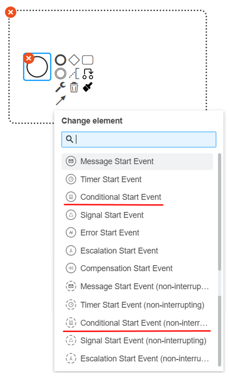
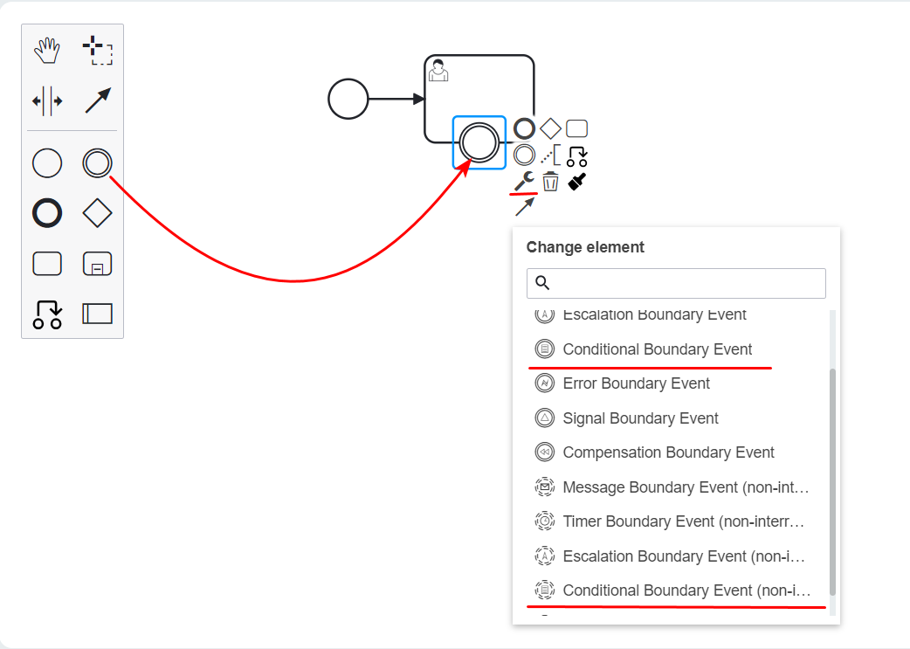
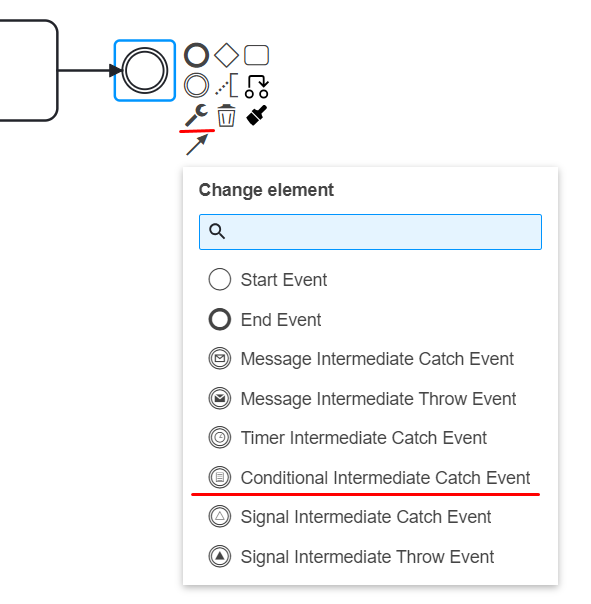
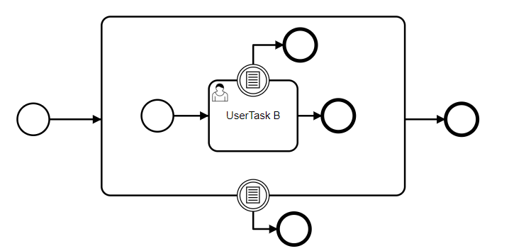
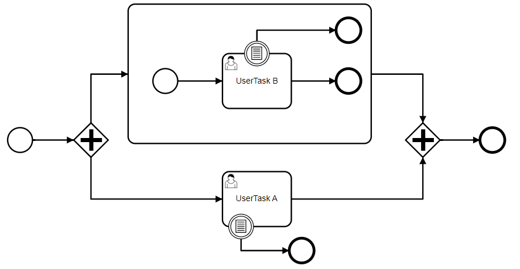
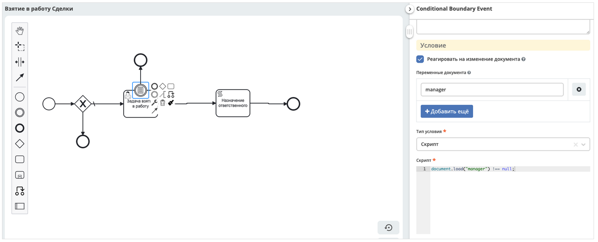

Условие
========

.. _ecos_bpmn_conditional:

**Событие BPMN с типом «Условие» (условное событие)** используется для моделирования реакции бизнес-процесса на изменения условий. 

Событие «Условие» запускает событие при выполнении определенного условия. Как только определенное условие выполнено, процесс продолжается.

Событие «Условие» всегда является обработчиком, т.е. его можно использовать как начальное событие подпроцесса события, как промежуточное событие (intermediate event) и граничное событие (boundary event). 
Начальное и граничное событие могут быть прерывающими (interrupting) и непрерывающими (non-interrupting).

Событие «Условие» нельзя использовать в качестве завершающего события.

События «Условие» запускаются с помощью переменных процесса.

Начальное событие «Условие» для событийного подпроцесса (Conditional Start Event)
-----------------------------------------------------------------------------------

Подобно условным граничным событиям, начальные события «Условие» для подпроцесса события могут быть прерывающими и непрерывающими.

Подпроцесс события должен иметь одно начальное событие.

Граничное событие «Условие» (Conditional Boundary Event)
----------------------------------------------------------

Граничное событие «Условие» действует как наблюдатель, который срабатывает, если выполняется определенное условие. 

Прерывающее событие (interrupting) установлено по умолчанию. 

Непрерывающее событие (non-interrupting) приводит к тому, что исходная активность не прерывается, экземпляр остается активным. Вместо этого создается дополнительный путь исполнения, принимающий исходящий переход события. Непрерывающее событие «Условие» (non-interrupting) может запускаться более одного раза, пока активность, к которой оно прикреплено, активна.

Промежуточное обрабатывающее событие «Условие» (Conditional Intermediate Catch Event)
---------------------------------------------------------------------------------------

Промежуточное событие «Условие» похоже на ожидание, пока условие не станет истинным. Когда выполнение достигает действия перехвата события, условие оценивается в первый раз. Если условие выполнено, процесс выполнения переходит к следующему действию. Если условие не выполняется, выполнение остается в этом действии до тех пор, пока условие не будет выполнено.

Промежуточное событие «Условие» определяется как промежуточное обрабатывающее событие.

Атрибуты
--------

Чтобы указать, когда должно запускаться условное событие, необходимо заполнить раздел **«Условие»**. 
Условие может быть выражением  и иметь доступ к переменным экземпляра процесса. 

Условие оценивается каждый раз, когда изменяется переменная.    

Чтобы предотвратить непрерывную оценку условия, оценку можно ограничить конкретными изменениями. 

По умолчанию оценка условия запускается любым изменением переменной, т. е. созданием/обновлением/удалением любой переменной. Имя переменной можно использовать, чтобы ограничить это изменением конкретной переменной.
Событие переменной может использоваться для ограничения типа изменения. 

.. list-table::
      :widths: 5 5
      :align: center
      :class: tight-table 

      * - **Название события**

        - 
               .. image:: _static/conditional_event_5.png
                :width: 300
                :align: center

      * - | **Реагировать на изменение документа**
          | Если флаг выставлен, то условие будет вычисляться при изменении атрибутов документа, по которому идет бизнес-процесс.
          | **Важно:** Тип документа, по которому идет БП и Тип документа, указанный в процессе должен совпадать.
          | По умолчанию вычисление условия происходит при обновлении любой переменной документа.
          | Рекомендуется указать переменные для ограничения области вычислений.

        - 
               .. image:: _static/conditional_event_13.png
                :width: 300
                :align: center

      * - | **Имя переменной**
          | По умолчанию вычисление условия происходит при обновлении каждой переменной. 
          | Вы можете задать имя переменной для ограничения вычисления только для конкретной переменной.

        - 
               .. image:: _static/conditional_event_6.png
                :width: 300
                :align: center

      * - | **События переменной**
          | Можно использовать для ограничения типа изменений:

                *	Создание
                *	Обновление
                *	Удаление
        - 
               .. image:: _static/conditional_event_7.png
                :width: 300
                :align: center

      * - Тип условия: **Выражение**

        - 
               .. image:: _static/conditional_event_8.png
                :width: 300
                :align: center

      * - Тип условия: **Скрипт**

        - 
               .. image:: _static/conditional_event_9.png
                :width: 300
                :align: center

      * - | Асинхронность можно настроить ко многим элементам. 
          | `См. подробнее <https://camunda.com/blog/2014/07/advanced-asynchronous-continuations/>`_ 

        - 
               .. image:: _static/conditional_event_10.png
                :width: 300
                :align: center

.. important::

  При сохранении, сохранении/публикации процесса проверяется обязательность заполнения следующих полей:

   - **«Тип условия»**: скрипт или выражение. 

  Иначе в :ref:`линтере<bpmn_linter>` будет выдана ошибка. 

Оценка сверху вниз
--------------------

Изменение переменной вызывает оценку условия и запуск события сверху вниз. Это означает, что оценка начинается с условных событий области BPMN, в которой была изменена переменная. Затем он шаг за шагом спускается к экземплярам вложенных областей BPMN (например, встроенных подпроцессов). Это делается до тех пор, пока не будет инициировано условное событие, которое прерывает текущий экземпляр области (тем самым отменяя все дочерние элементы) или пока не останется более глубоких вложенных областей.

Например, см. следующую модель процесса BPMN:

Если переменная установлена в контексте экземпляра подпроцесса, то сначала оценивается граничное событие «Условие» подпроцесса. Если условие выполнено, то выполнение прерывается, в противном случае *UserTask B* оценивается и запускается условное граничное событие, если условие выполнено.

Оценка по объему
-----------------

Изменения переменных в контексте экземпляра области действия могут инициировать только те условные события, которым видна переменная , но не влияют на несвязанные экземпляры области. Это означает, что если переменная изменяется, оцениваются только те условные события, которые прослушиваются в контексте этого экземпляра области или его дочерних элементов.

См. следующую модель процесса BPMN:

Если мы запустили описанный выше процесс и *UserTask B* и *UserTask A* активны, то иерархия экземпляров активности будет следующей:

.. code-block::

    ProcessInstance
        UserTask A
        SubProcess
            UserTask B

Если переменная задана в контексте экземпляра , то оценивается *SubProcess* только событие условной границы . *UserTask B* Граничное событие *UserTask A* не может инициироваться, так как переменная не видна в своем контексте. 

Примеры
--------

Пример использования условного граничного события:

Скрипт:

.. code-block::

      document.load("manager") !== null;