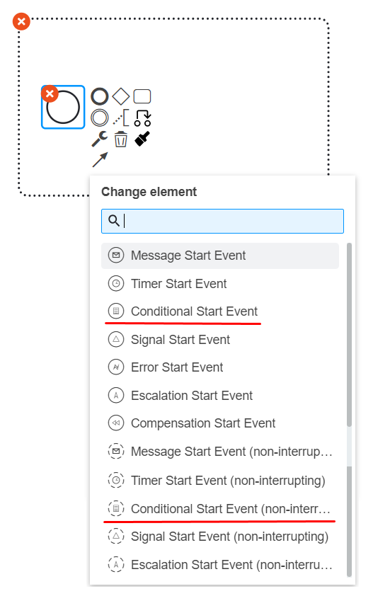
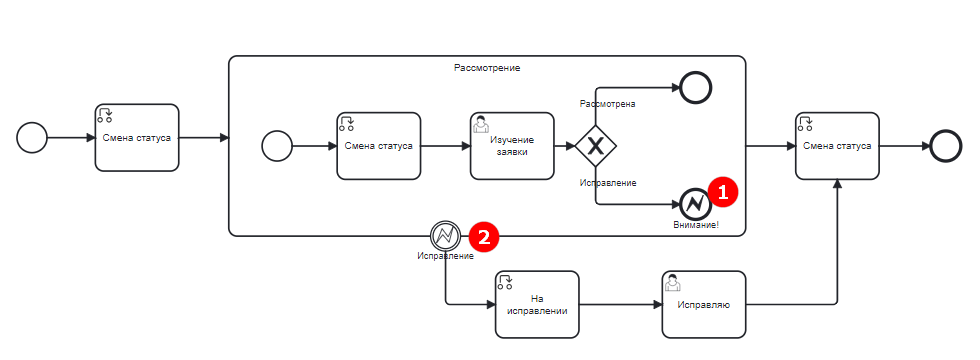
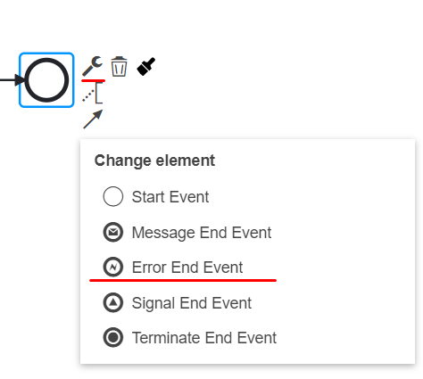
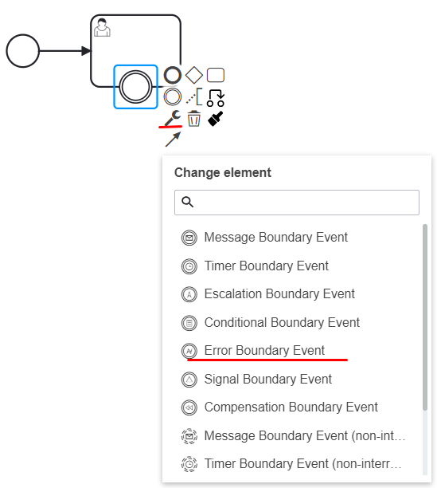

Ошибка
=======

.. _ecos_bpmn_error:

**Событие BPMN с типом «Ошибка»** используется для моделирования возможных ошибок при выполнении процесса, а также для отображения последовательности действий по устранению этих ошибок. \

BPMN не приводит какой-либо классификации возможных ошибок. Бизнес-аналитик сам выбирает какая ошибка может возникнуть в проектируемом процессе. 

**Событие «Ошибка»** может быть стартовым, промежуточным и конечным.

Начальное событие «Ошибка»
---------------------------

**Начальное событие «Ошибка»** используется только для запуска событийного подпроцесса. Событийный подпроцесс, начинающийся с ошибки, всегда прерывает родительский процесс.

Конечное событие «Ошибка»
--------------------------

**Конечное событие «Ошибка»** показывает, что в результате выполнения процесса произошла ошибка.

Когда выполнение процесса достигает события завершения ошибки, текущий путь выполнения завершается и выдается ошибка. 

Эту ошибку можно перехватить с помощью соответствующего промежуточного граничного события с типом "Ошибка" (Boundary Catch Event). В случае, если соответствующее Boundary Catch Event не найдено, семантика выполнения по умолчанию принимает семантику отсутствия конечного события.

На рисунке - **(1)**

Настройка:

.. list-table::
      :widths: 5 5
      :align: center
      :class: tight-table 

      * - **Имя**

        - 
               .. image:: _static/error_event_4_1.png
                :width: 300
                :align: center

      * - **Имя ошибки**

        - 
               .. image:: _static/error_event_4_2.png
                :width: 300
                :align: center

      * - **Код**

        - 
               .. image:: _static/error_event_4_3.png
                :width: 300
                :align: center

      * - **Сообщение**

        - 
               .. image:: _static/error_event_4_4.png
                :width: 300
                :align: center

      * - | Асинхронность можно настроить ко многим элементам. 
          | `См. подробнее <https://camunda.com/blog/2014/07/advanced-asynchronous-continuations/>`_ 

        - 
               .. image:: _static/error_event_4_5.png
                :width: 300
                :align: center

Промежуточное событие «Ошибка»
---------------------------------

**Промежуточное событие «Ошибка»** всегда является граничным-прерывающим. Это означает, что ошибка прерывает выполнение действия, в котором она произошла, и поток операций идет по другому маршруту.

На рисунке - **(2)**

.. list-table::
      :widths: 5 5
      :align: center
      :class: tight-table 

      * - **Название события**
        - 
               .. image:: _static/error_event_6_1.png
                :width: 300
                :align: center

      * - **Имя ошибки**
        - 
               .. image:: _static/error_event_6_2.png
                :width: 300
                :align: center

      * - **Код**
        - 
               .. image:: _static/error_event_6_3.png
                :width: 300
                :align: center

      * - | **Переменная кода**
          | Имя переменной, которая будет содержать код ошибки
        - 
               .. image:: _static/error_event_6_4.png
                :width: 300
                :align: center

      * - | **Переменная ошибки**
          | Имя переменной, в которой будет содержаться сообщение об ошибке
        - 
               .. image:: _static/error_event_6_5.png
                :width: 300
                :align: center

      * - | Асинхронность можно настроить ко многим элементам. 
          | `См. подробнее <https://camunda.com/blog/2014/07/advanced-asynchronous-continuations/>`_ 
        - 
               .. image:: _static/error_event_6_6.png
                :width: 300
                :align: center

Intermediate catching error event перехватывает ошибки, возникающие в рамках действия, для которого оно определено.

Определение error boundary event наиболее целесообразно для встроенного подпроцесса или действия вызова, поскольку подпроцесс создает область действия для всех действий внутри подпроцесса. Ошибки выдаются конечным событием «Ошибка». Такая ошибка будет распространять свои родительские области вверх до тех пор, пока не будет найдена область, в которой определено граничное событие ошибки, соответствующее определению события ошибки.

Когда **событие «Ошибка»** перехвачено,  действие, для которого определено граничное событие (boundary event), завершается, а также завершаются все текущие выполнения в нем (например, параллельные действия, вложенные подпроцессы и т. д.). Выполнение процесса продолжается в соответствии с исходящим потоком последовательности boundary event.
errorCode (код ошибки) используется для сопоставления обнаруженных ошибок:

  •	Если установлена *errorCodeVariable (Переменная кода)*, код ошибки можно получить с помощью этой переменной.
  •	Если установлена переменная *errorMessageVariable (Переменная ошибки)*, сообщение об ошибке можно получить с помощью этой переменной.
