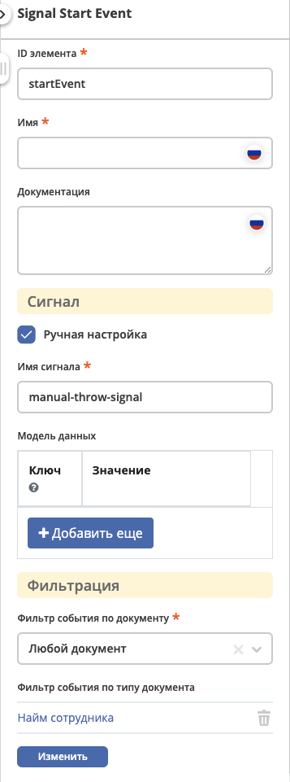

События (Сигналы)
=================

.. contents:: Содеражание

События сигнала — это события, которые ссылаются на именованный сигнал. 
Сигнал — это событие глобального масштаба (broadcast semantics), которое доставляется всем активным обработчикам. 
Throw и Catch сигналов происходит по его имени.

BPMN Сигналы используются для интеграции :ref:`Событий ECOS <bpmn_events_integrations>`

Определение событий (сигналов)
------------------------------

Форма
~~~~~

|br|

Атрибуты
~~~~~~~~

:Ручная настройка: Флаг, который позволяет переключить настройку сигнала в ручной режим - указание имени сигнала, а не выбор из предустановленных типов событий.

:Имя сигнала: Служит для идентификации сигнала. |br| Данное поле становится доступно если включена опция ``Ручная настройка``. Если выбран ``тип события``, то имя генерируется автоматически.

:Модель данных: Каждое событие имеет свою полезную нагрузку (payload). Например, событие ``Статус изменен`` содержит информацию о новом и предыдущем статусе. |br| Модель данных представляет собой ``map``, где ``ключ`` - это имя атрибута, по которому будет доступно вычисленное значение, а ``значение`` - это :ref:`Records API атрибут.<Records API attribute>` |br| Таким образом, модель данных позволяет указать какие данные будут передаваться в сигнале, при этом пользовательская модель данных имеет высший приоритет над :ref:`payload по умолчанию. <ecos_bpmn_signal_event_defaut_payload>` 

:Фильтр события по документу: Позволяет отфильтровать события на основе документа, по которому возникает данное событие. |br| Поле имеет 3 значения: |br| ``Любой документ`` - событие будет происходить для любого документа. |br| ``Текущий документ`` - событие будет происходить только для документа по которому идет бизнес процесс. |br| ``Документ по из переменной процесса`` - событие будет возникать только для документа, который указан в поле ``Имя переменной``.

:Имя переменной: Поле становится доступно, если в ``Фильтр события по документу`` выбрано значение ``Документ из переменной процесса``. |br| В данном поле указывается имя переменной процесса, по которой будет определяться документ, для которого будет возникать событие. |br| Переменная должна содержать EntityRef документа в виде String.

:Фильтр события по предикатам: Используется для фильтрации catch событий. |br| Моделью для вычисления предиката является payload события. B предикатах можно ссылаться на значения переменной из payload через ``{{someAttribute}}``. |br| :ref:`Подробнее о предикатах. <ecos-predicate_main>`

Payload событий
---------------

.. _ecos_bpmn_signal_event_defaut_payload:

.. code-block:: json
    :caption: Пример payload события **Статус изменен**

    {
      "_meta": {
          "id": "0944c87d-7d4a-482f-881a-3b84ec9b740d",
          "type": "record-status-changed",
          "time": 1670576506017,
          "user": "system"
      },
      "record": "emodel/hr-person@7d2455c4-26b5-408a-913c-6affd9eb3a19",
      "recordType": "emodel/type@hr-person",
      "before": "prepare",
      "after": "fill-data"
    }

Payload по умолчанию для всех событий
~~~~~~~~~~~~~~~~~~~~~~~~~~~~~~~~~~~~~~

Каждое событие имеет payload по умолачнию, который содержит:

-  ``_meta`` - мета информация о событии. Содержит:

   -  ``id`` - уникальный идентификатор события (UUID)

   -  ``type`` - тип события (String)

   -  ``time`` - время возникновения события (Instant)

   -  ``user`` - username пользователя, который вызвал событие (String)
- ``record`` - документ по которому произошло событие (EntityRef)
- ``recordType`` - тип документа по которому произошло событие (EntityRef)

.. note:: 
    
   По соглашению, каждое событие должно содержать атрибут ``record`` в виде EntityRef. Если событие не содержит этого поля, то фильтрация по документу не будет работать.

Payload по умолчанию для предопределенных событий
~~~~~~~~~~~~~~~~~~~~~~~~~~~~~~~~~~~~~~~~~~~~~~~~~

Статус изменен
______________

- ``before`` - статус до изменения (StatusValue)
- ``after`` - статус после изменения (StatusValue)

``StatusValue`` содержит следующие поля:

- ``id`` - идентификатор статуса (String)
- ``name`` - имя статуса (MLText)

по умолчанию возращается в виде ``id``.

Комментарий создан
__________________

- ``text`` - текст комментария (String)
- ``commentRecord`` - рекорд созданного комментария (EntityRef)

Комментарий изменен
___________________

- ``textBefore`` - текст комментария до изменения (String)
- ``textAfter`` - текст комментария после изменения (String)
- ``commentRecord`` - рекорд созданного комментария (EntityRef)

Комментарий удален
__________________

- ``text`` - текст удалленого комментария (String)
- ``commentRecord`` - рекорд удаленного комментария (EntityRef)

Использование payload события в Script Task
~~~~~~~~~~~~~~~~~~~~~~~~~~~~~~~~~~~~~~~~~~~

После воникновениия события, его payload доступен в переменной ``event`` в рамках текущей транзакции. Если необходимо сохранить какую-то информацию из payload в execution процесса, то это можно осуществить через обычное сохранение переменных в execution.

Переменная ``event``, это класс-обертка `BpmnDataValue <https://gitlab.citeck.ru/ecos-community/ecos-process/-/blob/develop/src/main/java/ru/citeck/ecos/process/domain/bpmn/engine/camunda/impl/variables/convert/BpmnDataValue.kt>`_, который позволяет удобно работать с json представлением данных - безопасно обращаться к полям, получать значения по умолчанию, приводить к нужному типу и многое другое, подробнее см. методы класса.

Пример использования payload в скрипте:

.. code-block:: javascript

    print("---HELLO FROM SCRIPT---");

    print("event id from base: " + event.get("_meta").get("id"));
    print("event id from $: " + event.get("$._meta.id"));
    print("event id from JsonPointer: " + event.get("/_meta/id"));

    print("event time as instant: " + event.get("/_meta/time").takeAsInstant());
    print("event field names list: " + event.fieldNamesList());

    print("call undefined prop is safe: " + event.get("/_meta/a/b/c/"));

    print("event id is boolean " + event.get("_meta").get("id").isBoolean());

    print("-------END--------------");

Результат выполнения скрипта:

.. code-block:: text

    ---HELLO FROM SCRIPT---
    event id from base: "5cf00981-6da6-414e-a82f-d0320f91f7a4"
    event id from $: "5cf00981-6da6-414e-a82f-d0320f91f7a4"
    event id from JsonPointer: "5cf00981-6da6-414e-a82f-d0320f91f7a4"
    event time as instant: 2022-12-09T14:17:24.027Z
    event field names list: [text, commentRecord, docDisp, myText, myText2, _meta, record, recordType]
    call undefined prop is safe: null
    event id is boolean: false
    -------END--------------

Примеры конфигураций событий
----------------------------

Start Event - старт процесса
~~~~~~~~~~~~~~~~~~~~~~~~~~~~

При измении статуса по любому документу будет запущен процесс, который выполнит скрипт.

.. image:: _static/bpmn_start_event_form_example.png
   :width: 45%

Start Event - старт событийного подпроцесса
~~~~~~~~~~~~~~~~~~~~~~~~~~~~~~~~~~~~~~~~~~~

Каждый раз при создании комментария по текущему документу, пока основной процесс активен, будет запущен подпроцесс, который отправит уведомление.

.. image:: _static/bpmn_start_event_sub_process_example.png
   :width: 45%

Bondary Event - событие с предикатом
~~~~~~~~~~~~~~~~~~~~~~~~~~~~~~~~~~~~

При активной задачи, если был добавлен комментарий, который содержит текст "Галя, отмена!", то задача будет отменена и отправлено уведомление.

.. image:: _static/bpmn_boundary_event_with_predicate_example.png
   :width: 45%
.. image:: _static/bpmn_boundary_event_with_predicate_form_example.png

End Throw Event - ручная настройка и события с фильтрами
~~~~~~~~~~~~~~~~~~~~~~~~~~~~~~~~~~~~~~~~~~~~~~~~~~~~~~~~

При завершении подпроцесса сработает signal end event и будет сформировал сигнал с именем "manual-throw-signal" с фильтрацией - любой документ, тип "Найм сотрудника". При этом запустится событийный подпроцесс, так как он подходит по названию сигнала, документу и типу документа.

.. image:: _static/bpmn_throw_event_with_filters_example.png
  :align: center
  :width: 500

Intermediate Catch Event - событие с пользовательской моделью и предикатом с expression
~~~~~~~~~~~~~~~~~~~~~~~~~~~~~~~~~~~~~~~~~~~~~~~~~~~~~~~~~~~~~~~~~~~~~~~~~~~~~~~~~~~~~~~

Создается задача, в результате которой, пользователь определяет, комментарий с каким текстом нужно удалить, текст комментария сохраняется в переменную документа ``textForDelete``. |br|
После выполнения задачи процесс ожидается события ``Комментарий удален`` по текущему документу и предикатом, который проверяет, что текст удаленного комментария совпадает с текстом переменной ``delText``, которая определена в модели данных и ссылается на атрибут документа.

.. image:: _static/bpmn_intermediate_catch_event_with_model_expression_predicate_example.png
  :align: center
  :width: 800

.. |br| raw:: html

      