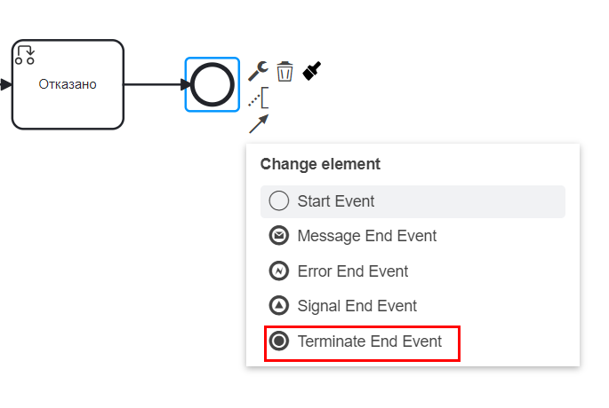
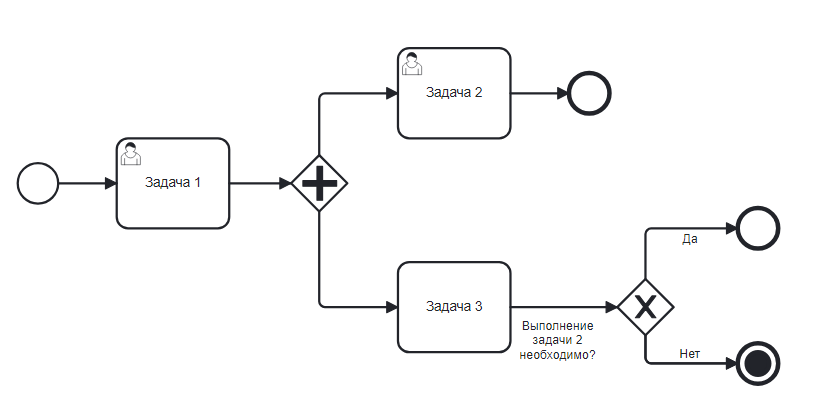

Останов
========

.. _ecos_bpmn_termination:

**Событие «Останов»** вызывает немедленное завершение выполнения процесса, при этом все его активные потоки управления прерываются. 

**Событие «Останов»** может быть только конечным событием (Terminate End Event) в процессе.

Выберите конечное событие и далее:

.. list-table::
      :widths: 5 5
      :align: center
      :class: tight-table 

      * - Указать **Имя**

        - 
               .. image:: _static/terminate_event_2.png
                :width: 300
                :align: center

На уровне процесса **Terminate End Event** завершает процесс по связанным потокам. На уровне подпроцесса завершает подпроцесс и связанные потоки.
