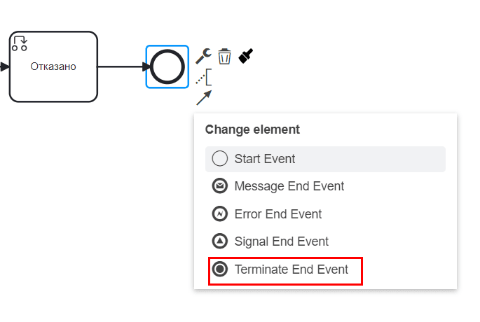
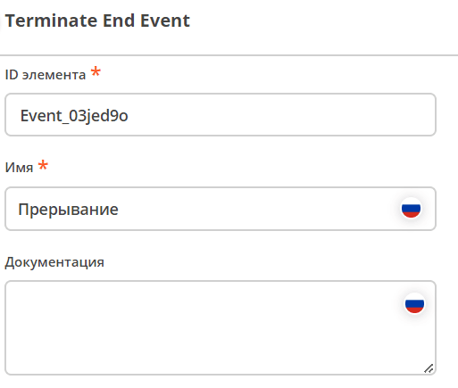
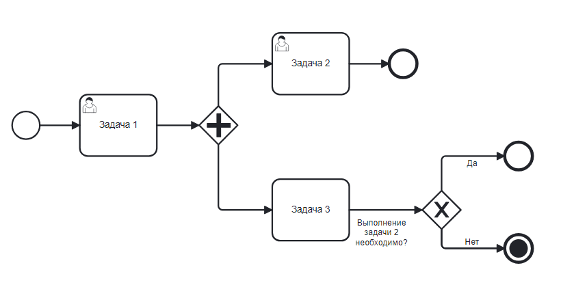

.. _ecos_bpmn_termination:

Прерывающее
===========

.. contents::

**Прерывающее событие** вызывает немедленное завершение выполнения процесса, при этом все его активные потоки управления прерываются.

**Прерывающее событие** может быть только конечным событием (Terminate End Event) в процессе.

Настройка
---------

Чтобы добавить прерывающее событие, выберите конечное событие и в меню замены элемента выберите **Terminate End Event**:

Специфичных настроек у данного типа события нет — форма содержит только стандартные поля (ID элемента, Имя, Документация):

Поведение
---------

На уровне процесса **Terminate End Event** завершает процесс по связанным потокам. На уровне подпроцесса завершает подпроцесс и связанные потоки.

Пример
------

После выполнения «Задача 1» процесс разделяется на два параллельных потока — «Задача 2» и «Задача 3». Если после «Задачи 3» проверка «Выполнение задачи 2 необходимо?» дает ответ «Нет», процесс завершается через прерывающее событие, не дожидаясь завершения потока с «Задачей 2»:

