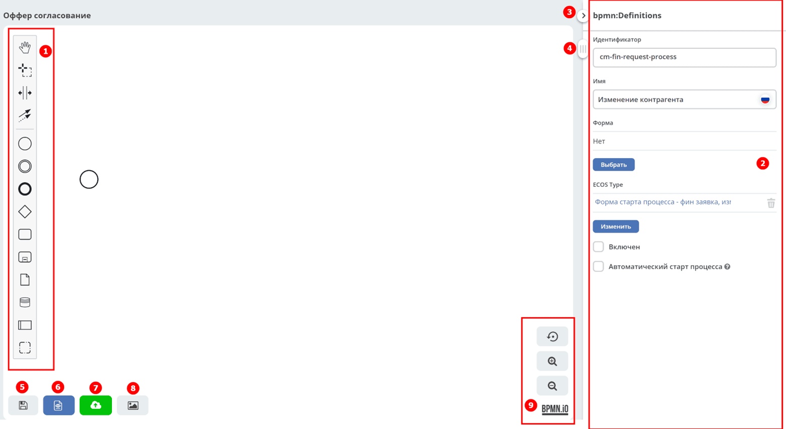
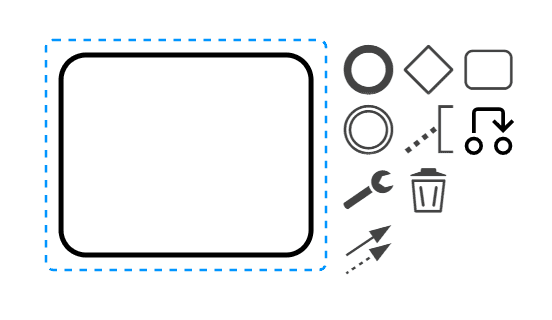
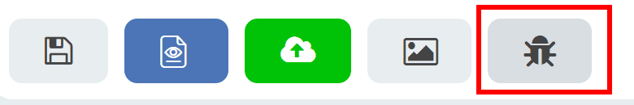
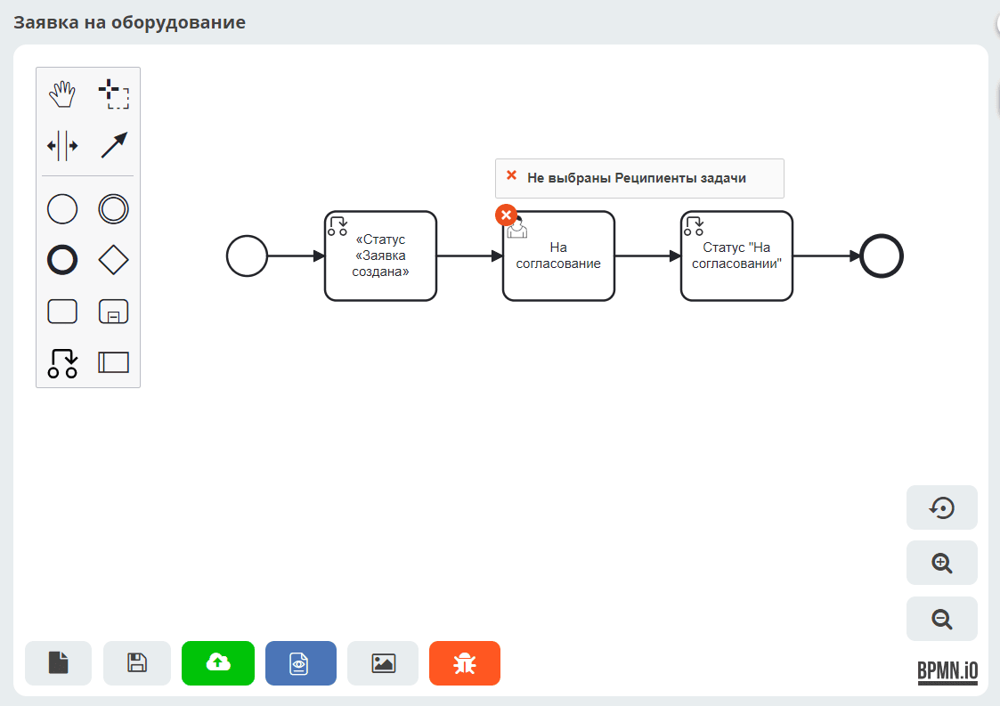
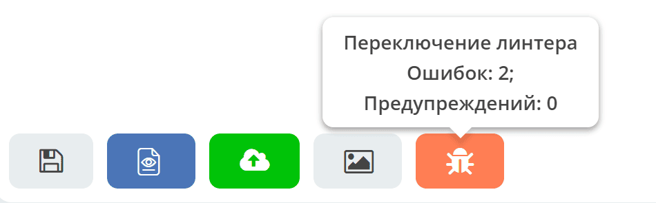

.. _editor_bpmn:

Конструктор бизнес-процесса
==========================================================

.. contents::

**Конструктор бизнес-процесса** — графический редактор для моделирования процессов в нотации BPMN 2.0. Он позволяет создавать схемы бизнес-процессов, настраивать свойства элементов, проверять корректность схемы и публиковать процесс в движок для исполнения.

Элементы конструктора
--------------------------------------------

1.	Панель элементов
2.	Панель свойств элемента — задаются свойства либо самой схемы, либо выделенного элемента.
3.	Свернуть панель свойств элемента
4.	Ползунок для перемещения рабочего пространства
5.	Сохранить черновик процесса
6.	Сохранить процесс
7.	Сохранить и опубликовать процесс в движок
8.	Посмотреть данные процесса в XML
9.	Сохранить процесс в виде изображения в формате svg
10. Автоматическое выравнивание схемы по центру рабочего пространства
11. Включение/выключение отображения ошибок
12. Кнопки работы с масштабом

Состав панели элементов
--------------------------------------------

.. grid:: 1
   :gutter: 2

   .. grid-item-card:: Activate the hand tool
      :class-header: sd-font-weight-bold

      .. image:: _static/12.png
         :width: 30
         :align: left

      Используется для перемещения схемы вверх-вниз, вправо-влево, удерживая ее левой кнопкой мыши.

   .. grid-item-card:: Activate the lasso tool
      :class-header: sd-font-weight-bold

      .. image:: _static/13.png
         :width: 30
         :align: left

      Используется для выделения области схемы — позволяет выделить несколько элементов схемы, удерживая левую кнопку мыши. Выделяются все элементы, попавшие в выделяемую область.

   .. grid-item-card:: Activate the create/remove space tool
      :class-header: sd-font-weight-bold

      .. image:: _static/14.png
         :width: 30
         :align: left

      Позволяет «раздвинуть» или «сжать» схему: указатель мыши ставится на то место на схеме, где нужно «раздвинуть» или «сжать» схему, и, удерживая левую кнопку мыши, указателем нужно переместить часть схемы в нужное место.

   .. grid-item-card:: Activate the global connect tool
      :class-header: sd-font-weight-bold

      .. image:: _static/15.png
         :width: 30
         :align: left

      Соединяющие элементы: поток управления (сплошная линия) и поток сообщений (прерывистая линия).

Элементы потока управления
----------------------------------------------------

.. grid:: 1
   :gutter: 2

   .. grid-item-card:: Create StartEvent
      :class-header: sd-font-weight-bold

      .. image:: _static/16.png
         :width: 30
         :align: left

      Начальное :ref:`событие <bpmn_events>`.

   .. grid-item-card:: Create Intermediate/Boundary Event
      :class-header: sd-font-weight-bold

      .. image:: _static/17.png
         :width: 30
         :align: left

      Промежуточное :ref:`событие <bpmn_events>`.

   .. grid-item-card:: Create EndEvent
      :class-header: sd-font-weight-bold

      .. image:: _static/18.png
         :width: 30
         :align: left

      Завершающее :ref:`событие <bpmn_events>`.

   .. grid-item-card:: Create Gateway
      :class-header: sd-font-weight-bold

      .. image:: _static/19.png
         :width: 30
         :align: left

      Развилка или :ref:`шлюз <gateways>`, логический оператор.

   .. grid-item-card:: Create Task
      :class-header: sd-font-weight-bold

      .. image:: _static/20.png
         :width: 30
         :align: left

      Задача.

   .. grid-item-card:: Create expanded SubProcess
      :class-header: sd-font-weight-bold

      .. image:: _static/21.png
         :width: 30
         :align: left

      Несколько задач, выделенные в :ref:`отдельную подзадачу <sub_process>`.

   .. grid-item-card:: Create Set document status
      :class-header: sd-font-weight-bold

      .. image:: _static/89.png
         :width: 30
         :align: left

      :ref:`Изменение значения статуса элемента бизнес-процесса <set_status>`.

   .. grid-item-card:: AI Task
      :class-header: sd-font-weight-bold

      .. image:: _static/93.png
         :width: 30
         :align: left

      Задача, которая отвечает за вызов :ref:`AI <ai_task>` по указанному промпту.

   .. grid-item-card:: Create Pool/Participant
      :class-header: sd-font-weight-bold

      .. image:: _static/24.png
         :width: 30
         :align: left

      :ref:`Пул <pool>`, используется для разграничения ответственности между задачами, организациями, пользователями. Пулы взаимодействуют между собой только потоками сообщений.

Любой бизнес-процесс начинается с начального события и заканчивается конечным событием. См. подробно :ref:`Компоненты Citeck BPMN <ecos_bpmn_components>`.

Вы создаете схему БП, выбирая на Панели элементов нужные вам элементы и соединяете их потоками управления. Выделив любой элемент схемы, справа от него появляется панель кнопок:

На панели рядом с элементом расположены следующие кнопки:

.. grid:: 1
   :gutter: 2

   .. grid-item-card:: Создать следующий элемент
      :class-header: sd-font-weight-bold

      .. image:: _static/27.png
         :width: 70
         :align: left

      Создать следующий элемент схемы, связанный с выделенным потоком управления.

   .. grid-item-card:: Добавить аннотацию
      :class-header: sd-font-weight-bold

      .. image:: _static/28.png
         :width: 30
         :align: left

      Добавить текст аннотации к элементу.

   .. grid-item-card:: Изменить статус
      :class-header: sd-font-weight-bold

      .. image:: _static/89.png
         :width: 30
         :align: left

      :ref:`Изменить значение статуса <set_status>` элемента бизнес-процесса.

   .. grid-item-card:: AI задача
      :class-header: sd-font-weight-bold

      .. image:: _static/93.png
         :width: 30
         :align: left

      :ref:`AI задача <ai_task>`.

   .. grid-item-card:: Изменить тип элемента
      :class-header: sd-font-weight-bold

      .. image:: _static/29.png
         :width: 30
         :align: left

      Нажать для изменения типа элемента и далее выбрать соответствующий тип.

   .. grid-item-card:: Удалить элемент
      :class-header: sd-font-weight-bold

      .. image:: _static/30.png
         :width: 30
         :align: left

      Удалить элемент.

   .. grid-item-card:: Изменить цвет элемента
      :class-header: sd-font-weight-bold

      .. image:: _static/91.png
         :width: 30
         :align: left

      Изменить цвет элемента.

   .. grid-item-card:: Связать с другим элементом
      :class-header: sd-font-weight-bold

      .. image:: _static/31.png
         :width: 30
         :align: left

      Связать элемент с любым другим на схеме.

.. _bpmn_linter:

Отображение ошибок на схеме бизнес-процесса
----------------------------------------------------------------------------------------

Для информирования о наличии ошибки в схеме бизнес-процесса реализован режим отображения ошибок (линтер). Используется плагин `bpmnlint <https://github.com/bpmn-io/bpmnlint>`_.

Режим включается/отключается по кнопке:

При наведении мышки на пиктограмму ошибки/предупреждения показывается текст ошибки/предупреждения:

Суммарное количество ошибок и предупреждений для процесса показывается при наведении мышки на кнопку линтера:

.. important::

    Процесс с выявленными предупреждениями может быть сохранен и опубликован. Предупреждения основаны на использовании лучших практик.

Ошибки при моделировании процесса
------------------------------------------------------------------

.. note::

    Возможные ошибки элементов процесса описаны в соответствующих разделах.

.. list-table::
      :widths: 10 5 20
      :align: center
      :header-rows: 1
      :class: tight-table

      * - Название
        - Тип
        - Описание

      * - **Элемент не подключен**
        - :bdg-danger:`Ошибка`
        - | Проверяет, связан ли элемент с другими элементами процесса через входящие или исходящие потоки управления.
          | Пример использования правила:

               .. grid:: 2
                  :gutter: 2

                  .. grid-item::

                     Неправильно:

                     .. image:: _static/errors/Linter_err_01.png
                        :width: 250
                        :align: center

                  .. grid-item::

                     Правильно:

                     .. image:: _static/errors/Linter_err_02.png
                        :width: 250
                        :align: center
      * - **Процесс/подпроцесс имеет несколько пустых начальных событий**
        - :bdg-danger:`Ошибка`
        - | Проверяет наличие только одного пустого стартового события для каждого процесса (или подпроцесса).
          | Пример использования правила:

               .. grid:: 2
                  :gutter: 2

                  .. grid-item::

                     Неправильно:

                     .. image:: _static/errors/Linter_err_03.png
                        :width: 250
                        :align: center

                  .. grid-item::

                     Правильно:

                     .. image:: _static/errors/Linter_err_04.png
                        :width: 250
                        :align: center
      * - **Входящие потоки не объединяются**
        - :bdg-warning:`Предупреждение`
        - | Пользователи должны смоделировать параллельный шлюз для достижения желаемого поведения.
          | Пример использования правила:

               .. grid:: 2
                  :gutter: 2

                  .. grid-item::

                     Неправильно:

                     .. image:: _static/errors/Linter_err_05.png
                        :width: 250
                        :align: center

                  .. grid-item::

                     Правильно:

                     .. image:: _static/errors/Linter_err_06.png
                        :width: 250
                        :align: center
      * - **Gateway излишний, т.к. имеет только один ввод и вывод**
        - :bdg-warning:`Предупреждение`
        - | Правило, проверяющее, имеет ли шлюз только один ввод и вывод. Такие шлюзы лишние, поскольку не несут никакой функциональности.
          | Пример использования правила:

               .. grid:: 2
                  :gutter: 2

                  .. grid-item::

                     Неправильно:

                     .. image:: _static/errors/Linter_err_07.png
                        :width: 250
                        :align: center

                  .. grid-item::

                     Правильно:

                     .. image:: _static/errors/Linter_err_08.png
                        :width: 250
                        :align: center
      * - **В процессе/подпроцессе отсутствует начальное событие**
        - :bdg-danger:`Ошибка`
        - | Проверяет наличие простого начального события в процессе или подпроцессе (не событийном).
          | Пример использования правила:

               .. grid:: 2
                  :gutter: 2

                  .. grid-item::

                     Неправильно:

                     .. image:: _static/errors/Linter_err_19.png
                        :width: 250
                        :align: center

                  .. grid-item::

                     Правильно:

                     .. image:: _static/errors/Linter_err_20.png
                        :width: 250
                        :align: center
      * - **В процессе/подпроцессе отсутствует конечное событие**
        - :bdg-danger:`Ошибка`
        - | У каждого процесса и подпроцесса должно быть конечное событие.
          | Пример использования правила:

               .. grid:: 2
                  :gutter: 2

                  .. grid-item::

                     Неправильно:

                     .. image:: _static/errors/Linter_err_09.png
                        :width: 250
                        :align: center

                  .. grid-item::

                     Правильно:

                     .. image:: _static/errors/Linter_err_10.png
                        :width: 250
                        :align: center
      * - **SequenceFlow: является дубликатом**
        - :bdg-danger:`Ошибка`
        - | Проверяет, что потоки управления не дублируются. Дублирование потоков управления приводит к непреднамеренному разветвлению.
          | Пример использования правила:

               .. grid:: 2
                  :gutter: 2

                  .. grid-item::

                     Неправильно:

                     .. image:: _static/errors/Linter_err_11.png
                        :width: 250
                        :align: center

                  .. grid-item::

                     Правильно:

                     .. image:: _static/errors/Linter_err_12.png
                        :width: 250
                        :align: center
      * - **SequenceFlow: дублирование входящих/исходящих потоков**
        - :bdg-danger:`Ошибка`
        - | Проверяет, что потоки управления не дублируются. Дублирование входящих/исходящих потоков управления приводит к непреднамеренному разветвлению.
          | Пример использования правила:

               .. grid:: 2
                  :gutter: 2

                  .. grid-item::

                     Неправильно:

                     .. image:: _static/errors/Linter_err_28.png
                        :width: 250
                        :align: center

                  .. grid-item::

                     Правильно:

                     .. image:: _static/errors/Linter_err_29.png
                        :width: 250
                        :align: center
      * - **Разветвления и соединения шлюза**
        - :bdg-danger:`Ошибка`
        - | Правило, которое проверяет, одновременно ли разветвляется и соединяется шлюз.
          | Пример использования правила:

               .. grid:: 2
                  :gutter: 2

                  .. grid-item::

                     Неправильно:

                     .. image:: _static/errors/Linter_err_13.png
                        :width: 250
                        :align: center

                  .. grid-item::

                     Правильно:

                     .. image:: _static/errors/Linter_err_14.png
                        :width: 250
                        :align: center
      * - **Поток разделяется неявно**
        - :bdg-danger:`Ошибка`
        - | Проверяет, не моделируется ли неявное разделение после задачи. Вместо этого пользователям следует явно смоделировать параллельный шлюз.
          | Пример использования правила:

               .. grid:: 2
                  :gutter: 2

                  .. grid-item::

                     Неправильно:

                     .. image:: _static/errors/Linter_err_15.png
                        :width: 250
                        :align: center

                  .. grid-item::

                     Правильно:

                     .. image:: _static/errors/Linter_err_16.png
                        :width: 250
                        :align: center
      * - **Условие не применимо без Exclusive Gateway или Inclusive Gateway**
        - :bdg-danger:`Ошибка`
        - | Проверяет, если у потока управления без Exclusive Gateway или Inclusive Gateway задан тип условия.

               .. image:: _static/errors/Linter_err_32.png
                :width: 300
                :align: center

      * - **Последовательность операций: отсутствует условие**
        - :bdg-danger:`Ошибка`
        - | Проверяет наличие типа условия у потока управления, выходящего из Exclusive Gateway или Inclusive Gateway.

               .. image:: _static/errors/Linter_err_30.png
                :width: 300
                :align: center

          | См. подробно :ref:`типы условия <sequential flow_type>`.

      * - **Поток без условия рекомендуется помечать как Default**
        - :bdg-warning:`Предупреждение`
        - | Проверяет, если несколько потоков управления выходят из exclusive и inclusive gateways, и у одного из потоков **Тип условия = Нет**, то такой поток нужно помечать как **default**.

               .. image:: _static/errors/Linter_err_31.png
                :width: 300
                :align: center

          | См. как изменить :ref:`тип потока управления <sequential flow_change>`.

      * - **В стартовом событии отсутствует определение события**
        - :bdg-danger:`Ошибка`
        - | Стартовые события внутри событийных подпроцессов должны быть типизированы (иметь определение события), что требует стандарт BPMN 2.0.
          | Пример использования правила:

               .. grid:: 2
                  :gutter: 2

                  .. grid-item::

                     Неправильно:

                     .. image:: _static/errors/Linter_err_17.png
                        :width: 250
                        :align: center

                  .. grid-item::

                     Правильно:

                     .. image:: _static/errors/Linter_err_18.png
                        :width: 250
                        :align: center
      * - **Стартовое событие должно быть пустым**
        - :bdg-danger:`Ошибка`
        - | Проверяет, что начальное (стартовое) событие внутри обычного подпроцесса пусто (не имеют определения события).
          | Пример использования правила:

               .. grid:: 2
                  :gutter: 2

                  .. grid-item::

                     Неправильно:

                     .. image:: _static/errors/Linter_err_33.png
                        :width: 250
                        :align: center

                  .. grid-item::

                     Правильно:

                     .. image:: _static/errors/Linter_err_34.png
                        :width: 250
                        :align: center

      * - **Отсутствует элемент bpmndi**
        - :bdg-danger:`Ошибка`
        - | Проверяется отсутствие информации BPMNDI для элементов BPMN, которые должны иметь визуальное представление.
          | На каждый элемент BPMN (который требует визуального представления) ссылается элемент BPMNDI, который определяет, как визуально отображать соответствующий элемент.
          | Может случиться так, что пользователь случайно удалит такой элемент BPMNDI (например, непосредственно работая с XML). Это может привести к ошибкам, так как элемент BPMN по-прежнему интерпретировался бы при выполнении процесса, но больше не был бы виден в средствах графического моделирования.
          | Пример ошибки:

               .. image:: _static/errors/Linter_err_27.png
                :width: 250
                :align: center
