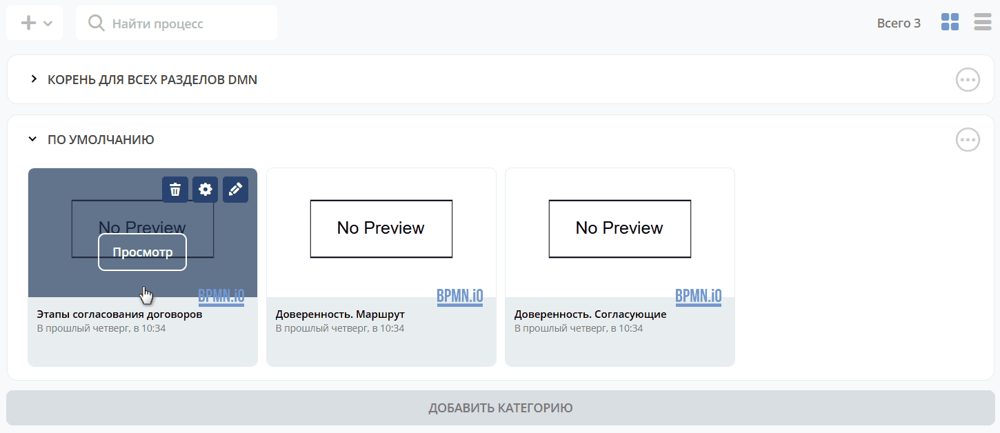
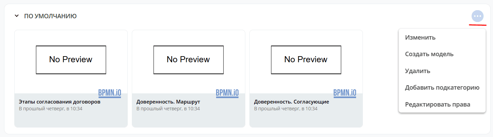
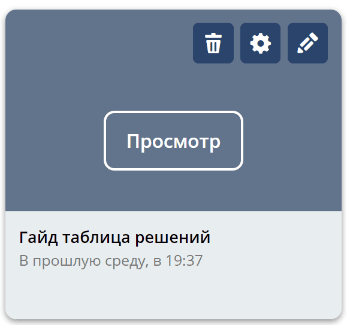
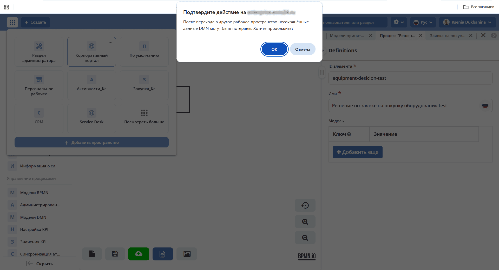
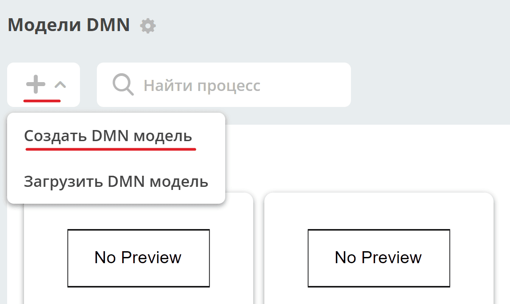
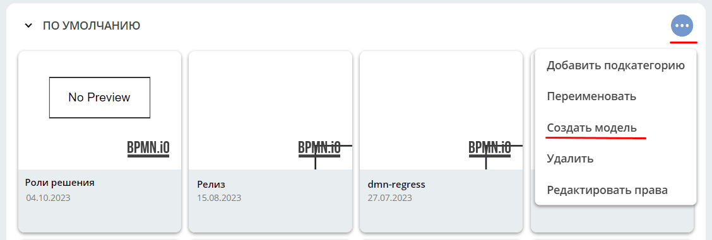
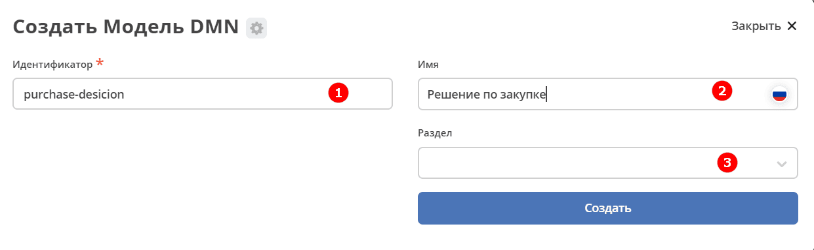
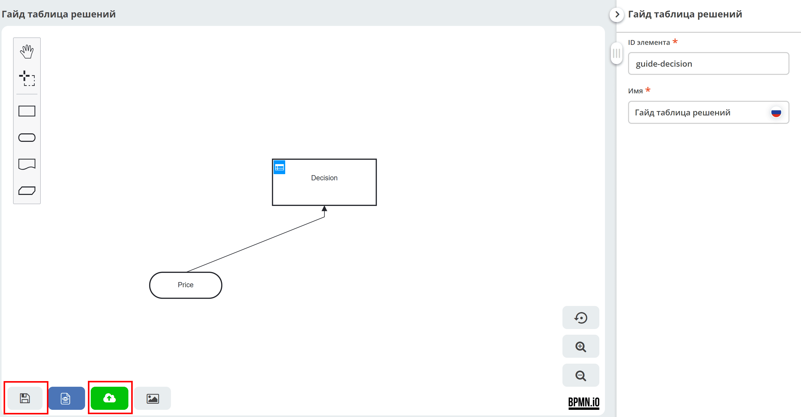

.. _new_dmn:

Базовые операции
================

.. contents::

В данном разделе описаны базовые операции с моделями принятия решений в Citeck DMN: просмотр списка моделей, управление разделами, создание, редактирование, сохранение и публикация решений.

Список процессов
----------------

Процессы сгруппированы по разделам и могут быть представлены в виде **плиток** или **списка**:

.. grid:: 2
   :gutter: 2

   .. grid-item::

      Представление в виде плиток:

      .. image:: _static/dmn_06_1.png
         :width: 500
         :align: left

   .. grid-item::

      Представление в виде списка:

      .. image:: _static/dmn_06_2.png
         :width: 500
         :align: left

Для просмотра или редактирования модели решения наведите курсор мыши на плитку:

Действия с разделами
~~~~~~~~~~~~~~~~~~~~~~

Для разделов доступны следующие действия:

.. grid:: 1
   :gutter: 2

   .. grid-item-card:: Добавить подкатегорию
      :class-header: sd-font-weight-bold

      Создание подкатегории в текущем разделе:

      .. image:: _static/category_actions_1.png
         :width: 500
         :align: left

   .. grid-item-card:: Изменить
      :class-header: sd-font-weight-bold

      Переименовать категорию:

      .. image:: _static/category_actions_2.png
         :width: 500
         :align: left

   .. grid-item-card:: Создать модель
      :class-header: sd-font-weight-bold

      :ref:`Создание нового решения <new_dmn_decision>`.

   .. grid-item-card:: Удалить
      :class-header: sd-font-weight-bold

      Удалить категорию:

      .. image:: _static/category_actions_3.png
         :width: 300
         :align: left

   .. grid-item-card:: Редактировать права
      :class-header: sd-font-weight-bold

      :ref:`Редактирование прав на раздел <dmn_permissions>`.

Карточка модели решения
------------------------

Для созданной модели решения доступны следующие опции:

.. grid:: 1
   :gutter: 2

   .. grid-item-card:: Просмотр
      :class-header: sd-font-weight-bold

      Карточка решения с виджетами.

   .. grid-item-card:: Редактировать карточку решения
      :class-header: sd-font-weight-bold

      .. image:: _static/dmn_09.png
         :width: 600
         :align: left

   .. grid-item-card:: Редактировать модель принятия решения
      :class-header: sd-font-weight-bold

      .. image:: _static/dmn_10.png
         :width: 600
         :align: left

Если при редактировании DMN-решения вы переходите в другое рабочее пространство, необходимо подтвердить действие:

.. _new_dmn_decision:

Создание решения
-----------------

Для создания нового решения DMN перейдите в журнал **"Модели DMN" (Рабочее пространство "Раздел администратора" - Управление процессами)**:

Или в разделе выберите действие:

Откроется форма создания карточки:

.. list-table::
      :widths: 20 30
      :header-rows: 1
      :align: center
      :class: tight-table

      * - Наименование
        - Описание
      * - **Идентификатор**
        - Уникальный идентификатор модели.
      * - **Имя**
        - Наименование создаваемой модели принятия решений.
      * - **Раздел**
        - Наименование раздела, в котором будет сохранена модель. Если не заполнять, сохранение происходит в раздел «По умолчанию».

Сохранение и публикация
-----------------------

Модель можно:

.. tab-set::

      .. tab-item:: Сохранить как черновик

         Без проверки валидности (наличия логических ошибок) и конвертации в Citeck формат.

      .. tab-item:: Сохранить

         С проверкой валидности (наличия логических ошибок) и конвертацией в Citeck формат.

      .. tab-item:: Сохранить и опубликовать

         С проверкой валидности (наличия логических ошибок), конвертацией в Citeck формат, публикацией, чтобы решение стало исполняемым.
