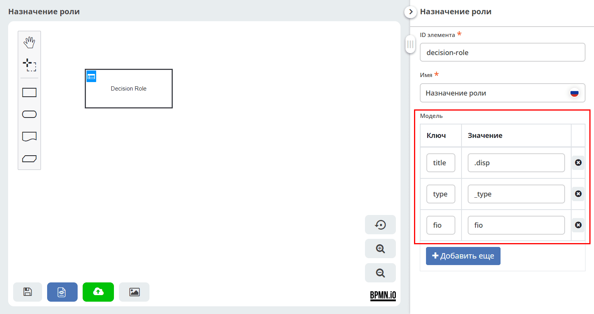
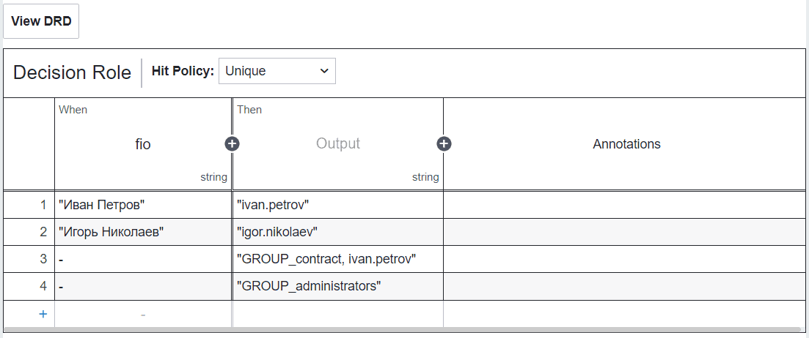
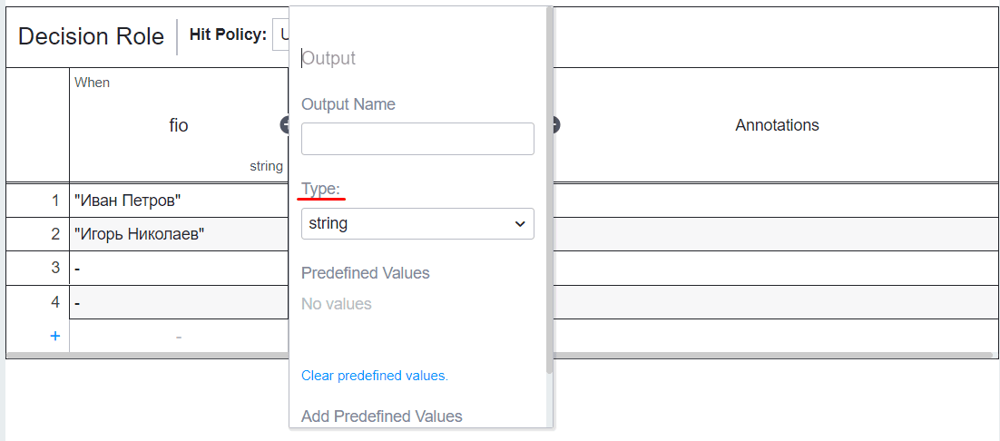

.. _dmn_decision_data:

Входные и выходные данные решения
=========================================================

Одно и то же решение DMN может вызываться из разных мест платформы, и от вызывающей стороны зависит и то, откуда решение получает входные переменные, и то, каким должен быть его результат.

.. list-table::
      :widths: 20 25 20
      :header-rows: 1
      :align: center
      :class: tight-table

      * - Кто вызывает решение
        - Откуда берутся входные переменные
        - Какая версия решения используется
      * - :ref:`Задача бизнес-правило <business_rule_task>` в процессе BPMN
        - Переменные процесса
        - Определяется настройкой **«Связь»** в задаче
      * - :ref:`Динамическая роль <dmn_role>` типа данных
        - Свойство схемы **«Модель»**
        - Всегда последняя опубликованная
      * - :ref:`Условие применения KPI <bpmn_kpi>`
        - Свойство схемы **«Модель»**
        - Всегда последняя опубликованная

.. important::

   Это два независимых механизма: свойство **«Модель»** не участвует в вызове из задачи бизнес-правило, а переменные процесса недоступны при вычислении динамической роли и условия KPI.

   Поэтому решение, написанное под вызов из процесса, нельзя без переделки назначить на роль, и наоборот.

Переменные процесса (вызов из BPMN)
--------------------------------------

При вызове из :ref:`задачи бизнес-правило <business_rule_task>` решение выполняется в контексте процесса, и ему доступны переменные этого процесса — в том числе ``documentRef``.

В качестве :ref:`Expression <input_variable>` входного элемента указывается имя переменной процесса. Если нужного значения в переменных нет, его либо кладут туда заранее (например, :ref:`script task <script_task>`), либо получают прямо в выражении на языке **juel**:

.. code-block::

   Records.get(documentRef).load("color")

Подробнее — в описании :ref:`задачи бизнес-правило <business_rule_task>`.

.. _dmn_model:

Модель (вызов вне процесса)
--------------------------------------

Динамическая роль и условие применения KPI вычисляются вне бизнес-процесса: роль пересчитывается при проверке прав, назначении задач и отправке уведомлений, то есть тогда, когда никакого экземпляра процесса может и не быть. Переменных процесса в этот момент не существует, поэтому входные данные описываются на самой схеме DMN — в свойстве **«Модель»**.

Модель — это набор пар **Ключ — Значение**:

- **Ключ** — имя переменной, которая будет доступна в решении. Именно его указывают в поле **Expression** входного элемента таблицы;
- **Значение** — атрибут рекорда (документа), из которого берётся значение переменной.

Чтобы заполнить модель, перейдите в режим **DRD** и кликните по свободному месту схемы — в панели свойств справа появится блок **«Модель»**:

Значением может быть любой атрибут в синтаксисе :ref:`Records API <Records_API>`, включая :ref:`системные атрибуты <system_attributes>` и скалярные модификаторы:

.. list-table::
      :widths: 15 25
      :header-rows: 1
      :align: center
      :class: tight-table

      * - Значение
        - Что попадёт в переменную
      * - ``fio``
        - значение атрибута ``fio`` документа
      * - ``.disp``
        - отображаемое имя документа
      * - ``_creator?localId``
        - логин автора документа
      * - ``_type?id``
        - идентификатор типа документа
      * - ``amount?num``
        - числовое значение атрибута ``amount``
      * - ``?id``
        - ссылка на сам документ (RecordRef)

Если атрибут может оказаться незаполненным, задайте в модели значение по умолчанию через :ref:`пост-процессор <records_syntax>` ``!`` — тогда переменная не придёт в решение как ``null``:

.. list-table::
      :widths: 15 25
      :header-rows: 1
      :align: center
      :class: tight-table

      * - Значение
        - Что попадёт в переменную
      * - ``amount?num!``
        - число, либо ``0``, если атрибут не заполнен
      * - ``_creator?localId!``
        - логин, либо пустая строка
      * - ``status?localId!'draft'``
        - идентификатор статуса, либо константа ``draft``

Без значения по умолчанию незаполненный атрибут приходит в решение как ``null``: правила с ним просто не сработают, а выражение, вызывающее у такого значения метод (например, проверку вхождения), завершится ошибкой. Для многозначных атрибутов ту же задачу решает признак ``[]``: список приходит всегда, максимум пустой.

При вычислении роли атрибуты запрашиваются от имени системного пользователя, поэтому права текущего пользователя на состав роли не влияют.

Тип входного элемента (**Type**) в таблице должен соответствовать типу загруженного атрибута: для текстовых значений — ``string``, для чисел — ``integer``/``long``/``double`` и т. д.

.. warning::

   В решении, которое вызывается вне процесса, нельзя использовать ``documentRef`` и другие переменные процесса — они не определены. В зависимости от языка выражения вычисление либо завершится ошибкой (**juel**), либо молча вернёт пустой результат (**FEEL**).

   Если в выражении нужна ссылка на сам документ, добавьте в модель ключ со значением ``?id`` и обращайтесь к нему по имени ключа.

.. _dmn_multivalue_atts:

Многозначные атрибуты и проверка вхождения
--------------------------------------------

Многозначный атрибут (с ``[]`` в конце) приходит в решение списком. Типичная задача — проверить, входит ли значение в этот список: например, состоит ли автор документа в определённой группе.

Признак ``[]`` в модели обязателен: он гарантирует, что переменная всегда будет списком (возможно, пустым). Без него при отсутствии значения придёт ``null``, и проверка в выражении завершится ошибкой.

.. warning::

   Список нельзя проверять через ``cellInput``. Тип колонки (**Type**) применяется к результату входного выражения, а типа «список» в редакторе нет: при ``Type: string`` список превращается в строку вида ``"[GROUP_it, GROUP_finance-accounting]"``, и проверка становится поиском подстроки. Условие ``GROUP_finance`` при этом ложно сработает на группе ``GROUP_finance-accounting``.

Ниже — два корректных способа. Первый проще и нагляднее, второй лучше масштабируется на большое число проверок.

Проверка в атрибуте
~~~~~~~~~~~~~~~~~~~~~~~~~~~~~~

Проверку можно выполнить прямо в модели и передать в решение готовый признак ``boolean``. Для групп пользователя это делает ``_has``:

.. list-table::
      :widths: 15 25
      :header-rows: 1
      :align: center
      :class: tight-table

      * - Ключ
        - Значение
      * - ``isAccountant``
        - ``_creator.authorities._has.GROUP_finance-accounting?bool``
      * - ``isLawyer``
        - ``_creator.authorities._has.GROUP_lawyers?bool``

В таблице для каждой проверки заводится своя колонка: **Expression** — ключ модели, **Type** — ``boolean``, в ячейках ``true`` или ``-``. Сравнение точное, переключать язык выражений не требуется.

Способ удобен, пока проверок немного: каждая добавляет колонку, и при десятке групп таблица становится слишком широкой.

Проверка в ячейках правил на JUEL
~~~~~~~~~~~~~~~~~~~~~~~~~~~~~~~~~~~~~~~

Второй способ позволяет обойтись одной колонкой на любое число проверок. Он опирается на то, что приведение типа не меняет исходную переменную: результат входного выражения кладётся в **отдельную** переменную с именем из поля **Input Variable** (по умолчанию ``cellInput``), а переменные модели остаются доступны в ячейках в исходном виде.

Модель:

.. list-table::
      :widths: 15 25
      :header-rows: 1
      :align: center
      :class: tight-table

      * - Ключ
        - Значение
      * - ``creatorAuthorities``
        - ``_creator.authorities.list[]?str``

В шапке колонки указывается **Expression** = ``creatorAuthorities``, **Type** оставляется ``string``. Выражение шапки при этом вычисляется как обычно, но его результат (``cellInput``) в ячейках не используется — колонке он нужен только как заголовок.

В ячейках правил обращение идёт напрямую к переменной модели, а не к ``cellInput``:

.. code-block::

   creatorAuthorities.contains("GROUP_finance-accounting")
   creatorAuthorities.contains("GROUP_lawyers")
   creatorAuthorities.contains("GROUP_it") || creatorAuthorities.contains("GROUP_admins")

Каждой такой ячейке нужно задать язык выражений **JUEL**: язык по умолчанию для входных ячеек — FEEL, где проверки вхождения нет. Язык задаётся не в шапке колонки, а на самой ячейке: кликните по ячейке правой кнопкой мыши, выберите **Change Cell Expression Language** и укажите **JUEL**. Настройка сохраняется для каждой ячейки отдельно.

.. note::

   Имя в поле **Input Variable** не должно совпадать ни с одним ключом модели. При совпадении значение из колонки перекроет переменную модели, и в ячейке окажется строка вместо списка. По умолчанию используется ``cellInput``, и менять его не нужно.

   В выходных ячейках ``cellInput`` недоступен: выходы вычисляются на общем контексте переменных, без слоя со значением колонки. Переменные модели в них доступны.

В ячейке доступна вся булева логика языка выражений — отрицание, И, ИЛИ, сравнения:

.. list-table::
      :widths: 15 20
      :header-rows: 1
      :align: center
      :class: tight-table

      * - Операция
        - Формы записи
      * - НЕ
        - ``!``, ``not``
      * - И
        - ``&&``, ``and``
      * - ИЛИ
        - ``||``, ``or``
      * - Равенство
        - ``==`` (``eq``), ``!=`` (``ne``)
      * - Сравнение
        - ``<`` (``lt``), ``>`` (``gt``), ``<=`` (``le``), ``>=`` (``ge``)
      * - Проверка на пустоту
        - ``empty``

Например:

.. code-block::

   !creatorAuthorities.contains("GROUP_interns")
   creatorAuthorities.contains("GROUP_it") && !creatorAuthorities.contains("GROUP_admins")
   not creatorAuthorities.contains("GROUP_interns") and amount > 100000

Правило считается сработавшим, если выражение вернуло ``true``.

.. important::

   Условия с отрицанием («не состоит в группе») истинны для большинства документов, поэтому правила начинают пересекаться. При :ref:`политике выбора <dmn_hit_policy>` **Unique** одновременное срабатывание нескольких правил приводит к ошибке — используйте **First** или **Collect**.

   Логические операции не защищают от отсутствующего в модели ключа: конструкция вида ``!empty creatorAuthorities && creatorAuthorities.contains(...)`` не поможет, потому что неизвестное имя вычисляется уже в первом операнде. От пустого значения такая защита работает — операнды вычисляются слева направо, и до вызова метода дело не доходит. От пустого значения защищает ``[]`` в атрибуте модели: переменная всегда существует, и в худшем случае это пустой список, на котором проверка вернёт ``false``.

**Правило по умолчанию.** Чтобы правило срабатывало всегда, оставьте его входные ячейки пустыми: входная ячейка без выражения считается истинной и не вычисляется вовсе, поэтому язык выражений для неё не важен. В редакторе пустая входная ячейка отображается прочерком ``-`` независимо от выбранного для неё языка выражений. При политике выбора **First** правила проверяются в порядке следования, поэтому правило по умолчанию должно быть последним в таблице — иначе оно перехватит все остальные. Для динамической роли это удобный способ задать исполнителя по умолчанию, чтобы роль не осталась пустой, если ни одно правило не подошло.

.. note::

   Если входных колонок несколько, в правиле по умолчанию должны быть пустыми все входные ячейки: достаточно одной заполненной, чтобы правило перестало быть безусловным.

   Не используйте вместо пустой ячейки значение ``true``: в ячейке на FEEL это сравнение значения колонки с ``true``, которое на строковом входе не сработает.

Требования к результату
--------------------------------------

Динамическая роль
~~~~~~~~~~~~~~~~~~~~~~~~~~~~~~

Результатом должны быть имена пользователей и групп, которые войдут в роль, — строки типа ``string``:

- ``"ivan.petrov"`` — имя пользователя;
- ``"GROUP_administrators"`` — группа (имя с префиксом ``GROUP_``);
- ``"emodel/person@ivan.petrov"`` — recordRef пользователя;
- ``"emodel/authority-group@administrators"`` — recordRef группы.

Несколько участников в одной ячейке перечисляются через запятую, лишние пробелы обрезаются:

.. important::

   В состав роли попадают значения **всех** выходных колонок **всех** сработавших правил — они объединяются в один общий список. Лишняя выходная колонка (например, служебная пометка или комментарий) добавит в роль несуществующего участника, поэтому в решении для роли не должно быть выходов, не являющихся именами участников.

   Для служебных пояснений используйте колонку **Annotations** — она в результат не входит.

**Output Name** значения не имеет и может быть пустым — важен только тип ``string``:

:ref:`Политика выбора <dmn_hit_policy>` выбирается по задаче: **Unique** допускает не более одного сработавшего правила и завершается ошибкой, если подошло несколько; **Collect** собирает все сработавшие.

Состав, вычисленный решением, объединяется по **ИЛИ** с полями **«Участники роли»** и **«Атрибуты»** :ref:`роли типа данных <roles_statuses>`.

.. _dmn_result_kpi:

Условие применения KPI
~~~~~~~~~~~~~~~~~~~~~~~~~~~~~~

Берётся значение первой выходной колонки первого сработавшего правила и приводится к **boolean**. KPI применяется, если получено ``true``. Имя выходной переменной значения не имеет.

Остальные сработавшие правила игнорируются независимо от :ref:`политики выбора <dmn_hit_policy>`, поэтому **Collect** здесь не даёт ожидаемого объединения — в отличие от вычисления динамической роли, где собираются все сработавшие правила.

Вызов из процесса BPMN
~~~~~~~~~~~~~~~~~~~~~~~~~~~~~~

Результат решения не сохраняется в переменные процесса автоматически — в задаче бизнес-правило указываются **«Переменная результата»** и **«Сопоставление результата решения»**. См. :ref:`задачу бизнес-правило <business_rule_task>`.

Ограничения и производительность
--------------------------------------

- Для динамической роли и условия KPI всегда используется последняя опубликованная версия решения. Незаконченные правки, не прошедшие публикацию, в расчёт не попадают.
- Результат вычисления кешируется в рамках одной транзакции по паре «решение — документ»: повторные обращения к роли внутри одной операции не приводят к повторному вычислению.
- Каждое вычисление роли — обращение к сервису процессов. Если состав роли определяется простым правилом (значение атрибута, фиксированный список), дешевле использовать типы динамической роли **Attribute**, **Value** или **Script**. DMN оправдан, когда логика действительно табличная и её сопровождают без участия разработчика.

.. seealso::

   :ref:`Пример использования DMN для динамической роли <dynamic_role_dmn>`
