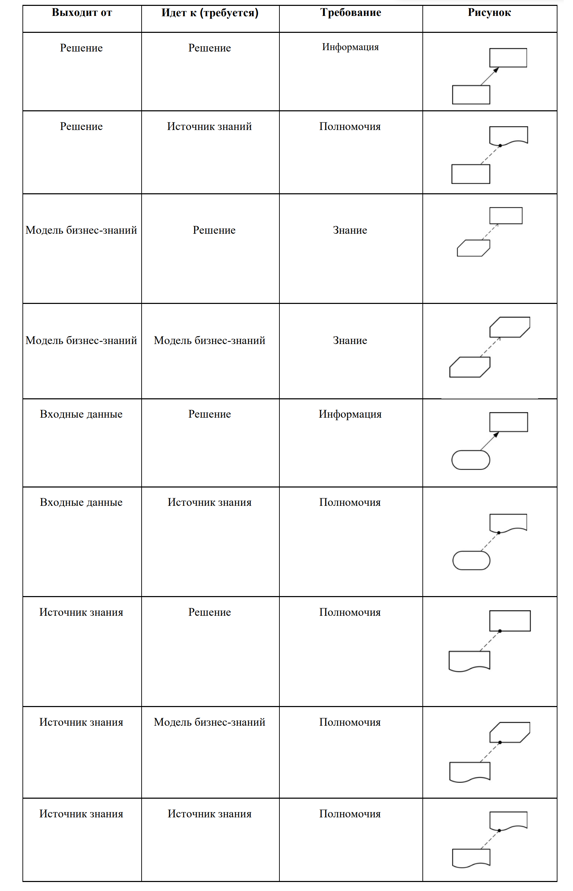

Соединение элементов
=====================

.. _dmn_connectors:

.. list-table::
      :widths: 20 30 20 
      :align: center
      :class: tight-table 
      
      * - **Требование к информации**
        - Требование к информации обозначает входные данные или результат решения, которые используются в качестве одного из входов решения.
        -
            
            .. image:: _static/connectors/connector_1.png
                  :width: 100
                  :align: center

      * - **Требование к знаниям**
        - Требование к знаниям обозначает вызов модели бизнес-знаний с помощью логики решения.
        -
            
            .. image:: _static/connectors/connector_2.png
                  :width: 100
                  :align: center

      * - **Требование к полномочиям**
        - Требование к полномочиям обозначает зависимость элемента модели принятия решений от другого элемента , который выступает в качестве источника руководства или знаний.
        -
            
            .. image:: _static/connectors/connector_3.png
                  :width: 100
                  :align: center

Правила соединения элементов:

