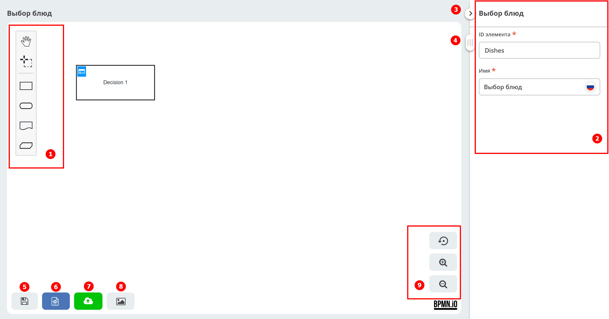
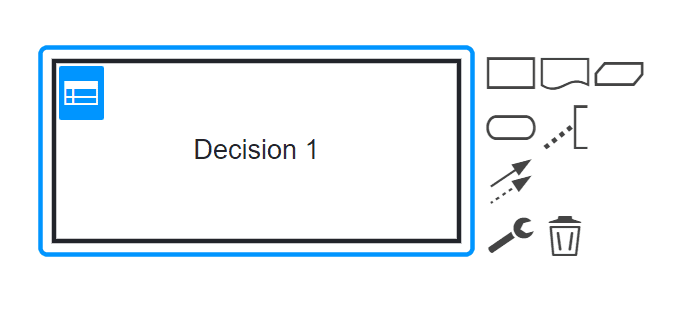

.. _editor_dmn:

Конструктор DMN
==========================

.. contents::

**Конструктор DMN** — графический редактор для моделирования решений в нотации DMN 1.3. Он позволяет создавать схемы принятия решений, настраивать таблицы решений, определять входные и выходные данные, а также публиковать модели решений в движок для исполнения.

Элементы конструктора
---------------------

1. Панель элементов
2. Панель свойств элемента — задаются свойства либо самой схемы, либо выделенного элемента.
3. Свернуть панель свойств элемента
4. Ползунок для перемещения рабочего пространства
5. Сохранить черновик процесса
6. Сохранить процесс
7. Сохранить и опубликовать процесс в движок
8. Посмотреть данные процесса в XML
9. Сохранить процесс в виде изображения в формате SVG
10. Кнопки работы с масштабом

Состав панели элементов
-----------------------

.. grid:: 1
   :gutter: 2

   .. grid-item-card:: Activate the hand tool
      :class-header: sd-font-weight-bold

      .. image:: _static/editor_02.png
         :width: 30
         :align: left

      Используется для перемещения схемы вверх-вниз, вправо-влево, удерживая ее левой кнопкой мыши.

   .. grid-item-card:: Activate the lasso tool
      :class-header: sd-font-weight-bold

      .. image:: _static/editor_03.png
         :width: 30
         :align: left

      Используется для выделения области схемы — позволяет выделить несколько элементов схемы, удерживая левую кнопку мыши. Выделяются все элементы, попавшие в выделяемую область.

Элементы DMN
--------------------------

.. grid:: 1
   :gutter: 2

   .. grid-item-card:: Решение
      :class-header: sd-font-weight-bold

      .. image:: _static/editor_04.png
         :width: 30
         :align: left

      Узел, в котором один или несколько входных элементов определяют выход на основе бизнес-логики принятия решения, определённой в виде выражения или таблицы.

   .. grid-item-card:: Входные данные
      :class-header: sd-font-weight-bold

      .. image:: _static/editor_05.png
         :width: 30
         :align: left

      Информация, используемая в узле принятия решений или модели бизнес-знания. Входные данные обычно включают в себя концепции или объекты бизнес-уровня, относящиеся к бизнесу. Например, данные соискателя кредита из заявки клиента.

   .. grid-item-card:: Источник знаний
      :class-header: sd-font-weight-bold

      .. image:: _static/editor_06.png
         :width: 30
         :align: left

      Внешние сущности, документы, комитеты или политики, которые регулируют модель принятия решений или бизнес-знаний. Источники знаний – ссылки на факторы реального мира, а не исполняемые бизнес-правила. Например, заявка на кредит.

   .. grid-item-card:: Модель бизнес-знания
      :class-header: sd-font-weight-bold

      .. image:: _static/editor_07.png
         :width: 30
         :align: left

      Повторно используемая функция с одним или несколькими элементами принятия решений. Решения, которые имеют одинаковую логику, но зависят от разных вспомогательных входных данных или решений, используют модели бизнес-знания, чтобы определить, какой процедуре следовать.

См. подробно :ref:`Компоненты Citeck DMN<ecos_dmn_components>`

Вы создаёте схему DMN, выбирая на панели элементов нужные элементы, и соединяете их потоками управления. Выделив любой элемент схемы, справа от него появляется панель кнопок.

На панели рядом с элементом расположены следующие кнопки:

.. grid:: 1
   :gutter: 2

   .. grid-item-card:: Создать следующий элемент
      :class-header: sd-font-weight-bold

      .. image:: _static/editor_09.png
         :width: 70
         :align: left

      Создать следующий элемент схемы, связанный с выделенным потоком управления.

   .. grid-item-card:: Добавить аннотацию
      :class-header: sd-font-weight-bold

      .. image:: _static/editor_10.png
         :width: 30
         :align: left

      Добавить текст аннотации к элементу.

   .. grid-item-card:: Связать элемент
      :class-header: sd-font-weight-bold

      .. image:: _static/editor_11.png
         :width: 30
         :align: left

      Связать элемент с любым другим на схеме.

   .. grid-item-card:: Изменить тип элемента
      :class-header: sd-font-weight-bold

      .. image:: _static/editor_12.png
         :width: 30
         :align: left

      Нажать для изменения типа элемента и далее выбрать соответствующий тип.

   .. grid-item-card:: Удалить элемент
      :class-header: sd-font-weight-bold

      .. image:: _static/editor_13.png
         :width: 30
         :align: left

      Удалить элемент.
