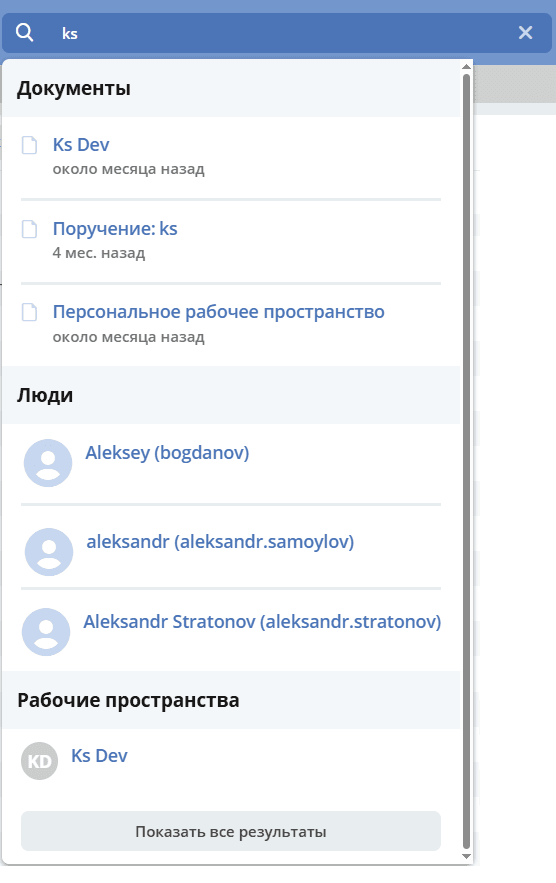
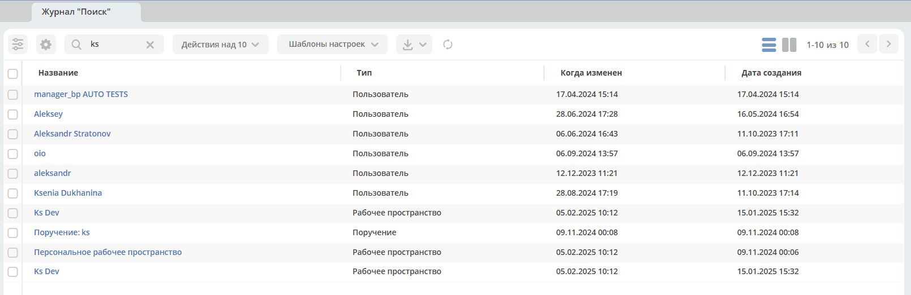

.. _search_settings:

Настройки поиска
==================

Глобальный поиск в Citeck позволяет быстро находить нужные объекты прямо из шапки интерфейса, не переходя в конкретный журнал или раздел. Поиск охватывает документы, людей (пользователей) и рабочие пространства; дополнительно можно подключить произвольные типы данных.

В данном разделе описывается, как настроить глобальный поиск: расширить список типов данных, задать атрибуты для поиска и ограничить нагрузку на сервер.

По нажатию на «Показать все результаты» открывается первая страница результатов поиска:

Типы документов, по которым осуществлять поиск, настраиваются дополнительно.

Открытие настройки поиска
------------------------------------------

.. dropdown:: Как открыть форму настройки глобального поиска
   :color: secondary

   1. Перейдите в журнал :ref:`«Конфигурация ECOS»<configuration_admin>`. Журнал доступен по адресу: ``v2/journals?journalId=ecos-configs&viewMode=table&ws=admin$workspace``

   2. В поисковой строке введите **global-search-config**:

   .. image:: _static/search/setting_01.png
          :width: 700
          :align: center

   3. Откройте настройку:

   .. image:: _static/search/setting_02.png
          :width: 500
          :align: center

На форме можно настроить:

    - Максимальное количество одновременных запросов на одно приложение (микросервис). Если будет много одновременных запросов в глобальный поиск, то это не должно положить сервер.
    - Список типов документов, по которым должен быть глобальный поиск и опционально возможность указать атрибуты, по которым его производить.

.. note::

   Если атрибуты для поиска не указывать, то поиск будет вестись по отображаемому имени. Список доступных типов атрибутов для выбора: ``TEXT``, ``MLTEXT``, ``OPTIONS``.

Добавление типа данных
------------------------------------------

.. dropdown:: Как добавить тип данных для поиска
   :color: secondary

   1. Нажмите **«Добавить ещё»**. Выберите тип данных:

   .. image:: _static/search/setting_03.png
          :width: 600
          :align: center

   2. Выберите атрибуты для поиска:

   .. image:: _static/search/setting_04.png
          :width: 600
          :align: center

   3. Сохраните - нажмите **«Создать»**.

Проверка результата
------------------------------------------

Проверьте работу поиска:

.. grid:: 2
   :gutter: 2

   .. grid-item::

      .. image:: _static/search/search_03.png
             :width: 300
             :align: left

   .. grid-item::

      .. image:: _static/search/search_04.png
             :width: 700
             :align: left
