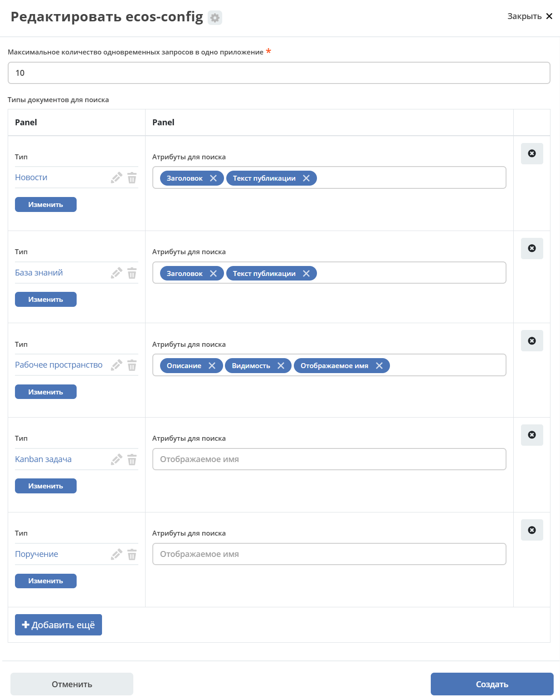

.. _search_settings:

Настройки поиска
==================

.. contents::
    :depth: 2

Поиск осуществляется по документам, людям (пользователям), рабочим пространствам.

По нажатию на «Показать все результаты» открывается первая страница результатов поиска:

Типы документов, по которым осуществлять поиск, настраиваются дополнительно.

Для настройки типов данных перейдите в журнал :ref:`«Конфигурация ECOS»<configuration_admin>`.

Журнал доступен по адресу: ``v2/journals?journalId=ecos-configs&viewMode=table&ws=admin$workspace``

В поисковой строке введите **global-search-config**:

откройте настройку:

На форме можно настроить:

    - Максимальное количество одновременных запросов на одно приложение (микросервис). Если будет много одновременных запросов в глобальный поиск, то это не должно положить сервер.
    - Список типов документов, по которым должен быть глобальный поиск и опционально возможность указать атрибуты, по которым его производить.

Если атрибуты для поиска не указывать, то поиск будет вестись по отображаемому имени. Список доступных типов атрибутов для выбора: ``TEXT``, ``MLTEXT``, ``OPTIONS``.

Добавление типа данных
------------------------------------------

Нажмите **«Добавить ещё»**. Выберите тип данных:

и атрибуты для поиска:

Сохраните - нажмите **«Создать»**.

Проверьте работу поиска:

.. list-table::
      :widths: 10 20
      :align: center

      * - |

            .. image:: _static/search/search_03.png
                  :width: 300
                  :align: center

        - |

            .. image:: _static/search/search_04.png
                  :width: 700
                  :align: center
