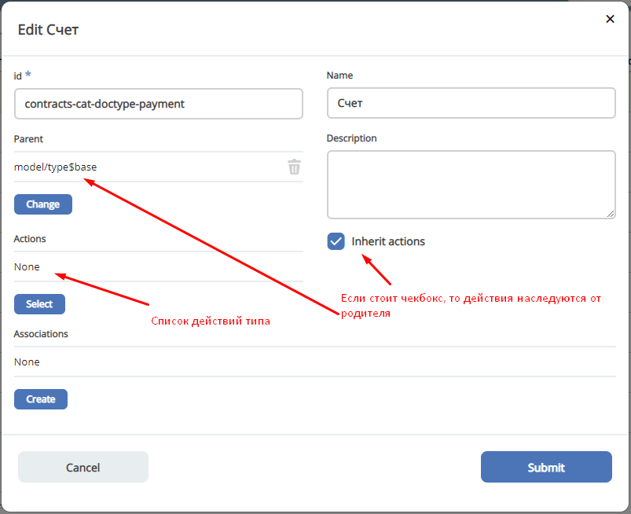

Действия
========

ECOS Actions
------------
Описание работы действий в ECOS

.. list-table::
      :widths: 3 3 5
      :header-rows: 1
      :class: tight-table 

      * - Имя
        - Тип
        - Описание
      * - **id**
        - String
        - | Идентификатор действия. 
          | Уникальный среди всех действий в системе
      * - **key**
        - String
        - | Ключ, по которому возможна фильтрация. 
          | Должен быть в формате **word0.word1.word2**, чтобы можно было фильтровать по маске.
      * - **name**
        - String
        - Имя действия, которое увидит пользователь
      * - **type**
        - String
        - | Тип действия. 
          | Тип определяет логику, которая будет выполнена при выполнении действия.
      * - **icon**
        - String
        - | Иконка действия. Пример "icon-delete", "icon-on". 
          | Все иконки можно посмотреть в ``citeck/ecos-ui/src/fonts/citeck/demo.html``
      * - **config**
        - JsonObject
        - | Конфигурация действия. 
          | Полезно в случаях, когда один тип действия может на основе конфигурации менять свое поведение. 
          | Например - для действия с типом **Download** можно задать шаблон URI для скачивания контента.
      * - **predicate**
        - Predicate
        - | Используется для динамического определения доступности действия для пользователя. 
          | Например, действия **Редактировать** и **Удалить** не могут выполнять пользователи без прав на запись и для них эти действия скрываются.

Расширение списка действий
~~~~~~~~~~~~~~~~~~~~~~~~~~

**Действия** - это артефакты ECOS в формате json или yaml с типом ui/action.

Одно действие может быть многократно использовано в разных местах системы (например, в журнале и на карточке документа).

Получение действий по записи
~~~~~~~~~~~~~~~~~~~~~~~~~~~~
Для запроса действий отправляется следующий запрос::

 {
    "query": {
        "records": [
            "workspace://SpacesStore/123123-123-123",
            "workspace://SpacesStore/123123-123-124"
        ],
        "actions": [
            "ui/action$delete",
            "ui/action$edit"
        ]
    }
 }

Ответ::

 [
    {
        "record": "workspace://SpacesStore/123123-123-123",
        "actions": [
            {
                "icon": "edit",
                "key": "...",
                "type": "mutate",
                "config": {}
            },
            {
                "icon": "delete",
                "key": "...",
                "type": "delete",
                "config": {}
            }
        ]
    },
    {
        "record": "workspace://SpacesStore/123123-123-124",
        "actions": [
            {
                "icon": "edit",
                "id": "...",
                "type": "mutate",
                "config": {}
            },
            {
                "icon": "delete",
                "id": "...",
                "type": "delete",
                "config": {}
            }
        ]
    }
 ]

Так же доступен вариант раздельного указания действий по записям::

 {
    "query": {
        "records": [
            {
                "record": "workspace://SpacesStore/123123-123-123",
                "actions": [
                    "ui/action$delete",
                    "ui/action$edit"
                ]
            },
            {
                "record": "workspace://SpacesStore/123123-123-555",
                "actions": [
                    "ui/action$edit"
                ]
            }
        ]
    }
 }

Фронтенд
~~~~~~~~

На фронтенде действия описаны в виде javascript сущностей с методами
``execForRecord``, ``execForRecords``, ``execForQuery``, ``getDefaultModel``, ``canBeExecuted`` и др.
Например: ``src/components/Records/actions/handler/executor/CreateAction.js``
При выполнении действия вызывается метод execute в который передается запись, над которой выполняется действие и конфигурация действия.
Реестр действий описан в ``src/components/Records/actions/RecordActionExecutorsRegistry.js``
Регистрация действий в реестре: ``src/components/Records/actions/index.js``

Общие настройки любого действия
---------------------------------

.. list-table::
      :widths: 80 80 
      :header-rows: 1
      :class: tight-table 

      * - Конфигурация
        - Описание
      * - **Стандартные установки**
                      
            .. code-block::
	
                id: "print-signed-fin-pdf",
              name: {
                ru: "Распечатать подписанный PDF",
                en: "Print signed PDF"
              },
              type: "open-url",
              icon: "icon-print",
              theme: '',
              features: {
                "execForQuery": false,
                "execForRecord": false,
                "execForRecords": true
              }

        - | **id** - идентификатор действия;
          | **name** - название действия;
          | **type** - тип;
          | **config** - дополнительные сведения;
          | **icon** - код картинки из иконочного шрифта citeck;
          | **theme** - имя темы.   
      * - **Подтверждение и контент окна**
                      
            .. code-block::

              confirm:{
                title:{ ru: 'текст' , en: 'text' },
                message:{ ru: 'текст' , en: 'text' },
                formRef: '',
                attributesMapping:{ body.comment: "comment" }
	            }
	
        - | Подтверждение выполнения действия
          | - если не заданы значения в **confirm** , действие выполняется без подтверждения
          | - **title** - заголовок окна (строка или объект с локализацией)
          | - **message** - сообщение в окне
          | - если задано **formRef** - отображается соответствующая форма в окне подтверждения (message игнорируется)
          | - **attributesMapping** - правила разбора ответа с формы подтверждения; ``key`` - путь для записи в body конфигурации действия, ``value`` - путь к значению с формы       
          | 
          | Ответ подтверждения, если он есть, к пр. данные с формы, передается в действие 
      * - **Подстановка значения по атрибуту**
                      
            .. code-block::

              { 
                "type": "fetch",
                "config": {
                  "url": "/share/proxy/alfresco/api/someurl?nodeRef=${recordRef}",
                  "body": {
                    "counterparty": "${idocs:counterparty.idocs:organizationName}"
		              }
	              } 
	            }

        - | В любом месте конфигурации можно подставлять атрибуты из записи, над которой происходит действие. 
          | Есть один частный случай - ``${recordRef}``. Вместо него всегда подставляется ``recordRef`` текущей записи. 
          | Все остальные атрибуты подставляются так же как если они загружены через ``Citeck.Records.load(...)``. Например:
      * - **Отключение окна о результатах выполнения**
                      
            .. code-block::

              { 
                ...
                "config": {
		              "noResultModal": true,
	              }
	            }

        - | По умолчанию ``false``
      * - **Первоначальная обработка внешнем модулем**
                      
            .. code-block::

              {
                ...
                "preActionModule": "js/citeck/modules/common/custom-preProcess-action"
	            }

        - | ``preActionModule`` указывается ссылка на модуль содержащая js код.
          | Модулю нужно экспортировать функции ``execForRecord`` или ``execForRecords``  (в зависимости от features), которые вызываются перед выполнением основного внутреннего действия.
          | В функцию модуля передаются значения: ``records``, ``action``, ``context``. 
          | Ожидаемый ответ от функции модуля:

            .. code-block::

              {
                config: {},
                results: [{
                  message: 'String', 
                  status: 'String', 
                  recordRef: 'String'
                  },
                  ...
	              ] 
	            }

          | ключ-значения не обязательные, но обрабатываются только они.
          | **config** - объединяется со значением config из конфигурации самого действия
          | **results** - актуально для ``execForRecords``; внешнее действие может обработать какие-то записи и вернуть по ним результат. 
          | Если записи указаны в **results**, они исключаются из выполнения внутреннего основного действия. 
          |
          | Результаты внешнего и внутреннего объединяются для вывода информации.

Типы действий
-------------

view
~~~~~~~~~

id типа: ``view``

Открыть запись на просмотр.

**Конфигурация:**

Дополнительные параметры для config:

* **background: Bool** - открыть запись в новой вкладке приложения в фоновом режиме;
* **reopen: Bool** - открыть запись в текущей вкладке приложения;
* **newBrowserTab: Bool** - открыть запись в новой вкладке браузера
* **reopenBrowserTab: Bool** - открыть запись в текущей вкладке браузера (с перезагрузкой страницы).

edit
~~~~~~~~~~

id типа: ``edit``

Редактировать запись.

**Конфигурация:**

* **attributes: Object<String, String>** - Атрибуты, которые будут прокинуты на форму создания. Необязательный параметр

open-in-background
~~~~~~~~~~~~~~~~~~~~~~

id типа: ``open-in-background``

Открыть запись в новой фоновой вкладке

download
~~~~~~~~~~~~~~

id типа: ``download``

Скачать некоторый контент связанный (или не связанный) с записью.

По умолчанию скачивается контент записи

**Конфигурация:**

* **url** - URL для скачивания. Можно добавлять ``${recordRef}`` для подстановки текущей записи.
  
delete
~~~~~~~~~~~~

id типа: ``delete``

Удалить запись

**Конфигурация:**

.. code-block::

  {
    "config" : {
        "isWaitResponse" : false,
        "withoutConfirm" : true
    },
    "type" : "delete"
  }

* **isWaitResponse** - ожидание ответа удаления (по умолчанию ``true``)
* **withoutConfirm** - удаление без подтверждения (по умолчанию ``false``)  

download-card-template
~~~~~~~~~~~~~~~~~~~~~~~~~~~

id типа: ``download-card-template``

Скачать печатную версию документа

**Конфигурация:**

* **templateType** - тип шаблона
* **format** - формат (html, pdf, pdf2, docx)

view-card-template
~~~~~~~~~~~~~~~~~~~~~~~~~

id типа: ``view-card-template``

Просмотр печатной версии документа в новой вкладке браузера (возвращаемый документ такой же как для события ``download-card-template``).

**Конфигурация:**

* **templateType** - тип шаблона
* **format** - формат (html, pdf, pdf2, docx)
* **includeTimezone** (по умолчанию - ``true``)

upload-new-version
~~~~~~~~~~~~~~~~~~~~~~~~

id типа: ``upload-new-version``

Загрузка новой версии документа

reate
~~~~~~~~~~

id типа: ``create``

Действие для создания нового документа. Обычно применяется когда требуется создать новый документ, в котором некоторые поля будут предзаполнены из данных текущего открытого документа.

**Конфигурация:**

* **typeRef: String** - ECOS тип для создания. Обязательный параметр;
* **createVariantId: String** - Идентификатор варианта создания для типа. Если не указан, то используется первый доступный вариант
* **createVariant: Object** - Вариант создания для ситуаций, когда ни один вариант создания из типа не походит и требуется его полностью определить в действии
* **attributes: Object** - Предопределенные атрибуты для создания новой сущности. Для прокидывания атрибутов с текущей записи (т.е. той, с которой выполняется действие) на форму создания можно использовать вставки вида ``${attribute_name}`` 
* **options: Object** - Опции формы

save-as-case-template
~~~~~~~~~~~~~~~~~~~~~~~~~~

id типа: ``save-as-case-template``

Создается шаблон, затем по условию конфигурации - скачивание или переход на дашборд. 

**Конфигурация:**

* **download** 

По умолчанию скачивается контент записи.

* ``true`` (по умолчанию) - скачивается шаблон; 
* ``false`` - редирект на дашборд шаблона

open-url
~~~~~~~~~~~~~~

id типа: ``open-url``

Открывает заданный URL относительно текущего стенда.

**Конфигурация:**

* **URL** - можно добавлять ``${recordRef}`` для подстановки текущей записи

assoc-action
~~~~~~~~~~~~~~~~~

id типа: ``assoc-action``

Выполняет действие над указанной ассоциацией.

**Конфигурация:**

* **assoc** - ассоциация
* **action** - объект действия

content-preview-modal
~~~~~~~~~~~~~~~~~~~~~~~~~~~~

id типа: ``content-preview-modal``

Модальное окно с предпросмотром документа. В конфигурации действия ожидается поле **scale**. 

Возможные значения: 

* **auto**
* **0…4**
* **page-fit** 
* **page-height**
* **page-width**

**Конфигурация:**

**recordRef**

fetch
~~~~~~~~~~~

id типа: ``fetch``

Отправляет запрос на указанный URL

**Конфигурация:**

* **url** 
* **method**
* **args** - аргументы, которые будут переданы в URL
* **body** - аргументы, которые будут переданы в тело запроса

edit-task-assignee
~~~~~~~~~~~~~~~~~~~~~~~~

id типа: ``edit-task-assignee``

Редактировать исполнителя задачи (запускается окно с выбором исполнителя).

Действие связано с бизнес-процессом записи.

**Конфигурация:**

**actionOfAssignment [claim , release]** 

view-business-process
~~~~~~~~~~~~~~~~~~~~~~~~~~

id типа: ``view-business-process``

Просмотреть Бизнес-процесс (окно с превью процесса и доп. действиями).

* ``workflowFromRecord = true`` => получает **workflow id** из переданного **record** в действие
* ``workflowFromRecord = false`` => указанное значение **record** является **workflow id** 

**Конфигурация:**

**workflowFromRecord [true/ false]**

cancel-business-process
~~~~~~~~~~~~~~~~~~~~~~~~~~~~~~

id типа: ``cancel-business-process``

Отменить бизнес- процесс.

mutate
~~~~~~~~~~~~

id типа: ``mutate``

Внесение изменений без участия пользователя посредством передачи атрибутов.

* **record.id** - необязательный параметр
* **record.attributes** - изменяемые поля и их значения

**Конфигурация:**

.. code-block::

    record :  { 
      id: "${recordRef}",
      attributes: { "key": "value" }
	             }
         
set-task-assignee
~~~~~~~~~~~~~~~~~~~~~~~~

id типа: ``set-task-assignee``

Назначение исполнителя задачи (расширенный вариант edit-task-assignee)

* **assignTo** - на кого назначить [me , group , someone]

 * ``someone`` - если не указан assignee, запускается ``edit-task-assignee`` для выбора 
 * ``me`` - исполнитель устанавливается автоматически (текущий пользователь)
 * ``group`` - возврат в группу

Необязательные параметры (можно использовать дополнительно или вместо assignTo):

* **actionOfAssignment** - [claim , release]
  
 * ``release`` - вернуть в группу

* **assignee** -  ``workspace исполнителя`` - если ``claim`` и значения нет - выбор через окно
* **errorMsg** - сообщение об ошибки выполнения

**Конфигурация:**

``assignTo: 'me'`` или 

``actionOfAssignment: 'claim'``

``assignee: 'workspace://SpacesStore/......'``
            

.. code-block::

   
   config: { 
           errorMsg: 'text'
              }

edit-menu
~~~~~~~~~~~~~~~~

id типа: ``edit-menu``

Запустить редактор конфигурации меню

*действие для версии конфигурации > 0*

view-menu
~~~~~~~~~~~~~~

id типа: ``view-menu``

Запустить редактор конфигурации меню

*действие для версии конфигурации > 0*

task-outcome
~~~~~~~~~~~~~~~~~~

id типа: ``task-outcome``

Действие используется в связке с ``tasks-actions``. Действие связано с бизнес-процессом записи.

**Конфигурация:**

* **label** - заголовок варианта завершения задачи
* **outcome** - идентификатор варианта завершения задачи
* **formRef** - ссылка на форму задачи (uiserv/eform@...)
* **taskRef** - ссылка на задачу (wftask@flowable$12345)

tasks-actions
~~~~~~~~~~~~~~~~~~~

id типа: ``tasks-actions``

Действие для загрузки вариантов завершения задач.

**Конфигурация:**

На выходе для каждой задачи получается основное действие и ``variants`` с типом ``task-outcome`` где перечислены варианты завершения

           .. image:: _static/actions_1.png
              :width: 200
              :align: center

Отображаются только задачи, которые может завершить текущий пользователь. Т.е. то же самое что и в виджете "Мои задачи".

Варианты завершения загружаются из конфигурации формы для задачи. 

Находятся все кнопки с ключом outcome_* и преобразуются в варианты создания.

Если у задачи на форме есть поля, то показывается всплывающая форма с этими полями:
           
           .. image:: _static/actions_2.png
              :width: 400
              :align: center
          
Если у задачи на форме нет полей, то показывается следующее окно:
           
           .. image:: _static/actions_3.png
              :width: 300
              :align: center

Если форма пустая и в конфигурации для tasks-actions задано как ``hideConfirmEmptyForm=true``, окно не появляется, форма выполняется, действие завершается, уведомление, если успешно, появляется. 

.. code-block::

  {
    "id": "tasks-actions",
    "name": {
      "ru": "Действия для завершения задач",
      "en": "Actions to complete tasks"
    },
    "type": "tasks-actions",
    ------------------------new-------------------
    "config": {
      "hideConfirmEmptyForm": true <<<
    }
    ----------------------------------------------
  }

При выполнение вариантов действия, в каждый вариант передаются некоторые конфигурации: 

то есть ``config`` из ``tasks-actions`` передается в ``task-outcome``.

При этом у ``task-outcome`` может быть свой конфиг, который может перезаписать прошедшие настройки.

edit-password
~~~~~~~~~~~~~~~~~~~~

id типа: ``edit-password``

Изменение пароля

open-submit-form
~~~~~~~~~~~~~~~~~~~~

id типа: ``open-submit-form``

Вызов формы редактирования с попыткой отправить в рассмотрение. Если все поля заполнены корректны, форма отправляется и закрывается.

Иначе отображается список ошибок, после их исправления отправление вручную.

**config.formId** - необязательный параметр; без указания загружается форма по умолчанию.

Действие связано с бизнес-процессом записи.

**Конфигурация:**

.. code-block::
              	
     "config": {
		    "formId": "...",
	              }
          

Расширение действий
-------------------

Добавление новых инстансов действий
~~~~~~~~~~~~~~~~~~~~~~~~~~~~~~~~~~~~~
Для добавления новых инстансов действий необходимо описать их в json виде и добавить их в alfresco (в микросервисы так же можно добавлять действия) по пути

**{alfresco_module_id}/src/main/resources/alfresco/module/{alfresco_module_id}/ui/action**

Пример описания::

 {
    "id": "confirm-list-html",
    "key": "card-template.confirm-list.html",
    "name": "Скачать лист согласования",
    "type": "download-card-template",
    "config": {
        "templateType": "confirm-list",
        "format": "html"
    }
 }

Для тестирования можно заливать эту конфигурацию в журнале действий вручную.

Добавление новых типов действий
~~~~~~~~~~~~~~~~~~~~~~~~~~~~~~~
На данный момент все типы описаны в базовом проекте ecos-ui (в планах есть поддержка расширения действий без изменений в ecos-ui).

Описать новое действие::

 export const DownloadAction = {
  execute: ({ record, action }) => {
    const config = action.config || {};

    let url = config.url || getDownloadContentUrl(record.id);
    url = url.replace('${recordRef}', record.id); // eslint-disable-line no-template-curly-in-string

    const name = config.filename || 'file';

    const a = document.createElement('A', { target: '_blank' });

    a.href = url;
    a.download = name;
    document.body.appendChild(a);
    a.click();
    document.body.removeChild(a);

    return false;
  },

  getDefaultModel: () => {
    return {
      name: 'grid.inline-tools.download',
      type: 'download',
      icon: 'icon-download'
    };
  },

  canBeExecuted: ({ record }) => {
    return record.att('.has(n:"cm:content")') !== false;
  }
 };

Зарегистрировать новый тип::

 import Registry from './RecordActionExecutorsRegistry';
 import { DownloadAction } from './DefaultActions';

 Registry.addExecutors({
  download: DownloadAction,
 });

Настройки списка действий
-------------------------
Настройка действий на dashboard
~~~~~~~~~~~~~~~~~~~~~~~~~~~~~~~
Настройка действий на dashboard осуществляется в журнале типов кейсов, который располагается в системных журналах:

Настройка действий в журналах
~~~~~~~~~~~~~~~~~~~~~~~~~~~~~
Действия в журнале описываются в разделе actions перед headers и содержат ссылки на те же действия, что и в типах. Если действия не описаны, то используется список действий по умолчанию:

**ui/action$content-download**

**ui/action$edit**

**ui/action$delete**

**ui/action$view-dashboard**

**ui/action$view-dashboard-in-background**

Примеры настроек действий::

 <journal id="ecos-sync">
    <datasource>integrations/sync</datasource>
    <create>
        <variant title="Alfresco Records">
            <recordRef>integrations/sync@alfrecords</recordRef>
            <attribute name="type">alfrecords</attribute>
        </variant>
    </create>
    <actions>
        <action ref="ui/action$ecos-module-download" />
        <action ref="ui/action$delete" />
        <action ref="ui/action$edit" />
    </actions>
    <headers>
        <header key="module_id" default="true"/>
        <header key="name" default="true"/>
        <header key="type" default="true"/>
        <header key="syncDate" default="true"/>
        <header key="enabled" default="true"/>
    </headers>
 </journal>

Настройка действия, которое активно для записей с определенным mimetype контента::

 {
    "id": "edit-in-onlyoffice",
    "key": "edit.onlyoffice",
    "name": "Редактировать Документ",
    "type": "open-url", // тип действия должен соответствовать типу на UI
    "config": {
        "url": "/share/page/onlyoffice-edit?nodeRef=${recordRef}&new="
    },
    "evaluator": {
        "type": "predicate", // Тип evaluator'а для фильтрации действий
        "config": {
            "predicate": {
                "t": "in",
                "att": "_content.mimetype?str", // атрибут, который мы проверяем
                "val": [ //значения, на которые мы проверяем
                    "application/vnd.openxmlformats-officedocument.wordprocessingml.document",
                    "application/vnd.openxmlformats-officedocument.spreadsheetml.sheet",
                    "application/vnd.openxmlformats-officedocument.presentationml.presentation",
                    "text/plain",
                    "text/csv"
                ]
            }
        }
    }
 }

Данный конфиг достаточно положить в ecos-app/ui/action для микросервисов или в ``{alfresco_module_id}/src/main/resources/alfresco/module/{alfresco_module_id}/ui/action для Alfresco``

Техническая информация
----------------------

Вспомогательные параметры
~~~~~~~~~~~~~~~~~~~~~~~~~~~

.. list-table::
      :widths: 5 40
      :header-rows: 1

      * - Параметр
        - Описание
      * - **actionRecord**
        - | В любую форму, которая вызывается из действия, в объект ``options`` устанавливается свойство ``actionRecord``, указывающее идентификатор записи (record), для которой выполняется действие.
          | Данное значение только для чтения. Указать в действии ``config.options.actionRecord`` не нужно, пользовательское будет перезаписано. 

Ожидаемый формат результат действия
~~~~~~~~~~~~~~~~~~~~~~~~~~~~~~~~~~~~

Тип результата boolean или object 
(array - deprecated - обработка поддерживается)

Если ``object`` отображаются подробности выполнения в зависимости от типа результата.
Для групповых действий модальное окно появляется сразу при запуске и если результат boolean автоматические закрывается.

**link**

Отображаемый результата выполнения - ссылка на скачивания отчета

.. code-block::

	{
	  "type": "link",
	  "data": {
		"url": "..."
	  }
	}

**results**

Таблица записей с результатом выполнения действия

.. code-block::

	{
	  "type": "results",
	  "data": {
		"results": [
		  {
			  "recordRef": "workspace://SpacesStore/...",
			  "disp": "название записи"
			  "status": "OK",
			  "message": "Все хорошо"  
		  }
		]
	  }
	}

**error**

Вывод ошибки.
Возможно автоматическое создание.

.. code-block::

	{
	  "type": "error",
	  "data": {
		"message": "..."
	  }
	}

.. note::
  
 * В колонке **ID** типа используйте форматирование для типа - **Heading 3** (вместо Normal text) - так оно попадет в список доступных действий и будет возможность ссылки-якоря 
 * Если описание конфигурации большое используете **Expand** панель (+)