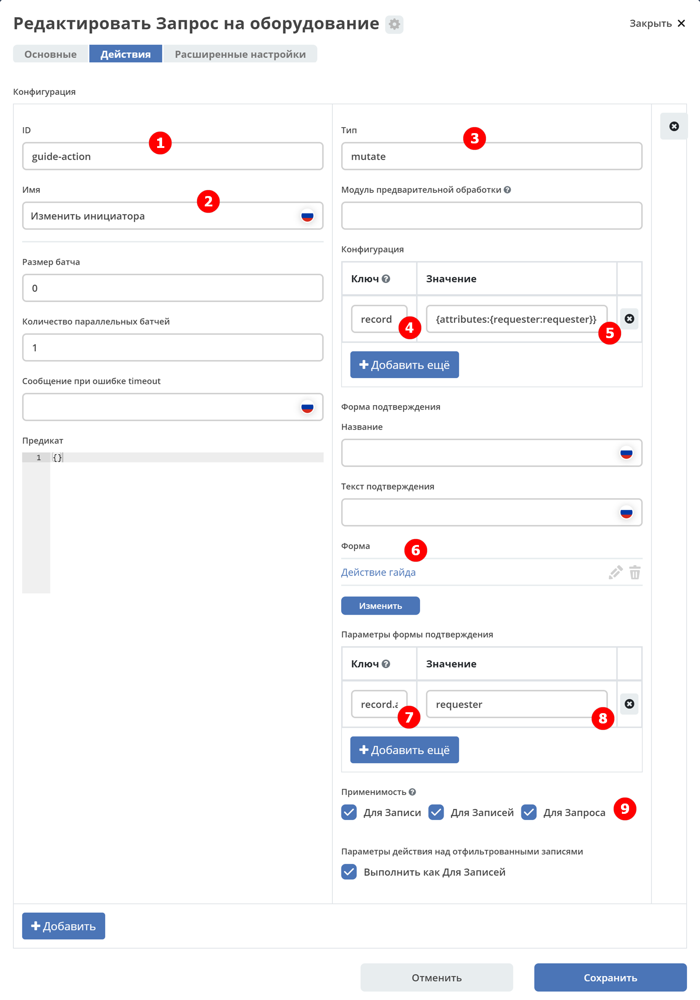
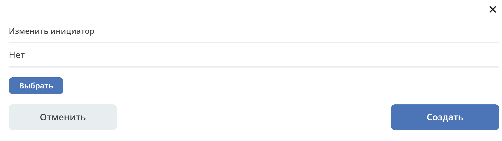

.. _ui_actions:

Действия
========

Раздел содержит описание работы действий в Citeck.

.. contents::
		:depth: 4

**Действия** - это артефакты Citeck в формате **json** или **yaml** с типом **ui/action**.

Одно действие может быть многократно использовано в разных местах системы (например, в журнале и на карточке документа).

Все действия делятся на 3 категории - **"над записью"**, **"над выбранными записями"** и **"над отфильтрованными записями"**.

.. list-table::
      :widths: 10 30
      :class: tight-table
      :align: center 

      * - **Над записью**
        - | 1.	Выполняются над конкретной записью
          | 2.	Отображаются либо напротив каждой строки в журнале в самой правой части таблицы, либо на карточке документа в виджете действий.

           .. image:: _static/ui_actions/UI/01.png
              :width: 400
              :align: center

      * - **Над выбранными**
        - | 1.	Выполняются над записями, рядом с которыми пользователь поставил галки
          | 2.	Отображаются в дропдауне над таблицей, когда пользователь выбрал хотя бы одну запись

           .. image:: _static/ui_actions/UI/02.png
              :width: 400
              :align: center

      * - **Над отфильтрованными**
        - | 1. Выполняются над записями, которые подходят под фильтрацию
          | 2.	Отображаются в дропдауне над таблицей, когда пользователь ничего не выбрал в журнале

Описание формата
------------------

.. list-table::
      :widths: 3 3 10
      :header-rows: 1
      :class: tight-table
      :align: center

      * - Имя
        - Тип
        - Описание
      * - **id**
        - String
        - | Идентификатор действия. 
          | Уникальный среди всех действий в системе
      * - **key**
        - String
        - | Ключ, по которому возможна фильтрация. 
          | Должен быть в формате **word0.word1.word2**, чтобы можно было фильтровать по маске.
      * - **name**
        - String
        - Имя действия, которое увидит пользователь
      * - **type**
        - String
        - | Тип действия. 
          | Тип определяет логику, которая будет выполнена при выполнении действия.
      * - **icon**
        - String
        - | Иконка действия. Пример "icon-delete", "icon-on". 
          | Все иконки можно посмотреть в ``citeck/ecos-ui/src/fonts/citeck/demo.html``
      * - **config**
        - JsonObject
        - | Конфигурация действия. 
          | Полезно в случаях, когда один тип действия может на основе конфигурации менять свое поведение. 
          | Например - для действия с типом **Download** можно задать шаблон URI для скачивания контента.
      * - **predicate**
        - Predicate
        - | Используется для динамического определения доступности действия для пользователя. Подробно о :ref:`предикатах <ecos-predicate_main>`
          | Например, действия **Редактировать** и **Удалить** не могут выполнять пользователи без прав на запись и для них эти действия скрываются.

Получение действий по записи
------------------------------
Для запроса действий отправляется следующий запрос::

 {
    "query": {
        "records": [
            "emodel/someType@bb617ee9-e085-4a3a-8fbf-df2d9534eadb",
            "emodel/someType@74c11ef8-8c63-40c1-b119-94feefd7f885"
        ],
        "actions": [
            "ui/action$delete",
            "ui/action$edit"
        ]
    }
 }

Ответ::

 [
    {
        "record": "emodel/someType@bb617ee9-e085-4a3a-8fbf-df2d9534eadb",
        "actions": [
            {
                "icon": "edit",
                "key": "...",
                "type": "mutate",
                "config": {}
            },
            {
                "icon": "delete",
                "key": "...",
                "type": "delete",
                "config": {}
            }
        ]
    },
    {
        "record": "emodel/someType@74c11ef8-8c63-40c1-b119-94feefd7f885",
        "actions": [
            {
                "icon": "edit",
                "id": "...",
                "type": "mutate",
                "config": {}
            },
            {
                "icon": "delete",
                "id": "...",
                "type": "delete",
                "config": {}
            }
        ]
    }
 ]

Так же доступен вариант раздельного указания действий по записям::

 {
    "query": {
        "records": [
            {
                "record": "emodel/someType@3352b46d-ec44-465c-8673-086282d62b04",
                "actions": [
                    "ui/action$delete",
                    "ui/action$edit"
                ]
            },
            {
                "record": "emodel/someType@3dfff282-3ddf-45e1-886d-f5f2c94fe4e7",
                "actions": [
                    "ui/action$edit"
                ]
            }
        ]
    }
 }

Фронтенд
---------------

На фронтенде действия описаны в виде javascript сущностей с методами ``execForRecord``, ``execForRecords``, ``execForQuery``, ``getDefaultModel``, ``canBeExecuted`` и др.

Например: ``src/components/Records/actions/handler/executor/CreateAction.js``

При выполнении действия вызывается метод execute в который передается запись, над которой выполняется действие и конфигурация действия.

Реестр действий описан в ``src/components/Records/actions/RecordActionExecutorsRegistry.js``

Регистрация действий в реестре: ``src/components/Records/actions/index.js``

Общие настройки любого действия
---------------------------------

.. list-table::
      :widths: 80 80 
      :header-rows: 1
      :class: tight-table
      :align: center

      * - Конфигурация
        - Описание
      * - **Стандартные установки**
                      
            .. code-block::
	
                id: "print-signed-fin-pdf",
              name: {
                ru: "Распечатать подписанный PDF",
                en: "Print signed PDF"
              },
              type: "open-url",
              icon: "icon-print",
              theme: '',
              features: {
                "execForQuery": false,
                "execForRecord": false,
                "execForRecords": true
              }

        - | **id** - идентификатор действия;
          | **name** - название действия;
          | **type** - тип;
          | **config** - дополнительные сведения;
          | **icon** - код картинки из иконочного шрифта citeck;
          | **theme** - имя темы. 
          | **features** - использовать для записи/Record, записей/Records, поискового запроса/Query  
      * - **Подтверждение и контент окна**
                      
            .. code-block::

              confirm:{
                title:{ ru: 'текст' , en: 'text' },
                message:{ ru: 'текст' , en: 'text' },
                formRef: '',
                attributesMapping:{ body.comment: "comment" }
                formAttributes:{
                    recordId: ${?id} // атрибут ?id будет взят из карточки
                    recordName: ${name} // атрибут name будет взят из карточки
                    constant: value // константное значение                
                               }
                      }
	
        - | Подтверждение выполнения действия
          | - если не заданы значения в **confirm** , действие выполняется без подтверждения
          | - **title** - заголовок окна (строка или объект с локализацией)
          | - **message** - сообщение в окне
          | - если задано **formRef** - отображается соответствующая форма в окне подтверждения (message игнорируется)
          | - **attributesMapping** - маппинг атрибутов, данные с формы подтверждения (комментарии и т.д.) можно прокинуть в поля конфигурации действия; ``key`` - путь для записи в body конфигурации действия, ``value`` - путь к значению с формы.
          | Ответ подтверждения, если он есть, к прочие данные с формы, передается в действие.      
          | Например, в запросе необходимо отправить комментарий с формы подтверждения. Для этого настраиваем ``body.comment``. Внутри ``body`` в поле ``comment`` необходимо найти и записать значение из поля ``comment`` в форму подтверждения.         
      * - **Подстановка значения по атрибуту**
                      
            .. code-block::

              {
                "id": "artifact-deploy",
                "name": {
                  "ru": "Задеплоить артефакт",
                  "en": "Deploy artifact"
                },
                "type": "fetch",
                "config": {
                  "url": "/gateway/eapps/api/artifact/deploy",
                  "args": {
                    "ref": "${recordRef}"
                  },
                  "method": "POST"
                }
              }

        - | В любом месте конфигурации можно подставлять атрибуты из записи, над которой происходит действие. 
          | Есть один частный случай - ``${recordRef}``. Вместо него всегда подставляется ``recordRef`` текущей записи. 
          | Все остальные атрибуты подставляются так же как если они загружены через ``Records.load(...)``. Например:
      * - **Отключение окна о результатах выполнения**
                      
            .. code-block::

              { 
                ...
                "config": {
		              "noResultModal": true,
	              }
	            }

        - | По умолчанию ``false``
      * - **Первоначальная обработка внешнем модулем**
                      
            .. code-block::

              {
                ...
                "preActionModule": "js/citeck/modules/common/custom-preProcess-action"
	            }

        - | ``preActionModule`` указывается ссылка на модуль содержащая js код.
          | Модулю нужно экспортировать функции ``execForRecord`` или ``execForRecords``  (в зависимости от features), которые вызываются перед выполнением основного внутреннего действия.
          | В функцию модуля передаются значения: ``records``, ``action``, ``context``. 
          | Ожидаемый ответ от функции модуля:

            .. code-block::

              {
                config: {},
                results: [{
                  message: 'String', 
                  status: 'String', 
                  recordRef: 'String'
                  },
                  ...
	              ] 
	            }

          | ключ-значения не обязательные, но обрабатываются только они.
          | **config** - объединяется со значением config из конфигурации самого действия
          | **results** - актуально для ``execForRecords``; внешнее действие может обработать какие-то записи и вернуть по ним результат. 
          | Если записи указаны в **results**, они исключаются из выполнения внутреннего основного действия. 
          |
          | Результаты внешнего и внутреннего объединяются для вывода информации.

Типы действий
-------------

view
~~~~~~~~~

id типа: ``view``

.. list-table::
      :widths: 10 10
      :header-rows: 1
      :class: tight-table
      :align: center 

      * - Описание
        - Конфигурация
      * - Открыть запись на просмотр.
        - 
           | Дополнительные параметры для config:
           | **background: Bool** - открыть запись в новой вкладке приложения в фоновом режиме;
           | **reopen: Bool** - открыть запись в текущей вкладке приложения;
           | **newBrowserTab: Bool** - открыть запись в новой вкладке браузера
           | **reopenBrowserTab: Bool** - открыть запись в текущей вкладке браузера (с перезагрузкой страницы).

edit
~~~~~~~~~~

id типа: ``edit``

.. list-table::
      :widths: 10 10
      :header-rows: 1
      :class: tight-table
      :align: center

      * - Описание
        - Конфигурация
      * - Редактировать запись.
        - **attributes: Object<String, String>** - атрибуты, которые будут прокинуты на форму создания. Необязательный параметр

open-in-background
~~~~~~~~~~~~~~~~~~~~~~

id типа: ``open-in-background``

.. list-table::
      :widths: 10 10
      :header-rows: 1
      :class: tight-table
      :align: center 

      * - Описание
        - Конфигурация
      * - Открыть запись в новой фоновой вкладке
        - 

download
~~~~~~~~~~~~~~

id типа: ``download``

.. list-table::
      :widths: 10 10
      :header-rows: 1
      :class: tight-table
      :align: center 

      * - Описание
        - Конфигурация
      * -  
           | Скачать некоторый контент связанный (или не связанный) с записью.
           | По умолчанию скачивается контент записи
        - **url** - URL для скачивания. Можно добавлять ``${recordRef}`` для подстановки текущей записи.
 
delete
~~~~~~~~~~~~

id типа: ``delete``

.. list-table::
      :widths: 10 10
      :header-rows: 1
      :class: tight-table
      :align: center

      * - Описание
        - Конфигурация
      * - Удалить запись
        - 
          .. code-block::

            {
              "config" : {
                  "isWaitResponse" : false,
                  "withoutConfirm" : true
              },
              "type" : "delete"
            }

          | **isWaitResponse** - ожидание ответа удаления (по умолчанию ``true``)
          | **withoutConfirm** - удаление без подтверждения (по умолчанию ``false``)

download-card-template
~~~~~~~~~~~~~~~~~~~~~~~~~~~

id типа: ``download-card-template``

.. list-table::
      :widths: 10 10
      :header-rows: 1
      :class: tight-table
      :align: center

      * - Описание
        - Конфигурация
      * -  
          | Скачать печатную версию документа
        - | **templateType** - тип шаблона
          | **format** - формат (html, pdf, pdf2, docx)

download-by-template
~~~~~~~~~~~~~~~~~~~~~~~~~~~

id типа: ``download-by-template``

.. list-table::
      :widths: 10 10
      :header-rows: 1
      :class: tight-table
      :align: center

      * - Описание
        - Конфигурация
      * -  
          | Скачать документ по шаблону
        - | **templateRef** - ссылка на шаблон
          | **resultName** - имя файла, который будет скачан
          | **requestParams** - дополнительные параметры, которые будут отправлены на сервер

view-card-template
~~~~~~~~~~~~~~~~~~~~~~~~~

id типа: ``view-card-template``

.. list-table::
      :widths: 10 10
      :header-rows: 1
      :class: tight-table
      :align: center

      * - Описание
        - Конфигурация
      * -  
          | Просмотр печатной версии документа в новой вкладке браузера
          | (возвращаемый документ такой же как для события ``download-card-template``)
        - | **templateType** - тип шаблона
          | **format** - формат (html, pdf, pdf2, docx)
          | **includeTimezone** (по умолчанию - ``true``)

upload-new-version
~~~~~~~~~~~~~~~~~~~~~~~~

id типа: ``upload-new-version``

.. list-table::
      :widths: 10 10
      :header-rows: 1
      :class: tight-table
      :align: center

      * - Описание
        - Конфигурация
      * - Загрузка новой версии документа
        - 

create
~~~~~~~~~~

id типа: ``create``

.. list-table::
      :widths: 10 10
      :header-rows: 1
      :class: tight-table
      :align: center 
      
      * - Описание
        - Конфигурация
      * -  
          | Действие для создания нового документа. 
          | Обычно применяется когда требуется создать новый документ, в котором некоторые поля будут предзаполнены из данных текущего открытого документа.
        - | **typeRef: String** - тип данных для создания. Обязательный параметр;
          | **createVariantId: String** - Идентификатор варианта создания для типа. Если не указан, то используется первый доступный вариант
          | **createVariant: Object** - Вариант создания для ситуаций, когда ни один вариант создания из типа не походит и требуется его полностью определить в действии
          | **attributes: Object** - Предопределенные атрибуты для создания новой сущности. Для прокидывания атрибутов с текущей записи (т.е. той, с которой выполняется действие) на форму создания можно использовать вставки вида ``${attribute_name}`` 
          | **options: Object** - Опции формы
          |
          | **Пример:**
          |
          | Создание сущности с типом emodel/type@request-to-manager и проставлением в атрибут "incident" ссылки на текущий документ

            .. code-block::

                id: request-to-manager
                name:
                  en: Request to manager
                  ru: Запрос руководителю
                type: create
                config:
                  typeRef: emodel/type@request-to-manager
                  redirectToPage: false
                  attributes:
                    incident: "${?id}"

save-as-case-template
~~~~~~~~~~~~~~~~~~~~~~~~~~

id типа: ``save-as-case-template``

.. list-table::
      :widths: 10 10
      :header-rows: 1
      :class: tight-table
      :align: center
      
      * - Описание
        - Конфигурация
      * -  
          | Создается шаблон, затем по условию конфигурации - скачивание или переход на дашборд. 
        - | **download** 
          | По умолчанию скачивается контент записи.

              * ``true`` (по умолчанию) - скачивается шаблон; 
              * ``false`` - редирект на дашборд шаблона

open-url
~~~~~~~~~~~~~~

id типа: ``open-url``

.. list-table::
      :widths: 10 10
      :header-rows: 1
      :class: tight-table
      :align: center
      
      * - Описание
        - Конфигурация
      * -  
          | Открывает заданный URL относительно текущего стенда.
        - | **URL** - можно добавлять ``${recordRef}`` для подстановки текущей записи

assoc-action
~~~~~~~~~~~~~~~~~

id типа: ``assoc-action``

.. list-table::
      :widths: 10 10
      :header-rows: 1
      :class: tight-table
      :align: center
      
      * - Описание
        - Конфигурация
      * -  
          | Выполняет действие над указанной ассоциацией.
        - | **assoc** - ассоциация
          | **action** - объект действия

content-preview-modal
~~~~~~~~~~~~~~~~~~~~~~~~~~~~

id типа: ``content-preview-modal``

.. list-table::
      :widths: 10 10
      :header-rows: 1
      :class: tight-table 
      :align: center
      
      * - Описание
        - Конфигурация
      * -  
          | Модальное окно с предпросмотром документа. 
          | В конфигурации действия ожидается поле **scale**. 
          | Возможные значения: 
              | **auto**
              | **0…4**
              | **page-fit** 
              | **page-height**
              | **page-width**          
        - | **recordRef**

fetch
~~~~~~~~~~~

id типа: ``fetch``

.. list-table::
      :widths: 10 10
      :header-rows: 1
      :class: tight-table
      :align: center 
      
      * - Описание
        - Конфигурация
      * -  
          | Отправляет запрос на указанный URL     
        - | **url** 
          | **method**
          | **args** - аргументы, которые будут переданы в URL
          | **body** - аргументы, которые будут переданы в тело запроса

view-business-process
~~~~~~~~~~~~~~~~~~~~~~~~~~

id типа: ``view-business-process``

.. list-table::
      :widths: 10 10
      :header-rows: 1
      :class: tight-table
      :align: center 
      
      * - Описание
        - Конфигурация
      * -  
          | Просмотреть Бизнес-процесс 
          | (окно с превью процесса и доп. действиями).
        - | **workflowFromRecord [true/ false]**

              * ``workflowFromRecord = true`` => получает **workflow id** из переданного **record** в действие
              * ``workflowFromRecord = false`` => указанное значение **record** является **workflow id** 

cancel-business-process
~~~~~~~~~~~~~~~~~~~~~~~~~~~~~~

id типа: ``cancel-business-process``

.. list-table::
      :widths: 10 10
      :header-rows: 1
      :class: tight-table
      :align: center
      
      * - Описание
        - Конфигурация
      * -  
          | Отменить бизнес- процесс.
        - | 

mutate
~~~~~~~~~~~~

.. _mutate_action:

id типа: ``mutate``

.. list-table::
      :widths: 10 10
      :header-rows: 1
      :class: tight-table
      :align: center
      
      * - Описание
        - Конфигурация
      * -  
          | Внесение изменений без участия пользователя посредством передачи атрибутов.
          | Доступно для ``execForRecord``, ``execForRecords``
        - | 

          .. code-block::

            config: {
              implSourceId: "ARTIFACTID_ПРОЕКТА/id_действия@"
              record: {
                  id: "${recordRef}",
                    attributes: { "key": "value" } 
                  } 
                }

          | **implSourceId** - возможность получить ссылку для скачивания файла с карточки и определенной записи в журнале
          | **record.id** - необязательный параметр
          | **record.attributes** - изменяемые поля и их значения

Пример: Настройка группового действия Изменить инициатора
""""""""""""""""""""""""""""""""""""""""""""""""""""""""""

1. В журнале перейти во вкладку **«Действия»**:

.. list-table:: 
      :widths: 10 30 30 30
      :header-rows: 1
      :align: center
      :class: tight-table

      * - п/п
        - Наименование
        - Описание
        - Пример заполнения
      * - 1
        - **Id**
        - уникальный идентификатор
        - guide-action
      * - 2
        - **Имя**
        - наименование действия
        - Изменить инициатора
      * - 3
        - **Тип**
        - тип действия
        - mutate
      * - 4
        - **Ключ**
        - ключ конфигурации
        - ``record``
      * - 5
        - **Значение**
        - значение конфигурации
        - ``{attributes:{requester:requester}}``
      * - 6
        - **Форма**
        - выбрать форму ввода данных
        - Изменить инициатора (form-action-guide)
      * - 7
        - **Ключ**
        - ключ параметра формы подтверждения
        - ``record.attributes.requester``
      * - 8
        - **Значение**
        - значение параметра формы подтверждения
        - ``requester``
      * - 9
        - **Применимость**
        - Применить для записи, записей, поискового запроса. См. :ref:`подробно<applicability>`
        - все в true

2. Пользователь отмечает некоторые строки в журнале и выбирает в выпадающем меню над журналом действие:

3. Открывается форма для уточнения значений атрибута для выполнения действия и нажимает кнопку:

Пример: Настройка действия Изменить статус
"""""""""""""""""""""""""""""""""""""""""""

Конфиг действия:

.. code-block::

  {
      "id": "change-status",
      "name": {
        "ru": "Изменить статус",
        "en": "Change status"
      },
      "confirm":{
        "title": {
        "ru": "Изменить",
        "en": "Change"
        },
      "message":{},
      "formRef":"uiserv/form@change-status-form",
      "formAttributes":{}, 
      "attributesMapping":{
        "record.attributes._status": "statuses" 
        }
      }
      "type": "mutate",
      "config": {
        "record": {
          "id": "${recordRef}"
          "attributes": {}
          }
        }
      }
    }

Форма, которая предлагается пользователю:

Через компонент **Async Data** добавляются статусы типа данных:

Настройки компонента **ECOS Select**:

.. list-table::
      :widths: 20 20
      :align: center

      * - |

            .. image:: _static/ui_actions/Change_status/change_3.png
                  :width: 600
                  :align: center

        - |

            .. image:: _static/ui_actions/Change_status/change_4.png
                  :width: 600
                  :align: center

Скрипт для перебора массива для получения id статуса:

.. code-block::

  var statuses = _.get(data, "stats.statuses");
  var arr = [];

  for(var i = 0; i < statuses.length; i++) {
    var id statuses[i].id;
    arr.push(id);
  }
  values = arr;

Полученные статусы в форме :ref:`локализуются<form_localisation>`:

Действие в интерфейсе:

.. list-table::
      :widths: 20 20
      :align: center

      * - |

            .. image:: _static/ui_actions/Change_status/change_6.png
                  :width: 300
                  :align: center

        - |

            .. image:: _static/ui_actions/Change_status/change_7.png
                  :width: 300
                  :align: center

Пример: Настройка группового действия Выгрузить данные в файл
"""""""""""""""""""""""""""""""""""""""""""""""""""""""""""""""

Пример группового действия для выгрузки в txt файл некоторых данных из выбранных записей (в примере - ``_created``) с возможностью скачивания.

Конфиг действия:

.. code-block::

  id: example-unload-to-file
  type: mutate
  name:
    ru: Выгрузить в файл
    en: Unload
  confirm:
    title:
      ru: Подтвердите действие
      en: Confirm the action
    message:
      ru: Выгрузить в файл
      en: Unload
  config:
    implSourceId: ЗДЕСЬ_ARTIFACTID_ВАШЕГО_ПРОЕКТА/example-unload
  features:
    execForQuery: false
    execForRecord: true
    execForRecords: true

RecordsDAO для действия (метод ``getId()`` должен возвращать значение из implSourceId в конфигурации):

.. code-block::

  import lombok.extern.slf4j.Slf4j;
  import org.jetbrains.annotations.NotNull;
  import org.jetbrains.annotations.Nullable;
  import org.springframework.beans.factory.annotation.Autowired;
  import org.springframework.stereotype.Component;
  import ru.citeck.ecos.commons.data.DataValue;
  import ru.citeck.ecos.records3.RecordsService;
  import ru.citeck.ecos.records3.record.dao.mutate.ValueMutateDao;
  import ru.citeck.ecos.webapp.api.content.EcosContentApi;
  import ru.citeck.ecos.webapp.api.entity.EntityRef;

  import java.util.*;

  @Component
  @Slf4j
  public class ExampleUnloadToFileRecordsDao implements ValueMutateDao<DataValue> {

      private final RecordsService recordsService;
      private final EcosContentApi contentApi;

      @Autowired
      public ExampleUnloadToFileRecordsDao(RecordsService recordsService, EcosContentApi contentApi) {
          this.recordsService = recordsService;
          this.contentApi = contentApi;
      }

      @NotNull
      @Override
      public String getId() {
          return "example-unload";
      }

      @Nullable
      @Override
      public Object mutate(@NotNull DataValue selectedRecords) throws Exception {
          List<String> recordRefs = selectedRecords.get("records").asList(String.class);
          List<String> data = new ArrayList<>(Collections.emptyList());

          for (String record : recordRefs) {
              data.add(recordsService.getAtt(record,"_created").asText());
          }

          EntityRef tempRef = contentApi.uploadTempFile()
              .writeContent(writer -> {
                  writer.writeText(data.toString());
                  return null;
              });

          String url = recordsService.getAtt(tempRef, "_content.url").asText();

          return DataValue.createObj()
              .set("type", "link")
              .set("data", DataValue.createObj()
                  .set("url", url)
              );
      }

  }

В интерфейсе при активации действия из выбранных записей были получены их ``_created`` и записаны в файл, который доступен для скачивания:

Подробнее о :ref:`EcosContentApi<EcosContentApi>`

Пример: Действие для вывода в консоль информации о данных
"""""""""""""""""""""""""""""""""""""""""""""""""""""""""""

|

Конфиг действия:

.. code-block::

  {
    "id": "print-to-console",
    "name": {
      "ru": "Вывести в консоль",
      "en": "Print to console"
    },
    "confirm": {
      "title": {
        "ru": "Подтвердите действие",
        "en": "Confirm the action"
      },
      "message": {
        "ru": "Вывести в консоль",
        "en": "Print to console"
      },
      "formRef": "",
      "formAttributes": {},
      "attributesMapping": {}
    },
    "type": "mutate",
    "config": {
      "record": {
        "id": "minimal-webapp/print-to-console@",
        "attributes": {
          "employee": "${employee}",
          "position": "${position}",
          "start_date": "${start_date}"
        }
      }
    },
    "features": {
      "execForRecords": false,
      "execForQuery": false,
      "execForRecord": true
    }
  }

DTO для необходимого набора данных - SalaryDataDto.java 

.. code-block::

  package ru.citeck.ecos.webapp.sample.minimal.dto;

  import lombok.Data;

  import java.util.Date;

  @Data
  public class SalaryDataDto {
      private String employee;
      private String position;
      private Date start_date;
  }

И DAO класс, который будет все это обрабатывать - JavaPrintToConsoleRecordsDao.java

.. code-block::

  package ru.citeck.ecos.webapp.sample.minimal.service.java.action;

  import org.jetbrains.annotations.NotNull;
  import org.jetbrains.annotations.Nullable;
  import org.springframework.stereotype.Component;
  import ru.citeck.ecos.records3.record.dao.mutate.ValueMutateDao;
  import ru.citeck.ecos.webapp.sample.minimal.dto.SalaryDataDto;

  @Component
  public class JavaPrintToConsoleRecordsDao implements ValueMutateDao<SalaryDataDto> {

      @NotNull
      @Override
      public String getId() {
          return "print-to-console";
      }

      @Nullable
      @Override
      public Object mutate(@NotNull SalaryDataDto salaryDataRecord) {
          String salaryInfo = String.format("Сотрудник: %s%nДолжность: %s%nДата приема: %s%n",
                  salaryDataRecord.getEmployee(), salaryDataRecord.getPosition(), salaryDataRecord.getStart_date());
          System.out.println("###################\n");
          System.out.println(salaryInfo);
          System.out.println("###################");
          return null;
      }

  }

Обратите внимание, связь между конфигой и обработчиком осуществляется за счет указания ID обработчика в конфиге.

Пример: Групповое действие с выгрузкой данных в файл
""""""""""""""""""""""""""""""""""""""""""""""""""""""

|

Конфиг действия:

.. code-block::

  {
    "id": "unload-salary-data-to-file",
    "name": {
      "ru": "Выгрузить в файл",
      "en": "Unload to file"
    },
    "confirm": {
      "title": {
        "ru": "Подтвердите действие",
        "en": "Confirm the action"
      },
      "message": {
        "ru": "Выгрузить в файл",
        "en": "Unload to file"
      },
      "formRef": "",
      "formAttributes": {},
      "attributesMapping": {}
    },
    "type": "mutate",
    "config": {
      "implSourceId": "minimal-webapp/unload-to-file"
    },
    "features": {
      "execForRecords": true,
      "execForQuery": false,
      "execForRecord": false
    }
  }

DAO класс - JavaUnloadToFileRecordsDao.java

.. code-block::

  package ru.citeck.ecos.webapp.sample.minimal.service.java.action;

  import lombok.AllArgsConstructor;
  import lombok.Data;
  import lombok.NoArgsConstructor;
  import org.jetbrains.annotations.NotNull;
  import org.jetbrains.annotations.Nullable;
  import org.springframework.beans.factory.annotation.Autowired;
  import org.springframework.stereotype.Component;
  import ru.citeck.ecos.commons.data.DataValue;
  import ru.citeck.ecos.records3.RecordsService;
  import ru.citeck.ecos.records3.record.dao.mutate.ValueMutateDao;
  import ru.citeck.ecos.webapp.api.content.EcosContentApi;
  import ru.citeck.ecos.webapp.api.entity.EntityRef;

  import java.util.Date;
  import java.util.List;

  @Component
  public class JavaUnloadToFileRecordsDao implements ValueMutateDao<DataValue> {
      private final RecordsService recordsService;
      private final EcosContentApi contentApi;

      @Autowired
      public JavaUnloadToFileRecordsDao(RecordsService recordsService, EcosContentApi contentApi) {
          this.recordsService = recordsService;
          this.contentApi = contentApi;
      }

      @NotNull
      @Override
      public String getId() {
          return "unload-to-file";
      }

      @Nullable
      @Override
      public Object mutate(@NotNull DataValue selectedRecords) {
          List<String> recordRefs = selectedRecords.get("records").asList(String.class);
          List<SalaryRecordData> salaryRecordsData = recordsService.getAtts(recordRefs, SalaryRecordData.class);

          String salaryDataAsPrettyString = formatSalaryDataList(salaryRecordsData);

          EntityRef tempRef = contentApi.uploadTempFile()
                  .writeContentJ(writer -> {
                      writer.writeText(salaryDataAsPrettyString);
                  });

          String url = recordsService.getAtt(tempRef, "_content.url").asText();

          return DataValue.createObj()
                  .set("type", "link")
                  .set("data", DataValue.createObj()
                          .set("url", url)
                  );
      }

      public String formatSalaryDataList(List<SalaryRecordData> salaryRecordsData) {
          StringBuilder sb = new StringBuilder();
          for (SalaryRecordData record : salaryRecordsData) {
              sb.append("\nСотрудник: ").append(record.getEmployee()).append(",\n");
              sb.append("Должность: ").append(record.getPosition()).append(",\n");
              sb.append("Дата приема: ").append(record.getStart_date()).append(",\n\n");
          }
          sb.append("\n");
          return sb.toString();
      }

      @Data
      @NoArgsConstructor
      @AllArgsConstructor
      static class SalaryRecordData {
          private String employee;
          private String position;
          private Date start_date;
      }
  }

edit-menu
~~~~~~~~~~~~~~~~

id типа: ``edit-menu``

.. list-table::
      :widths: 10 10
      :header-rows: 1
      :class: tight-table
      :align: center
      
      * - Описание
        - Конфигурация
      * -  
          | Запустить редактор конфигурации меню
        - | 
          | *действие для версии конфигурации > 0*

view-menu
~~~~~~~~~~~~~~

id типа: ``view-menu``

.. list-table::
      :widths: 10 10
      :header-rows: 1
      :class: tight-table
      :align: center
      
      * - Описание
        - Конфигурация
      * -  
          | Запустить редактор конфигурации меню
        - | 
          | *действие для версии конфигурации > 0*

task-outcome
~~~~~~~~~~~~~~~~~~

id типа: ``task-outcome``

.. list-table::
      :widths: 10 10
      :header-rows: 1
      :class: tight-table
      :align: center
      
      * - Описание
        - Конфигурация
      * -  
          | Действие используется в связке с ``tasks-actions``.
          | Действие связано с бизнес-процессом записи.
        - | 
          | **label** - заголовок варианта завершения задачи
          | **outcome** - идентификатор варианта завершения задачи
          | **formRef** - ссылка на форму задачи (uiserv/eform@...)
          | **taskRef** - ссылка на задачу (wftask@flowable$12345)

tasks-actions
~~~~~~~~~~~~~~~~~~~

id типа: ``tasks-actions``

.. list-table::
      :widths: 10 10
      :header-rows: 1
      :class: tight-table
      :align: center
      
      * - Описание
        - Конфигурация
      * -  
          | Действие для загрузки вариантов завершения задач
        - | 
          | На выходе для каждой задачи получается основное действие и ``variants`` с типом ``task-outcome`` где перечислены варианты завершения

           .. image:: _static/ui_actions/actions_1.png
              :width: 200
              :align: center

          | Отображаются только задачи, которые может завершить текущий пользователь. Т.е. то же самое что и в виджете "Мои задачи".
          | Варианты завершения загружаются из конфигурации формы для задачи. 
          | Находятся все кнопки с ключом outcome_* и преобразуются в варианты создания.
          | Если у задачи на форме есть поля, то показывается всплывающая форма с этими полями:
          
           .. image:: _static/ui_actions/actions_2.png
              :width: 400
              :align: center
          
          | Если у задачи на форме нет полей, то показывается следующее окно:
           
           .. image:: _static/ui_actions/actions_3.png
              :width: 300
              :align: center
          
          | Если форма пустая и в конфигурации для tasks-actions задано как ``hideConfirmEmptyForm=true``, окно не появляется, форма выполняется, действие завершается, уведомление, если успешно, появляется. 

              .. code-block::

                {
                  "id": "tasks-actions",
                  "name": {
                    "ru": "Действия для завершения задач",
                    "en": "Actions to complete tasks"
                  },
                  "type": "tasks-actions",
                  ------------------------new-------------------
                  "config": {
                    "hideConfirmEmptyForm": true <<<
                  }
                  ----------------------------------------------
                }

          | При выполнение вариантов действия, в каждый вариант передаются некоторые конфигурации: 
          | то есть ``config`` из ``tasks-actions`` передается в ``task-outcome``.
          | При этом у ``task-outcome`` может быть свой конфиг, который может перезаписать прошедшие настройки.

edit-password
~~~~~~~~~~~~~~~~~~~~

id типа: ``edit-password``

.. list-table::
      :widths: 10 10
      :header-rows: 1
      :class: tight-table
      :align: center
      
      * - Описание
        - Конфигурация
      * -  
          | 
          | Изменение пароля
        - | 

open-submit-form
~~~~~~~~~~~~~~~~~~~~

id типа: ``open-submit-form``

.. list-table::
      :widths: 10 10
      :header-rows: 1
      :class: tight-table
      :align: center
      
      * - Описание
        - Конфигурация
      * -  
          | 
          | Вызов формы редактирования с попыткой отправить в рассмотрение. 
          | Действие связано с бизнес-процессом записи.
        - | 
          | Если все поля заполнены корректны, форма отправляется и закрывается.
          | Иначе отображается список ошибок, после их исправления отправление вручную.
          | **config.formId** - необязательный параметр; без указания загружается форма по умолчанию.

            .. code-block::
                            
                "config": {
                    "formId": "...",
                            }

user-event
~~~~~~~~~~~

.. _user_event_action:

id типа: ``user-event``

Для формирования пользовательских эвентов и возможности на них реагировать :ref:`в BPMN<user_event_bpmn>` добавлен новый тип действия user-event, которое кидает ecos-event.

Например:

.. code-block::

  ---
  id: user-event-action1

  name:
    ru: Пользовательское действие 1
    en: User event action 1

  type: user-event

  config:
    record: ${?id}
    eventData:
      priority: 1
      counterpartInitiator: ${counterparty.initiator}
      counterpartyRef: ${counterparty?id}
      house:
        kitchen: red
        livingRoom: blue

В итоге в системе будет сформирован **ecos event**:

   * **Тип**. Всегда равен id действия. В данном случае *user-event-action1*
   * **Рекорд**, по которому произошел эвент. То, что указано в record, *${?id*} означает, что по текущему документу, из которого вызывается действие. Если record не указан, эвент глобальный (не привязан к какому-то конкретному рекорду)
   * **Полезная нагрузка эвента**. Все, что указано в *eventData*. На первом уровне атрибутов можно передавать данные в виде *entityRef*, для этого можно воспользоваться синтаксисом ${some_attribute?id}.

Enterprise действия
-------------------

transform
~~~~~~~~~~

id типа: ``transform``

.. list-table::
      :widths: 10 10
      :header-rows: 1
      :class: tight-table
      :align: center
      
      * - Описание
        - Конфигурация
      * -  
          | 
          | Трансформация содержимого по заданным правилам и его скачивание или загрузка в атрибут с типом "контент"
        - 
          | 
          | **input: Object** // источник содержимого. По умолчанию - основное содержимое текущего документа;  
          | **transformations: Object[]** // описание трансформаций;
          | **output: Object** // цель для результата трансформации. По умолчанию - временный файл, контент которого сразу же скачивается.
          |
          | Подробнее о возможных настройках input, transformations и output можно прочитать :ref:`здесь<Content_transformation>`
          | 
          | **Пример:**
          |
          | 1. Сконвертировать содержимое в PDF и скачать:

            .. code-block::

                id: download-as-pdf
                type: transform
                name: Скачать как PDF
                config: 
                  transformations:
                    - type: convert
                      config: { toMimeType: 'application/pdf' } 

Пример: Настройка действия Скачать c штрихкод
"""""""""""""""""""""""""""""""""""""""""""""""

.. _download_with_barcode:

Конфиг действия:

.. code-block::

  {
    "id": "test-action-transform",
    "name": {
      "ru": "Скачать с штрих-код",
      "en": "Download with barcode"
    },
    "type": "transform",
    "config": {
      "transformations": [
        {
          "type": "convert",
          "config": {
            "toMimeType": "application/pdf"
          }
        },
        {
          "type": "barcode",
          "config": {
            "entityRef": "${?id}",
            "layout": "BOTTOM_RIGHT",
            "pages": "ALL"
          }
        }
      ]
    }
  }

``layout`` - выбор положения баркода с возможными значениями: TOP_LEFT, TOP_CENTER, TOP_RIGHT, BOTTOM_LEFT, BOTTOM_CENTER, BOTTOM_RIGHT

До добавления действия в тип данных необходимо:

- добавить :ref:`аспект Имеет штрих-код<barcode_aspect>` в тип данных;

- добавить :ref:`шаблон нумерации<number_template>` в тип данных.

Расширение действий
-------------------

Добавление новых инстансов действий
~~~~~~~~~~~~~~~~~~~~~~~~~~~~~~~~~~~~~

Для добавления новых инстансов действий необходимо описать их в json виде и добавить их в микросервис по пути ``eapps/artifacts/ui/actions``

Пример описания::

 {
    "id": "confirm-list-html",
    "key": "card-template.confirm-list.html",
    "name": "Скачать лист согласования",
    "type": "download-card-template",
    "config": {
        "templateType": "confirm-list",
        "format": "html"
    }
 }

Для тестирования можно заливать эту конфигурацию в журнале действий вручную.

Добавление новых типов действий
~~~~~~~~~~~~~~~~~~~~~~~~~~~~~~~

На данный момент все типы описаны в базовом проекте ecos-ui (в планах есть поддержка расширения действий без изменений в ecos-ui).

Описать новое действие::

 export const DownloadAction = {
  execute: ({ record, action }) => {
    const config = action.config || {};

    let url = config.url || getDownloadContentUrl(record.id);
    url = url.replace('${recordRef}', record.id); // eslint-disable-line no-template-curly-in-string

    const name = config.filename || 'file';

    const a = document.createElement('A', { target: '_blank' });

    a.href = url;
    a.download = name;
    document.body.appendChild(a);
    a.click();
    document.body.removeChild(a);

    return false;
  },

  getDefaultModel: () => {
    return {
      name: 'grid.inline-tools.download',
      type: 'download',
      icon: 'icon-download'
    };
  },

  canBeExecuted: ({ record }) => {
    return record.att('.has(n:"_content")') !== false;
  }
 };

Зарегистрировать новый тип::

 import Registry from './RecordActionExecutorsRegistry';
 import { DownloadAction } from './DefaultActions';

 Registry.addExecutors({
  download: DownloadAction,
 });

Настройки списка действий
-------------------------

Настройка действий для карточки
~~~~~~~~~~~~~~~~~~~~~~~~~~~~~~~

Настройка действий для карточки осуществляется в журнале типов данных, который располагается в системных журналах:

.. image:: _static/ui_actions/Action_settings.png
       :align: center
       :alt: Настройка действий
       :width: 600

- **1** - выбрать список действий для типа.
- **2** - если стоит чекбокс, то действия наследуются от родителя.

Пример в конфиге типа данных: ::

  "actions": [
    "uiserv/action@create-supplementary-agreement"
  ],

Настройка действий в журналах
~~~~~~~~~~~~~~~~~~~~~~~~~~~~~

Настройка действий для журнала осуществляется в разделе **Конфигурация UI - Журналы**, который располагается в системных журналах:

.. image:: _static/ui_actions/Action_settings_journal.png
       :align: center
       :alt: Настройка действий
       :width: 600

- **1** - Добавить действия из типа:

 * **empty (null)** - если actions и actionsDef пустые, то добавляем действия из типа;
 * **true** - всегда добавляем действия из типа;
 * **false** - никогда не добавляем из типа.

- **2** - выбор действий

Пример в конфиге журнала: ::

    "actions": [
    "uiserv/action@download-zip",
    "uiserv/action@edit",
    "uiserv/action@view-dashboard",
    "uiserv/action@view-dashboard-in-background"
  ],

Настройка действия, которое активно для записей с определенным mimetype контента::

 {
    "id": "edit-in-onlyoffice",
    "key": "edit.onlyoffice",
    "name": "Редактировать Документ",
    "type": "open-url", // тип действия должен соответствовать типу на UI
    "config": {
        "url": "/share/page/onlyoffice-edit?nodeRef=${recordRef}&new="
    },
    "evaluator": {
        "type": "predicate", // Тип evaluator'а для фильтрации действий
        "config": {
            "predicate": {
                "t": "in",
                "att": "_content.mimetype?str", // атрибут, который мы проверяем
                "val": [ //значения, на которые мы проверяем
                    "application/vnd.openxmlformats-officedocument.wordprocessingml.document",
                    "application/vnd.openxmlformats-officedocument.spreadsheetml.sheet",
                    "application/vnd.openxmlformats-officedocument.presentationml.presentation",
                    "text/plain",
                    "text/csv"
                ]
            }
        }
    }
 }

Данный конфиг достаточно положить в папку ``eapps/artifacts/ui/actions`` для микросервисов.

Техническая информация
----------------------

Вспомогательные параметры
~~~~~~~~~~~~~~~~~~~~~~~~~~~

.. list-table::
      :widths: 5 40
      :header-rows: 1
      :class: tight-table
      :align: center

      * - Параметр
        - Описание
      * - **actionRecord**
        - | В любую форму, которая вызывается из действия, в объект ``options`` устанавливается свойство ``actionRecord``, указывающее идентификатор записи (record), для которой выполняется действие.
          | Данное значение только для чтения. Указать в действии ``config.options.actionRecord`` не нужно, пользовательское будет перезаписано. 

Ожидаемый формат результат действия
~~~~~~~~~~~~~~~~~~~~~~~~~~~~~~~~~~~~

Тип результата boolean или object (array - deprecated - обработка поддерживается)

Если ``object`` отображаются подробности выполнения в зависимости от типа результата. Для групповых действий модальное окно появляется сразу при запуске и если результат boolean автоматические закрывается.

**link**

Отображаемый результата выполнения - ссылка на скачивания отчета

.. code-block::

	{
	  "type": "link",
	  "data": {
		"url": "..."
	  }
	}

**results**

Таблица записей с результатом выполнения действия

.. code-block::

	{
	  "type": "results",
	  "data": {
		"results": [
		  {
			  "recordRef": "emodel/someType@a2fb0374-d69c-4861-8d03-4a30e395fb2d",
			  "disp": "название записи"
			  "status": "OK",
			  "message": "Все хорошо"  
		  }
		]
	  }
	}

**error**

Вывод ошибки.
Возможно автоматическое создание.

.. code-block::

	{
	  "type": "error",
	  "data": {
		"message": "..."
	  }
	}

.. note::
  
 * В колонке **ID** типа используйте форматирование для типа - **Heading 3** (вместо Normal text) - так оно попадет в список доступных действий и будет возможность ссылки-якоря 
 * Если описание конфигурации большое используете **Expand** панель (+)
