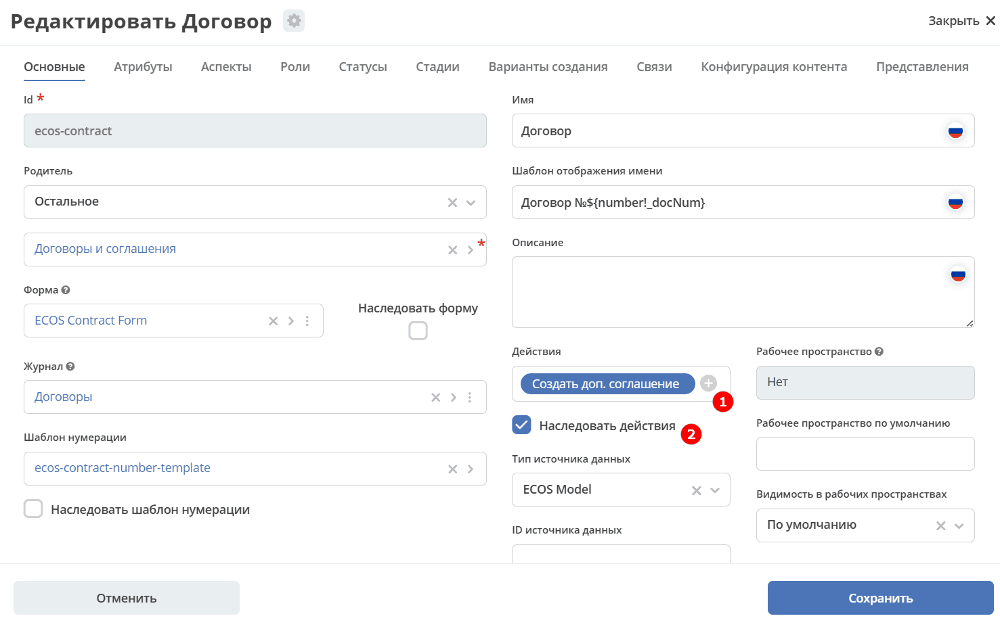
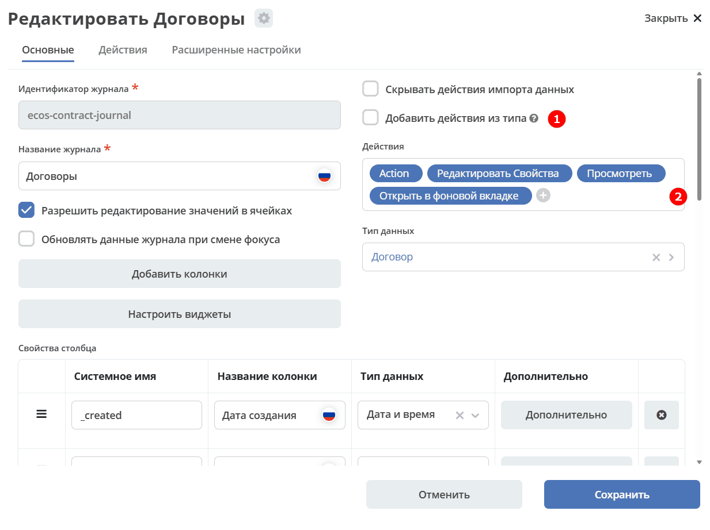

.. _ui_actions_extending:

Расширение и настройка действий
================================

Как добавлять новые действия и типы действий, настраивать списки действий для карточек и журналов, а также технические детали формата результата.

.. contents::
    :depth: 2

Расширение действий
--------------------

Добавление новых инстансов действий
~~~~~~~~~~~~~~~~~~~~~~~~~~~~~~~~~~~~~

Для добавления новых инстансов действий необходимо описать их в json виде и добавить их в микросервис по пути ``eapps/artifacts/ui/actions``

Пример описания:

.. code-block:: json

 {
    "id": "confirm-list-html",
    "key": "card-template.confirm-list.html",
    "name": "Скачать лист согласования",
    "type": "download-card-template",
    "config": {
        "templateType": "confirm-list",
        "format": "html"
    }
 }

Для тестирования можно заливать эту конфигурацию в журнале действий вручную.

Добавление новых типов действий
~~~~~~~~~~~~~~~~~~~~~~~~~~~~~~~

На данный момент все типы описаны в базовом проекте ecos-ui (в планах есть поддержка расширения действий без изменений в ecos-ui).

Описать новое действие:

.. code-block:: javascript

 export const DownloadAction = {
  execute: ({ record, action }) => {
    const config = action.config || {};

    let url = config.url || getDownloadContentUrl(record.id);
    url = url.replace('${recordRef}', record.id); // eslint-disable-line no-template-curly-in-string

    const name = config.filename || 'file';

    const a = document.createElement('A', { target: '_blank' });

    a.href = url;
    a.download = name;
    document.body.appendChild(a);
    a.click();
    document.body.removeChild(a);

    return false;
  },

  getDefaultModel: () => {
    return {
      name: 'grid.inline-tools.download',
      type: 'download',
      icon: 'icon-download'
    };
  },

  canBeExecuted: ({ record }) => {
    return record.att('.has(n:"_content")') !== false;
  }
 };

Зарегистрировать новый тип:

.. code-block:: javascript

 import Registry from './RecordActionExecutorsRegistry';
 import { DownloadAction } from './DefaultActions';

 Registry.addExecutors({
  download: DownloadAction,
 });

Настройки списка действий
-------------------------

Настройка действий для карточки
~~~~~~~~~~~~~~~~~~~~~~~~~~~~~~~

Настройка действий для карточки осуществляется в журнале типов данных, который располагается в системных журналах:

- **1** - выбрать список действий для типа.
- **2** - если стоит чекбокс, то действия наследуются от родителя.

Пример в конфиге типа данных: :

.. code-block:: json

  "actions": [
    "uiserv/action@create-supplementary-agreement"
  ],

Настройка действий в журналах
~~~~~~~~~~~~~~~~~~~~~~~~~~~~~

Настройка действий для журнала осуществляется в разделе **Конфигурация UI - Журналы**, который располагается в системных журналах:

- **1** - Добавить действия из типа:

 * **empty (null)** - если actions и actionsDef пустые, то добавляем действия из типа;
 * **true** - всегда добавляем действия из типа;
 * **false** - никогда не добавляем из типа.

- **2** - выбор действий

Пример в конфиге журнала: :

.. code-block:: json

    "actions": [
    "uiserv/action@download-zip",
    "uiserv/action@edit",
    "uiserv/action@view-dashboard",
    "uiserv/action@view-dashboard-in-background"
  ],

Настройка действия, которое активно для записей с определенным mimetype контента:

.. code-block:: json

 {
    "id": "edit-in-onlyoffice",
    "key": "edit.onlyoffice",
    "name": "Редактировать Документ",
    "type": "open-url", // тип действия должен соответствовать типу на UI
    "config": {
        "url": "/share/page/onlyoffice-edit?nodeRef=${recordRef}&new="
    },
    "evaluator": {
        "type": "predicate", // Тип evaluator'а для фильтрации действий
        "config": {
            "predicate": {
                "t": "in",
                "att": "_content.mimetype?str", // атрибут, который мы проверяем
                "val": [ //значения, на которые мы проверяем
                    "application/vnd.openxmlformats-officedocument.wordprocessingml.document",
                    "application/vnd.openxmlformats-officedocument.spreadsheetml.sheet",
                    "application/vnd.openxmlformats-officedocument.presentationml.presentation",
                    "text/plain",
                    "text/csv"
                ]
            }
        }
    }
 }

Данный конфиг достаточно положить в папку ``eapps/artifacts/ui/actions`` для микросервисов.

Техническая информация
----------------------

Вспомогательные параметры
~~~~~~~~~~~~~~~~~~~~~~~~~~~

.. list-table::
      :widths: 5 40
      :header-rows: 1
      :class: tight-table
      :align: center

      * - Параметр
        - Описание
      * - **actionRecord**
        - | В любую форму, которая вызывается из действия, в объект ``options`` устанавливается свойство ``actionRecord``, указывающее идентификатор записи (record), для которой выполняется действие.
          | Данное значение только для чтения. Указать в действии ``config.options.actionRecord`` не нужно, пользовательское будет перезаписано.

Ожидаемый формат результат действия
~~~~~~~~~~~~~~~~~~~~~~~~~~~~~~~~~~~~

Тип результата boolean или object (array - deprecated - обработка поддерживается)

Если ``object`` отображаются подробности выполнения в зависимости от типа результата. Для групповых действий модальное окно появляется сразу при запуске и если результат boolean автоматические закрывается.

**link**

Отображаемый результат выполнения - ссылка на скачивания отчета

.. code-block:: json

  {
    "type": "link",
    "data": {
    "url": "..."
    }
  }

**results**

Таблица записей с результатом выполнения действия

.. code-block:: json

  {
    "type": "results",
    "data": {
    "results": [
      {
        "recordRef": "emodel/someType@a2fb0374-d69c-4861-8d03-4a30e395fb2d",
        "disp": "название записи"
        "status": "OK",
        "message": "Все хорошо"
      }
    ]
    }
  }

**error**

Вывод ошибки.
Возможно автоматическое создание.

.. code-block:: json

  {
    "type": "error",
    "data": {
    "message": "..."
    }
  }

.. note::

 * Для заголовка типа действия используйте уровень **Heading 3** (``~~~~~~~~``) - так тип попадет в список доступных действий и будет возможность сослаться на него через якорь
 * Если описание конфигурации большое, оформляйте его через ``.. dropdown::``, чтобы оно сворачивалось по умолчанию
