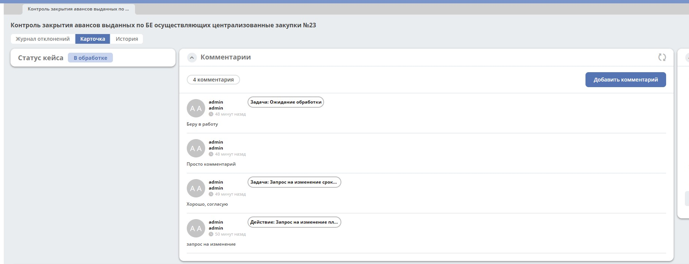

===================================
**Комментарии**
===================================

Транслирование комментариев в виджет комментариев
--------------------------------------------------------------------------------------------------------

Транслирование комментариев задач
~~~~~~~~~~~~~~~~~~~~~~~~~~~~~~~~~~~

Флаг отвечающий за включение/отключение функционала в журнале конфигураци - *add-comment-with-task-tag-enabled*, по умочанию выключен.

При ззавершении задачи комментарий из задачи добавляется в виджет комментариев от имени пользователя, завершившего задачу, с тегом "Задача" и названием задачи.

Транслирование комментариев из действий
~~~~~~~~~~~~~~~~~~~~~~~~~~~~~~~~~~~~~~~

Флаг отвечающий за включение/отключение функционала в журнале конфигураци - *add-comment-with-action-tag-enabled*, по умочанию выключен.

Если при выполнении case action на форме был оставлен комментарий, то он добавляется в виджет комментариев от имени пользователя, выполневшего case action, с тегом "Действие" и названием задачи.

На данный момент необходимо явно объявлять мэппинг между типом case action и свойством комментария. Для этого нужно добавить бин по примеру ниже, где

* key - alfresco model type с parent iEvent:additionalData, используемый для case action
* value - свойство комментария, в которое будет записываться комментарий из формы действия

::

    <bean id="case.actions-comments.type-to-comment-prop.mapping"
          class="ru.citeck.ecos.spring.registry.MappingRegistrar">
        <constructor-arg ref="case.actions.additional-data.add-comment-with-tag.mappingRegistry"/>
        <property name="mapping">
            <map>
                <entry key="em:changeReactionDueDateRequestEvent" value="em:changeRequestDueDateComment"/>
                <entry key="em:changeProcessingDueDateRequestEvent" value="em:changeRequestDueDateComment"/>
                <entry key="em:changeValidationDueDateRequestEvent" value="em:changeRequestDueDateComment"/>
            </map>
        </property>
    </bean>
