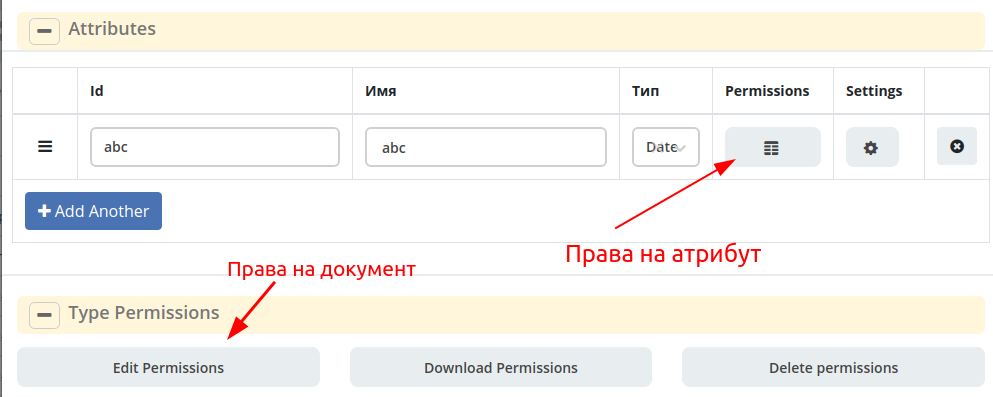

Права доступа
=============

Матрица прав
------------
Полезные ссылки: 
`Язык_предикатов <https://citeck.atlassian.net/wiki/spaces/knowledgebase/pages/1019674636/>`_  
`Типы_кейсов <https://citeck.atlassian.net/wiki/spaces/knowledgebase/pages/1103102066>`_

В версии ECOS 4.0.0 добавлен новый формат настроек прав на документ и его атрибуты.

Основная логика находится в библиотеке **ecos-model-lib**.

Конфигурация прав хранится в микросервисе **ecos-model**.

Модель описания прав
~~~~~~~~~~~~~~~~~~~~
::

	 TypePermsDef 
	 id: String // Идентификатор настроек. Уникальный в пределах системы
	 typeRef: RecordRef // Тип ECOS, к которому относятся настройки прав
	 permissions: PermissionsDef // Настройка прав на документ
	 attributes: Map<String, PermissionsDef> // Настройка прав на атрибуты

::
 
	PermissionsDef
	 matrix: Map<String, Map<String, PermissionLevel>> // Матрица прав <Роль, <Статус, Уровень_прав>>. 
	 rules: List<PermissionRule> // Дополнительные правила для гибкой настройки 

::
 
	 PermissionLevel (enum)
	 NONE // нет прав
	 READ // права на чтение
	 WRITE // права на чтение и запись

::

	 PermissionRule
	 roles: Set<String> // Роли, для которых применяется правило
	 permissions: Set<String> // Список прав
	 statuses: Set<String> // Статусы, в которых данное правило применимо. Пустой список - любой статус
	 condition: Predicate // Условие, по которому данное правило применимо в формате предиката (см. Язык предикатов).
	 type: RuleType // Тип правила

	 RuleType (enum)
	 ALLOW - разрешение. Если правило активно, то permissions добавляются для указанных ролей
	 REVOKE - отбирание прав. Если правило активно, то permissions убираются из списка уже существующих прав у ролей

Вычисление прав
~~~~~~~~~~~~~~~~~

Вычисление прав для **PermissionsDef** (документа или атрибута) делится на два этапа:

**1. Применение матрицы прав** <*Роль, <Статус, Уровень_прав*>>. Есть 3 уровня прав: 

* NONE - нет прав;
* READ - чтение;
* WRITE - чтение и запись.

**2. Применение правил**. Правила нужны в случаях, когда логика распределения прав не укладывается в простую матрицу. Примеры: 

* Если есть 2 состояния документа в одном статусе, но с разными правами;
* Если уровень прав зависит от атрибутов документа.

Значения, которые вычисляются на этапах 1 и 2 должны быть абсолютными. Т.е. если у нас есть конфигурация прав, то она на 100% описывает текущий уровень прав и не предполагает наличие дополнительных механизмов.

* Роли и статусы берутся из конфигурации типа. Если какой-то роли или статуса нет в конфигурации типа, то наличие этих сущностей в конфиге прав игнорируется.
* Если для роли, статуса или атрибута нету настройки прав, но они присутствуют в типе, то по умолчанию выставляется право только на чтение.
* Если у документа выставлен статус или есть роль, которые отсутствуют в конфиге типа, то права для них по умолчанию пустые (нет возможности даже читать).

Пограничные условия
~~~~~~~~~~~~~~~~~~~

Данные условия относятся к настройкам матрицы без системных статусов и ролей.

.. csv-table:: Пограничные условия
 :header: "Статус есть в типе","Статус есть в матрице","Роль есть в типе","Роль есть в матрице","Уровень прав"
 :widths: 10, 10, 10, 10, 20

 "Да","Да","Да","Да","Из матрицы"
 "Да","Да","Да","Нет","Чтение"
 "Да","Да","Нет","Да","Нет прав"
 "Да","Да","Нет","Нет","Нет прав"
 "Да","Нет","Да","Да","Чтение"
 "Да","Нет","Да","Нет","Чтение"
 "Да","Нет","Нет","Да","Нет прав"
 "Да","Нет","Нет","Нет","Нет прав"
 "Нет","Да","Да","Да","Нет прав"
 "Нет","Да","Да","Нет","Нет прав"
 "Нет","Да","Нет","Да","Нет прав"
 "Нет","Да","Нет","Нет","Нет прав"
 "Нет","Нет","Да","Да","Нет прав"
 "Нет","Нет","Да","Нет","Нет прав"
 "Нет","Нет","Нет","Да","Нет прав"
 "Нет","Нет","Нет","Нет","Нет прав"

Системные статусы и роли
~~~~~~~~~~~~~~~~~~~~~~~~

При необходимости можно настроить в типе системные статусы и роли. Для этого достаточно указать **ID** равным одному из предопределенных значений:

**Роли:**

1. **EVERYONE** - виртуальная роль, к которой относятся все пользователи. *Assignees* у такой роли всегда пустые, но если роль **EVERYONE** по матрице получает права, то они распространяются на всех пользователей в системе.

**Статусы:**

1. **EMPTY** - пустой статус. Полезен для приватных сущностей, которые недоступны на чтение всем пользователям в системе. Пустой статус может быть в случае если процесс для кейса не найден или операция старта процесса еще не завершилась;
2. **ANY** - любой статус. Вариант использования: для справочников можно задать права для **ANY** и **EVERYONE** на чтение, а для изменения записей завести отдельную группу.

Настройка прав
~~~~~~~~~~~~~~
Настройка прав осуществляется на форме редактирования типа во вкладке :guilabel:`Модель`. Редактор доступен только в **Enterprise** версии ECOS.

Наследование прав
~~~~~~~~~~~~~~~~~
При поиске матрицы прав учитывается иерархия типов ECOS. При этом ищется первая не пустая конфигурация и дальше поиск прекращается. Т.е. никакого объединения настроек прав из разных типов не происходит.  

Особенности применение прав в Alfresco
~~~~~~~~~~~~~~~~~~~~~~~~~~~~~~~~~~~~~~

1. Изменения прав в настройке типа подхватывается в **alfresco** с небольшой задержкой (секунд 10). Т.о. перед тестированием после изменений прав лучше выждать некоторое время;
2. Права на атрибуты вычисляются при каждом обращении к полям документа. Т.о. права на атрибуты всегда актуальны (за исключением случая из п.1);
3. Права на документ обновляются только при изменении документа (на данный момент учитывается только статус) или людей/групп в ролях. Т.о. если мы меняем права на документ в типе, то это никак не отразится на существующих документах до тех пор пока они не сменят статус или роли. 

Пример конфигурации
~~~~~~~~~~~~~~~~~~~
::

 id: "2a5c3f00-06d5-4b62-8192-1b9116f12db4"
 typeRef: "emodel/type@contracts-cat-doctype-contract"

 permissions

  matrix:
    confirmers:
      approval: WRITE
      reworking: NONE
    initiator:
      approval: READ
      reworking: WRITE
    scan-man:
      approval: WRITE
      reworking: NONE
  rules: []

 attributes::

  cm:name:
    matrix:
      confirmers:
        approval: WRITE
        reworking: NONE
      initiator:
        approval: READ
        reworking: WRITE
      scan-man:
        approval: WRITE
        reworking: NONE
    rules: []

  cm:title:
    matrix:
      confirmers:
        approval: WRITE
        reworking: NONE
      initiator:
        approval: READ
        reworking: WRITE
      scan-man:
        approval: WRITE
        reworking: NONE
    rules: []

ECOS atributes Permissions
---------------------------

Добавлен новый компонент для обработки получения прав для атрибутов для матриц нового формата.

# Yaml-формат. Пример конфига::

  id: test-attrs-permissions
  typeRef: emodel/type@test-cat-doctype

  rules:

    - roles: [ initiator ]
      statuses: [ unilever-draft, unilever-reworking ]
      attributes:
        - name: 'cm:content'
          permissions: { read: true, edit: true }

# Регистрируется в ``emodel``. Расположение: **alfresco/module/{module-repo}/model/attrs_permission/test-attrs-permissions.yml**