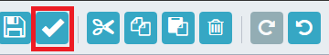
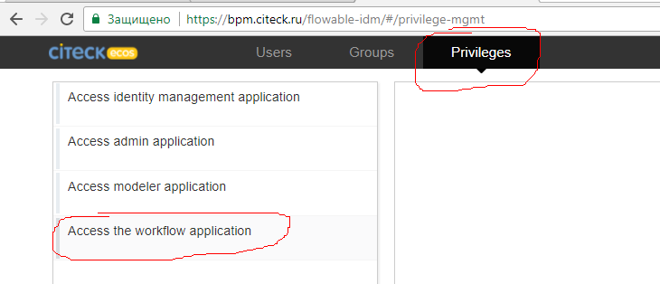

============
**Процессы**
============

Редактор бизнес-процессов (BPMN)
--------------------------------

Создание процесса в Flowable
~~~~~~~~~~~~~~~~~~~~~~~~~~~~~
Начало работы:

1. Выбираете вкладку Процессы на верхней панели
2. Выбираете один из предложенных процессов или нажимаете кнопку "Создать процесс": 

.. image:: _static/process_flowable_1.png
        :align: center

3. Заполняете поля "Наименование модели" и "Ключ бизнес-процесса", нажимаете "Создать новую модель". Открывается страница старта формирования модели процесса. В левой панели хранятся события, которые можно использовать при создании, основное поле - для создания модели, снизу есть кардлет с параметрами объекта модели (например, исполнитель задачи, её наименование, слушатели события и так далее):
   

4. Для процесса с минимальным набором типов событий (пользовательские действия и системные проверки) достаточно того количества элементов, которое появляется при клике на событие старта на экране:
   

Значок, выделенный красной стрелкой - пользовательская задача; синей - гейтвей; жёлтой - стрелка для указания связи между событиями, фиолетовой - настройка элемента. Например, при выбора гейтвея по умолчанию на экране отображается "ИЛИ". Для выбора типа "Параллельная развилка" необходимо нажать на значок гаечного ключа и во всплывающем окне выбрать Parallel gateway + Выбрать.

 5. Для того, чтобы создать связь с объектом, создавая его с помощью всплывающего меню, достаточно просто зажать новый объект кнопкой мыши и немного "протянуть" его вверх или вправо. Стрелка связи установится автоматически. В случае создания связи между двумя уже существующими объектами необходимо выбрать один из них, выбрать стрелку (выделено жёлтой стрелкой), зажать стрелку и "протянуть" (как drag&drop) до второго объекта. Чтобы визуально сменить внешний вид стрелки с 
    

НА

.. image:: _static/process_flowable_5.png
        :align: center

ИЛИ НА

необходимо "зажать" второй объект и выровнять его с первым. После этого объект можно перемещать по экрану, стрелка будет образовывать угол в 90 градусов, где необходимо.

6. ля изображения свимлейнов необходимо использовать раздел Swimlanes левого меню. Сначала выбор Pool ("зажать" мышкой и вытащить на основное поле), после этого для создания следующей роли надо выбрать Lane, вытащить на основное поле на Pool и подвести к краю Pool (пока не появятся зелёные границы): 
 
.. image:: _static/process_flowable_7.png
        :align: center

После этого в Pool появляются уже 2 лейна, а не один:

Добавлять можно любое количество дорожек.

7. Редактирование длины Pool&Lane: можно увеличивать высоту/длину как всего Pool, так и отдельных Lane. Для того, чтобы переместить на экране/"протянуть" pool целиком, необходимо "встать" на него мышкой в левом верхнем углу и проверить, что весь pool выделился прерывистой линией, после чего с помощью "уголков" (подчёркнуты красным) можно произвести необходимые действия: 

.. image:: _static/process_flowable_9.png
        :align: center

Чтобы отредактировать длину/высоту конкретного lane, надо "встать" мышкой на него (а не на весь pool) и теми же уголками изменить его размер.

8. Редактирование canvas: после того, как опция увеличения длины (см. п. 7) станет недоступна (как если бы возможность протягивать закончилась), наведите мышку на самую правую панель. На ней должны будут появиться стрелки, нажатием на которые можно увеличить размер основного окна вправо или влево (как на рисунке): 
   
.. image:: _static/process_flowable_10.png
        :align: center

Аналогичные стрелки для увеличения основного окна вверх и вниз можно увидеть, наведя мышью на область снизу рисунка. На текущий момент только в Safari удалось продлевать pool&lane без ограничений.

9. В случае если есть необходимость в валидации созданного процесса надо нажать значок V на верхней панели:

Система выведет список ошибок и предупреждений. При нажатии на конкретную ошибку/предупреждение система произведёт редирект именно на то место в схеме, где допущена ошибка.

10. Для того, чтобы сохранить созданную схему, необходимо нажать на значок дискетки рядом с V (см. рисунок выше) и выбрать "Сохранить и закрыть редактор" (после нажатия редирект на страницу процессов) или "Сохранить" (после нажатия возврат в редактор).

Редактор процесса Flowable
~~~~~~~~~~~~~~~~~~~~~~~~~~~
Неочевидные натстройки
"""""""""""""""""""""""
1) При создании новых пользователей, которые будут участвовать в демонстрации процесса, надо добавить им право работать в Workflow:

2) В названии ключа элемента не должно быть пробелов - аккуратнее с копированием   
3) В условиях переходов логические операнды - не AND и OR, а  && и  ||
4) В условиях переходов ссылка на результат (кнопку) формы имеет синтаксис:
${form_КЛЮЧ ФОРМЫ_outcome == "ОК"}

Сервисы Flowable
~~~~~~~~~~~~~~~~~

Уведомления Flowable
~~~~~~~~~~~~~~~~~~~~~

Редактор сценариев (CMMN)
------------------------------

Работа в сазязке CMMN - BPMN
-----------------------------