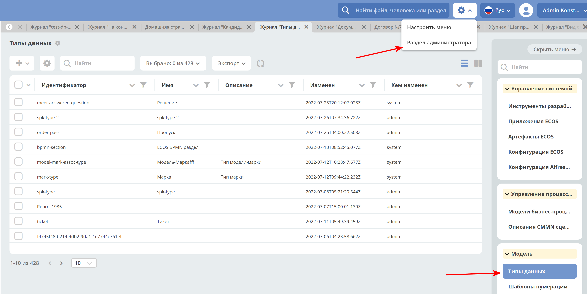

=====================================
**Типы данных**
=====================================

В ECOS внедрена собственная система типов, на основе которой настраиваются следующие аспекты:

* **Форма**;
* **Действия**;
* **Связи**;

Типы ECOS являются артефактами ECOS с типом model/type.

Для просмотра существующих типов и их редактирования создан журнал **Типы кейсов**. Чтобы в него попасть следует открыть меню и перейти в системные журналы:

Пример описания типа
~~~~~~~~~~~~~~~~~~~~
::

 {
    "id": "base",
    "name": "Базовый тип",
    "actions": [
        "ui/action$edit",
        "ui/action$content-download",
        "ui/action$record-actions"
    ],
    "associations": [
        {
            "id": "assoc:associatedWith",
            "name": "Связан с",
            "direction": "BOTH",
            "target": "model/type$base"
        }
    ]
 }

Структура типов данных
----------------------------------------

Наследование типов
------------------

У всех типов должен быть родитель. По умолчанию - **model/type@base** (базовый тип).

Маппинг старых типов и видов на новые типы кейсов
~~~~~~~~~~~~~~~~~~~~~~~~~~~~~~~~~~~~~~~~~~~~~~~~~

Старые типы и виды кейса записываются в полях tk:type и tk:kind в виде nodeRef. Например:

* **tk:type = workspace://SpacesStore/contracts-cat-doctype-contract** (Договор),
* **tk:kind = workspace://SpacesStore/contracts-cat-contract-services** (Услуги).

Для преобразования в новый тип кейса следует взять значения из этих полей, убрать у каждого из них **workspace://SpacesStore/** и оставшиеся части объединить в одну строку через "/" (слева - ``tk:type``, а справа ``tk:kind``): **contracts-cat-doctype-contract/contracts-cat-contract-services**.

Если ``tk:kind`` не задан, то правой части и знака "/" не нужно. Например: **contracts-cat-doctype-contract**.

При добавлении новых типов кейсов следует учитывать, что тип с ``tk:kind`` должен наследоваться от типа без ``tk:kind`` чтобы унаследовать его свойства:

.. image:: _static/case_type_legacy_1.png
       :align: center
       :alt: Наследование типа

Связи (с формой, действиями)
----------------------------

*Связи наследуются* т.е. чтобы добавить связь "Связан с" достаточно указать в качестве parent'а **model/type$base** т.к. там уже настроена эта связь
Связи (associations) настраиваются для отображения, добавления и удаления в виджете связей на карточке документа.
Связь описывается следующей структурой::

 {
    "id": "assoc:associatedWith",
    "name": "Связан с",
    "direction": "BOTH",
    "target": "model/type$base"
 }

**id** в данном случае для Alfresco должно совпадать с **QName** существующей в модели связи. Для добавления произвольных связей (без обязательного наличия связи в модели) нужна доработка.

Связь с типом Alfresco
~~~~~~~~~~~~~~~~~~~~~~

Чтобы у записей с определенным типом ``alfresco`` был нужный тип ECOS можно сделать следующее (на выбор):

Для новых нод:

		1. Сделать аспект, который унаследован от **etype:hasType** и переопределить там свойство **etype:type** (!тип следует указывать *без* emodel/type@ префикса). После этого можно навесить данный аспект на тип ``alfresco`` и новые ноды будут иметь нужный тип ECOS.
		2. В варианте создания добавить атрибут **_type=emodel/type@нужный-тип**. Новые ноды, создаваемые через данный вариант создания будут иметь нужный тип.

Для новых и старых нод:

        3. Добавить **Registrar** бин, который зарегистрирует связь тип alfresco → тип ECOS:

            **ecosTypeService.register(QName nodeType, Function<AlfNodeInfo, RecordRef> evaluator)**.

Для примера см. конфигурацию **ru.citeck.ecos.node.EcosTypeConfiguration**.

Действия
--------

Варианты создания
-----------------
