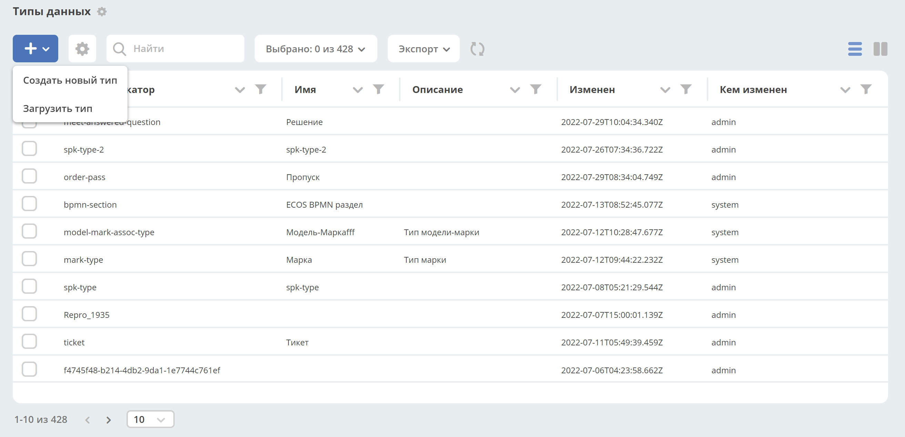
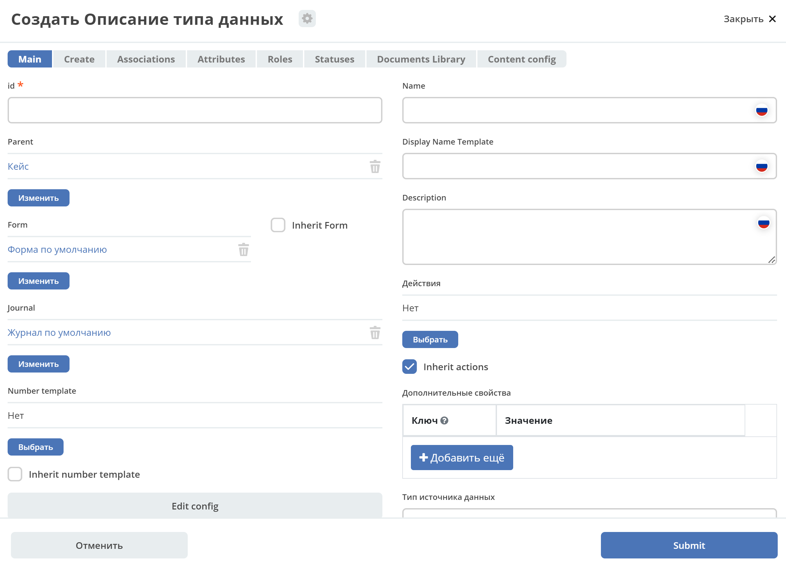

Типы данных
============

В ECOS внедрена собственная система типов данных, на основе которой настраиваются следующие аспекты:

* **Форма**;
* **Действия**;
* **Связи**;
* ...

**Тип данных** - основной артефакт ECM, описывающий объект. В типе данных определяются метаданные, которые будет содержать объект, статусы жизненного цикла, роли, которые могут работать с объектом. Тип данных связан с формой и журналом.

Типы ECOS - артефакты с типом **model/type**.

Для просмотра существующих типов и их редактирования создан журнал **Типы данных** (Раздел администратора - Конфигурация UI - Журналы).

.. image:: _static/case_type_1.png
       :align: center

При клике на запись журнала отображаются значки действий:

       
|

.. list-table:: 
      :widths: 20 50
      :align: center

      * - |
 
            .. image:: _static/icon_1.png
                :width: 30

        - Скачать
      * - |
 
            .. image:: _static/icon_2.png
                :width: 30

        - Удалить
      * - |
 
            .. image:: _static/icon_3.png
                :width: 30

        - Редактировать форму:

            .. image:: _static/type_edit.png
                :width: 400

      * - |
 
            .. image:: _static/icon_4.png
                :width: 30

        - | Редактировать json:

            .. image:: _static/edit_type.png
                :width: 400
      * - |
 
            .. image:: _static/icon_5.png
                :width: 30

        - Копировать
      * - |
 
            .. image:: _static/icon_6.png
                :width: 30

        - Открыть в фоновой вкладке

Для создания типа данных необходимо нажать **+**

Откроется форма создания типа данных:

- **Id** - уникальный идентификатор 
- **Parent** - выбор типа, на основании которого, создается новый.
- **Name** - человекопонятное имя. 
- **Form** -  связь с формой, созданной из данного типа.
- **Journal** - связь с журналом, созданным из данного типа.
- **Number template** - выбор шаблона нумерации. `См. Шаблоны нумерации <https://citeck-ecos.readthedocs.io/ru/latest/settings_kb/interface/number_template.html>`_
- **Config form** - [уточнить]
- **Display Name Template** - шаблон заголовка объекта.
- **Description** - описание данного типа ECOS (необязательно).
- **Actions/Действия (необязательно)** - из списка выбрать действия, которые будут доступны для типа данных.
- **Дополнительные свойства** - [уточнить]
- **Тип источника данных** - [уточнить]
- **Source ID** - [уточнить]
- **Канбан доска** - выбор канбан-доски.

Пример описания типа
~~~~~~~~~~~~~~~~~~~~
::

 {
    "id": "base",
    "name": "Базовый тип",
    "actions": [
        "ui/action$edit",
        "ui/action$content-download",
        "ui/action$record-actions"
    ],
    "associations": [
        {
            "id": "assoc:associatedWith",
            "name": "Связан с",
            "direction": "BOTH",
            "target": "model/type$base"
        }
    ]
 }

Структура типов данных
----------------------

Наследование типов
------------------

У всех типов должен быть родитель. По умолчанию - **model/type@case** (базовый тип).

[Связи (с формой, действиями)]
-------------------------------

*Связи наследуются* т.е. чтобы добавить связь "Связан с" достаточно указать в качестве parent'а **model/type$base** т.к. там уже настроена эта связь
Связи (associations) настраиваются для отображения, добавления и удаления в виджете связей на карточке документа.
Связь описывается следующей структурой::

 {
    "id": "assoc:associatedWith",
    "name": "Связан с",
    "direction": "BOTH",
    "target": "model/type$base"
 }

**id** в данном случае для Alfresco должно совпадать с **QName** существующей в модели связи. Для добавления произвольных связей (без обязательного наличия связи в модели) нужна доработка.

[Действия]
-----------
Действия по умолчанию наследуются от родительского типа.
Если необходимо кастомизировать список доступных действий для документа (убрать действия по умолчанию по типу **Delete** или **Upload new version**) необходимо снять флаг **Inherit actions**.

[Варианты создания]
--------------------
